# EGC Code Review Checklist for Developers

> Source: This instruction file documents the **EGC (E.ON Global Commodities) Code Review Checklist for Developers** — the mandatory self-review checklist every EET Fenix Endur OpenJVS developer must work through **before** submitting code for the formal code review referenced throughout the Programming Guide (Section 1: *"All application software will need to pass a code review to enforce coding conventions"*). This checklist is the practical, item-by-item enforcement mechanism for everything covered in the companion `EGC_Fenix_Endur_OpenJVS_Coding_Standards` chapters (Introduction, Source File Organization, Lines and Indentation, Comments, Declarations, Statements, White Space, Naming Conventions, Programming Practices — all in that sibling folder).

---

## Table of Contents

1. [Overview: Why a Pre-Review Checklist Exists](#1-overview-why-a-pre-review-checklist-exists)
2. [How the Checklist Fits the Review Workflow](#2-how-the-checklist-fits-the-review-workflow)
3. [The Checklist Items — Full Detail](#3-the-checklist-items--full-detail)
   - 3.1 [My code compiles](#31-my-code-compiles)
   - 3.2 [My code has been developer-tested](#32-my-code-has-been-developer-tested)
   - 3.3 [My code includes sufficient and clear javadoc where appropriate](#33-my-code-includes-sufficient-and-clear-javadoc-where-appropriate)
   - 3.4 [My code includes sufficient and clear in-line comments where appropriate](#34-my-code-includes-sufficient-and-clear-in-line-comments-where-appropriate)
   - 3.5 [My code is tidy](#35-my-code-is-tidy)
   - 3.6 [My methods are not too long — one method, one function](#36-my-methods-are-not-too-long--one-method-one-function)
   - 3.7 [My class, method and variables have meaningful names](#37-my-class-method-and-variables-have-meaningful-names)
   - 3.8 [My code has sufficient error checks and error handling](#38-my-code-has-sufficient-error-checks-and-error-handling)
   - 3.9 [I have not duplicated code or existing functionality](#39-i-have-not-duplicated-code-or-existing-functionality)
   - 3.10 [I have considered proper use of exceptions](#310-i-have-considered-proper-use-of-exceptions)
   - 3.11 [I have made appropriate use of logging](#311-i-have-made-appropriate-use-of-logging)
   - 3.12 [I have eliminated unused imports](#312-i-have-eliminated-unused-imports)
   - 3.13 [I have eliminated Eclipse warnings](#313-i-have-eliminated-eclipse-warnings)
   - 3.14 [I have considered possible NPEs](#314-i-have-considered-possible-npes)
   - 3.15 [The code follows the Coding Standards](#315-the-code-follows-the-coding-standards)
   - 3.16 [The code follows Java best practices](#316-the-code-follows-java-best-practices)
   - 3.17 [The code is easy to follow, understand, and maintain](#317-the-code-is-easy-to-follow-understand-and-maintain)
   - 3.18 [Are there any leftover stubs or test routines in the code?](#318-are-there-any-leftover-stubs-or-test-routines-in-the-code)
   - 3.19 [Are there any hardcoded, development-only things still in the code?](#319-are-there-any-hardcoded-development-only-things-still-in-the-code)
   - 3.20 [Was performance considered?](#320-was-performance-considered)
   - 3.21 [Does the code release resources?](#321-does-the-code-release-resources)
   - 3.22 [Corner cases well documented or any workaround for a known limitation of the frameworks](#322-corner-cases-well-documented-or-any-workaround-for-a-known-limitation-of-the-frameworks)
   - 3.23 [Can any code be replaced by calls to external reusable components or library functions?](#323-can-any-code-be-replaced-by-calls-to-external-reusable-components-or-library-functions)
4. [Full Checklist Quick-Reference Table](#4-full-checklist-quick-reference-table)
5. [End-to-End Checklist Diagram](#5-end-to-end-checklist-diagram)
6. [Practical Usage Guidance](#6-practical-usage-guidance)

---

## 1. Overview: Why a Pre-Review Checklist Exists

The Programming Guide establishes that a **mandatory code review** gates every piece of application software before it can be considered complete (Section 1). A formal reviewer's time is expensive and limited — the purpose of this checklist is to **shift the first pass of review left**, onto the developer themselves, so that the human reviewer's time is spent on genuine design and logic feedback rather than catching preventable, mechanical issues (unused imports, missing Javadoc, un-released `Table` objects, etc.).

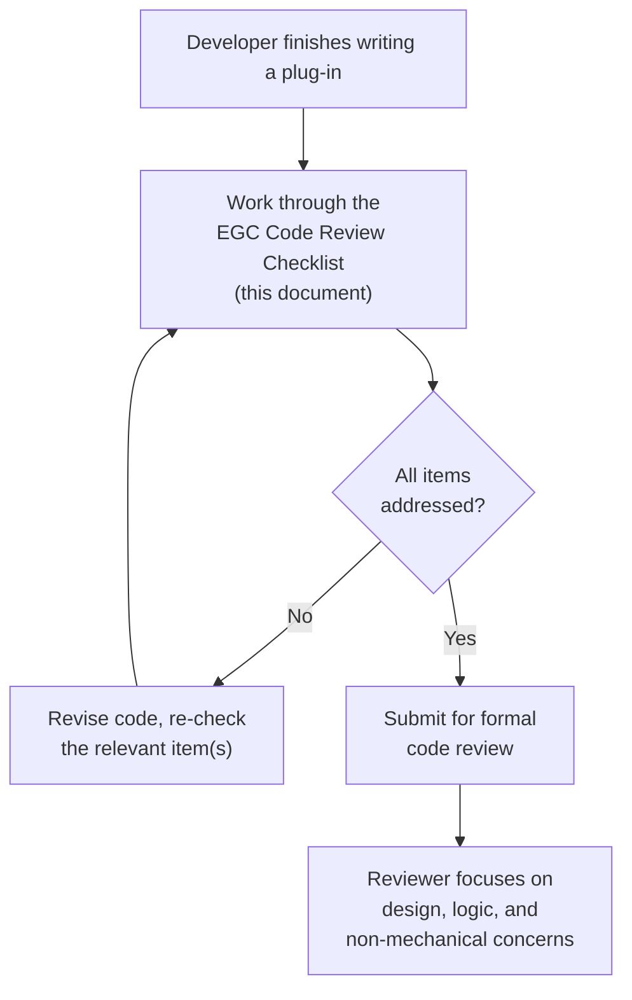

> **This checklist is not optional decoration** — it is the direct, practical instantiation of the Programming Guide's mandatory review requirement, and it is the fastest way to avoid review rejections for issues that are entirely within the developer's own control before ever involving a second person.

---

## 2. How the Checklist Fits the Review Workflow

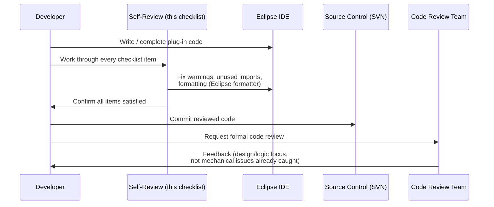

---

## 3. The Checklist Items — Full Detail

### 3.1 My code compiles

> The most basic gate — code that does not compile cannot be reviewed, tested, or deployed. Always do a full, clean rebuild in Eclipse before submitting (Project → Clean...), not just rely on incremental/background compilation, since stale `.class` artifacts can mask a real compilation failure.

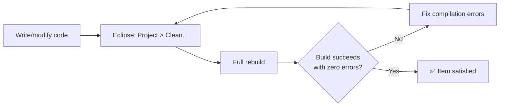

### 3.2 My code has been developer-tested

> Compiling is necessary but not sufficient — the developer must actually **run** the plug-in (using the Eclipse debugging workflow described in *Debugging Code*) against realistic Endur data/tasks before submission. This includes exercising both the "happy path" and at least the most obvious failure/edge-case paths (e.g. empty result sets, a parameter plug-in run both ad-hoc and inside the workflow — see Programming Guide, Section 8.3).

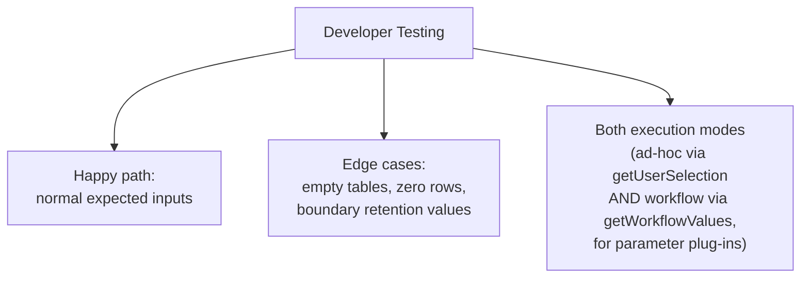

### 3.3 My code includes sufficient and clear javadoc where appropriate

> As detailed in the *Comments* chapter (Class Documentation Comment, Method Documentation Comment, Required Tags), every class intended for reuse — especially anything destined for the Common Framework — must carry a clear Javadoc comment with the required `@author`, `@param`, `@return`, and `@throws` tags. "Where appropriate" means: **always** for Common Framework/shared classes; **at minimum** for any `public`/`protected` method with non-obvious behavior.

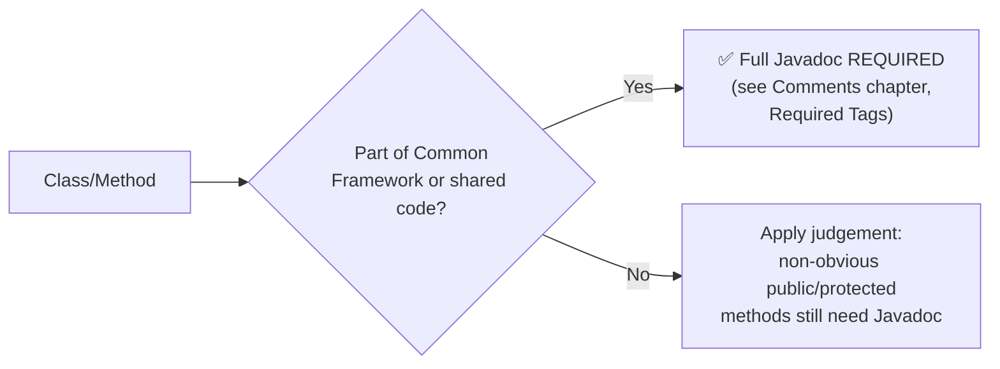

### 3.4 My code includes sufficient and clear in-line comments where appropriate

> Per the *Comments* chapter (Block/Single-Line/Trailing Comments), implementation comments explain **non-obvious** logic — the *why*, not the *what*. A checklist pass here means re-reading the code as a stranger would, and asking: "is there any point where I'd need to stop and puzzle out what's happening?" If so, a comment is missing.

### 3.5 My code is tidy

> "Tidy" is a bundle of several distinct, previously-established rules working together:

| Sub-item | Governed By |
|---|---|
| Indentation | *Lines and Indentation* — 4 spaces per level |
| Line length | *Lines and Indentation* — 80-character limit |
| No commented-out code | See note below |
| No spelling mistakes | Applies to identifiers, comments, log/exception messages alike |
| SQL formatted to be easy to read | Apply the same wrapping discipline as any other long statement |

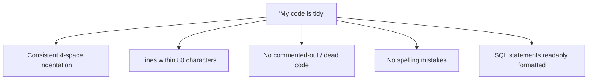

> **Commented-out code should never be committed.** If code is no longer needed, delete it — Source Control (SVN, see *Source Control*) already preserves history, so there is never a good reason to leave a block of disabled code "just in case."

```java
// ❌ Avoid — dead, commented-out code left in the file
// Table oldResult = legacyQuery(sql);
// tables.add(oldResult);
Table result = DbaseUtil.execISql(sql);
tables.add(result);
```

```java
// ✅ SQL formatted for readability, using StringBuilder (see Programming Practices)
StringBuilder sql = new StringBuilder();
sql.append("SELECT * FROM user_index_price_output_values");
sql.append(" WHERE extraction_date < GETDATE() - ").append(retentionDays);
```

### 3.6 My methods are not too long and adhere as close as possible to the Java best practice one method, one function

> Each method should have a **single, clearly identifiable responsibility** (the "Single Responsibility Principle" applied at method granularity). A method that spans many screens, mixes validation with querying with formatting with logging, is a strong signal it should be decomposed into smaller, well-named private helper methods.

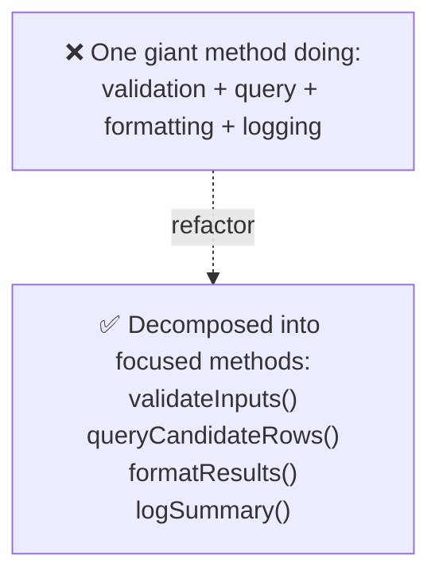

```java
// ❌ Avoid — one method doing everything
public void purgeTable(List<Table> tables) throws OException {
    // 80 lines mixing validation, querying, row classification,
    // batching, and logging all together...
}

// ✅ Preferred — decomposed into single-purpose methods
public void purgeTable(List<Table> tables) throws OException {
    validateConfiguration();
    Table candidates = queryCandidateRows(resolveRetentionDays());
    classifyRows(candidates);
    tables.add(candidates);
}
```

### 3.7 My class, method and variables have meaningful names

> This item directly enforces the entire *Naming Conventions* chapter — package naming, class naming (including the mandatory plug-in type suffixes/prefixes), method naming, accessor naming, variable naming, and constant naming. A quick self-test: could a colleague understand what a class/method/variable does from its name alone, without reading its implementation?

### 3.8 My code has sufficient error checks and error handling

> This is the **Defensive Coding** practice from *Programming Practices* applied concretely: validate inputs, check for `null`/out-of-range values, and fail fast with a contextual `FenixRuntimeException` rather than letting an invalid state silently propagate.

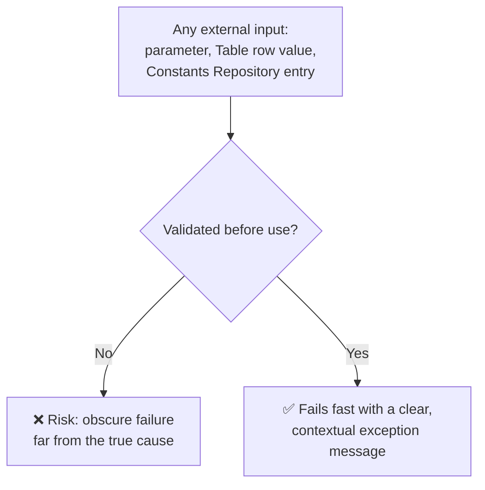

### 3.9 I have not duplicated code or existing functionality

> Before writing new logic, search the Common Framework (Section 6 of the Programming Guide) and the shared `com.eon.eet.fenix.shared` package (see *CommonExtension Shared Package*) for existing utilities — `DestroyableObjectStore`, `DbaseUtil`, `TableRowIterator`, `DelimitedFileImporter`, `SendMail`, etc. Re-implementing something the framework already provides is both wasted effort and a maintenance liability (two implementations to keep in sync).

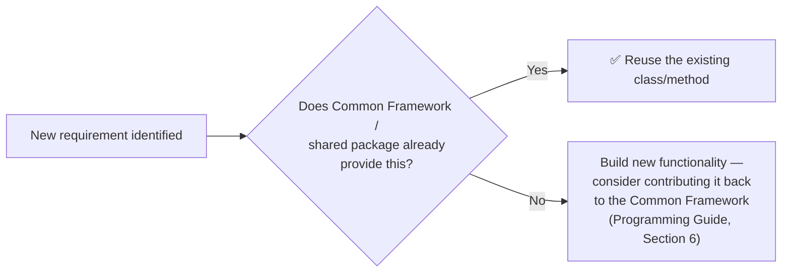

### 3.10 I have considered proper use of exceptions

> Directly reuses *Programming Practices* (Defensive Coding) and *Statements* (try-catch ordering, never-empty catch blocks): unchecked exceptions by default, checked exceptions only when the caller can meaningfully react, `FenixException`/`FenixRuntimeException` for EET-authored exceptions, and `FenixAlertBrokerException`/`FenixAlertBrokerRuntimeException` when an alert must reach the Alert Broker (Programming Guide, Section 8.11.1.1).

### 3.11 I have made appropriate use of logging

> Reuses *Programming Practices* (Do Not Use `System.out.print`) and the Programming Guide's full Logging chapter (Section 8.10): use the `Log` class (never instantiated as `static`), choose the correct log category (DEBUG/INFO/WARNING/ERROR per Section 8.10.6), and — for deal-processing scripts — use `setDealNumForLogging`/`setTranNumForLogging` so log entries can be traced back to a specific deal or transaction.

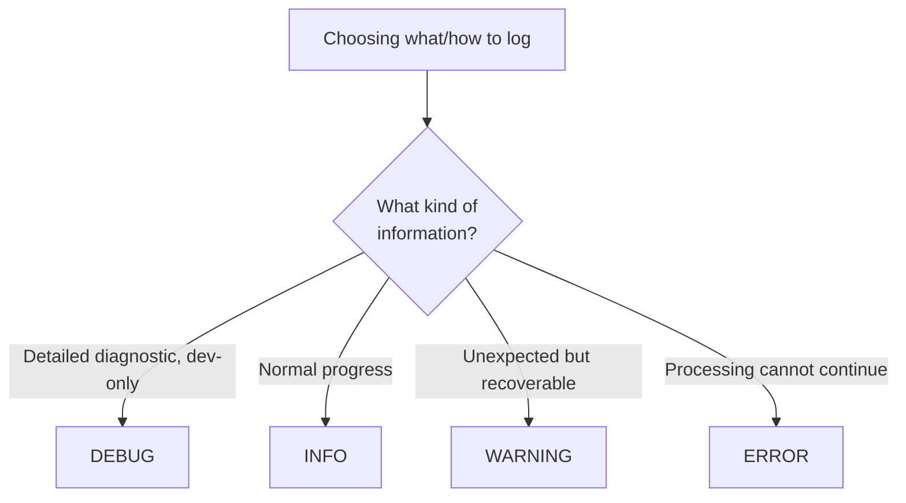

### 3.12 I have eliminated unused imports

> Unused imports clutter the file, slow down comprehension of a class's real dependencies, and are trivially detected — Eclipse flags them automatically. Use **Source → Organize Imports** (Ctrl+Shift+O) before every submission.

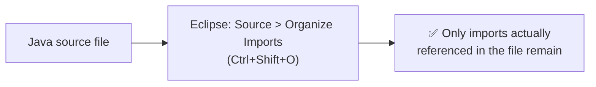

### 3.13 I have eliminated Eclipse warnings

> Eclipse's built-in problem markers (unused variables, raw type usage, deprecated API calls, potential null dereferences, etc.) are inexpensive, automated early-warning signals. A submission with visible warnings signals the code has not been carefully reviewed even once by its own author.

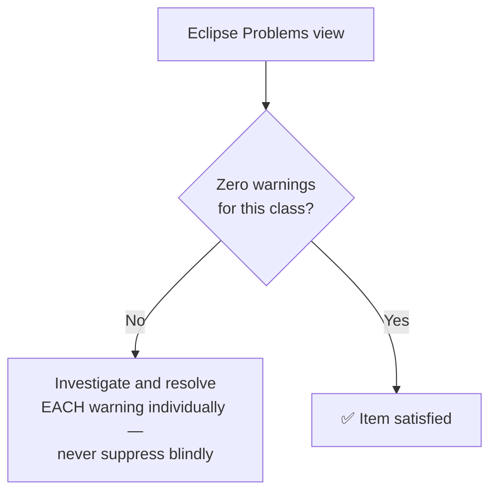

### 3.14 I have considered possible NPEs

> `NullPointerException` risk is especially relevant in OpenJVS code manipulating `Table` row values, `Ref` lookups, and Constants Repository entries that may be absent or empty (see *Data Purging*, Section 9.3 — *"If any of the parameters does not exist... no purging is carried out"*). Explicitly check for `null`/empty before dereferencing, particularly around chained calls like `order.getCustomer().getId()` (a scenario the Programming Guide itself warns about in Section 8.11).

```java
// ❌ Risk — order or order.getCustomer() could be null, hiding the real failure
throw new OBException("Exception when submitting order " +
        order.getId() + " with customer " +
        order.getCustomer().getId(), e);

// ✅ Defensive — validate before dereferencing chained calls
if (order == null || order.getCustomer() == null) {
    throw new FenixRuntimeException("Order or customer was null"
            + " when submitting order");
}
```

### 3.15 The code follows the Coding Standards

> This is the direct, single umbrella check for **every chapter** in the companion `EGC_Fenix_Endur_OpenJVS_Coding_Standards` folder: Source File Organization, Lines and Indentation, Comments, Declarations, Statements, White Space, Naming Conventions, and Programming Practices.

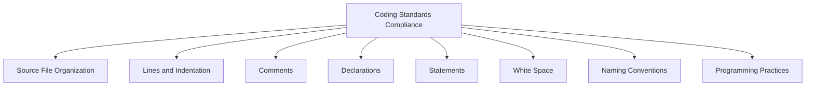

### 3.16 The code follows Java best practices

> Beyond EET-specific conventions, general Java best practices apply: favor composition over inheritance where appropriate, prefer interfaces for API contracts, avoid raw types/unchecked warnings, use the enhanced `for` loop where possible, and keep methods and classes cohesive (see also Item 3.6).

### 3.17 The code is easy to follow and understand and can be easily maintained by other developers in the future

> This is the **capstone item** — it's the Programming Guide's core objective (Section 1: *"maintainable, testable, readable and adaptable"*) restated as a single self-check question: *if I left the team tomorrow, could another EET developer pick this class up and understand it without needing to ask me anything?*

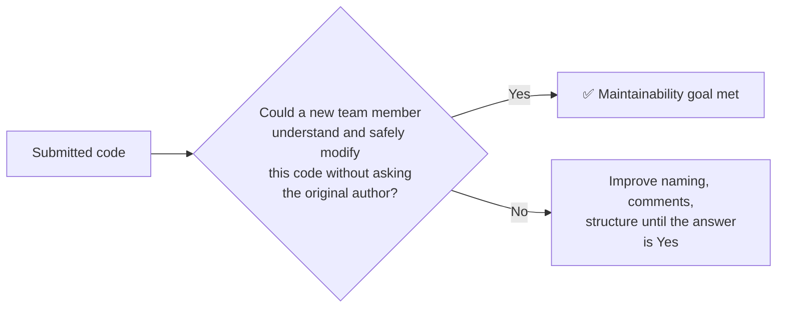

### 3.18 Are there any leftover stubs or test routines in the code?

> Temporary debugging aids — placeholder `return null;` stubs, ad-hoc `main()` test methods, hardcoded sample data used while developing — must be removed before submission. These are easy to forget precisely because they were useful during development.

```java
// ❌ Leftover test stub — must be removed before submission
public Table queryCandidateRows(int retentionDays) throws OException {
    // TODO: remove this stub once real query is wired up
    return DestroyableObjectStore.tableNew();
}
```

### 3.19 Are there any hardcoded, development-only things still in the code?

> This overlaps with, but is distinct from, Item 3.18 — it specifically targets **environment-specific literals**: a developer's own username, a test database name, a local file path, a hardcoded email address (see *Common Framework*, Section 6 — `SendMail`'s `user_email_configuration` table exists *specifically* to avoid this class of mistake), or a debug-only Constants Repository override.

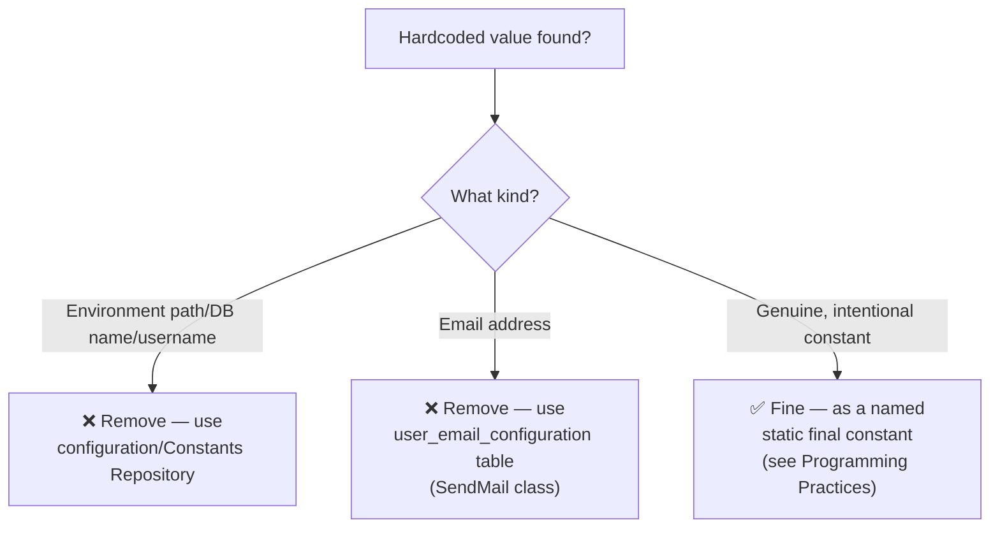

### 3.20 Was performance considered?

> In a shared, always-on Endur environment, an inefficient plug-in doesn't just slow itself down — it can degrade a shared script engine for every other concurrently running task. Specific things to check: are `Table` queries filtered as tightly as possible at the SQL level rather than iterating and filtering afterward in Java? Is string building using `StringBuilder` (see *Programming Practices*) rather than repeated `+` concatenation in a loop? Is a `TableRowIterator` used instead of repeatedly calling `getNumRows()`?

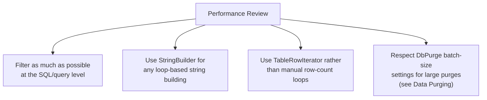

### 3.21 Does the code release resources?

> Every `Table`, `Transaction`, or other `IntPtr`-derived object created outside of `DestroyableObjectStore.tableNew()`-style factory methods must be explicitly destroyed, and every file handle explicitly closed. This is the single most OpenJVS-specific item on the checklist, because `IntPtr` objects allocate **native, off-heap memory** (see *OpenJVS Architecture*, Section 5.2) that the Java garbage collector cannot reclaim on its own.

```mermaid
flowchart TD
    Create["Table/Transaction created"] --> Managed{"Created via\nDestroyableObjectStore?"}
    Managed -- Yes --> AutoCleanup["✅ Automatically destroyed when\nthe BasicScript-derived plug-in\nterminates"]
    Managed -- No --> Manual["Must be manually destroyed\n(table.destroy(), file.close(), etc.)\nbefore the method/script exits"]
```

```java
// ✅ Resource safely released via try/finally, per Declarations/Statements chapters
Table result = null;
try {
    result = DbaseUtil.execISql(sql);
    processResult(result);
} finally {
    if (result != null) {
        DestroyableObjectStore.remove(result);
    }
}
```

### 3.22 Corner cases well documented or any workaround for a known limitation of the frameworks

> If the code contains a workaround for a known OpenJVS/Endur limitation (e.g. the annual purge scheduling workaround described in *Data Purging*, Section 9.1.2 — *"Endur does not provide an annual schedule therefore the annual purging set is scheduled to run every day..."*), that workaround **must be documented** with a comment explaining the underlying limitation, not just the code that works around it — otherwise a future developer may "simplify" the workaround away, unknowingly reintroducing the original bug.

```java
// Endur has no native "annual" schedule; this purging set is scheduled to
// run DAILY, and internally checks the 'Annual DB Purge Date' configuration
// parameter to determine whether today is the actual day the annual purge
// should execute (see Data Purging chapter, Section 9.1.2).
if (!isAnnualPurgeDateToday()) {
    return;
}
```

### 3.23 Can any code be replaced by calls to external reusable components or library functions?

> The final check, closely related to Item 3.9 but broader in scope — beyond just the EET Common Framework, consider whether standard Java SE library functionality, well-established open source libraries (permitted per Programming Guide, Section 6.1.2 for the core `Common` project), or existing OLF Standard classes already solve part of the problem.

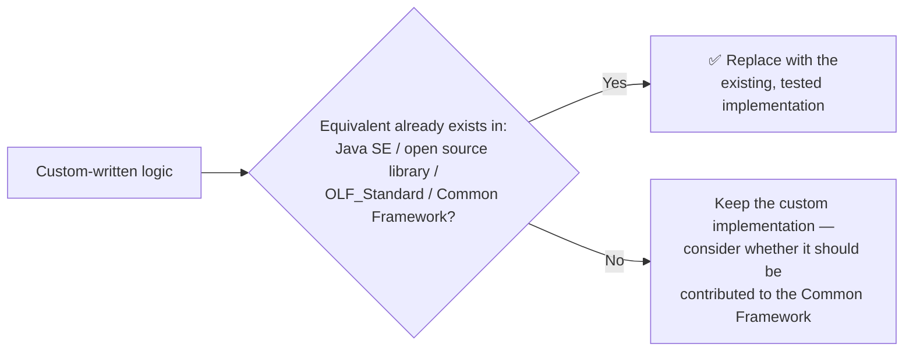

---

## 4. Full Checklist Quick-Reference Table

| # | Checklist Item | Primary Coding Standards Chapter |
|---|---|---|
| 1 | My code compiles | — |
| 2 | My code has been developer-tested | *Debugging Code* |
| 3 | Sufficient and clear Javadoc where appropriate | *Comments* |
| 4 | Sufficient and clear in-line comments where appropriate | *Comments* |
| 5 | My code is tidy | *Lines and Indentation*, *White Space* |
| 6 | Methods not too long — one method, one function | *Programming Practices* |
| 7 | Meaningful class/method/variable names | *Naming Conventions* |
| 8 | Sufficient error checks and error handling | *Programming Practices* (Defensive Coding) |
| 9 | No duplicated code or existing functionality | *Common Framework* |
| 10 | Proper use of exceptions | *Statements*, *Programming Practices* |
| 11 | Appropriate use of logging | *Programming Practices* |
| 12 | Unused imports eliminated | *Source File Organization* |
| 13 | Eclipse warnings eliminated | — |
| 14 | Possible NPEs considered | *Programming Practices* (Defensive Coding) |
| 15 | Code follows the Coding Standards | All Coding Standards chapters |
| 16 | Code follows Java best practices | — |
| 17 | Easy to follow, understand, maintain | *Introduction* (maintainability objective) |
| 18 | No leftover stubs or test routines | — |
| 19 | No hardcoded, development-only values | *Common Framework* (`SendMail` example) |
| 20 | Performance considered | *Programming Practices* |
| 21 | Resources released | *OpenJVS Architecture*, *Common Framework* |
| 22 | Corner cases/workarounds documented | *Data Purging*, *Comments* |
| 23 | Reuse of external/library components considered | *Common Framework*, *CommonExtension Shared Package* |

---

## 5. End-to-End Checklist Diagram

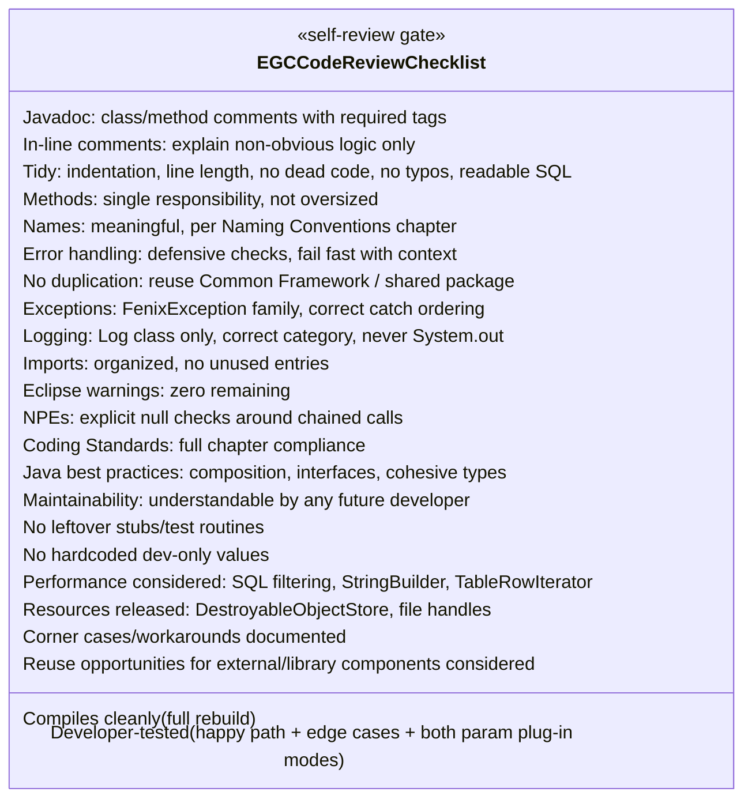

---

## 6. Practical Usage Guidance

- **Use this checklist literally, item by item**, immediately before requesting a formal code review — do not rely on memory or "I'm pretty sure it's fine."
- **Treat every unchecked item as a blocker**, not a suggestion — the whole point of a pre-review checklist is that it catches issues *before* they consume a human reviewer's time.
- **Pair this checklist with the Eclipse code formatter** (Programming Guide, Section 8.1) — many of the "tidy" and "Coding Standards" items are mechanically enforced by running the formatter first, leaving fewer manual checks required.
- **Revisit this checklist for every submission**, not just new classes — modifications to existing Common Framework or shared code carry the same review obligations as brand-new plug-ins.
- **When in doubt about Item 9 or 23** (avoiding duplication / reuse of existing components), consult the Common Framework documentation (Programming Guide, Section 6) and the `EGC_Fenix_Endur_OpenJVS_Coding_Standards` folder before writing new code — or ask the code review team, exactly as advised for package/project placement decisions (Programming Guide, Section 4.3).

---

## Related Sections (Full Programming Guide & Coding Standards)

- Programming Guide, Section 1 — Introduction (the mandatory code review requirement and the four quality objectives: maintainable, testable, readable, adaptable)
- Programming Guide, Section 6 — The Common Framework (the primary source of reusable functionality referenced in Items 9 and 23)
- Programming Guide, Section 8.10/8.11 — Logging and Exception Handling (directly underpinning Items 10, 11, 14, 21)
- Programming Guide, Section 9.1.2 — `DbPurge[...]Main` Classes (the annual-schedule workaround used as the worked example for Item 22)
- *EGC_Fenix_Endur_OpenJVS_Coding_Standards* folder (sibling to this file) — the full set of chapters this checklist enforces item by item
