# EGC Fenix Endur OpenJVS Coding Standards — Comments

> Source: This instruction file represents the **Comments** chapter of the companion *EGC Fenix Endur OpenJVS Coding Standards* document (see *Introduction*, *Source File Organization*, and *Lines and Indentation* in this same folder). It covers **Implementation Comment Formats** (Block, Single-Line, Trailing), **Javadoc Comments** (Class Documentation Comment, Method Documentation Comment, Javadoc Tags, Order of Tags, Ordering Multiple Tags, Required Tags), and **Version History Comments** — the EET-specific revision-tracking header used throughout the Programming Guide's own worked examples (e.g. `WorkflowSleeper`).

---

## Table of Contents

1. [Overview: Two Families of Comments](#1-overview-two-families-of-comments)
2. [Implementation Comment Formats](#2-implementation-comment-formats)
   - 2.1 [Block Comments](#21-block-comments)
   - 2.2 [Single-Line Comments](#22-single-line-comments)
   - 2.3 [Trailing Comments](#23-trailing-comments)
3. [Javadoc Comments](#3-javadoc-comments)
   - 3.1 [Class Documentation Comment](#31-class-documentation-comment)
   - 3.2 [Method Documentation Comment](#32-method-documentation-comment)
   - 3.3 [Javadoc Tags](#33-javadoc-tags)
   - 3.4 [Order of Tags](#34-order-of-tags)
   - 3.5 [Ordering Multiple Tags of the Same Kind](#35-ordering-multiple-tags-of-the-same-kind)
   - 3.6 [Required Tags](#36-required-tags)
4. [Version History Comments](#4-version-history-comments)
5. [Full Worked Example](#5-full-worked-example)
6. [End-to-End Comment Structure Diagram](#6-end-to-end-comment-structure-diagram)
7. [Practical Checklist for Developers](#7-practical-checklist-for-developers)

---

## 1. Overview: Two Families of Comments

Java (and therefore OpenJVS) recognizes **two distinct families** of comments, each with a different **audience** and **purpose**. Conflating them is one of the most common mistakes new OpenJVS developers make.

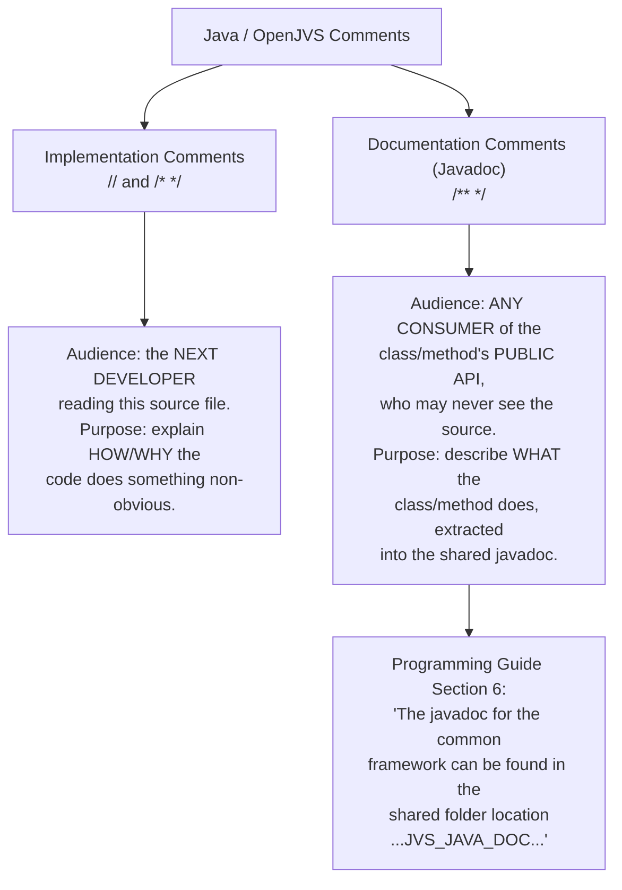

> **Why this distinction matters in OpenJVS specifically:** the Programming Guide (Section 6) explicitly states that the Common Framework's javadoc is extracted and published to a shared network folder for **all EET developers** to consult — independent of whether they ever open the `.java` source file. This means **Javadoc comments are a deliverable**, not an afterthought — while implementation comments only ever matter to someone reading the raw source.

---

## 2. Implementation Comment Formats

> Implementation comments are enclosed in `/* ... */` or preceded with `//`. They are meant for comments about a particular implementation — code that may change, be optimized, or be reworked. There are four styles: **block**, **single-line**, **trailing**, and (informally) **end-of-line**.

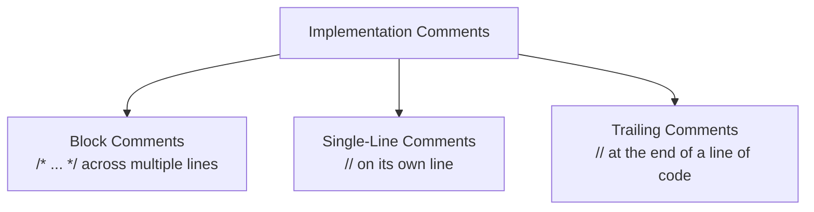

### 2.1 Block Comments

> Block comments are used to provide descriptions of files, methods, data structures, and algorithms. They are placed at the **beginning** of each file, and before each method. They can also be used elsewhere in a file, such as before a particularly non-obvious section of code.

```java
/*
 * This algorithm iterates the candidate rows in descending extraction-date
 * order so that the most recently loaded batch is purged first. This
 * mirrors the retention policy defined in the DbPurge Constants Repository
 * (see EGC Fenix Endur OpenJVS Coding Standards — Data Purging).
 */
for (int row : new TableRowIterator(candidateRows, DIRECTION.BACKWARDS)) {
    ...
}
```

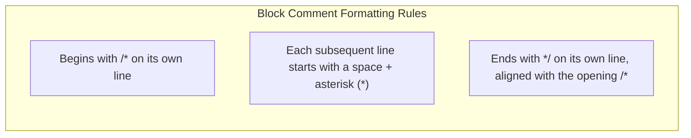

> **Never place a block comment inside the body of a method at the same indentation as surrounding code without blank-line separation** — this makes it hard to distinguish where the comment ends and code resumes. A blank line before and after a block comment used mid-method is recommended.

### 2.2 Single-Line Comments

> Short comments can appear on a single line, indented to the level of the code that follows. If a comment can't be written in a single line, it should follow the block comment format (Section 2.1). A single-line comment should be preceded by a blank line if it applies to more than the immediately preceding statement.

```java
if (isValidationEnabled()) {
    // Skip rows already flagged as reconciled in a previous run
    for (int row : new TableRowIterator(candidateRows)) {
        ...
    }
}
```

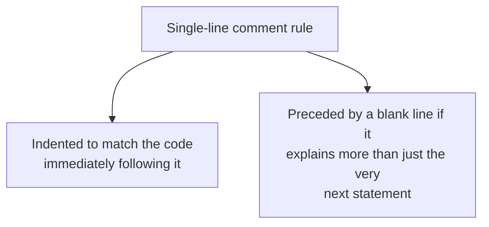

### 2.3 Trailing Comments

> Very short comments can appear on the same line as the code they describe, but should be shifted far enough to separate them from the statements. If more than one short comment appears in the same section of code, they should all be indented to the same tab setting.

```java
int rowCount        = 0;   // number of candidate rows found
int purgedCount      = 0;   // number of rows actually purged
int retentionDays    = DEFAULT_RETENTION_DAYS;  // fallback if not configured
```

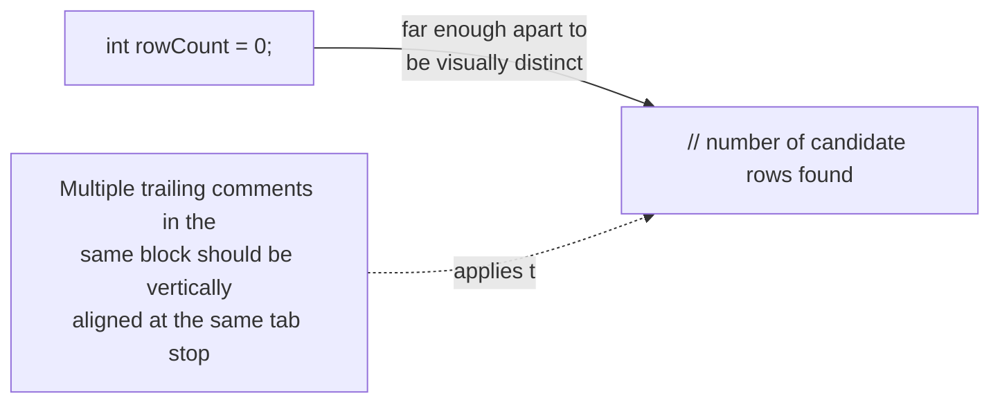

> **Use trailing comments sparingly.** The Programming Guide's own logging guidance (Section 8.10.6) makes a very similar point about over-commenting: *"Too much logging and the log files become cluttered and hard to follow"* — the same is true of trailing comments on every line; reserve them for genuinely non-obvious values (e.g. a magic number, a flag, a unit of measurement).

---

## 3. Javadoc Comments

> Javadoc comments are set off from implementation comments by an **extra asterisk** at the beginning: `/** ... */`. They describe the **specification** of a class or method, from an implementation-free perspective, and are extracted by the Javadoc tool into the shared HTML documentation referenced in Programming Guide Section 6.

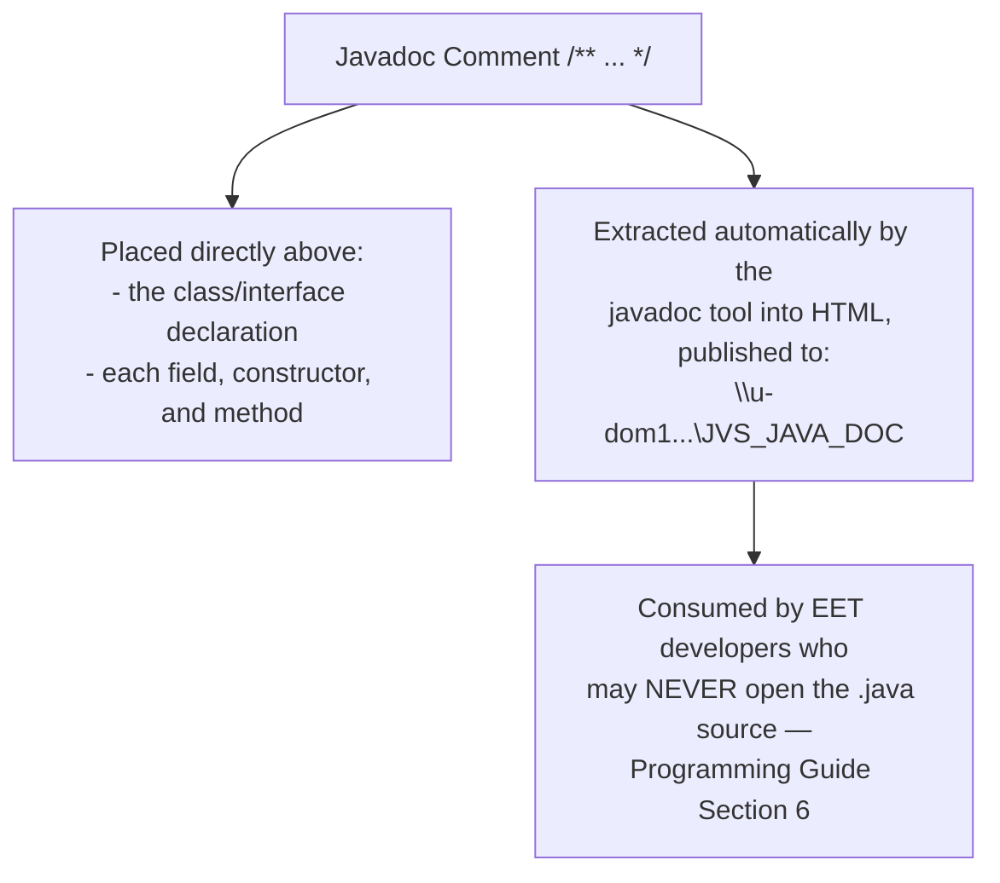

### 3.1 Class Documentation Comment

> Every class and interface that forms part of the Common Framework (or any class intended to be reused) should have a Javadoc comment describing its **purpose**, **package**, and — where relevant — the plug-in type it supports.

```java
/**
 * Provides an alternative way to iterate through all the rows of a table,
 * without first having to determine the row count. Supports both forwards
 * and backwards iteration via the {@link DIRECTION} enum.
 *
 * <p>Package: {@code com.eon.eet.fenix.common.table}
 *
 * @author G. Moore
 * @since 1.0
 */
public class TableRowIterator implements Iterator<Integer> {
    ...
}
```

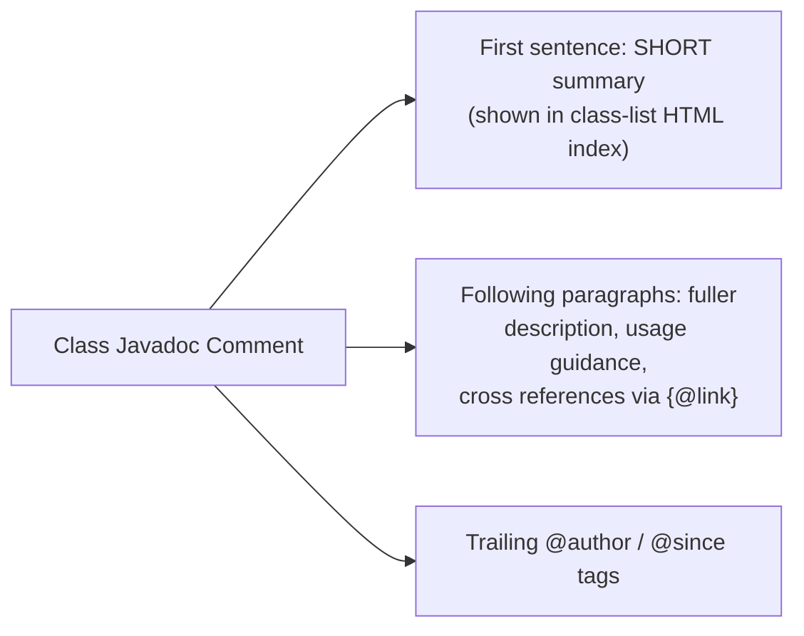

### 3.2 Method Documentation Comment

> Every `public` and `protected` method — especially those on Common Framework classes such as `BasicScript`, `DestroyableObjectStore`, `DbaseUtil` — should have a Javadoc comment describing what the method does, its parameters, its return value, and any exceptions it may throw.

```java
/**
 * Imports a delimited (CSV) file into a memory table, validating each
 * column according to the supplied XML definition file.
 *
 * @param filename the full path to the file being imported
 * @param definitionFilename the name of the definition file previously
 *        saved to the Endur user directory
 *         {@code /User/Import File Definitions}
 * @return a memory {@link Table} populated according to the definition
 * @throws OException if a validation error occurs and the definition
 *         file's {@code validation_error} attribute is set to
 *         {@code "fail"}
 */
public static Table importFile(String filename, String definitionFilename)
        throws OException {
    ...
}
```

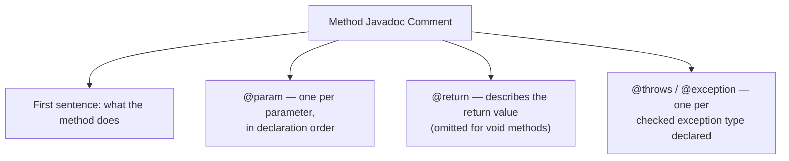

> **Method comments do not need to restate the method signature.** Focus on *behavior that isn't obvious from the signature alone* — e.g. what happens on validation failure, what default values apply, or side effects such as entries added to `DestroyableObjectStore`.

---

### 3.3 Javadoc Tags

> Javadoc tags are special `@`-prefixed keywords recognized by the Javadoc tool that generate structured, cross-referenced sections in the generated HTML.

| Tag | Applies To | Purpose |
|---|---|---|
| `@author` | Class / Interface | Identifies the original author(s) — required for Common Framework classes |
| `@version` | Class / Interface | Identifies a version/release identifier, if used |
| `@param` | Method / Constructor | Describes a single parameter — one per parameter |
| `@return` | Method | Describes the return value (omit for `void`) |
| `@throws` / `@exception` | Method / Constructor | Describes an exception that may be thrown |
| `@see` | Class / Method / Field | Cross-reference to a related class or method |
| `@since` | Class / Interface / Method | Indicates the version/date the element was introduced |
| `@deprecated` | Class / Method / Field | Marks the element obsolete; must state the replacement |
| `{@link}` | Inline (anywhere in text) | Inline cross-reference rendered as a hyperlink |
| `{@code}` | Inline (anywhere in text) | Renders text in a code (monospace) font, without interpreting HTML |

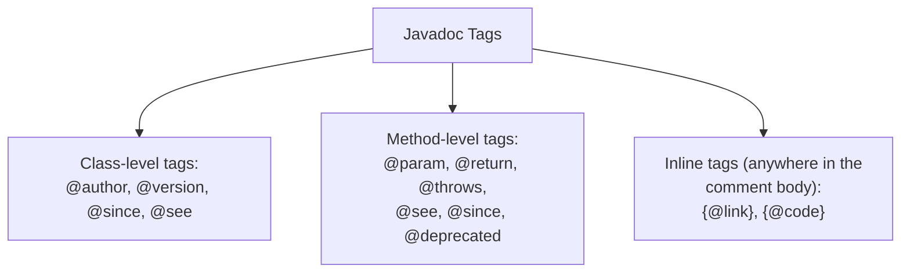

### 3.4 Order of Tags

> Tags are documented in this order for classes and methods, when applicable:

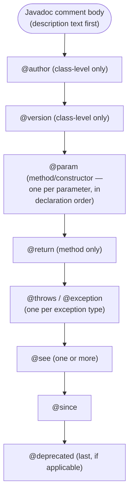

```java
/**
 * Registers a purge worker class with this purge set.
 *
 * @param worker the {@link IPurgeTable} implementation to register
 * @throws IllegalArgumentException if {@code worker} is {@code null}
 * @see IPurgeTable
 * @since 1.2
 */
protected void registerNewClass(IPurgeTable worker) {
    ...
}
```

### 3.5 Ordering Multiple Tags of the Same Kind

> When a tag type occurs more than once (most commonly `@param` and `@throws`), the multiple occurrences are grouped together and ordered as follows:

| Tag | Ordering Rule |
|---|---|
| `@param` | In the **same order** as the parameters appear in the method declaration |
| `@throws` | Alphabetically by exception class name |
| `@see` | Grouped logically — most relevant reference first |

```java
/**
 * Purges rows from the given table according to the retention policy.
 *
 * @param table the memory table containing candidate rows
 * @param retentionDays the number of days to retain before purge
 * @param batchSize the number of rows purged per batch
 * @throws FenixRuntimeException if the retention policy is misconfigured
 * @throws OException if the underlying database call fails
 */
public void purgeTable(Table table, int retentionDays, int batchSize)
        throws OException {
    ...
}
```

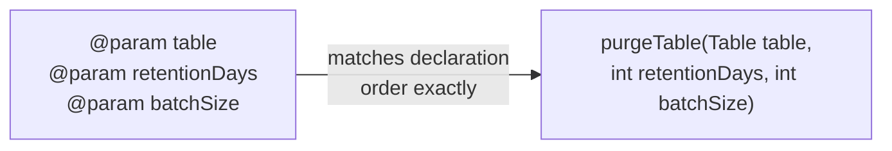

### 3.6 Required Tags

> At minimum, the following tags are **mandatory** for classes and methods that form part of the Common Framework or any shared/reusable EET code:

| Element | Required Tags |
|---|---|
| Every framework **class/interface** | `@author` |
| Every **public method** with parameters | `@param` for each parameter |
| Every **public method** with a non-`void` return | `@return` |
| Every **public method** declaring checked exceptions | `@throws` for each declared checked exception |
| Any **deprecated** element | `@deprecated`, stating the replacement |

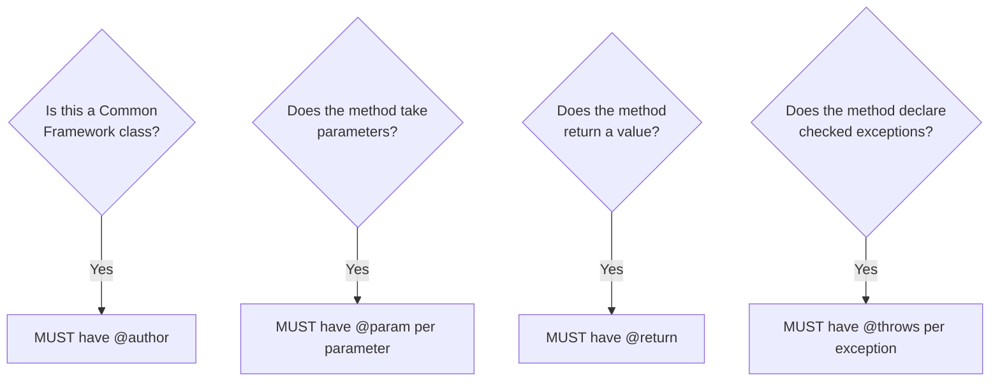

> Missing required tags is one of the most common code-review rejections referenced in the Programming Guide's Introduction (Section 1): *"All application software will need to pass a code review to enforce coding conventions."*

---

## 4. Version History Comments

> In addition to the standard Javadoc class comment, EET Fenix Endur OpenJVS classes conventionally include a **Version History** block — a running revision log placed directly beneath the class-level Javadoc, in the beginning-comment block described in the *Source File Organization* chapter. This convention is directly reflected in the Programming Guide's own screenshot of the `WorkflowSleeper` plug-in (Section 10.1), which shows exactly this structure.

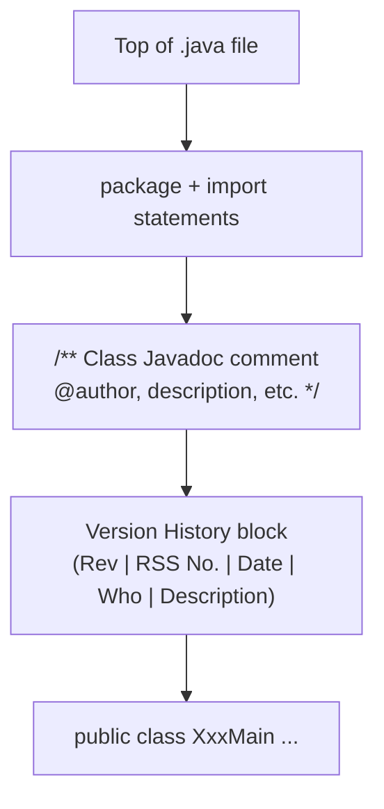

### Version History Table Format

As shown in the Programming Guide's own `WorkflowSleeper` example (Section 10.1):

```java
/**
 * Description: Stop a workflow from running until a specific time is
 * reached. The time is defined within the workflow that runs this script.
 * The time must be in the format [hh:mmAM].
 *
 * @author G. Moore
 * Created 10 Feb 2011
 */
/*-------------------------------------------------------------------------
 | Rev  | RSS No.  | Date        | Who      | Description                |
 -------------------------------------------------------------------------
 | 001  |          | 10-Feb-2011 | G. Moore | Initial version            |
 -------------------------------------------------------------------------*/
public class WorkflowSleeper extends BasicScript {
    ...
}
```

| Column | Purpose |
|---|---|
| **Rev** | Sequential revision number for this file (001, 002, 003, ...) |
| **RSS No.** | Associated change/ticket/request-tracking number, if applicable |
| **Date** | Date of the revision, in `dd-MMM-yyyy` format |
| **Who** | Author of that specific revision |
| **Description** | Short summary of what changed in that revision |

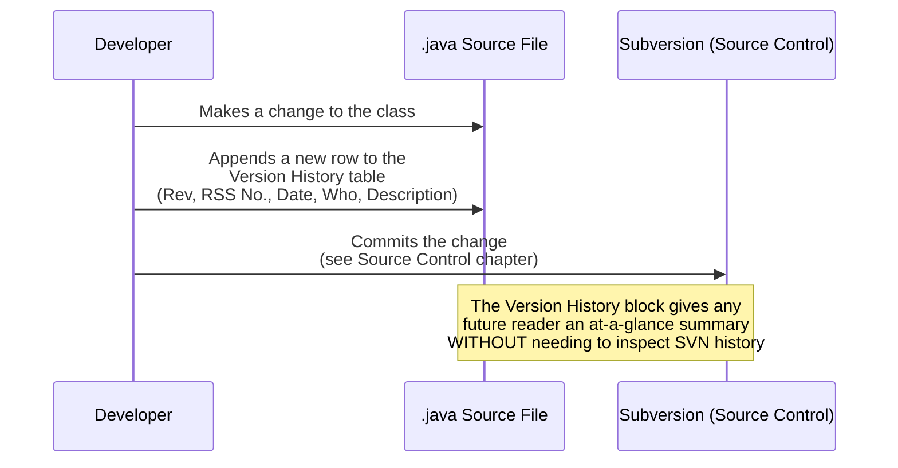

> **Why maintain this when Source Control (SVN) already tracks history?** The Version History block is a **quick, in-file summary** readable directly in the Endur Simple Editor or Directory Browser (Section 4.2/10.1) — which do **not** have access to SVN history at all. A developer viewing the class directly in Endur (rather than checking it out into Eclipse) can still see what changed and why.

### Practical Guidance

- Add exactly **one new row** to the Version History table per meaningful revision — do not rewrite or delete prior rows.
- Keep the **Description** column terse — one line, focused on *what changed*, not *why* (the *why* belongs in the SVN commit message or an accompanying block comment near the changed code).
- Always increment the **Rev** number sequentially; never reuse a number.

---

## 5. Full Worked Example

Combining every rule from this chapter into one realistic OpenJVS class:

```java
package com.eon.eet.fenix.purging;

import java.util.List;

import com.eon.eet.fenix.common.FenixRuntimeException;
import com.olf.openjvs.OException;
import com.olf.openjvs.Table;

/**
 * Purges obsolete rows from the {@code user_index_price_output_values}
 * user table according to the configured retention period.
 *
 * <p>See {@link com.eon.eet.fenix.purging.IPurgeTable} for the contract
 * implemented by this worker class.
 *
 * @author G. Moore
 * @see com.eon.eet.fenix.purging.AbstractDbPurgeSet
 * @since 1.0
 */
/*-------------------------------------------------------------------------
 | Rev  | RSS No.  | Date        | Who      | Description                |
 -------------------------------------------------------------------------
 | 001  |          | 10-Feb-2011 | G. Moore | Initial version            |
 | 002  | RSS-4821 | 03-May-2011 | H. Singh | Added configurable batch   |
 |      |          |             |          | size support               |
 -------------------------------------------------------------------------*/
public class DbPurgeUserIndexPriceOutputValues implements IPurgeTable {

    private static final int DEFAULT_RETENTION_DAYS = 60;

    /**
     * Retrieves rows eligible for purge and adds them to {@code tables}.
     *
     * @param tables the list to which purge-candidate memory tables
     *        must be added
     * @throws OException if the underlying database query fails
     */
    @Override
    public void purgeTable(List<Table> tables) throws OException {
        /*
         * Retention is read from the Constants Repository at runtime;
         * DEFAULT_RETENTION_DAYS is only a fallback (see Data Purging
         * chapter of the Coding Standards for the full DbPurge context).
         */
        int retentionDays = resolveRetentionDays();  // may come from config

        // Only rows older than the retention window are eligible
        Table candidates = queryCandidateRows(retentionDays);
        tables.add(candidates);
    }

    private int resolveRetentionDays() {
        return DEFAULT_RETENTION_DAYS;
    }

    private Table queryCandidateRows(int retentionDays) {
        return null; // implementation omitted for brevity
    }
}
```

---

## 6. End-to-End Comment Structure Diagram

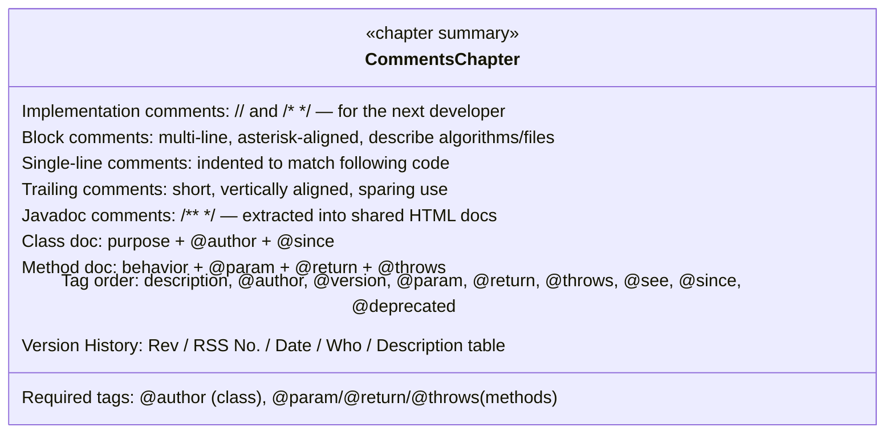

---

## 7. Practical Checklist for Developers

- [ ] **Use implementation comments (`//`, `/* */`) to explain non-obvious HOW/WHY** — never to restate what the code already makes obvious.
- [ ] **Format block comments** with aligned `*` on each line, opening `/*` and closing `*/` on their own lines.
- [ ] **Indent single-line comments** to match the code they describe, with a blank line before if they explain more than the very next statement.
- [ ] **Use trailing comments sparingly**, vertically aligned when multiple appear together.
- [ ] **Give every Common Framework class a Javadoc class comment** with a clear summary sentence and required `@author` tag.
- [ ] **Document every public/protected method** with a Javadoc comment: behavior summary, `@param` per parameter (in declaration order), `@return` if non-`void`, `@throws` per checked exception.
- [ ] **Follow the canonical tag order**: description → `@author` → `@version` → `@param` → `@return` → `@throws` → `@see` → `@since` → `@deprecated`.
- [ ] **Never omit required tags** — missing `@param`/`@return`/`@throws` is a common code-review rejection point.
- [ ] **Maintain a Version History block** beneath the class Javadoc comment, adding one new row per meaningful revision (Rev, RSS No., Date, Who, Description) — never edit or remove prior rows.
- [ ] **Remember Javadoc is a deliverable**: the Common Framework's generated HTML docs are published to a shared network location (Programming Guide, Section 6) and consulted by developers who may never open the source file.

---

## Related Sections (Full Programming Guide)

- Section 6 — The Common Framework (*"The javadoc for the common framework can be found in the shared folder location..."* — the direct justification for rigorous Javadoc discipline)
- Section 10.1 — Endur Simple Editor (the `WorkflowSleeper` screenshot showing the canonical Description/Author/Version-History comment structure in practice)
- *EGC Fenix Endur OpenJVS Coding Standards — Source File Organization* (this folder) — where the beginning comment block (including Version History) fits within overall file structure
- *EGC Fenix Endur OpenJVS Coding Standards — Lines and Indentation* (this folder) — the line-length and wrapping rules that also apply within comment text
