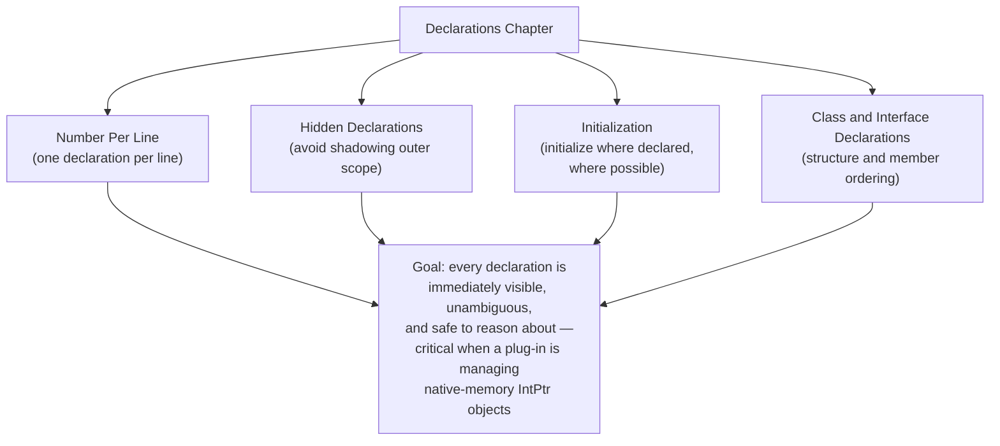
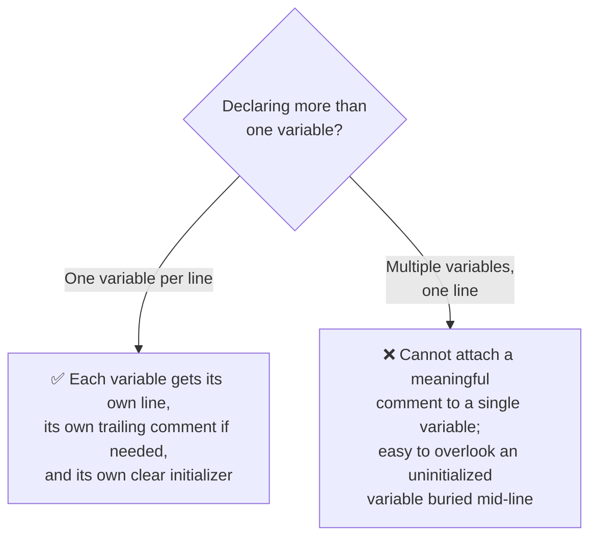
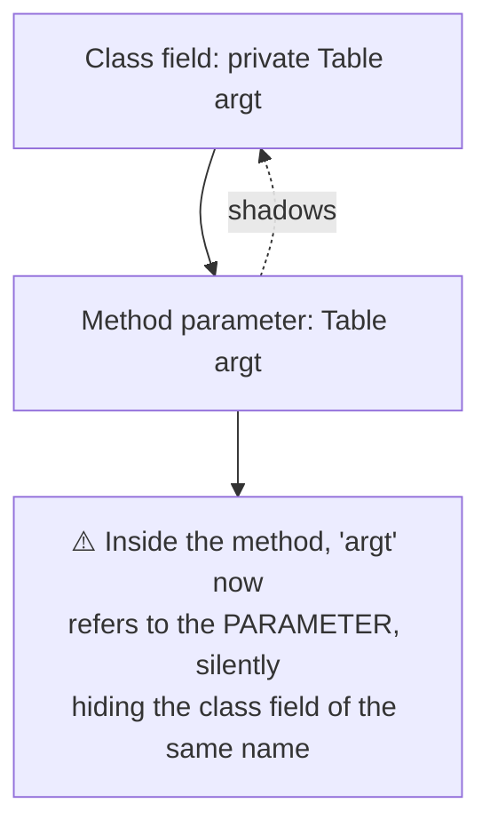
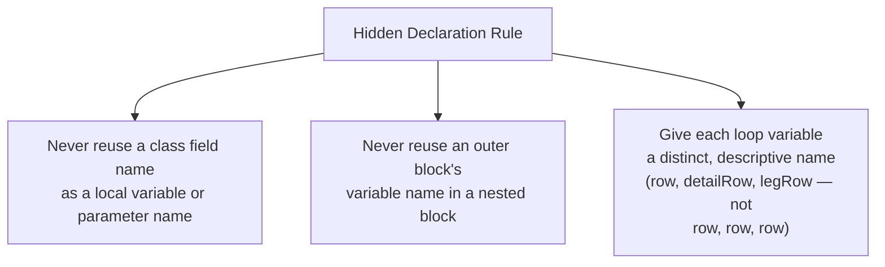
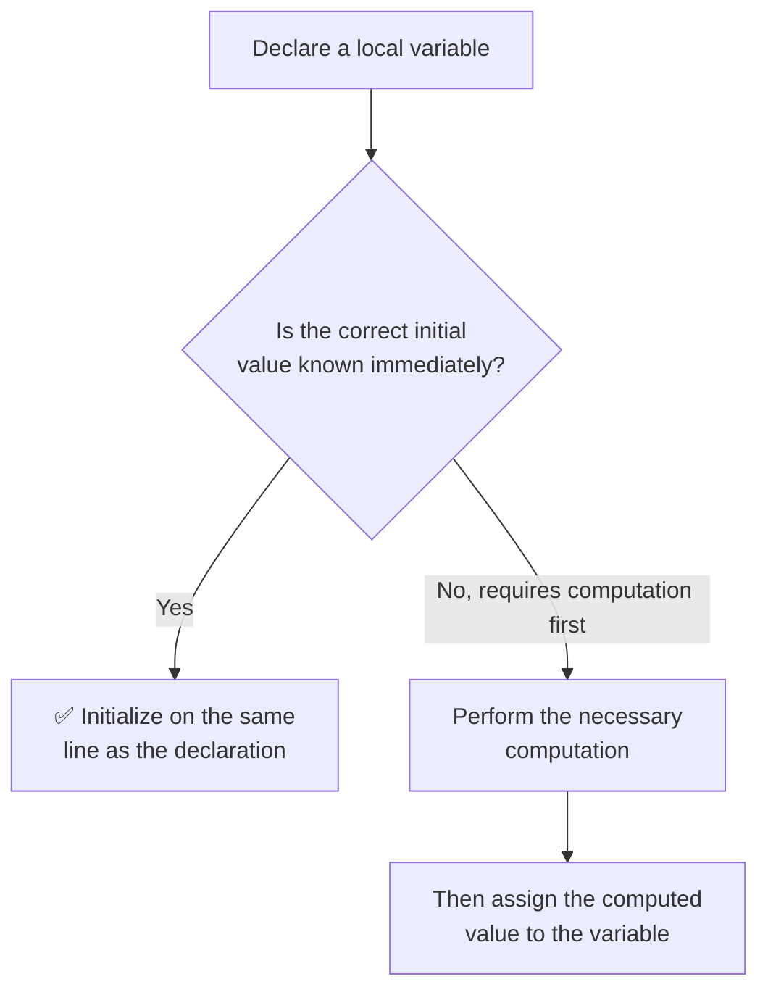
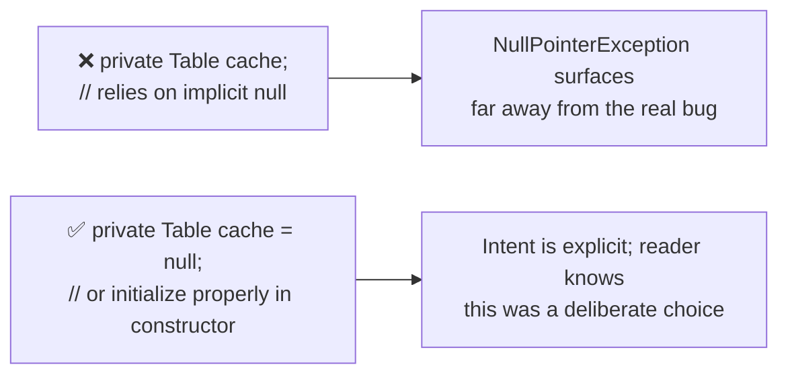
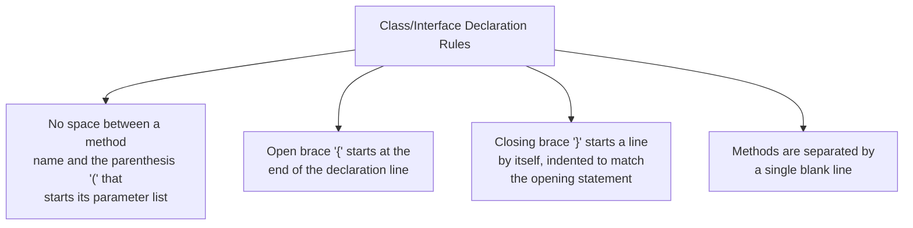
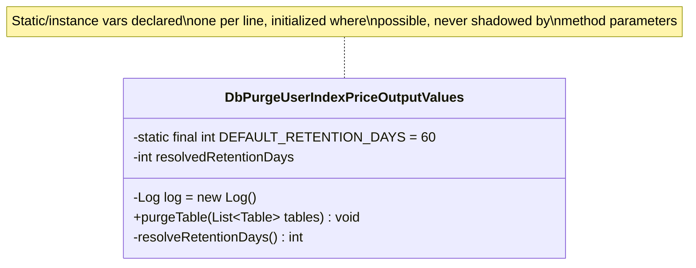
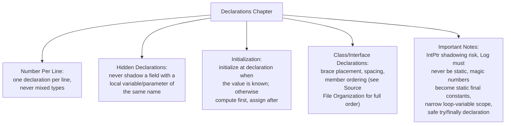

# EGC Fenix Endur OpenJVS Coding Standards — Declarations

> Source: This instruction file represents the **Declarations** chapter of the companion *EGC Fenix Endur OpenJVS Coding Standards* document (see *Introduction*, *Source File Organization*, *Lines and Indentation*, and *Comments* in this same folder). It covers **Number Per Line**, **Hidden Declarations**, **Initialization**, and **Class and Interface Declarations** — the rules governing how variables, fields, and types are declared so that every OpenJVS class remains unambiguous and easy to scan.

---

## Table of Contents

1. [Overview: Why Declaration Discipline Matters](#1-overview-why-declaration-discipline-matters)
2. [Number Per Line](#2-number-per-line)
3. [Hidden Declarations](#3-hidden-declarations)
4. [Initialization](#4-initialization)
5. [Class and Interface Declarations](#5-class-and-interface-declarations)
6. [Important Notes](#6-important-notes)
7. [Full Worked Example](#7-full-worked-example)
8. [End-to-End Declarations Diagram](#8-end-to-end-declarations-diagram)
9. [Practical Checklist for Developers](#9-practical-checklist-for-developers)

---

## 1. Overview: Why Declaration Discipline Matters

A **declaration** introduces a name (variable, field, parameter, class, interface) into scope. Because OpenJVS plug-ins frequently manipulate `Table`, `Transaction`, and other `IntPtr`-derived objects (see *OpenJVS Architecture*), sloppy declarations are a common source of subtle bugs — accidental shadowing of a `DestroyableObjectStore`-managed variable, uninitialized fields relied upon before `execute()` runs, or declarations crammed onto one line that hide a missing initializer.



---

## 2. Number Per Line

> One declaration per line is recommended, since it encourages commenting. In other words, `int level; int size;` is preferred over `int level, size;`. Do not put different types on the same line, and never mix a declaration with an executable statement on the same line.



```java
// ❌ Avoid — multiple declarations on one line
int rowCount, purgedCount, retentionDays;

// ✅ Preferred — one declaration per line, each independently commented
int rowCount;              // number of candidate rows found
int purgedCount;           // number of rows actually purged
int retentionDays;         // retention window, in days
```

### Applying This to OpenJVS Field Declarations

```java
public class DbPurgeUserIndexPriceOutputValues implements IPurgeTable {

    // ✅ One field per line, in the standard member-ordering position
    private static final int DEFAULT_RETENTION_DAYS = 60;
    private Log log = new Log();
    private int rowsPurged;
}
```

> **Never declare fields of unrelated types on the same line.** This rule applies equally to local variables inside `execute(Table argt, Table returnt)` methods and to instance fields at the top of a class (see *Source File Organization* for the full member-ordering convention).

---

## 3. Hidden Declarations

> Do not declare a local variable or parameter that **hides** (shadows) a variable of the same name already in an enclosing scope — such as a class field, an outer block variable, or a loop variable in a nested loop. Shadowing makes code ambiguous: a reader (and sometimes the compiler) cannot immediately tell which variable a statement refers to.



```java
public class OcNeonDealPushPre extends BasicScript {

    private int retentionDays;   // class field

    public void configure(int retentionDays) {  // ❌ parameter shadows the field
        this.retentionDays = retentionDays;      // requires 'this.' to disambiguate
    }
}
```

```java
public class OcNeonDealPushPre extends BasicScript {

    private int retentionDays;   // class field

    // ✅ Parameter name is distinct from the field it initializes
    public void configure(int retentionDaysParam) {
        this.retentionDays = retentionDaysParam;
    }
}
```

### The Most Common OpenJVS Shadowing Trap: `Table` Variables in Nested Loops

```java
// ❌ Inner loop variable 'row' shadows nothing here, but reusing 'table'
// across nested scopes is a frequent source of confusion in OpenJVS code
for (int row : new TableRowIterator(outerTable)) {
    Table detailTable = fetchDetail(row);
    for (int row2 : new TableRowIterator(detailTable)) {  // use a distinct name
        // ...
    }
}
```



> **Exception:** constructor and setter parameters are commonly named identically to the field they set (e.g. `public UserTableEnum(String name)` setting `this.name = name`), which is an accepted, well-understood Java idiom — this is **not** considered problematic shadowing because the `this.` qualifier makes the distinction explicit at the point of use.

---

## 4. Initialization

> Try to initialize local variables where they are declared. The only reason not to initialize a variable where it is declared is if the initial value depends on some computation occurring first.



```java
// ✅ Initialized immediately — the value is known at declaration time
int retentionDays = DEFAULT_RETENTION_DAYS;
Table result = DestroyableObjectStore.tableNew();

// ✅ Acceptable to defer initialization — value depends on prior computation
Table candidates;
if (isRetentionConfigured()) {
    candidates = queryCandidateRows(retentionDays);
} else {
    candidates = DestroyableObjectStore.tableNew();
}
```

### Field Initialization

Instance and static fields should be initialized at declaration wherever the value is a simple constant or a safe default; more complex initialization belongs in the constructor.

```java
public class DbPurgeUserIndexPriceOutputValues implements IPurgeTable {

    // ✅ Simple constant — initialize directly at declaration
    private static final int DEFAULT_RETENTION_DAYS = 60;

    // ✅ Safe default object — initialize directly at declaration
    private Log log = new Log();

    // Field whose value depends on runtime configuration — leave
    // uninitialized here and set it in the constructor/method instead
    private int resolvedRetentionDays;
}
```

### Never Rely on Default Java Field Values in OpenJVS Code

Java quietly initializes uninitialized instance fields to `0`, `false`, or `null`. **Do not rely on this default** — it obscures intent and, for `IntPtr`-derived types managed via `DestroyableObjectStore`, an implicitly-`null` field can propagate a `NullPointerException` far from its true cause.



---

## 5. Class and Interface Declarations

> When coding Java classes and interfaces, the following formatting rules apply. (This overlaps with, and should be read alongside, the member-ordering convention already established in the *Source File Organization* chapter — this section focuses specifically on the **declaration statement itself** and how members are laid out around it.)



```java
// ✅ Correctly formatted class declaration
public class DbPurgeUserIndexPriceOutputValues implements IPurgeTable {

    private static final int DEFAULT_RETENTION_DAYS = 60;

    @Override
    public void purgeTable(List<Table> tables) throws OException {
        // ...
    }

    private int resolveRetentionDays() {
        return DEFAULT_RETENTION_DAYS;
    }

}
```

### Interface Declarations Follow the Same Rules

```java
// ✅ Interface declaration — same brace and spacing conventions as a class
public interface IPurgeTable {

    void purgeTable(List<Table> tables) throws OException;

}
```

### Ordering Within a Class Declaration (Cross-Reference)

The full six-part member-ordering convention (Javadoc → class statement → static variables → instance variables → constructors → methods) is defined in the *Source File Organization* chapter. The **Declarations** chapter reinforces two additional points specific to how those members are *declared*:

| Rule | Applies To |
|---|---|
| One declaration per line (Section 2 above) | Static variables, instance variables |
| No hidden/shadowed declarations (Section 3 above) | Instance variables vs. method parameters/locals |
| Initialize at declaration where possible (Section 4 above) | Static variables, instance variables, local variables |



---

## 6. Important Notes

> The following notes highlight EET-specific consequences of poor declaration discipline, grounded in the Common Framework classes referenced throughout the Programming Guide.

- **Note 1 — `IntPtr`-derived fields must never be silently shadowed.** A `Table`, `Transaction`, or similar field managed via `DestroyableObjectStore` that gets shadowed by a same-named local variable can result in the *wrong* object being destroyed (or the intended object never being destroyed at all), leaking native memory. See *OpenJVS Architecture* and *Common Framework* for background on `IntPtr` memory management.

- **Note 2 — `Log` instances must never be declared static** (see *Comments*/*Developing OpenJVS Plugins*, Logging chapter). This is itself a declaration rule: `private Log log = new Log();` must be an **instance** field, never `private static Log log = new Log();`.

- **Note 3 — Constants belong in `static final` declarations, not magic numbers.** Where a literal value (e.g. a retention period, a batch size) is used more than once, declare it as a named `static final` constant rather than repeating the literal — this is a direct extension of the "one declaration per line, initialized at declaration" rule to configuration-like values.

- **Note 4 — Declare loop and iteration variables as narrowly-scoped as possible.** Prefer declaring the loop variable inside the `for` statement itself (`for (int row : new TableRowIterator(table))`) rather than declaring it outside the loop and reusing it — this naturally avoids the hidden-declaration problem described in Section 3.

- **Note 5 — Declarations inside `try`/`catch`/`finally` blocks.** Variables that must be visible in a `finally` block (for cleanup) should be declared **before** the `try` block, initialized to a safe default (e.g. `null`), and only assigned inside the `try`. This avoids "variable might not have been initialized" compiler errors while keeping the cleanup logic simple.

```java
// ✅ Declared and safely defaulted before the try block, per Note 5
Table result = null;
try {
    result = DbaseUtil.execISql(sql);
    // ... process result ...
} finally {
    if (result != null) {
        DestroyableObjectStore.remove(result);
    }
}
```

---

## 7. Full Worked Example

```java
package com.eon.eet.fenix.purging;

import java.util.List;

import com.eon.eet.fenix.common.dbase.DbaseUtil;
import com.eon.eet.fenix.common.logging.Log;
import com.olf.openjvs.OException;
import com.olf.openjvs.Table;

/**
 * Purges obsolete rows from the {@code user_index_price_output_values}
 * user table according to the configured retention period.
 *
 * @author G. Moore
 * @since 1.0
 */
public class DbPurgeUserIndexPriceOutputValues implements IPurgeTable {

    // Static variables: one per line, initialized at declaration (Section 2, 4)
    private static final int DEFAULT_RETENTION_DAYS = 60;

    // Instance variables: one per line, initialized at declaration (Section 2, 4)
    private Log log = new Log();

    @Override
    public void purgeTable(List<Table> tables) throws OException {
        // Parameter name 'tables' does not shadow any field (Section 3)
        int retentionDays = resolveRetentionDays();  // initialized immediately

        // Declared and defaulted before try, assigned inside (Section 6, Note 5)
        Table candidates = null;
        try {
            candidates = queryCandidateRows(retentionDays);
            tables.add(candidates);
        } catch (OException e) {
            log.error("Failed to query candidate rows: " + e.getMessage());
            throw e;
        }
    }

    private int resolveRetentionDays() {
        return DEFAULT_RETENTION_DAYS;
    }

    private Table queryCandidateRows(int retentionDays) throws OException {
        String sql = "SELECT * FROM user_index_price_output_values"
                + " WHERE extraction_date < GETDATE() - " + retentionDays;
        return DbaseUtil.execISql(sql);
    }

}
```

---

## 8. End-to-End Declarations Diagram



---

## 9. Practical Checklist for Developers

- [ ] **One declaration per line** — never combine multiple variables (even of the same type) on a single line.
- [ ] **Never shadow a class field** with a method parameter or local variable of the same name (except the well-understood constructor/setter idiom using `this.`).
- [ ] **Give nested loop variables distinct names** (`row`, `detailRow`, `legRow`) rather than reusing the same name in nested scopes.
- [ ] **Initialize variables at the point of declaration** whenever the correct value is already known.
- [ ] **Never rely on Java's implicit default values** (`0`, `false`, `null`) for fields — initialize explicitly, even if the explicit value happens to match the default.
- [ ] **Declare constants as `static final`**, never as repeated literal values scattered through the class.
- [ ] **Never declare a `Log` field as `static`** — it must always be an instance field.
- [ ] **Declare cleanup-relevant variables before a `try` block**, defaulted to `null`, and only assign them inside the `try` — this keeps `finally`-block cleanup logic (e.g. `DestroyableObjectStore.remove(...)`) safe and simple.
- [ ] **Follow the class/interface brace and spacing conventions**: opening brace at the end of the declaration line, closing brace on its own line, one blank line between methods.
- [ ] **Cross-check member ordering** against the *Source File Organization* chapter — Declarations governs *how* each member is written; Source File Organization governs *where* it goes.

---

## Related Sections (Full Programming Guide)

- Section 6.3 — `DestroyableObjectStore` Class (why `IntPtr`-derived field shadowing is a real memory-leak risk in OpenJVS)
- Section 8.10.2 — The `Log` Class (*"an instance of the Log class must NEVER be declared static"* — directly reflected in Important Note 2 above)
- *EGC Fenix Endur OpenJVS Coding Standards — Source File Organization* (this folder) — the full member-ordering convention this chapter cross-references
- *EGC Fenix Endur OpenJVS Coding Standards — Lines and Indentation* (this folder) — formatting rules that apply to wrapped declaration statements
- *EGC Fenix Endur OpenJVS Coding Standards — Comments* (this folder) — documenting declarations via trailing comments and Javadoc field descriptions
