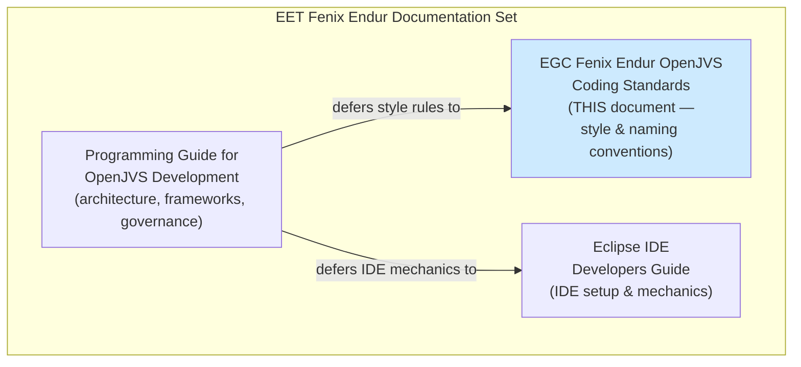
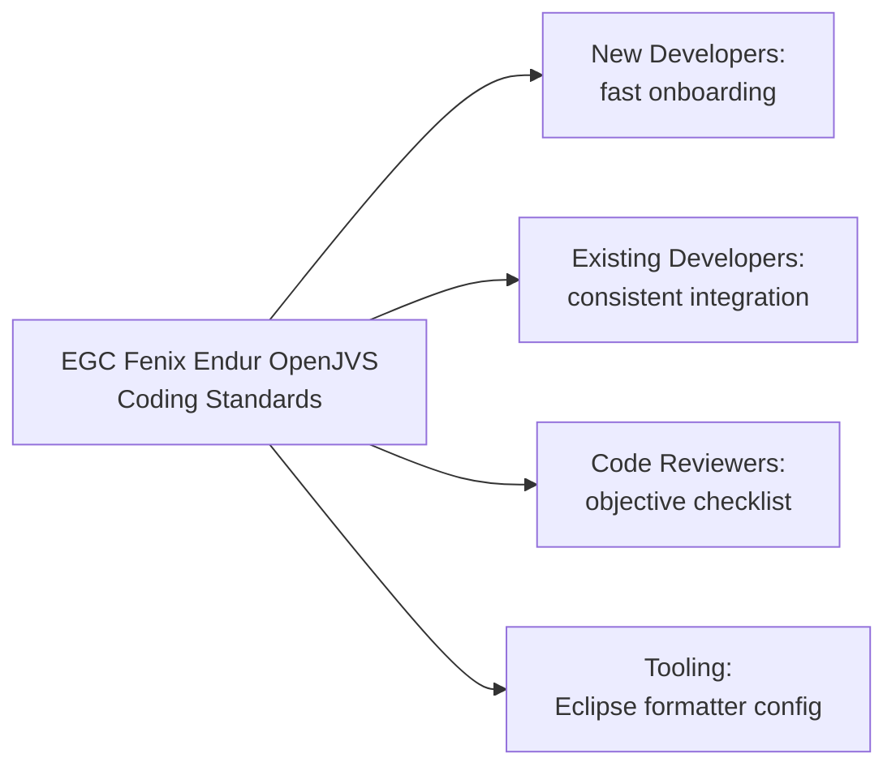
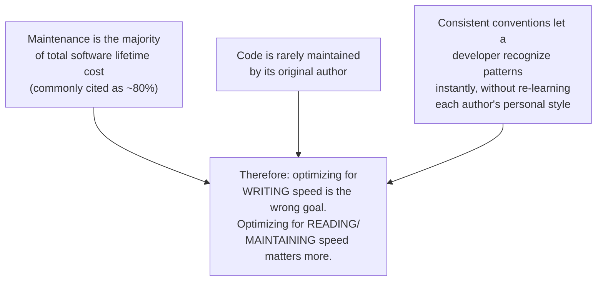
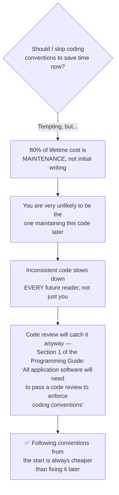
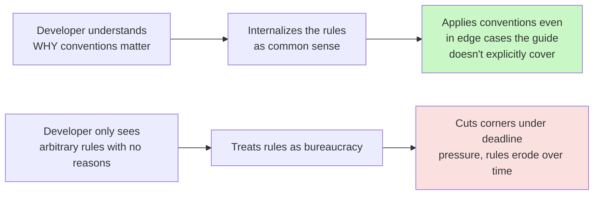
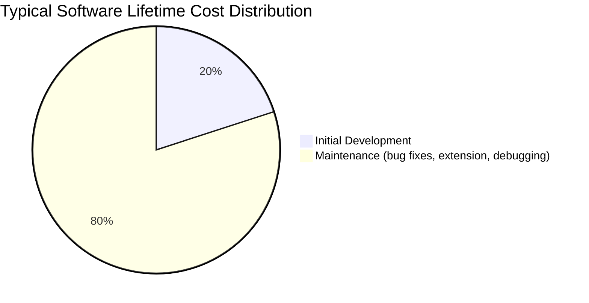
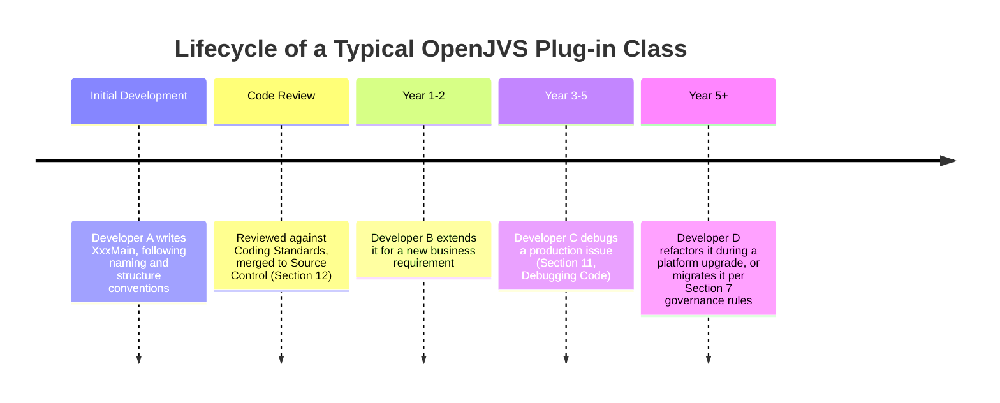
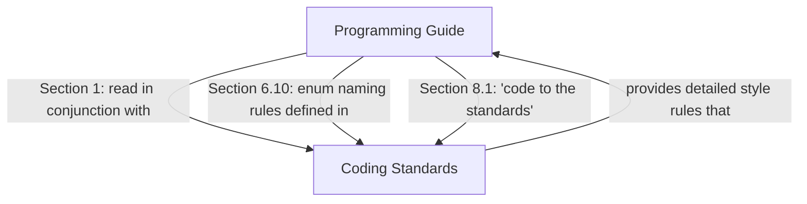
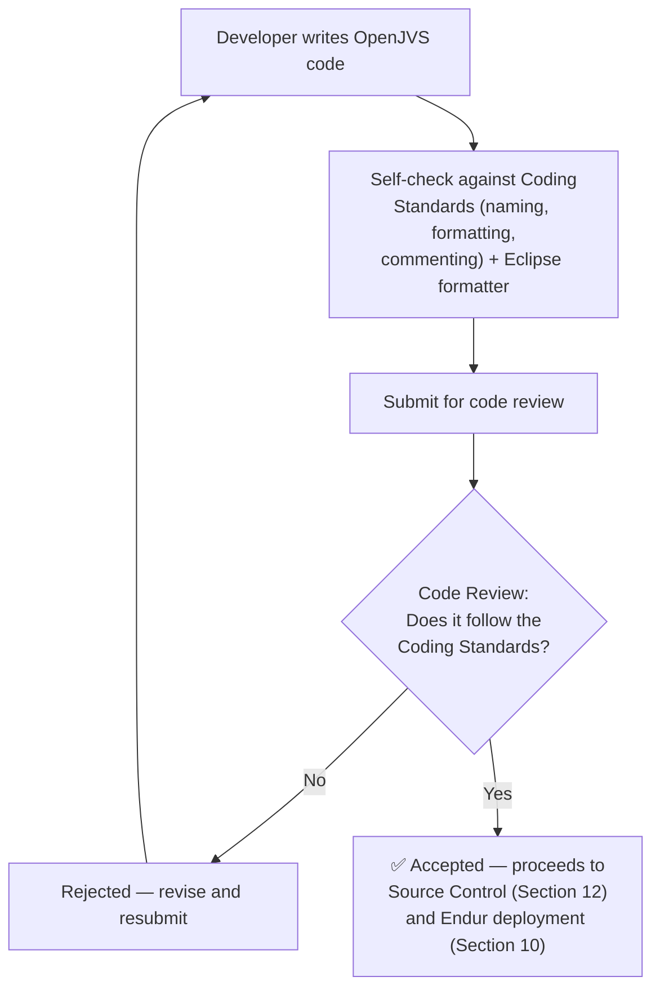

# EGC Fenix Endur OpenJVS Coding Standards — Introduction & Why Have Code Conventions

> Source: This instruction file represents the **Introduction** and **Why Have Code Conventions** sections of the companion document referenced throughout the *Programming Guide for OpenJVS Development (EET Fenix Endur)* — specifically Section 1 of that guide, which states: *"This document should be read in conjunction with the **Fenix Endur OpenJVS Coding Standards** and the Eclipse IDE Developers Guide."* This file expands that companion document's opening sections into a complete, diagrammed reference, grounded in the same rationale used by the canonical Java Code Conventions this standard is modeled on.

---

## Table of Contents

1. [Overview: What This Document Is](#1-overview-what-this-document-is)
2. [Introduction](#2-introduction)
3. [Why Have Code Conventions](#3-why-have-code-conventions)
4. [The Cost-of-Maintenance Argument, Visualized](#4-the-cost-of-maintenance-argument-visualized)
5. [How This Document Relates to the Programming Guide](#5-how-this-document-relates-to-the-programming-guide)
6. [Scope of the Coding Standards](#6-scope-of-the-coding-standards)
7. [Enforcement: The Code Review Gate](#7-enforcement-the-code-review-gate)
8. [Practical Checklist for Developers](#8-practical-checklist-for-developers)

---

## 1. Overview: What This Document Is

The **EGC Fenix Endur OpenJVS Coding Standards** is the companion reference that defines the **detailed, line-level style and naming rules** for all OpenJVS/Java code written for the EET Fenix Endur platform. Where the *Programming Guide for OpenJVS Development* establishes **architecture, frameworks, and governance** (which class to extend, which project to use, how to import/debug code), the **Coding Standards** document establishes the **fine-grained conventions** — naming, formatting, commenting, structure — that make code written by different developers look and read consistently.

This document begins, as most professional coding-standards guides do, with two questions every developer should be able to answer before writing a single line of OpenJVS code:

1. **What is this document, and why does it exist?** *(Introduction)*
2. **Why should I bother following it at all?** *(Why Have Code Conventions)*

---

## 2. Introduction

### Purpose

The Introduction establishes the document's mandate: to provide **application developers and designers** with a single, authoritative reference for **how code should look and be structured**, so that any OpenJVS class — regardless of who wrote it — is immediately recognizable as belonging to the EET Fenix Endur codebase.

This mirrors, and directly supports, the objective already stated in Section 1 of the Programming Guide:

> *"The major objective of this document is to provide for application developers and designers to develop systems that are **maintainable, testable, readable and adaptable** to changes in the infrastructure."*

The Coding Standards document is the **practical toolkit** for achieving the **"readable"** (and, indirectly, **"maintainable"**) pillar of that objective — it is where broad principles become concrete, checkable rules.

### Audience

| Audience                                                    | What They Get From This Document                                                                     |
| ----------------------------------------------------------- | ---------------------------------------------------------------------------------------------------- |
| **New developers joining the EET Fenix team**         | A fast, unambiguous reference for "how do we write code here?" — removing guesswork                 |
| **Experienced developers**                            | A shared baseline so their code integrates seamlessly with code written by others                    |
| **Code reviewers**                                    | An objective, checkable rulebook to enforce consistently, rather than relying on personal preference |
| **Tooling (Eclipse code formatter, static analysis)** | A specification that automated tools can be configured against                                       |

### Relationship to the Rest of the Standards Document

Just as the Programming Guide moves from general concepts (OOP, UML) into specific mechanics (OpenJVS architecture, the Common Framework, plug-in development), the Coding Standards document moves from the **philosophical justification** (this Introduction, and "Why Have Code Conventions") into **specific, enforceable rules** covering things like:

- Naming conventions for classes, methods, variables, and constants.
- File and package organization.
- Commenting and Javadoc requirements.
- Formatting (indentation, braces, line length).
- Declaration ordering and visibility rules.

This instruction file covers only the **opening rationale** — the "why" that everything else builds on.

---

## 3. Why Have Code Conventions

This is the single most important question a coding-standards document must answer convincingly, because **rules that developers don't understand the reason for are rules developers eventually stop following**. The rationale is the same one used by essentially every major software organization's style guide (including Oracle's own *Code Conventions for the Java Programming Language*, upon which this section is modeled) — and it is directly relevant to a long-lived, multi-developer, multi-decade platform like Endur.

### The Core Argument: Software Is Read Far More Than It Is Written

> Code conventions matter because **software maintenance consumes the majority of a software product's total lifetime cost**. Code is rarely maintained for its whole life by the original author. Code conventions **improve the readability of software**, allowing engineers to **understand new code more quickly and thoroughly**.

Breaking this down into its component claims:

### Six Concrete Reasons to Follow Code Conventions

| #           | Reason                                                                                                                                                                         | Why It Matters for EET Fenix Endur Specifically                                                                                                                                                    |
| ----------- | ------------------------------------------------------------------------------------------------------------------------------------------------------------------------------ | -------------------------------------------------------------------------------------------------------------------------------------------------------------------------------------------------- |
| **1** | **80% of the lifetime cost of software goes to maintenance.**                                                                                                            | Endur/Fenix is a long-running production trading platform — plug-ins written today may run unmodified for a decade, but will be*read and debugged* constantly (see Section 11, Debugging Code). |
| **2** | **Almost no software is maintained for its whole life by the original author.**                                                                                          | Developers rotate on/off the EET team; a class written by one developer will very likely be maintained, extended, or debugged by someone else entirely.                                            |
| **3** | **Code conventions improve software readability**, allowing engineers to understand new code more quickly and thoroughly.                                                | Faster comprehension directly reduces the time-to-fix for production incidents — critical in a trading environment where downtime/errors carry financial risk.                                    |
| **4** | **If you ship your source code as a product, you need to make sure it is as well packaged and clean as any other product you create.**                                   | Even internal EET code is "shipped" to future maintainers, auditors, and the code review team — code quality reflects on the whole platform, not just one script.                                 |
| **5** | **Consistency across a team lets developers pick up each other's work seamlessly.**                                                                                      | With naming rules like`XxxMain`, `XxxParam`, `UdsrXxx` (Section 8 of the Programming Guide), any developer can identify a class's role at a glance, without reading its implementation.      |
| **6** | **Conventions enable tooling and automation** (the Eclipse code formatter, static analysis, code review checklists) to enforce quality mechanically instead of manually. | Directly referenced in Section 8.1 of the Programming Guide:*"Run the Eclipse code formatter on the source code."*                                                                               |

### The "Rules Without Reasons Get Ignored" Principle

A coding standards document that only lists rules (*"class names must end in `Main`"*) without explaining **why** consistency matters, risks developers treating the rules as arbitrary bureaucracy. By contrast, once a developer internalizes *"most of this code's cost is in being read and maintained by someone else, for years, possibly by me in six months when I've forgotten the details"* — the specific rules that follow (naming, formatting, documentation) become **self-evidently sensible** rather than imposed.

---

## 4. The Cost-of-Maintenance Argument, Visualized

This is the classic, widely-cited industry ratio underpinning nearly all professional coding-standards documents. Applied specifically to Endur/Fenix OpenJVS development:

At every stage **after** initial development, a **different person** is reading the code, and the speed at which they can understand it is determined almost entirely by how consistently it follows the team's conventions — not by how cleverly or quickly it was originally written.

---

## 5. How This Document Relates to the Programming Guide

The Programming Guide for OpenJVS Development explicitly hands off style-level detail to this document in multiple places:

| Programming Guide Reference | What It Defers to the Coding Standards                                                                                      |
| --------------------------- | --------------------------------------------------------------------------------------------------------------------------- |
| Section 1 (Introduction)    | *"This document should be read in conjunction with the Fenix Endur OpenJVS Coding Standards..."*                          |
| Section 6.10 (Enumerations) | *"Enumeration class names must follow the **EET standards as set out in the EET OpenJVS Coding Standards Guide**."* |
| Section 8.1 (General Rules) | *"Know the EET coding standards and code to the standards."*                                                              |

**In short:** the Programming Guide tells you **what to build and how to architect it** (extend `BasicScript`, use `DestroyableObjectStore`, follow the project reference rules); the Coding Standards tell you **how it should look once written** (naming, formatting, documentation style). Neither document is complete without the other — this is exactly why Section 1 insists both be read together.

---

## 6. Scope of the Coding Standards

While this instruction file covers only the opening rationale, a complete Coding Standards document (matching the structure of the canonical Java Code Conventions it is modeled on) typically also defines:

```mermaid
graph TD
    subgraph FullScope["Full Scope of a Coding Standards Document"]
        Intro["Introduction & Why Have<br/>Code Conventions (this file)"]
        FileNames["File Names & Organization"]
        FileOrg["File Organization<br/>(import order, class layout)"]
        Indentation["Indentation & Formatting"]
        Comments["Comments & Javadoc"]
        Declarations["Declarations<br/>(one per line, initialization)"]
        Naming["Naming Conventions<br/>(classes, methods, variables, constants)"]
        Statements["Statement Style<br/>(braces, spacing)"]
        WhiteSpace["White Space Conventions"]
        Programming["Programming Practices<br/>(referencing, exceptions, etc.)"]
    end
    Intro --> FileNames --> FileOrg --> Indentation --> Comments --> Declarations --> Naming --> Statements --> WhiteSpace --> Programming
```

The naming-convention rules already visible in the Programming Guide (e.g., `XxxMain`, `XxxParam`, `UdsrXxx`, `OpsXxxPre`/`Post`, `OcXxxPre`/`Post` from Section 8) are themselves **specific applications** of the general naming-convention chapter that a full Coding Standards document would define — this Introduction is the rationale that justifies why those specific rules exist at all.

---

## 7. Enforcement: The Code Review Gate

Just as the Programming Guide states in its own Introduction:

> *"All application software will need to pass a code review to enforce coding conventions."*

...this is the **same enforcement mechanism** that applies to the Coding Standards document. Code conventions, no matter how well-justified, only remain effective if there is a checkpoint that verifies compliance.

Without this review gate, the "Why Have Code Conventions" argument remains purely theoretical — the gate is what turns the *rationale* into *actual, sustained consistency* across the whole EET Fenix Endur codebase.

---

## 8. Practical Checklist for Developers

- [ ] **Internalize the core argument** before writing any code: most of this code's cost will be paid during *maintenance*, by *someone other than you*.
- [ ] **Treat the Coding Standards as complementary to, not a replacement for, the Programming Guide** — architecture/framework rules live in one document, style/naming rules live in the other, and both must be followed together.
- [ ] **Run the Eclipse code formatter** on all source code before submission (Programming Guide, Section 8.1) — this operationalizes many Coding Standards rules automatically.
- [ ] **Expect and prepare for code review** — proactively check your code against the Coding Standards before submitting, rather than relying on the reviewer to catch every deviation.
- [ ] **When a convention seems arbitrary, revisit the "why"** — readability and maintainability for the *next* developer, not convenience for the *current* one, is always the underlying justification.
- [ ] **Apply the same naming-convention discipline** described in the Programming Guide's Section 8 (`XxxMain`, `XxxParam`, `UdsrXxx`, etc.) as a direct, practical instance of the principles introduced here.

---

## Related Sections (Full Programming Guide)

- Section 1 — Introduction (states the objective this Coding Standards document supports, and the mandatory code review requirement)
- Section 6.10 — Enumerations (an explicit example of the Programming Guide deferring naming rules to this document)
- Section 8.1 — General Rules for Developing OpenJVS Plugins (*"Know the EET coding standards and code to the standards"*, plus the Eclipse code formatter requirement)
- Section 8.2–8.7 — Plug-in naming conventions (`Main`, `Param`, `Output`, `Udsr`, `Ops`, `Oc` prefixes/suffixes) — concrete applications of the naming-convention rationale introduced here
