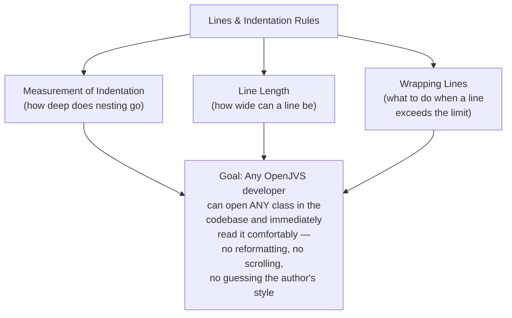
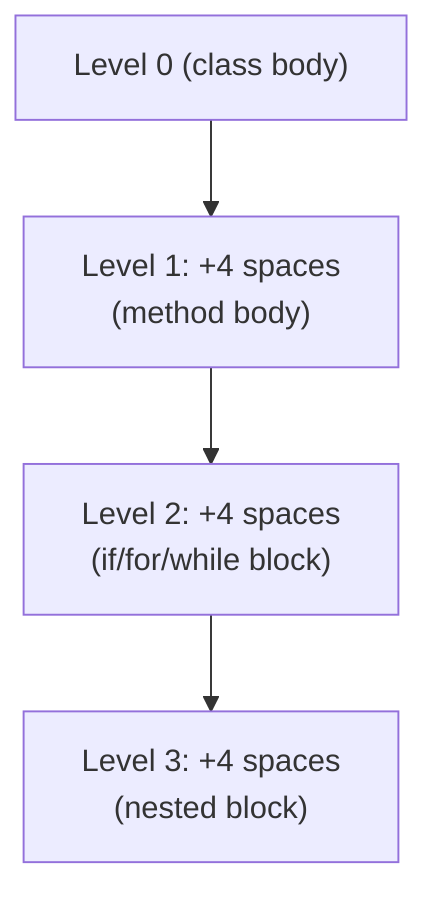
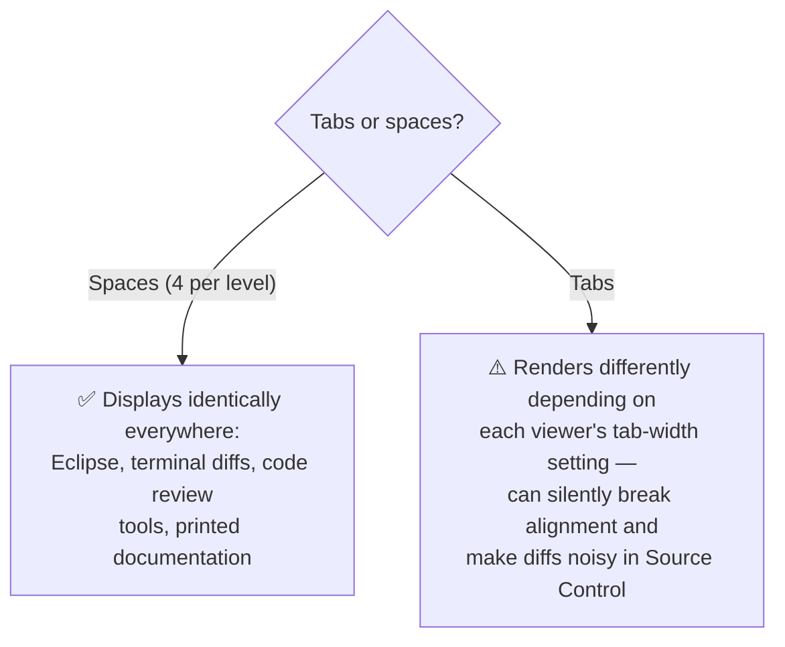
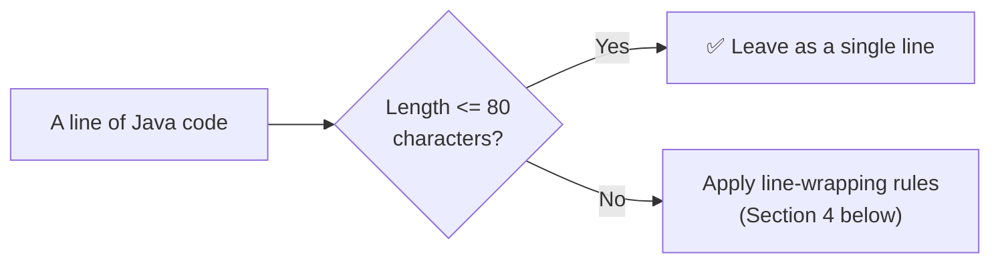
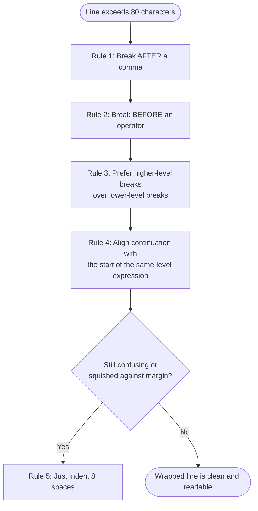
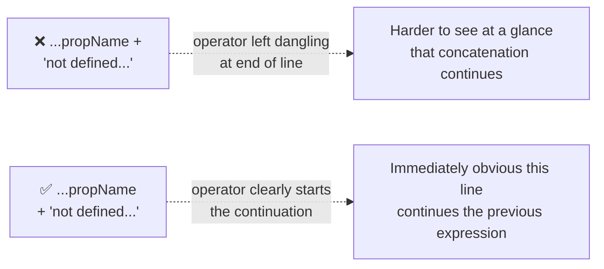
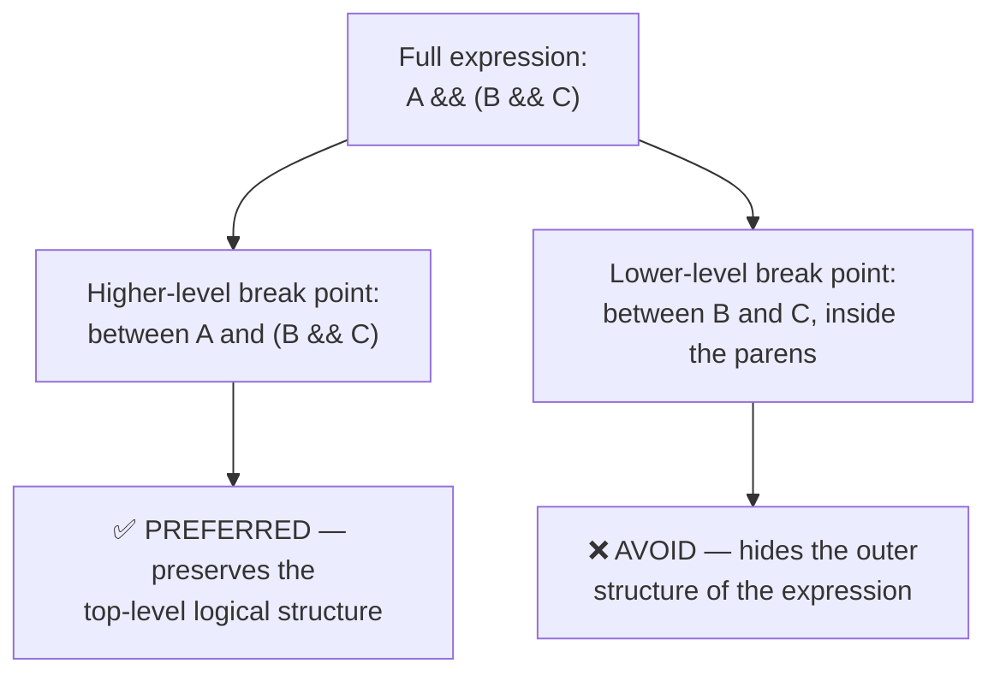
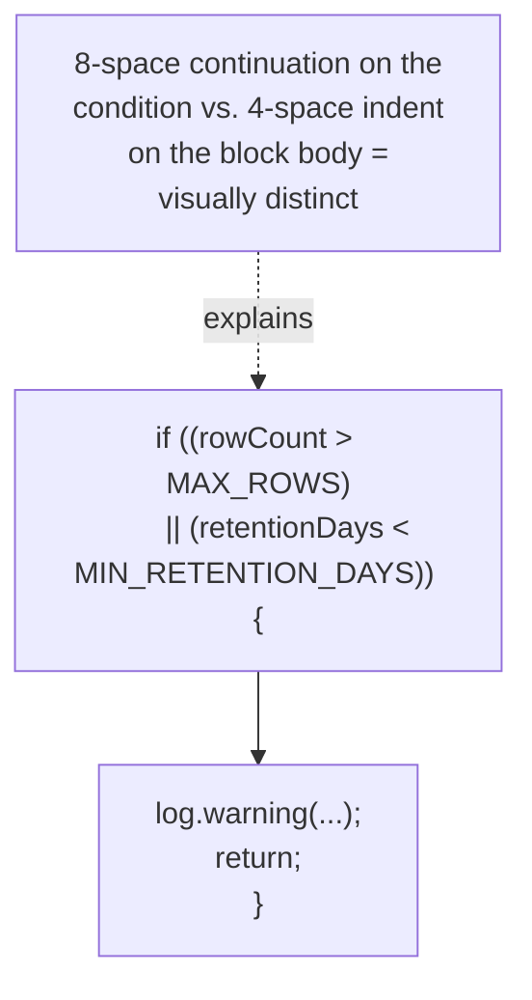
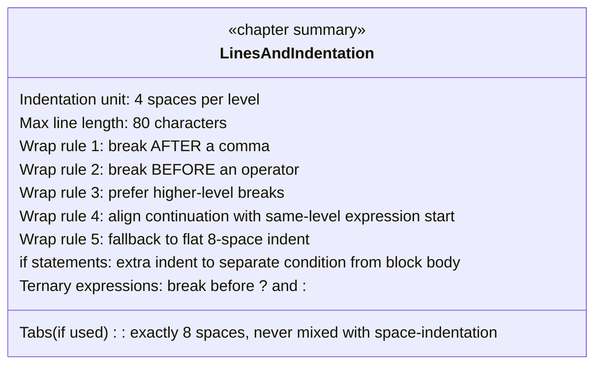

# EGC Fenix Endur OpenJVS Coding Standards — Lines and Indentation

> Source: This instruction file represents the **Lines and Indentation** chapter of the companion *EGC Fenix Endur OpenJVS Coding Standards* document (see the *Introduction* and *Source File Organization* instruction files in this same folder). It covers **Measurement of Indentation**, **Line Length**, and **Wrapping Lines** — the low-level visual formatting rules that, combined with the file-organization and naming conventions already established, keep every `.java` file in the EET Fenix codebase visually consistent regardless of author.

---

## Table of Contents

1. [Overview: Why Formatting Rules Matter](#1-overview-why-formatting-rules-matter)
2. [Measurement of Indentation](#2-measurement-of-indentation)
3. [Line Length](#3-line-length)
4. [Wrapping Lines](#4-wrapping-lines)
5. [Full Worked Example](#5-full-worked-example)
6. [End-to-End Formatting Diagram](#6-end-to-end-formatting-diagram)
7. [Practical Checklist for Developers](#7-practical-checklist-for-developers)

---

## 1. Overview: Why Formatting Rules Matter

Indentation and line length are the most **visually obvious** aspects of source code — before a reader even understands what a class does, they perceive its **shape**. Inconsistent indentation or unpredictable line lengths make code feel unfamiliar and slow down comprehension, even when the underlying logic is correct.



> **Enforcement note:** the Programming Guide's General Rules (Section 8.1) already state: *"Run the Eclipse code formatter on the source code."* The rules in this chapter are precisely what that formatter should be **configured** to enforce — so a developer rarely needs to manually apply these rules if the Eclipse formatter profile is set up correctly and used before every commit.

---

## 2. Measurement of Indentation

> **Four spaces** should be used as the unit of indentation. The exact construction of the indentation (tabs vs. spaces) is unspecified by convention alone, but **tabs must be set exactly every 8 spaces** (not 4) if tabs are used at all.



### Spaces vs. Tabs — the Recommended EET Standard

| Choice | Recommendation |
|---|---|
| **Spaces (4 per level)** | ✅ **Preferred** — renders identically in every editor, IDE, diff tool, and printed listing, regardless of the reader's tab-width setting |
| **Tabs** | ⚠️ Avoid mixing with spaces. If tabs must be used, configure them to expand to exactly **8 spaces**, and never mix tab-indentation with space-indentation in the same file |



### Why 4 Spaces Specifically

| Indentation Width | Trade-off |
|---|---|
| 2 spaces | Too subtle — deeply nested code (common in exception handling, loops within loops) becomes hard to visually distinguish between levels |
| **4 spaces** | ✅ **The EET standard** — clear visual separation between nesting levels without wasting horizontal space |
| 8 spaces | Too wide — combined with the 80-column line-length limit (Section 3), deeply nested code would run out of horizontal room almost immediately |

```java
public class DbPurgeLogDetail implements IPurgeTable {

    @Override
    public void purgeTable(List<Table> tables) throws OException {
        // Level 1: inside method body (4 spaces)
        if (shouldPurge()) {
            // Level 2: inside if block (8 spaces)
            for (int row : new TableRowIterator(candidateRows)) {
                // Level 3: inside for loop (12 spaces)
                log.info("Evaluating row " + row);
            }
        }
    }
}
```

### Consistent Indentation Applied to OpenJVS's Own Examples

The Programming Guide's own code samples consistently apply 4-space indentation — for example, the `TableRowIterator` before/after comparison:

```java
// Consistent 4-space indentation, exactly as shown in the Programming Guide
for (int row : new TableRowIterator(table1)) {
    int value = table1.getInt("value", row);
}
```

---

## 3. Line Length

> Avoid lines longer than **80 characters**, since many terminals, diff tools, and printed listings are unable to handle lines that wide.



### Why 80 Characters Specifically

| Reason | Explanation |
|---|---|
| **Terminal/console compatibility** | OConsole, command-line diff tools, and many older terminal emulators default to an 80-column display |
| **Side-by-side code review** | Two 80-column files fit comfortably side-by-side on a standard monitor — critical for code review (mandatory per Programming Guide Section 1) and for comparing branches in Source Control (Section 12) |
| **Printed documentation** | Long lines wrap awkwardly (or get truncated) when code is printed or pasted into documentation/tickets |
| **Readability** | Very long lines force the eye to scan far horizontally, which is measurably harder to read than shorter, well-wrapped lines |

```mermaid
flowchart TD
    subgraph TooLong["❌ Line exceeds 80 characters"]
        Bad["Table result = DbaseUtil.execISql(\"SELECT * FROM user_log_detail WHERE extraction_date < GETDATE() - 90\");"]
    end
    subgraph Wrapped["✅ Wrapped to stay within 80 characters"]
        Good1["String sql = \"SELECT * FROM user_log_detail\""]
        Good2["    + \" WHERE extraction_date < GETDATE() - 90\";"]
        Good3["Table result = DbaseUtil.execISql(sql);"]
    end
    Bad -.refactored into.-> Good1
```

### Practical Guidance for OpenJVS Code

Given how frequently OpenJVS code builds SQL strings (`DbaseUtil`), constructs exception messages (`FenixRuntimeException`), and chains method calls (`DestroyableObjectStore`), the 80-character rule has very direct, everyday application:

```java
// ❌ Exceeds 80 characters — hard to read, awkward to diff/review
throw new FenixRuntimeException("Property " + propName + " not defined for entity " + this.getEntity());

// ✅ Wrapped within 80 characters — see Section 4 for the wrapping rule applied here
throw new FenixRuntimeException("Property " + propName +
    " not defined for entity " + this.getEntity());
```

---

## 4. Wrapping Lines

> When an expression will not fit on a single line, break it according to these general principles:
>
> 1. Break **after** a comma.
> 2. Break **before** an operator.
> 3. Prefer higher-level breaks to lower-level breaks.
> 4. Align the new line with the beginning of the expression at the same level on the previous line.
> 5. If the above rules lead to confusing code, or code that's squished up against the right margin, just **indent 8 spaces** instead.



### Rule 1 — Break After a Comma

```java
// ✅ Break after the comma, in a method call with multiple arguments
DbaseUtil.execISql(sql, resultTable,
    connectionTimeout);
```

### Rule 2 — Break Before an Operator

```java
// ✅ Break BEFORE the '+' operator, not after
throw new FenixRuntimeException("Property " + propName
    + " not defined for entity " + this.getEntity());
```



### Rule 3 — Prefer Higher-Level Breaks

When a line has multiple possible break points at different "levels" of the expression, break at the **highest** (outermost) level first.

```java
// ✅ Higher-level break: split at the top-level '&&', not inside a sub-condition
if (isValidationEnabled()
        && (rowCount > 0 && rowCount <= maxAllowedRows)) {
    processRows();
}

// ❌ Lower-level break: splitting inside the parenthesized sub-condition
// is harder to read because it obscures the outer structure
if (isValidationEnabled() && (rowCount > 0
        && rowCount <= maxAllowedRows)) {
    processRows();
}
```



### Rule 4 — Align the Continuation

The wrapped line should line up with the **beginning of the expression at the same level** on the line above — not with an arbitrary column.

```java
// ✅ The continuation aligns with the start of the argument list
Table result = DbaseUtil.execISql(buildRetentionQuery(),
                                   resultTable);
```

### Rule 5 — The 8-Space Fallback

If applying the above rules would still leave the code confusing or squeezed against the right margin, simply indent the continuation by a flat **8 spaces**.

```java
// ✅ Simple 8-space continuation indent, used when alignment would be awkward
someObject.setSomeVeryLongPropertyName(
        computeSomeVeryLongPropertyValue());
```

### Wrapping Method Declarations

```java
// ✅ Wrapping a long method signature — one parameter per line,
// aligned/indented consistently
public void purgeTable(
        List<Table> tables,
        int maxRowsPerTable,
        boolean validateBeforePurge) throws OException {
    // ...
}
```

### Wrapping `if` Statements

> For `if` statements, when the wrapped conditional must be distinguished from the nested statements that follow, use **extra indentation** (typically 8 spaces) so the reader can immediately tell where the condition ends and the block body begins.

```java
// ✅ The 8-space continuation clearly separates the condition
// from the block body, which uses the normal 4-space indent
if ((rowCount > MAX_ROWS)
        || (retentionDays < MIN_RETENTION_DAYS)) {
    log.warning("Purge parameters out of expected range");
    return;
}
```



### Wrapping Ternary Expressions

> For ternary expressions, break **before the `?` and `:`** operators when the whole expression doesn't fit on one line.

```java
// ✅ Break before ? and :
String logLevel = (isCriticalError)
        ? "ERROR"
        : "WARNING";
```

---

## 5. Full Worked Example

Combining every rule from this chapter into one realistic OpenJVS example:

```java
public class DbPurgeUserIndexPriceOutputValues implements IPurgeTable {

    private static final int DEFAULT_RETENTION_DAYS = 60;
    private Log log = new Log();

    @Override
    public void purgeTable(List<Table> tables) throws OException {
        // Line length + wrapping: break before operator, align continuation
        String sql = "SELECT * FROM user_index_price_output_values"
                + " WHERE extraction_date < GETDATE() - "
                + DEFAULT_RETENTION_DAYS;

        // 4-space indentation per nesting level
        if (isRetentionConfigured()
                && (DEFAULT_RETENTION_DAYS > 0)) {
            Table result = DbaseUtil.execISql(sql);

            for (int row : new TableRowIterator(result)) {
                // Level 3 nesting: 12 spaces (3 x 4)
                log.debug("Row " + row + " marked for purge");
            }

            tables.add(result);
        } else {
            log.warning("Retention not configured;"
                    + " skipping purge for this table");
        }
    }

    private boolean isRetentionConfigured() {
        return DEFAULT_RETENTION_DAYS > 0;
    }
}
```

---

## 6. End-to-End Formatting Diagram



---

## 7. Practical Checklist for Developers

- [ ] **Use 4 spaces per indentation level** — never 2 or 8 — and prefer spaces over tabs entirely.
- [ ] **If tabs are unavoidable, configure them to exactly 8 spaces** and never mix tabs and spaces in the same file.
- [ ] **Keep lines at or under 80 characters** — check especially SQL string construction, exception messages, and chained method calls, which are the most common OpenJVS offenders.
- [ ] **Break after commas**, not before, when wrapping multi-argument method calls.
- [ ] **Break before operators** (`+`, `&&`, `||`, etc.), so the continuation is immediately recognizable as part of the same expression.
- [ ] **Prefer higher-level breaks** over breaking inside a deeply nested sub-expression.
- [ ] **Align wrapped continuations** with the start of the same-level expression above, or fall back to a flat 8-space indent if alignment would be confusing.
- [ ] **Add extra indentation to wrapped `if` conditions** so the condition is visually distinct from the block body that follows.
- [ ] **Break before `?` and `:`** when wrapping a ternary expression.
- [ ] **Run the Eclipse code formatter** (Programming Guide, Section 8.1) before every commit — configure its formatter profile to match all the rules in this chapter so they're applied automatically rather than manually.

---

## Related Sections (Full Programming Guide)

- Section 8.1 — General Rules for Developing OpenJVS Plugins (*"Run the Eclipse code formatter on the source code"* — the mechanical enforcement of this chapter's rules)
- *EGC Fenix Endur OpenJVS Coding Standards — Introduction* (this folder) — the rationale ("Why Have Code Conventions") underpinning consistent formatting
- *EGC Fenix Endur OpenJVS Coding Standards — Source File Organization* (this folder) — the higher-level file structure that these line/indentation rules apply within
