# EGC Fenix Endur OpenJVS Coding Standards — Naming Conventions

> Source: This instruction file represents the **Naming Conventions** chapter of the companion *EGC Fenix Endur OpenJVS Coding Standards* document (see *Introduction*, *Source File Organization*, *Lines and Indentation*, *Comments*, *Declarations*, *Statements*, and *White Space* in this same folder). It covers **Package Naming**, **Class Naming**, **Abstract Class Naming**, **Interface Naming**, **Enum Naming**, **Method Naming**, **Accessor Method Naming**, **Variable Naming**, and **Constant Naming** — grounded directly in the EET-specific naming rules already established throughout the Programming Guide (Sections 4.3, 6, and 8).

---

## Table of Contents

1. [Overview: Names as Documentation](#1-overview-names-as-documentation)
2. [Package Naming](#2-package-naming)
3. [Class Naming](#3-class-naming)
4. [Abstract Class Naming](#4-abstract-class-naming)
5. [Interface Naming](#5-interface-naming)
6. [Enum Naming](#6-enum-naming)
7. [Method Naming](#7-method-naming)
8. [Accessor Method Naming](#8-accessor-method-naming)
9. [Variable Naming](#9-variable-naming)
10. [Constant Naming](#10-constant-naming)
11. [Full Worked Example](#11-full-worked-example)
12. [End-to-End Naming Diagram](#12-end-to-end-naming-diagram)
13. [Practical Checklist for Developers](#13-practical-checklist-for-developers)

---

## 1. Overview: Names as Documentation

A well-chosen name is the cheapest form of documentation a developer can write — it costs nothing at runtime and pays back every time someone reads the code. In the EET Fenix Endur codebase, naming carries **extra weight** because plug-in *type* (Main, Param, Output, UDSR, OpsServices, Connex) is communicated entirely through class-name prefixes/suffixes (see *Developing OpenJVS Plugins*, Section 8) — get the name wrong, and the plug-in's role becomes invisible to the next developer, the Directory Browser (Section 4.2), and the code review team.

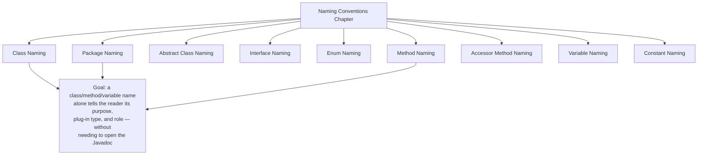

---

## 2. Package Naming

> All EET package names begin with the reversed-domain prefix `com.eon.eet.fenix`, all in **lower case**, with no underscores. The segment following the prefix identifies the functional area, and must match one of the current EET OpenJVS project packages listed in the Programming Guide (Section 4.3).

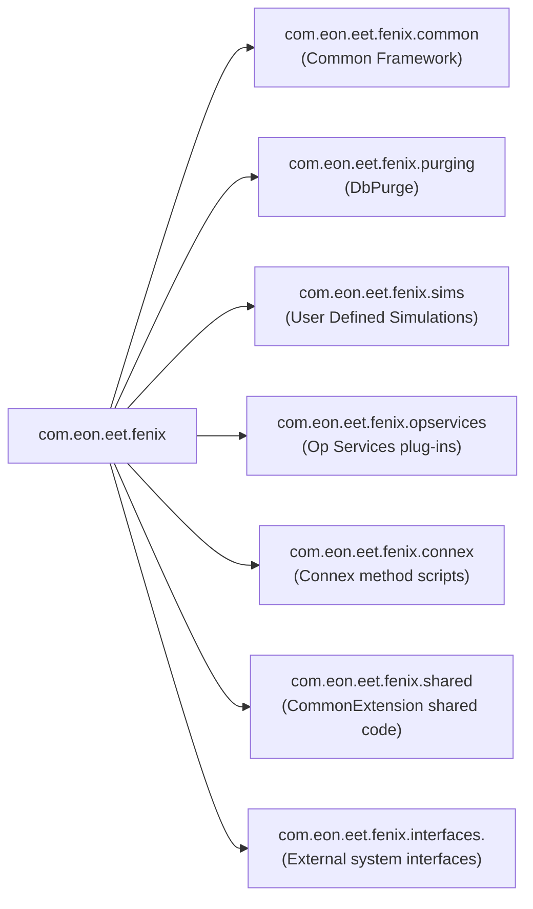

| Rule | Example |
|---|---|
| Root prefix is always `com.eon.eet.fenix` | `com.eon.eet.fenix.purging` |
| Common Framework classes use the `.common` sub-package (and further sub-packages like `.common.script`, `.common.udsr`) | `com.eon.eet.fenix.common.script` |
| All lower case, no underscores, no camelCase | ✅ `com.eon.eet.fenix.opservices` — ❌ `com.eon.eet.fenix.OpServices` |
| The final segment reflects the plug-in's functional purpose, matching the project table in Section 4.3 | `com.eon.eet.fenix.tpm` (TPM module code) |
| Interface-specific code is further namespaced by the external system name | `com.eon.eet.fenix.interfaces.murex` |

```java
// ✅ Correct package declaration for a UDSR plug-in
package com.eon.eet.fenix.sims.udsr;

// ✅ Correct package declaration for an Ops Services plug-in
package com.eon.eet.fenix.opservices;

// ❌ Avoid — missing root prefix
package fenix.purging;

// ❌ Avoid — mixed case in package segments
package com.eon.eet.fenix.OpServices;
```

---

## 3. Class Naming

> Class names should be **nouns**, in mixed case with the **first letter of every word capitalized** (`UpperCamelCase` / `PascalCase`). Try to keep class names simple and descriptive. Use whole words — avoid acronyms and abbreviations unless the abbreviation is more widely used than the full form (e.g. `URL`, `HTML`).

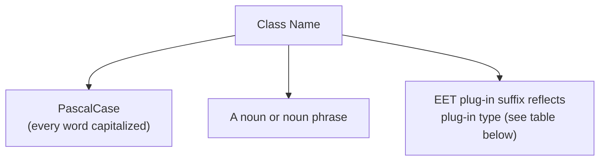

### General Class Naming

```java
// ✅ PascalCase, descriptive noun
public class DestroyableObjectStore { }
public class TableRowIterator { }
public class DelimitedFileImporter { }

// ❌ Avoid — lower camelCase or unclear abbreviation
public class destroyableObjectStore { }
public class TblRowIter { }
```

### EET Plug-in Type Suffix/Prefix Conventions (Programming Guide, Section 8)

| Plug-in Type | Naming Rule | Example |
|---|---|---|
| Main Plug-in | Class name **ends** with `Main` | `DbPurgeDailyMain` |
| Parameter Plug-in | Class name **ends** with `Param` | `WorkflowSleeperParam` |
| Output Plug-in | Class name **ends** with `Output` | `RiskReportOutput` |
| UDSR Plug-in | Class name **starts** with `Udsr` | `UdsrTranGptDeltaByLegHourly` |
| Operational Services Plug-in | Class name **starts** with `Ops`, and ends with `Pre`/`Post` for pre/post-processing scripts | `OpsSettlementPost` |
| Connex Method Script | Class name **starts** with `Oc`, and ends with `Pre`/`Post` for pre/post-processing scripts | `OcNeonDealPushPre` |

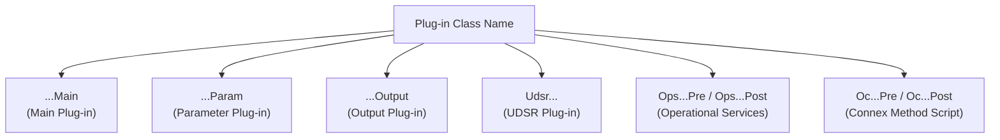

> This is a **strict, mandatory** convention specific to EET Fenix Endur — unlike general Java naming guidance, these prefixes/suffixes are not optional stylistic preference; they are load-bearing signals used by developers, the Directory Browser, and the code review team to instantly identify a plug-in's role (see *Developing OpenJVS Plugins*, Section 8, General Rules).

### Exception Class Naming

```java
// ✅ EET exception classes always contain "Fenix" to signal EET-authored code
public class FenixException extends Exception { }
public class FenixRuntimeException extends RuntimeException { }
public class FenixAlertBrokerException extends FenixException { }
public class FenixAlertBrokerRuntimeException extends FenixRuntimeException { }
```

---

## 4. Abstract Class Naming

> Abstract classes intended to be extended by concrete plug-in or worker classes are named starting with **`Abstract`**, followed by a descriptive noun — this immediately signals to a developer that the class cannot be instantiated directly and exists purely to be subclassed.

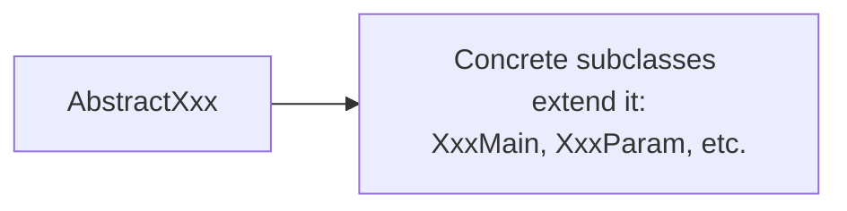

| Abstract Class | Purpose |
|---|---|
| `AbstractUdsr` | Base class for all UDSR plug-ins (see *Common Framework*, Section 6.5) |
| `AbstractDbPurgeSet` | Base class for `DbPurgeDailyMain`, `DbPurgeWeeklyMain`, etc. (see *Data Purging*) |
| `AbstractLog` | Base class providing the four logging method signatures, extended by `Log` |

```java
// ✅ Abstract class named with the "Abstract" prefix
public abstract class AbstractUdsr extends BasicScript {
    // ...
}

// ✅ Concrete subclass follows the UDSR naming convention (Section 3)
public class UdsrTranGptDeltaByLegHourly extends AbstractUdsr {
    // ...
}
```

> **Note:** `BasicScript` and `BasicParamScript` are exceptions to the `Abstract` prefix convention — they are also abstract classes, but use the established `Basic` prefix instead, since they predate this stricter naming rule and are deeply embedded throughout the Common Framework. New abstract base classes should follow the `Abstract` prefix going forward.

---

## 5. Interface Naming

> Interface names should be **adjectives** (describing a capability) or **nouns**, in PascalCase, conventionally prefixed with a capital **`I`** in the OpenJVS/EET codebase — this matches the OpenLink-provided interfaces (`IScript`, `IContainerContext`) and is followed consistently by EET-authored interfaces.

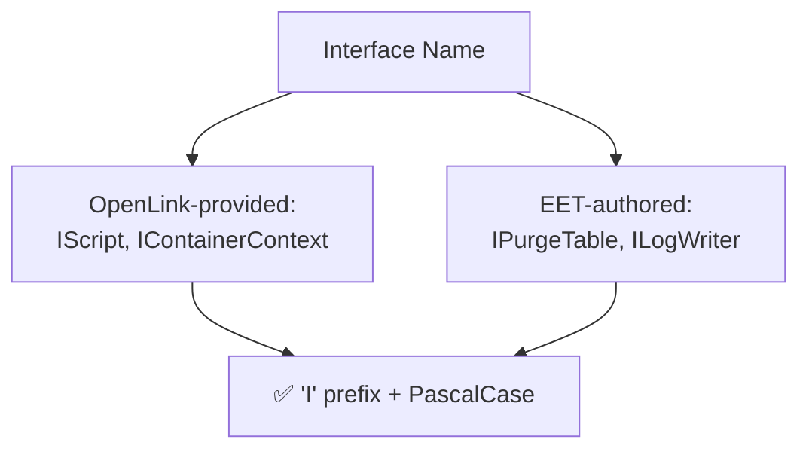

| Interface | Purpose |
|---|---|
| `IScript` | Entry-point contract for any standalone OpenJVS script (see *OpenJVS Architecture*, Section 5.3) |
| `IContainerContext` | Connection between script types, providing `argt`/`returnt` access |
| `IPurgeTable` | Contract implemented by all data-purging worker classes (see *Data Purging*) |
| `ILogWriter` | Contract implemented by classes that direct log messages to a destination |

```java
// ✅ EET-authored interface, following the established 'I' prefix convention
public interface IPurgeTable {
    void purgeTable(List<Table> tables) throws OException;
}
```

---

## 6. Enum Naming

> Enum type names follow the **same PascalCase rule as classes**, and (per *Common Framework*, Section 6.10) EET-specific enumerations relating to static reference data must be created within the `com.eon.eet.fenix.common.ref` package and follow this dedicated naming convention: enum **type** names end with `Enum`, and enum **constant** names are in **UPPER_SNAKE_CASE**.

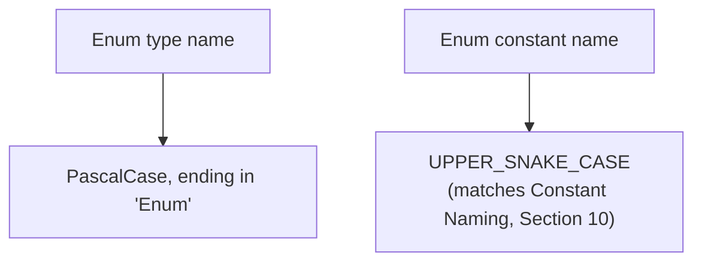

```java
// ✅ Enum type name ends with 'Enum'; constants are UPPER_SNAKE_CASE
public enum UserTableEnum {
    USER_INDEX_PRICE_OUTPUT_VALUES,
    USER_EMAIL_CONFIGURATION,
    USER_EON_CONFIGURATION
}

// ✅ Direction enum used by TableRowIterator (Common Framework, Section 6.11)
public enum DirectionEnum {
    FORWARDS,
    BACKWARDS
}
```

> Where the Programming Guide's own example (Section 6.11) refers simply to `DIRECTION.BACKWARDS`, the underlying enum type should still be named following this `...Enum` convention (e.g. `DirectionEnum`) — the short reference in code (`DIRECTION.BACKWARDS`) is typically achieved via a static import or a nested-enum convenience alias, but the **declared type name** must carry the `Enum` suffix.

---

## 7. Method Naming

> Methods should be **verbs**, in mixed case with the **first letter lower case and the first letter of each subsequent internal word capitalized** (`lowerCamelCase`). Method names should clearly describe the action performed.

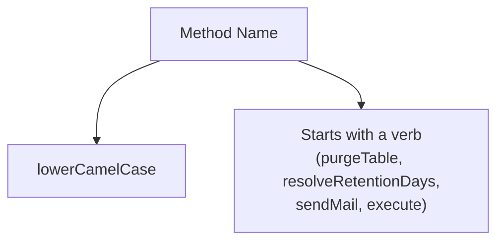

```java
// ✅ Verb-led, lowerCamelCase method names
public void purgeTable(List<Table> tables) throws OException { }
private int resolveRetentionDays() { return DEFAULT_RETENTION_DAYS; }
public void sendMail(String category, String subject, String message) { }
public abstract void execute(Table argt, Table returnt);
```

### EET Framework Method Naming Patterns

| Method Pattern | Used By | Purpose |
|---|---|---|
| `execute(...)` | `IScript`, `BasicScript` | Standard entry point for all script types |
| `getUserSelection(Table argt)` / `getWorkflowValues(Table argt)` | `BasicParamScript` subclasses | Parameter plug-in value resolution (ad-hoc vs. workflow) |
| `calculate` / `format` / `aggregate` / `finalizeAggregate` / `dwExtract` | `AbstractUdsr` subclasses | The five UDSR operation hooks (see *Common Framework*, Section 6.5) |
| `purgeTable(List<Table> tables)` | `IPurgeTable` implementers | The single purge-worker contract method |
| `registerNewClass(...)` | `AbstractDbPurgeSet` subclasses | Registers a purge worker with a purging set |

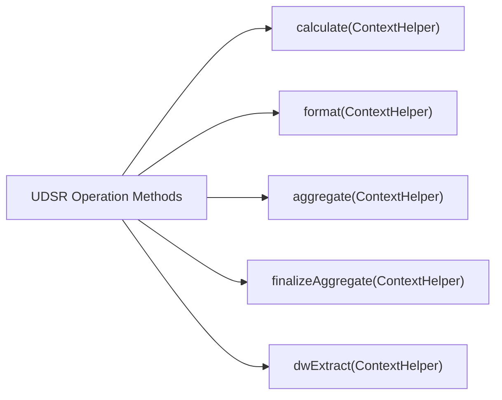

---

## 8. Accessor Method Naming

> Accessor methods (getters, setters, and boolean predicates) follow the standard JavaBean convention: `getXxx()` to retrieve a value, `setXxx(value)` to assign it, and `isXxx()` (preferred over `getXxx()`) for a method returning a `boolean`.

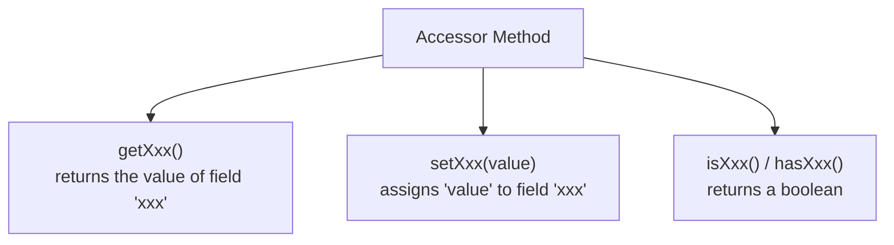

```java
// ✅ Standard getter/setter pair
public int getRetentionDays() {
    return retentionDays;
}

public void setRetentionDays(int retentionDays) {
    this.retentionDays = retentionDays;
}

// ✅ Boolean predicate uses 'is' rather than 'get'
public boolean isRetentionConfigured() {
    return retentionDays > 0;
}

// ✅ 'has' is an acceptable alternative predicate prefix
public boolean hasCandidateRows() {
    return candidateRowCount > 0;
}
```

### EET-Specific Accessor Examples from the Common Framework

```java
// ContextHelper (Common Framework, Section 6.6) — accessor-style retrieval methods
context.getGeneralResults();
context.getTransactionResults();
context.getLegResults();
context.getSimulationDefinition();
```

> **Consistency matters more than personal preference.** Once `isXxx()` is chosen for a boolean predicate on a class, do not mix in a `getXxx()` returning `boolean` elsewhere in the same class — pick one style and apply it uniformly.

---

## 9. Variable Naming

> Variable names (fields, parameters, and local variables) follow the same `lowerCamelCase` rule as methods. Variable names should be short yet meaningful — the name should suggest to the casual observer the intent of its use. Single-character variable names should be avoided except for temporary "throwaway" variables (loop counters like `i`, `j`, `k` are acceptable in a tight, obviously-bounded loop).

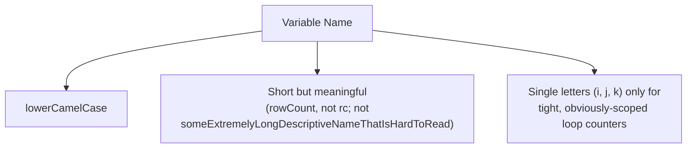

```java
// ✅ Meaningful, lowerCamelCase variable names
int rowCount = table.getNumRows();
Table candidateRows = queryCandidateRows(retentionDays);
boolean isRetentionConfigured = retentionDays > 0;

// ✅ Acceptable single-letter loop counter in a tight, obvious scope
for (int i = 0; i < rowCount; i++) {
    processRow(i);
}

// ❌ Avoid — unclear abbreviation
int rc = table.getNumRows();

// ❌ Avoid — overly long, awkward name
int theNumberOfRowsThatWereFoundInTheTable = table.getNumRows();
```

### OpenJVS-Specific Variable Naming Conventions

| Variable Name | Meaning | Where Used |
|---|---|---|
| `argt` | The input `Table` argument provided to a script | `execute(Table argt, Table returnt)` (see *OpenJVS Architecture*) |
| `returnt` | The output `Table` argument a script populates | `execute(Table argt, Table returnt)` |
| `context` | An instance of `IContainerContext` or `ContextHelper` | Script entry points, UDSR operation methods |
| `log` | The instance-level `Log` object (never `static`, see *Declarations*) | Every plug-in/supporting class that logs |

```java
// ✅ Standard OpenJVS argument names, per Programming Guide conventions
public void execute(Table argt, Table returnt) {
    // ...
}
```

> These are **conventional, near-universal** names across the entire OpenJVS/Endur codebase (both EET and OLF-standard code) — using anything other than `argt`/`returnt` for these specific parameters would be jarring and inconsistent with every other plug-in a developer will ever open.

---

## 10. Constant Naming

> Names of constants (`static final` fields whose value never changes) should be all **UPPER CASE**, with words separated by underscores (`UPPER_SNAKE_CASE`). This visually distinguishes constants from ordinary fields and local variables at a glance, regardless of where they are referenced.

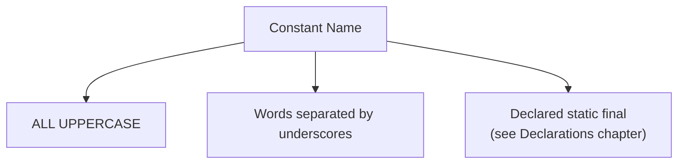

```java
// ✅ Constant naming — UPPER_SNAKE_CASE
private static final int DEFAULT_RETENTION_DAYS = 60;
private static final int MIN_RETENTION_DAYS = 1;
private static final int MAX_RETENTION_DAYS = 365;
private static final String LOGGING_CONTEXT = "Logging";

// ❌ Avoid — camelCase or PascalCase used for a constant
private static final int defaultRetentionDays = 60;
private static final int DefaultRetentionDays = 60;
```

### Constants Repository Entry Names (a Related but Distinct Convention)

Note that Constants Repository **entry names** (Context/Sub-Context/Variable Name triples stored in Endur, e.g. `Logging` / `Writer` / `ReportMain`, see *Developing OpenJVS Plugins*, Section 8.10.4) are **not** Java constants and are not subject to this naming rule — they are free-form configuration strings defined by convention within the Constants Repository UI itself, distinct from `static final` Java fields.

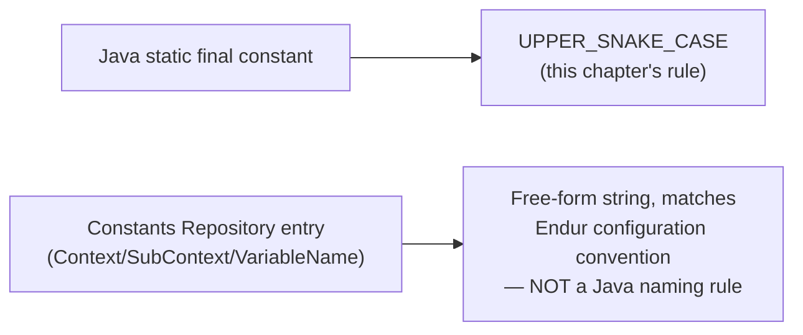

---

## 11. Full Worked Example

Combining every naming rule from this chapter into one realistic OpenJVS class hierarchy:

```java
package com.eon.eet.fenix.purging;                       // package naming (Section 2)

import java.util.List;

import com.eon.eet.fenix.common.FenixRuntimeException;   // class naming (Section 3)
import com.eon.eet.fenix.common.logging.Log;
import com.olf.openjvs.OException;
import com.olf.openjvs.Table;

/**
 * Purges obsolete rows from the user_index_price_output_values user table.
 *
 * @author G. Moore
 */
public class DbPurgeUserIndexPriceOutputValues implements IPurgeTable {  // interface naming (Section 5)

    private static final int DEFAULT_RETENTION_DAYS = 60;   // constant naming (Section 10)
    private static final int MIN_RETENTION_DAYS = 1;

    private Log log = new Log();                            // variable naming (Section 9)
    private int retentionDays;

    @Override
    public void purgeTable(List<Table> tables) throws OException {  // method naming (Section 7)
        retentionDays = resolveRetentionDays();

        if (!isRetentionConfigured()) {                       // accessor naming (Section 8)
            throw new FenixRuntimeException("Retention not configured");
        }

        Table candidateRows = queryCandidateRows(retentionDays);
        tables.add(candidateRows);
    }

    private int resolveRetentionDays() {
        return DEFAULT_RETENTION_DAYS;
    }

    private boolean isRetentionConfigured() {                 // 'is' prefix for boolean accessor
        return retentionDays >= MIN_RETENTION_DAYS;
    }

    private Table queryCandidateRows(int retentionDaysParam) {
        return null; // implementation omitted for brevity
    }

}
```

```java
// Abstract class naming (Section 4)
public abstract class AbstractDbPurgeSet extends BasicScript {

    protected void registerNewClass(IPurgeTable worker) {
        // ...
    }
}

// Enum naming (Section 6)
public enum UserTableEnum {
    USER_INDEX_PRICE_OUTPUT_VALUES,
    USER_EON_CONFIGURATION
}
```

---

## 12. End-to-End Naming Diagram

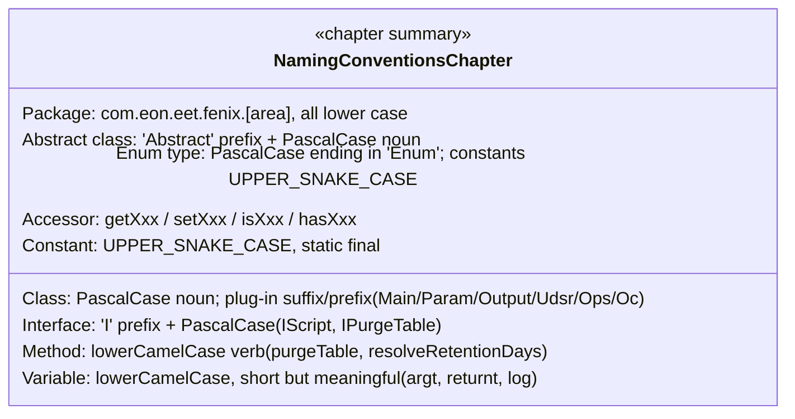

---

## 13. Practical Checklist for Developers

- [ ] **Package names** always start `com.eon.eet.fenix`, all lower case, matching one of the current EET OpenJVS projects (Section 4.3).
- [ ] **Class names** are PascalCase nouns, and plug-in classes carry the mandatory type-specific prefix/suffix (`Main`, `Param`, `Output`, `Udsr...`, `Ops...Pre/Post`, `Oc...Pre/Post`).
- [ ] **Abstract classes** are prefixed with `Abstract` (except the historical `BasicScript`/`BasicParamScript`).
- [ ] **Interfaces** are prefixed with `I` and named as a capability or noun (`IScript`, `IPurgeTable`).
- [ ] **Enum types** end with `Enum`; enum constants are UPPER_SNAKE_CASE.
- [ ] **Methods** are lowerCamelCase verbs describing the action performed.
- [ ] **Accessor methods** follow `getXxx()`/`setXxx()`/`isXxx()`/`hasXxx()`, consistently within a class.
- [ ] **Variables** are lowerCamelCase, short but meaningful; use the established `argt`/`returnt`/`context`/`log` names where applicable.
- [ ] **Constants** are `static final` and UPPER_SNAKE_CASE — never conflate them with Constants Repository entry names, which follow a separate, non-Java naming convention.
- [ ] When unsure which project/package a new class belongs in, **contact the code review team** (Programming Guide, Section 4.3) rather than guessing.

---

## Related Sections (Full Programming Guide)

- Section 4.3 — Current EET OpenJVS Projects (the authoritative package-to-project mapping table)
- Section 6.10 — Enumerations (`UserTableEnum`, and the rule that enum names must follow the EET Coding Standards)
- Section 8 — Developing OpenJVS Plugins (the full set of mandatory class-naming rules per plug-in type)
- *EGC Fenix Endur OpenJVS Coding Standards — Declarations* (this folder) — the `static final` requirement underpinning Constant Naming
- *EGC Fenix Endur OpenJVS Coding Standards — Source File Organization* (this folder) — package statement placement and import ordering that these package names feed into
