# EGC Fenix Endur OpenJVS Coding Standards — Programming Practices

> Source: This instruction file represents the **Programming Practices** chapter of the companion *EGC Fenix Endur OpenJVS Coding Standards* document (see *Introduction*, *Source File Organization*, *Lines and Indentation*, *Comments*, *Declarations*, *Statements*, *White Space*, and *Naming Conventions* in this same folder). It covers **Providing Access to Instance and Class Variables**, **Constants**, **Variable Assignments**, **Parentheses**, **Expressions Before `?` in the Conditional Operator**, **Referring to Static Methods**, **Do Not Use `System.out.print`**, **Returning Values**, **Defensive Coding**, and **StringBuilder vs. StringBuffer / Avoiding String Concatenation**.

---

## Table of Contents

1. [Overview: Practices Beyond Pure Formatting](#1-overview-practices-beyond-pure-formatting)
2. [Providing Access to Instance and Class Variables](#2-providing-access-to-instance-and-class-variables)
3. [Constants](#3-constants)
4. [Variable Assignments](#4-variable-assignments)
5. [Parentheses](#5-parentheses)
6. [Expressions Before `?` in the Conditional Operator](#6-expressions-before--in-the-conditional-operator)
7. [Methods — Referring to Static Methods](#7-methods--referring-to-static-methods)
8. [Do Not Use System.out.print](#8-do-not-use-systemoutprint)
9. [Returning Values](#9-returning-values)
10. [Defensive Coding](#10-defensive-coding)
11. [Use StringBuilder over StringBuffer](#11-use-stringbuilder-over-stringbuffer)
12. [Avoid String Concatenation](#12-avoid-string-concatenation)
13. [Full Worked Example](#13-full-worked-example)
14. [End-to-End Programming Practices Diagram](#14-end-to-end-programming-practices-diagram)
15. [Practical Checklist for Developers](#15-practical-checklist-for-developers)

---

## 1. Overview: Practices Beyond Pure Formatting

Where earlier chapters (*Lines and Indentation*, *White Space*, *Naming Conventions*) govern how code **looks**, this chapter governs how code **behaves** — the small, everyday decisions (encapsulation, defensive checks, string handling, logging discipline) that determine whether a plug-in is robust, efficient, and safe to maintain inside the always-running, resource-shared Endur environment.

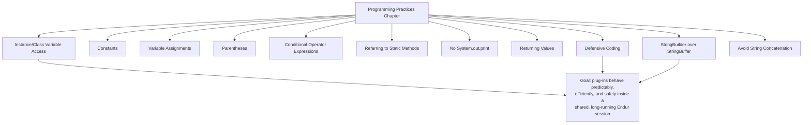

---

## 2. Providing Access to Instance and Class Variables

> Don't make any instance or class variable `public` without a good reason. Often, instance variables don't need to be explicitly set or gotten — this often happens as a side effect of method calls. One example of appropriate `public` instance variables is the case where the class is essentially a data structure with no behavior (analogous to a `struct` in other languages) — in this case it may be appropriate to make the instance variables `public` instead of accessor methods.

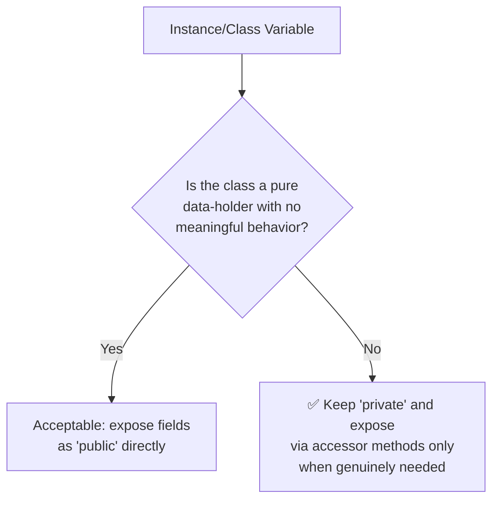

```java
// ✅ Encapsulated — internal state hidden, behavior exposed via methods
public class DbPurgeUserIndexPriceOutputValues implements IPurgeTable {
    private int retentionDays;   // private — never accessed directly from outside

    public void purgeTable(List<Table> tables) throws OException {
        retentionDays = resolveRetentionDays();
        // ...
    }
}

// ❌ Avoid — exposing internal state with no encapsulation
public class DbPurgeUserIndexPriceOutputValues implements IPurgeTable {
    public int retentionDays;   // callers can freely mutate this without validation
}
```

> In OpenJVS specifically, `Table`, `Transaction`, and other `IntPtr`-derived fields should almost always remain `private`, managed through `DestroyableObjectStore` (see *Common Framework*, Section 6.3) — exposing them as `public` risks a caller destroying or mutating memory-backed objects outside the lifecycle the framework expects.

---

## 3. Constants

> If a value refers to a constant that is not likely to ever change, it's a good candidate to become a named constant. Named constants make code easier to read and support, since it's easy to change the value in just one place, rather than at every point of use — this directly reuses the `static final` UPPER_SNAKE_CASE rule from *Naming Conventions*, Section 10, but focuses here on the **behavioral reason** to introduce a constant in the first place.

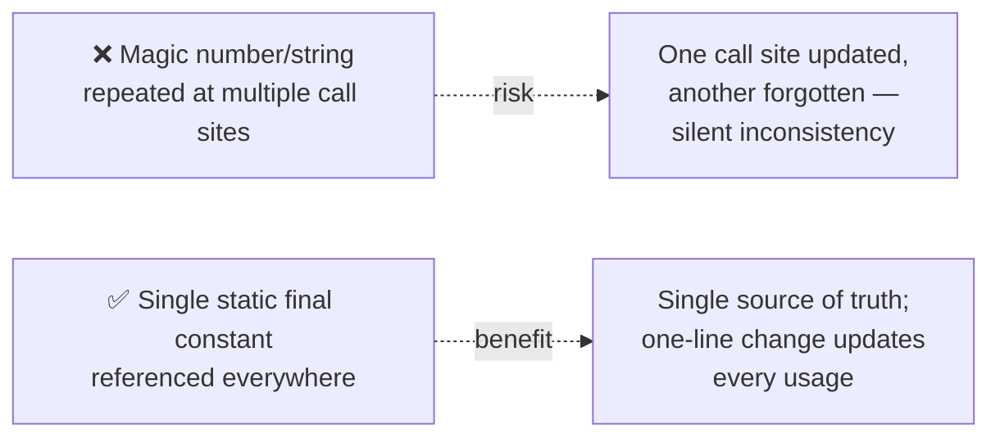

```java
// ❌ Avoid — the retention period "60" is a magic number repeated in two places
if (ageInDays > 60) {
    markForPurge(table, row);
}
log.info("Using a 60 day retention window");

// ✅ Preferred — a single named constant, referenced everywhere it is needed
private static final int DEFAULT_RETENTION_DAYS = 60;

if (ageInDays > DEFAULT_RETENTION_DAYS) {
    markForPurge(table, row);
}
log.info("Using a " + DEFAULT_RETENTION_DAYS + " day retention window");
```

> This applies equally to Constants Repository context/sub-context/variable-name strings (see *Developing OpenJVS Plugins*, Section 8.10.4) — if a Constants Repository key like `"Logging"` or `"LogLevel"` is referenced from multiple places in a class, declare it as a `static final String` constant rather than retyping the literal string each time.

---

## 4. Variable Assignments

> Avoid assigning several variables to the same value in a single statement — it is hard to read. Furthermore, avoid using the assignment operator in a place where it can be easily confused with the equality operator, and never embed an assignment inside a larger expression purely to save a line.

```java
// ❌ Avoid — chained assignment across several variables
int rowCount = purgedCount = skippedCount = 0;

// ✅ Preferred — one assignment per line (also reinforces Declarations, Section 2)
int rowCount = 0;
int purgedCount = 0;
int skippedCount = 0;
```

```java
// ❌ Avoid — assignment ('=') inside a condition, easily mistaken for equality ('==')
if ((retentionDays = resolveRetentionDays()) > 0) {
    // ...
}

// ✅ Preferred — assignment on its own line, condition is unambiguous
retentionDays = resolveRetentionDays();
if (retentionDays > 0) {
    // ...
}
```

> **Do not use the assignment operator in a place where it can be easily confused with the equality operator.** For example:

```java
// ❌ Avoid — dangerous: assigns 'false' to isValid rather than comparing it
if (isValid = false) {
    // this block never executes, and isValid is now permanently false —
    // a classic, hard-to-spot bug
}

// ✅ Preferred — clear equality comparison
if (isValid == false) {
    // or, more idiomatically:
    // if (!isValid) {
}
```

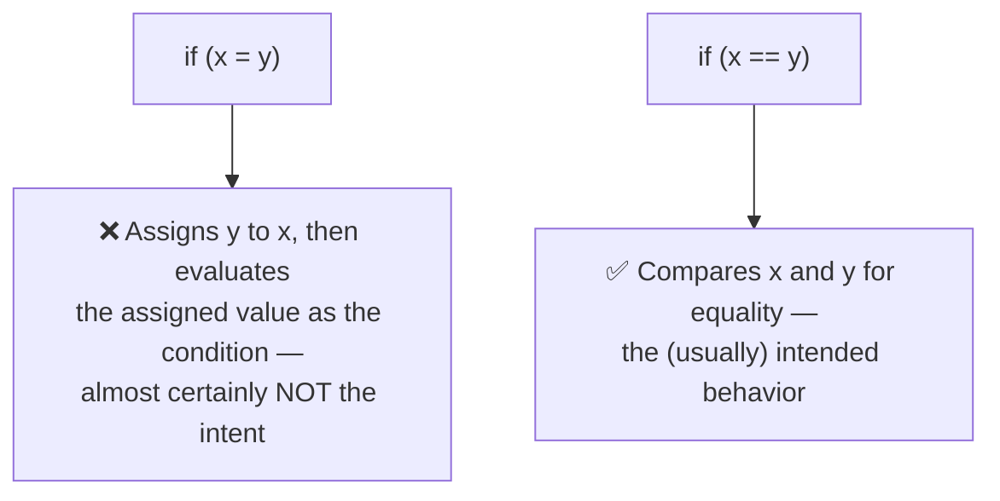

---

## 5. Parentheses

> It is generally a good idea to use parentheses liberally in expressions involving mixed operators to avoid operator precedence problems. Even if the operator precedence seems clear to you, it may not be as clear to other developers — you shouldn't assume that other programmers know precedence as well as you do.

```java
// ❌ Avoid — relies on the reader correctly recalling operator precedence
if (a << 8 | b << 16 | c >>> 2 == d) {
    // ...
}

// ✅ Preferred — explicit parentheses remove all ambiguity
if (((a << 8) | (b << 16) | (c >>> 2)) == d) {
    // ...
}
```

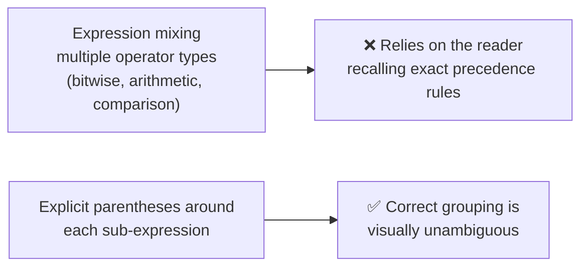

### Practical OpenJVS Example

```java
// ✅ Parentheses clarify a compound boolean condition, as also
// established in the Statements chapter (Section 5)
if ((rowCount > 0) && (retentionDays > MIN_RETENTION_DAYS)) {
    processRows();
}
```

---

## 6. Expressions Before `?` in the Conditional Operator

> If an expression containing a binary operator appears before the `?` in the ternary `?:` operator, it should be parenthesized to make the grouping explicit and remove any ambiguity for the reader.

```java
// ❌ Avoid — the boolean expression before '?' is not parenthesized
String logLevel = isCriticalError ? "ERROR" : "WARNING";

// ✅ Preferred if the condition is itself a compound expression —
// parenthesize it to clarify grouping
String logLevel = (rowCount > MAX_ROWS || retentionDays < 0)
        ? "ERROR"
        : "WARNING";
```

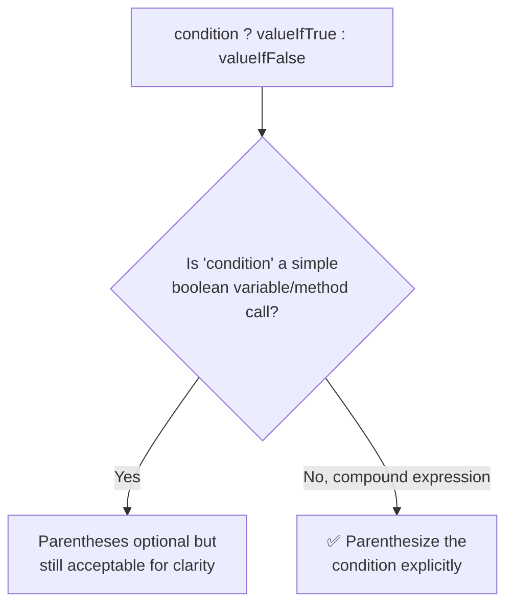

> This directly extends the ternary-wrapping guidance already established in *Lines and Indentation* (Section 4 — "break before `?` and `:`") by addressing what happens **before** the `?`, not just how the whole expression wraps across lines.

---

## 7. Methods — Referring to Static Methods

> A `static` method should always be invoked with a **class name**, never through an instance reference variable, even though this is technically legal in Java. Calling a static method through an instance variable is confusing because it implies the method's behavior depends on the specific instance, when it does not.

```java
// ❌ Avoid — calling a static method through an instance reference
DbaseUtil dbUtilInstance = new DbaseUtil();
Table result = dbUtilInstance.execISql(sql);   // misleading — execISql is static

// ✅ Preferred — invoke the static method via the class name
Table result = DbaseUtil.execISql(sql);
```

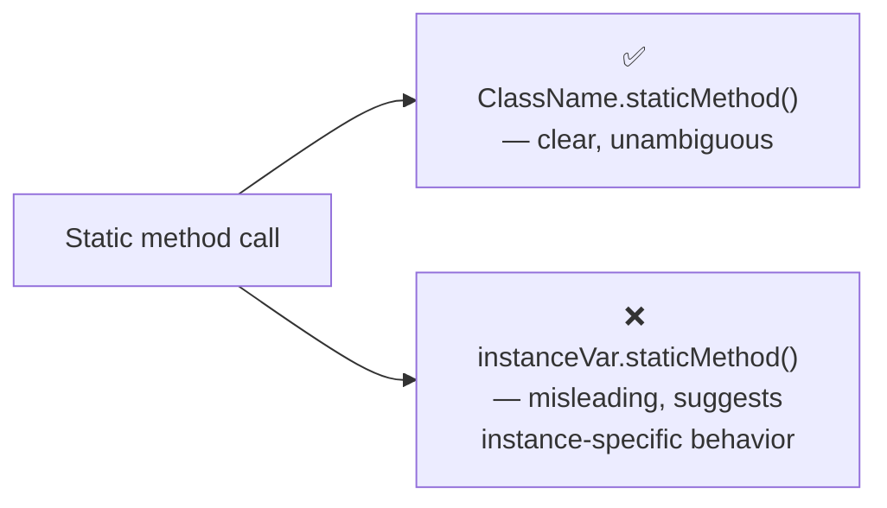

### EET Framework Examples of Correct Static Method Usage

```java
// ✅ These EET/OpenJVS utility methods are static and always called via the class name
Table portfolios = DestroyableObjectStore.tableNew();
Table result = DbaseUtil.execISql(sql);
Table csvFile = DelimitedFileImporter.importFile(filename, definitionFilename);
```

---

## 8. Do Not Use System.out.print

> `System.out.print` (and `System.out.println`/`System.err.print`) must **never** be used in OpenJVS plug-in code. Endur is a headless, multi-user, script-engine-driven environment (see *OpenJVS Architecture* and *Debugging Code*) — there is no guaranteed console attached to a running script engine, and output written to `System.out` is effectively lost or, worse, interleaved unpredictably with output from other concurrently running scripts.

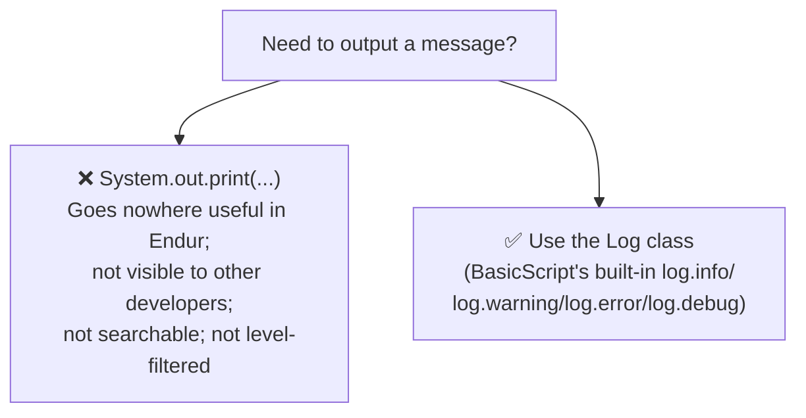

```java
// ❌ Never do this in OpenJVS plug-in code
System.out.println("Processing row " + row);

// ✅ Always use the Log class (see Developing OpenJVS Plugins, Section 8.10)
log.info("Processing row " + row);
```

> Using the `Log` class instead of `System.out.print` gives you, for free: **log level filtering** (DEBUG/INFO/WARNING/ERROR), **routing** via configurable log writers (`FileLogWriter`, `OConsoleLogWriter`, `NtEventLogWriter`), and **deal/transaction number prefixing** (see *Developing OpenJVS Plugins*, Section 8.10.7) — none of which `System.out.print` provides.

---

## 9. Returning Values

> Try to make the structure of your program match the intent. For example, if a method has two possible return paths based on a condition, use an `if-else` to make both paths explicit rather than relying on side effects or an ambiguous single return with hidden fall-through logic.

```java
// ✅ Both return paths explicit and easy to trace
public int resolveRetentionDays() {
    if (isRetentionConfigured()) {
        return configuredRetentionDays();
    } else {
        return DEFAULT_RETENTION_DAYS;
    }
}
```

> Avoid returning references to internal **mutable** objects (such as a `Table` still registered in `DestroyableObjectStore`) unless the caller is meant to take over ownership and lifecycle responsibility for that object — this is a direct extension of the encapsulation principle from Section 2 into method return values.

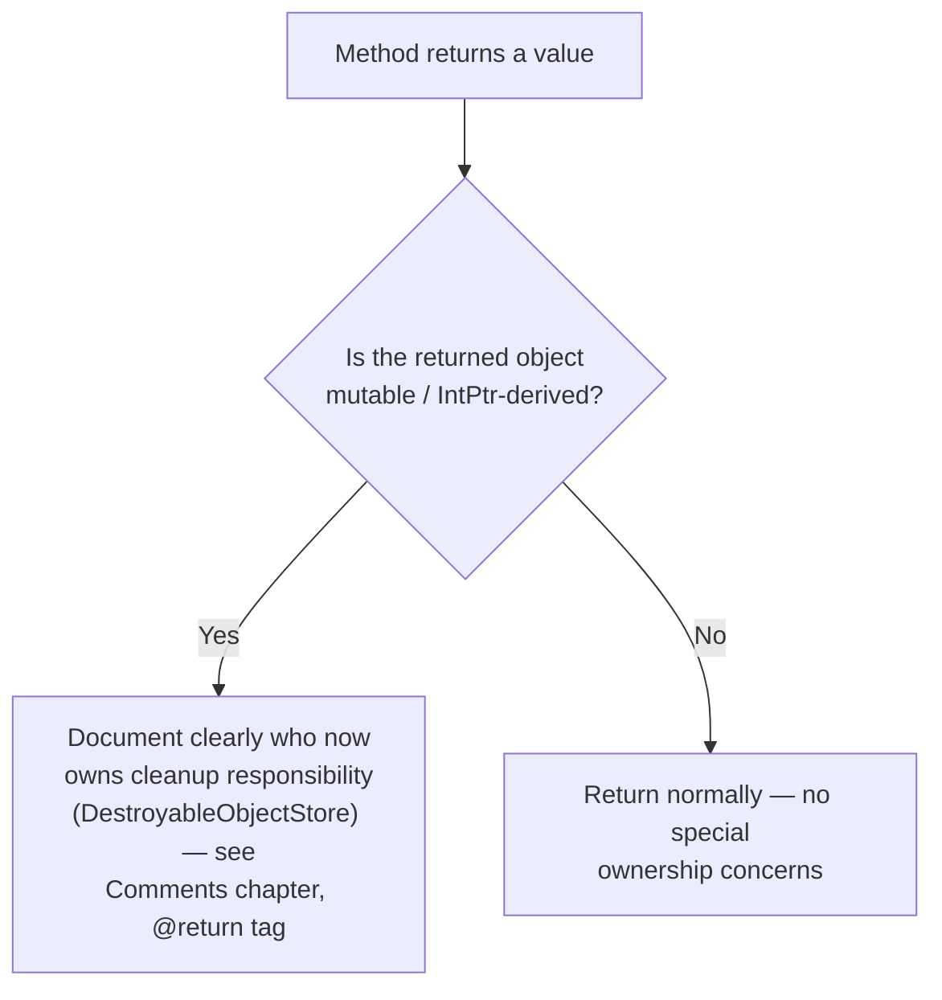

```java
/**
 * Returns candidate rows eligible for purge.
 *
 * @return a memory {@link Table}; caller is responsible for adding it
 *         to the purge framework's table list (see {@link IPurgeTable})
 */
private Table queryCandidateRows(int retentionDays) throws OException {
    return DbaseUtil.execISql(buildQuery(retentionDays));
}
```

---

## 10. Defensive Coding

> Defensive coding means validating inputs, checking for `null`, and failing fast with a clear, contextual exception message rather than allowing an unexpected state to silently propagate and surface confusingly far from its root cause — this directly complements the exception-handling guidance already established in *Statements*, Section 10, and *Comments*, Section 3.2 (documenting `@throws`).

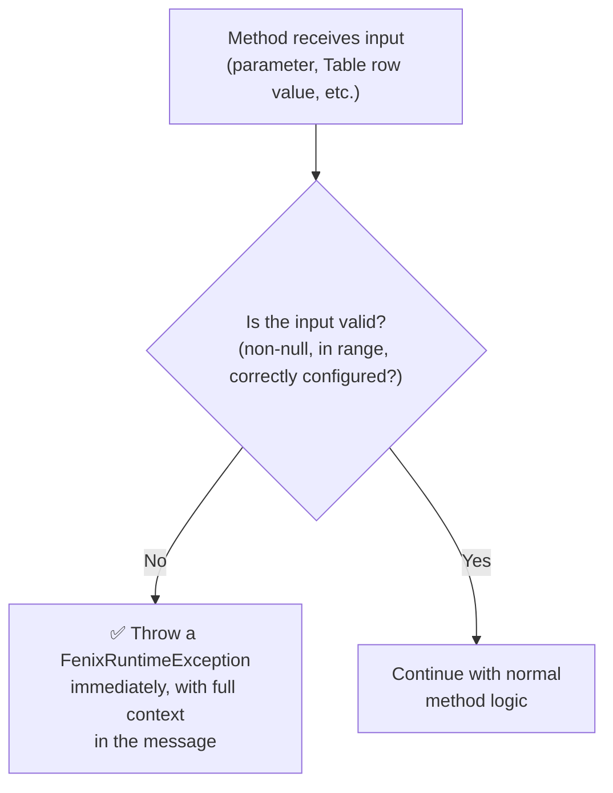

```java
// ✅ Defensive validation with a clear, contextual exception message
public void purgeTable(List<Table> tables) throws OException {
    if (tables == null) {
        throw new FenixRuntimeException(
                "purgeTable called with a null tables list");
    }

    int retentionDays = resolveRetentionDays();
    if (retentionDays <= 0) {
        throw new FenixRuntimeException(
                "Invalid retention period configured: " + retentionDays);
    }

    // ... proceed with validated inputs ...
}
```

```java
// ❌ Avoid — no validation; a null 'tables' list surfaces as an obscure
// NullPointerException far away from this method, inside tables.add(...)
public void purgeTable(List<Table> tables) throws OException {
    Table candidates = queryCandidateRows(resolveRetentionDays());
    tables.add(candidates);   // NPE here if tables was null — unclear why
}
```

> **Fail fast, fail with context.** As established in *Developing OpenJVS Plugins* (Section 8.11), always include context information (which entity, which value, which situation) in the exception message — a defensive check that throws a bare `"Invalid input"` is only marginally better than no check at all.

---

## 11. Use StringBuilder over StringBuffer

> Prefer `StringBuilder` over `StringBuffer` for string construction **unless thread-safety is genuinely required**. `StringBuffer`'s methods are `synchronized`, which imposes unnecessary locking overhead for the vast majority of OpenJVS code, which builds strings entirely within a single script-engine thread (recall: "All Java SE functionality is available to OpenJVS classes **except multi-threading**" — Programming Guide, Section 4).

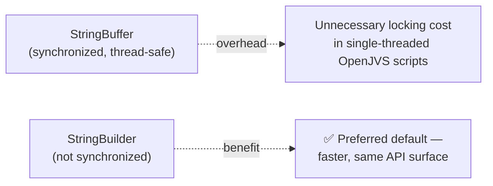

```java
// ❌ Avoid — StringBuffer's synchronization is unnecessary overhead here
StringBuffer sql = new StringBuffer();
sql.append("SELECT * FROM user_index_price_output_values");
sql.append(" WHERE extraction_date < GETDATE() - ").append(retentionDays);

// ✅ Preferred — StringBuilder, identical API, no locking overhead
StringBuilder sql = new StringBuilder();
sql.append("SELECT * FROM user_index_price_output_values");
sql.append(" WHERE extraction_date < GETDATE() - ").append(retentionDays);
```

> **Since OpenJVS explicitly excludes multi-threading** (Programming Guide, Section 4), there is essentially **never** a legitimate reason to reach for `StringBuffer` in EET plug-in code — treat `StringBuilder` as the default, mandatory choice.

---

## 12. Avoid String Concatenation

> Avoid building large or repeatedly-modified strings using the `+` concatenation operator in a loop — each `+` on `String` objects allocates a new `String` (Java strings are immutable), which is wasteful when done repeatedly. Use `StringBuilder` (Section 11) instead for any string built incrementally, especially inside a loop.

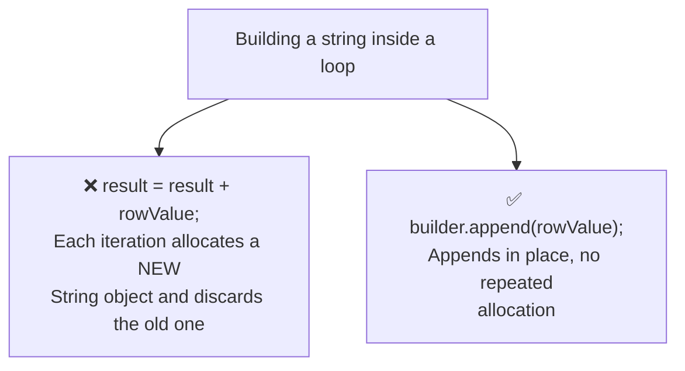

```java
// ❌ Avoid — string concatenation inside a loop, allocates repeatedly
String csvLine = "";
for (int row : new TableRowIterator(table)) {
    csvLine = csvLine + table.getString("value", row) + ",";
}

// ✅ Preferred — StringBuilder used for incremental construction
StringBuilder csvLine = new StringBuilder();
for (int row : new TableRowIterator(table)) {
    csvLine.append(table.getString("value", row)).append(",");
}
String result = csvLine.toString();
```

> A **single** string concatenation using `+` (e.g. building one exception message, or one log line, per *Lines and Indentation*, Section 4) is perfectly acceptable and idiomatic — this rule specifically targets **repeated concatenation inside loops or accumulating build-up across many statements**, where the cost compounds.

```java
// ✅ A single concatenation like this remains perfectly fine — not a loop, not
// repeated accumulation
throw new FenixRuntimeException("Property " + propName
        + " not defined for entity " + this.getEntity());
```

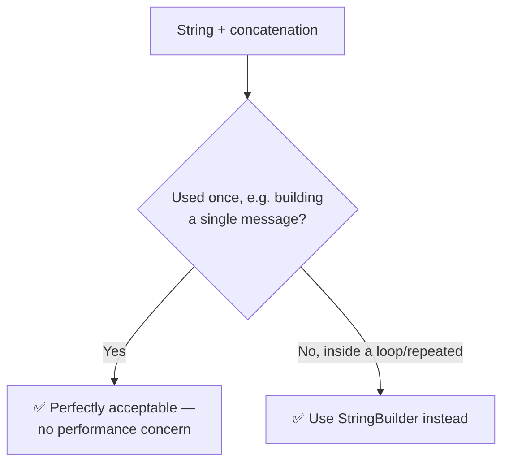

---

## 13. Full Worked Example

Combining every practice from this chapter into one realistic OpenJVS class:

```java
package com.eon.eet.fenix.purging;

import java.util.List;

import com.eon.eet.fenix.common.FenixRuntimeException;
import com.eon.eet.fenix.common.dbase.DbaseUtil;
import com.eon.eet.fenix.common.logging.Log;
import com.olf.openjvs.OException;
import com.olf.openjvs.Table;

/**
 * Purges obsolete rows from the user_index_price_output_values user table.
 *
 * @author G. Moore
 */
public class DbPurgeUserIndexPriceOutputValues implements IPurgeTable {

    private static final int DEFAULT_RETENTION_DAYS = 60;   // Constants (Section 3)

    private Log log = new Log();                             // Access (Section 2) — private field
    private int retentionDays;

    @Override
    public void purgeTable(List<Table> tables) throws OException {
        if (tables == null) {                                 // Defensive coding (Section 10)
            throw new FenixRuntimeException(
                    "purgeTable called with a null tables list");
        }

        retentionDays = resolveRetentionDays();                // Variable assignment (Section 4)
        if (retentionDays <= 0) {
            throw new FenixRuntimeException(
                    "Invalid retention period configured: " + retentionDays);
        }

        // ✅ Clear, parenthesized boolean condition (Section 5)
        boolean shouldLogVerbose = (retentionDays > 0) && (retentionDays < 30);
        String logLevel = shouldLogVerbose ? "DEBUG" : "INFO";   // Ternary (Section 6)

        log.info("Using retention window of " + retentionDays  // Log, not System.out (Section 8)
                + " days; log level: " + logLevel);             // single concat OK (Section 12)

        // ✅ Static utility method invoked via class name (Section 7)
        Table candidates = DbaseUtil.execISql(buildQuery(retentionDays));
        tables.add(candidates);
    }

    private int resolveRetentionDays() {                        // Returning values (Section 9)
        if (isRetentionConfigured()) {
            return configuredRetentionDays();
        } else {
            return DEFAULT_RETENTION_DAYS;
        }
    }

    private String buildQuery(int retentionDaysParam) {
        // ✅ StringBuilder used for incremental construction (Sections 11, 12)
        StringBuilder sql = new StringBuilder();
        sql.append("SELECT * FROM user_index_price_output_values");
        sql.append(" WHERE extraction_date < GETDATE() - ");
        sql.append(retentionDaysParam);
        return sql.toString();
    }

    private boolean isRetentionConfigured() {
        return retentionDays > 0;
    }

    private int configuredRetentionDays() {
        return retentionDays;
    }

}
```

---

## 14. End-to-End Programming Practices Diagram

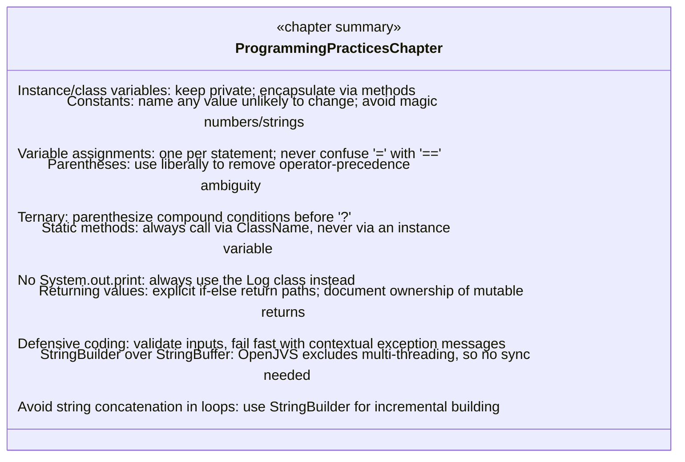

---

## 15. Practical Checklist for Developers

- [ ] **Keep instance/class variables `private`** unless the class is a pure data-holder with no behavior.
- [ ] **Introduce a named `static final` constant** for any value unlikely to change, instead of repeating a literal.
- [ ] **One assignment per statement** — never chain assignments, and never use `=` where `==` was intended.
- [ ] **Use parentheses liberally** in any expression mixing multiple operator types.
- [ ] **Parenthesize compound conditions** appearing before `?` in a ternary expression.
- [ ] **Always invoke `static` methods via the class name**, never through an instance reference.
- [ ] **Never use `System.out.print`/`println`/`System.err.print`** in OpenJVS code — always use the `Log` class.
- [ ] **Make return paths explicit** with `if-else`, and document ownership responsibility when returning mutable/`IntPtr`-derived objects.
- [ ] **Validate inputs defensively** and fail fast with a contextual `FenixRuntimeException` message.
- [ ] **Use `StringBuilder`, never `StringBuffer`**, for all string construction in OpenJVS code.
- [ ] **Avoid `+` string concatenation inside loops** — accumulate with `StringBuilder.append(...)` instead; a single, one-off `+` concatenation remains fine.

---

## Related Sections (Full Programming Guide)

- Section 4 — OpenJVS, Java and Endur (*"All Java SE functionality is available... except multi-threading"* — the direct justification for preferring `StringBuilder` over `StringBuffer`)
- Section 6.3 — `DestroyableObjectStore` Class (why mutable/`IntPtr`-derived return values need documented ownership, per Section 9 of this chapter)
- Section 8.10 — Logging (the `Log` class as the mandatory replacement for `System.out.print`, per Section 8 of this chapter)
- Section 8.11 — Exception Handling (`FenixRuntimeException` with contextual messages, underpinning Defensive Coding, Section 10)
- *EGC Fenix Endur OpenJVS Coding Standards — Statements* (this folder) — `try-catch` and `if-else` formatting that pairs with this chapter's defensive-coding and returning-values guidance
- *EGC Fenix Endur OpenJVS Coding Standards — Naming Conventions* (this folder) — the `UPPER_SNAKE_CASE` naming rule for the constants introduced per Section 3 of this chapter
