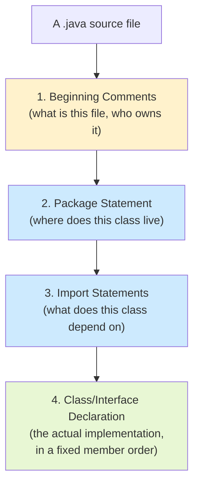
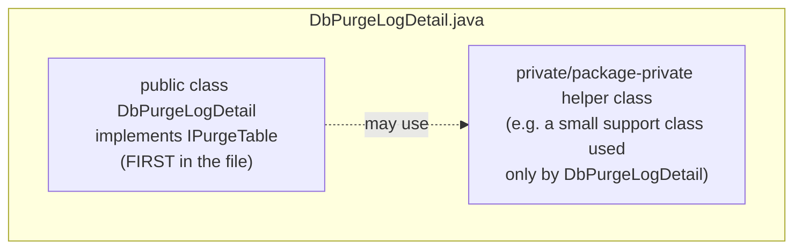
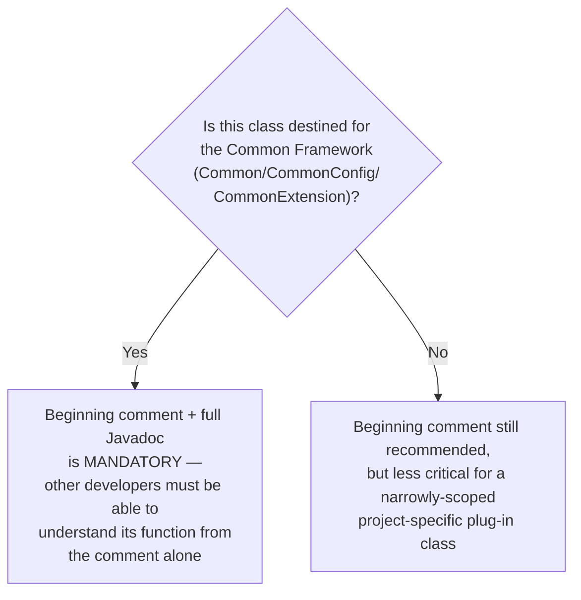
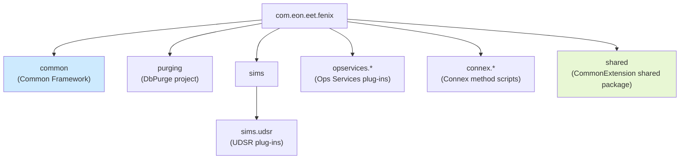
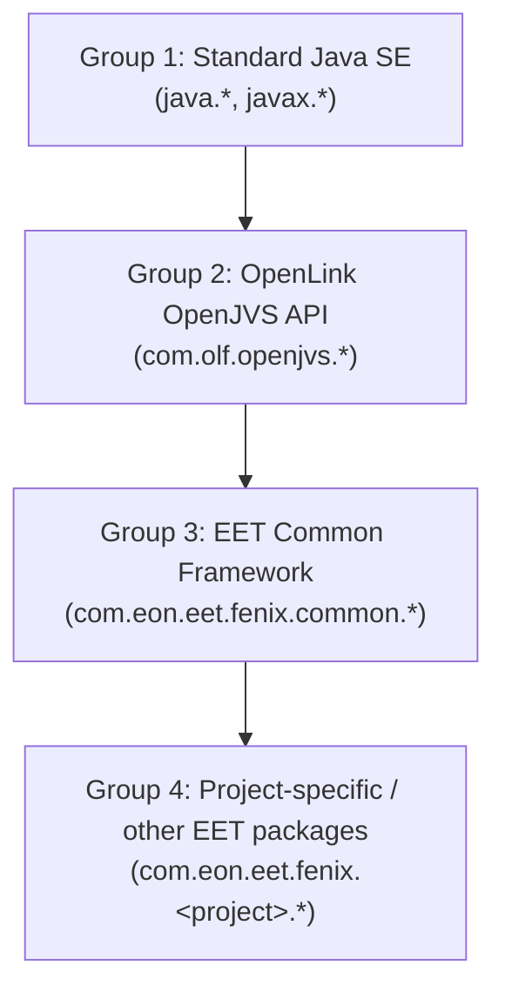
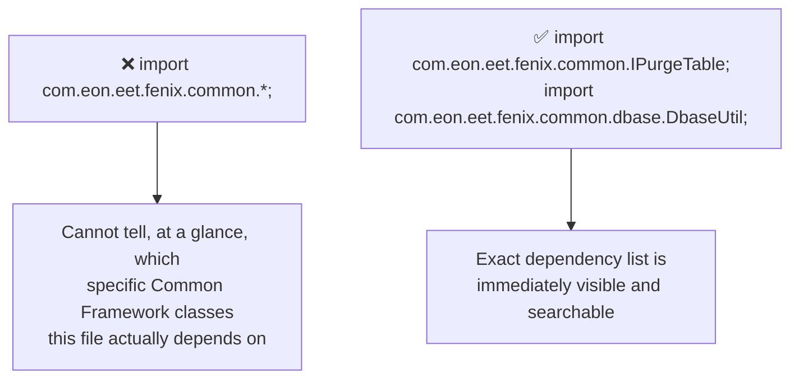
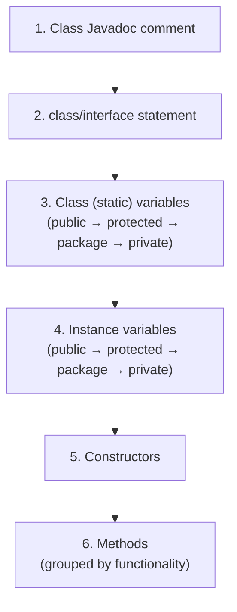
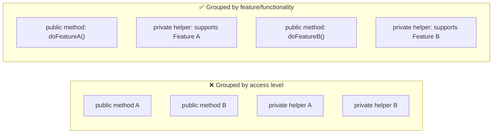
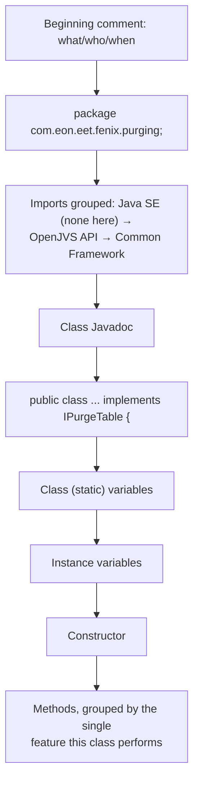
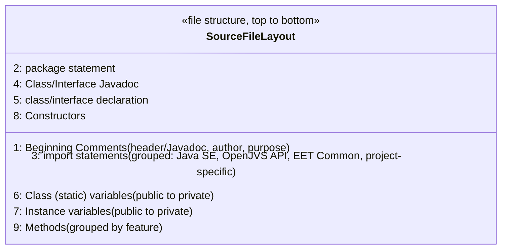

# EGC Fenix Endur OpenJVS Coding Standards — Source File Organization

> Source: This instruction file represents the **Source File Organization** chapter of the companion *EGC Fenix Endur OpenJVS Coding Standards* document (see the *Introduction* instruction file in this same folder for how this document relates to the Programming Guide). It covers **Java Source Files**, **Package and Import Statements**, and **Class and Interface Declarations** — the structural skeleton every `.java` file in the EET Fenix codebase should follow, modeled on the canonical *Code Conventions for the Java Programming Language* file-organization chapter and applied specifically to OpenJVS/Endur package and class conventions already established in the Programming Guide.

---

## Table of Contents

1. [Overview: Why File Organization Is Standardized](#1-overview-why-file-organization-is-standardized)
2. [Java Source Files](#2-java-source-files)
3. [Package and Import Statements](#3-package-and-import-statements)
4. [Class and Interface Declarations](#4-class-and-interface-declarations)
5. [Full Worked Example](#5-full-worked-example)
6. [End-to-End File Layout Diagram](#6-end-to-end-file-layout-diagram)
7. [Practical Checklist for Developers](#7-practical-checklist-for-developers)

---

## 1. Overview: Why File Organization Is Standardized

A `.java` file that always follows the **same top-to-bottom structure** lets any developer jump into an unfamiliar class and immediately know **where to look** for a specific piece of information — without reading the whole file first.



This ordering is not arbitrary — it mirrors the **order of questions a reader naturally asks**: *What is this? Where does it belong? What does it need? What does it actually do?*

---

## 2. Java Source Files

### One Public Type Per File

> Each Java source file contains a **single public class or interface**. When private classes and interfaces are associated with a public class, they can be put in the same source file as the public class. The public class **must be the first** class or interface in the file.



**Why this matters for OpenJVS:** every plug-in naming rule in the Programming Guide (`XxxMain`, `XxxParam`, `UdsrXxx`, etc.) implicitly assumes **one class per file, filename matching the class name exactly** — Endur's Directory Browser and the Eclipse IDE OpenJVS plugin both rely on this 1:1 mapping between file name and class name to import/compile correctly (see the *Importing Code to Endur* instruction file).

### Standard File Structure — the Four Parts

| Order | Section | Required? |
|---|---|---|
| 1 | **Beginning comments** (file header/Javadoc) | Recommended for all classes; **mandatory** for classes intended to join the Common Framework |
| 2 | **Package and Import statements** | Mandatory |
| 3 | **Class and interface declarations** | Mandatory (exactly one public type) |
| — | *(Blank lines between each of the above sections)* | Recommended for readability |

```java
/*
 * DbPurgeLogDetail.java
 *
 * Purges rows from the user_log_detail table older than the
 * configured retention period.
 *
 * @author J. Smith
 * Created: 12 Mar 2018
 */

package com.eon.eet.fenix.purging;

import java.util.List;

import com.olf.openjvs.OException;
import com.olf.openjvs.Table;

import com.eon.eet.fenix.common.IPurgeTable;
import com.eon.eet.fenix.common.dbase.DbaseUtil;

public class DbPurgeLogDetail implements IPurgeTable {
    // ... class body ...
}
```

### The Beginning Comment Block

The opening comment identifies **what the file is, and — for anything destined for the Common Framework — why it exists and who to ask about it**, directly echoing the Programming Guide's own requirement:

> *"If this is the case the code should be well documented with javadoc so that its function can be easily understood by other developers."* (Programming Guide, Section 6 — The Common Framework)



---

## 3. Package and Import Statements

### The Package Statement

> The first non-comment line of most Java source files is a **`package` statement**. After that, `import` statements can follow.

```java
package com.eon.eet.fenix.purging;
```

This is not optional formatting preference — it is the **direct mechanical realization** of every package-naming rule already established in the Programming Guide:

| Rule (from the Programming Guide) | Enforced By the Package Statement |
|---|---|
| Package name must start `com.eon.eet.fenix` | Section 8.1 General Rules |
| Common Framework classes start `com.eon.eet.fenix.common` | Section 6 |
| Purging worker classes live in `com.eon.eet.fenix.purging` | Section 9.2 |
| UDSR plug-ins live in `com.eon.eet.fenix.sims.udsr` | Section 8.5 |
| Ops Services plug-ins live in `com.eon.eet.fenix.opservices.*` | Section 8.6 |
| Connex scripts live in `com.eon.eet.fenix.connex.*` | Section 8.7 |



### The Import Statements

> Import statements should be **grouped**, with related packages together, and a **blank line** separating each group. The groups should be ordered so that the most-general dependencies come first.

**Recommended group order for OpenJVS classes:**



```java
// Group 1 — Java SE
import java.util.List;
import java.util.ArrayList;

// Group 2 — OpenLink OpenJVS API
import com.olf.openjvs.OException;
import com.olf.openjvs.Table;

// Group 3 — EET Common Framework
import com.eon.eet.fenix.common.IPurgeTable;
import com.eon.eet.fenix.common.dbase.DbaseUtil;
import com.eon.eet.fenix.common.logging.Log;

// Group 4 — Project-specific
import com.eon.eet.fenix.purging.util.RetentionCalculator;
```

### Why Grouping Matters

| Without grouping | With grouping |
|---|---|
| A long, unsorted list of imports mixing Java SE, OpenJVS API, and EET classes | Reader instantly sees, at a glance: *"this class touches Java collections, the native OpenJVS `Table` API, and the EET purging/logging framework"* |
| Merge conflicts in source control are noisy and hard to review | Grouped, alphabetized imports produce small, predictable diffs |
| Wildcard imports (`import com.eon.eet.fenix.common.*;`) hide exactly which classes are used | Explicit imports make dependencies traceable — important for the project-reference governance rules in Section 7 of the Programming Guide |



> **Rule:** Avoid wildcard (`*`) imports in OpenJVS code. Explicit imports make it trivial to audit exactly which Common Framework classes a plug-in depends on — directly supporting the traceability goals behind the CommonExtension governance rules.

---

## 4. Class and Interface Declarations

When writing a class or interface declaration, the following parts should occur **in this order**, and **each of the following elements should appear in the order listed**:

| # | Element | Example |
|---|---|---|
| 1 | **Class/interface documentation comment** (`/** ... */`) | Javadoc describing the class's purpose |
| 2 | **`class` or `interface` statement** | `public class DbPurgeLogDetail implements IPurgeTable {` |
| 3 | **Class (static) variables** — public, then protected, then package-level, then private | `private static final int MAX_ROWS = 1000;` |
| 4 | **Instance variables** — public, then protected, then package-level, then private | `private Log log = new Log();` |
| 5 | **Constructors** | `public DbPurgeLogDetail() { ... }` |
| 6 | **Methods** — grouped by functionality/feature, not by scope | `public void purgeTable(List tables) { ... }` |



### Worked Example — Correct Member Ordering

```java
/**
 * Purges rows from user_log_detail older than the configured
 * retention period, as part of the Data Purging Framework.
 */
public class DbPurgeLogDetail implements IPurgeTable {

    // 3. Class (static) variables
    private static final String TABLE_NAME = "user_log_detail";

    // 4. Instance variables
    private Log log = new Log();

    // 5. Constructor
    public DbPurgeLogDetail() {
        // no-arg constructor required by registerNewClass(...)
    }

    // 6. Methods
    @Override
    public void purgeTable(List<Table> tables) throws OException {
        log.info("Starting purge of " + TABLE_NAME);
        // ... retrieve rows to purge into a memory table, add to 'tables' ...
    }

    private int calculateRetentionDays() {
        // ... helper method ...
        return 90;
    }
}
```

### Method Grouping — By Feature, Not By Access Level

> Methods should be **grouped by functionality** rather than by scope or accessibility. For example, a private class method can be in between two public instance methods. The goal is to **make reading and understanding the code easier**.



**Applied to OpenJVS:** in a UDSR class extending `AbstractUdsr`, group `calculate(...)` next to any private helper methods it calls, then `format(...)` next to its own helpers — rather than dumping all public methods first and all private helpers at the bottom, which forces the reader to jump back and forth to understand a single feature.

---

## 5. Full Worked Example

Putting the entire chapter together — a complete, correctly organized OpenJVS source file:

```java
/*
 * DbPurgeUserIndexPriceOutputValues.java
 *
 * Purging worker for the user_index_price_output_values table.
 * Registered with DbPurgeMonthlyMain.
 *
 * @author J. Smith
 * Created: 04 Jun 2019
 */

package com.eon.eet.fenix.purging;

import java.util.List;

import com.olf.openjvs.OException;
import com.olf.openjvs.Table;

import com.eon.eet.fenix.common.IPurgeTable;
import com.eon.eet.fenix.common.dbase.DbaseUtil;
import com.eon.eet.fenix.common.logging.Log;

/**
 * Purges rows from user_index_price_output_values older than the
 * configured retention period.
 */
public class DbPurgeUserIndexPriceOutputValues implements IPurgeTable {

    // Class (static) variables
    private static final String TABLE_NAME = "user_index_price_output_values";
    private static final int DEFAULT_RETENTION_DAYS = 60;

    // Instance variables
    private Log log = new Log();

    // Constructor
    public DbPurgeUserIndexPriceOutputValues() {
    }

    // Methods
    @Override
    public void purgeTable(List<Table> tables) throws OException {
        log.info("Purging " + TABLE_NAME);
        Table rowsToPurge = buildPurgeCandidateTable();
        tables.add(rowsToPurge);
    }

    private Table buildPurgeCandidateTable() throws OException {
        String sql = buildRetentionQuery();
        Table result = DbaseUtil.execISql(sql);
        return result;
    }

    private String buildRetentionQuery() {
        return "SELECT * FROM " + TABLE_NAME
             + " WHERE extraction_date < GETDATE() - " + DEFAULT_RETENTION_DAYS;
    }
}
```

**Reading this example top-to-bottom confirms every rule in this chapter:**



---

## 6. End-to-End File Layout Diagram



---

## 7. Practical Checklist for Developers

- [ ] **Exactly one public class/interface per file**, and it must be the **first** type declared in the file.
- [ ] **File name matches the public class name exactly** (`DbPurgeLogDetail.java` contains `class DbPurgeLogDetail`) — required for Endur's import/compile tooling to work correctly.
- [ ] **Begin every file with a comment block** stating what the file is and (for Common Framework candidates) why it exists — mandatory per Programming Guide Section 6.
- [ ] **Package statement comes first** (after the beginning comment), matching the project's designated package per Section 4.3/8 of the Programming Guide.
- [ ] **Group and order imports**: Java SE → OpenJVS API → EET Common Framework → project-specific, separated by blank lines.
- [ ] **Avoid wildcard imports** (`import com.eon.eet.fenix.common.*;`) — always import specific classes.
- [ ] **Order class members correctly**: Javadoc → class declaration → static variables → instance variables → constructors → methods.
- [ ] **Order variables by visibility**: public, then protected, then package-private, then private — within both the static-variable and instance-variable groups.
- [ ] **Group methods by feature/functionality**, not by public/private access level — keep a method and its private helpers physically close together.

---

## Related Sections (Full Programming Guide)

- Section 4.3 — Current EET OpenJVS Projects (defines which package each project's classes belong in)
- Section 6 — The Common Framework (the Javadoc-documentation mandate for framework-bound classes)
- Section 7 — The CommonExtension Project Shared Package (why explicit, non-wildcard imports support project-reference traceability)
- Section 8.1–8.7 — Developing OpenJVS Plugins (the specific package/naming rules that this file's package-statement conventions mechanically enforce)
- *EGC Fenix Endur OpenJVS Coding Standards — Introduction* (this folder) — the rationale ("Why Have Code Conventions") underpinning this chapter's rules
