# EGC Fenix Endur OpenJVS Coding Standards — Statements

> Source: This instruction file represents the **Statements** chapter of the companion *EGC Fenix Endur OpenJVS Coding Standards* document (see *Introduction*, *Source File Organization*, *Lines and Indentation*, *Comments*, and *Declarations* in this same folder). It covers **Simple Statements**, **Compound Statements**, **return Statements**, **if / if-else / if-else-if-else Statements**, **for Statements**, **while Statements**, **do-while Statements**, **switch Statements**, and **try-catch Statements** — the formatting rules for every control-flow construct used throughout EET OpenJVS plug-ins.

---

## Table of Contents

1. [Overview: Statements as the Unit of Control Flow](#1-overview-statements-as-the-unit-of-control-flow)
2. [Simple Statements](#2-simple-statements)
3. [Compound Statements](#3-compound-statements)
4. [return Statements](#4-return-statements)
5. [if, if-else, if-else-if-else Statements](#5-if-if-else-if-else-if-else-statements)
6. [for Statements](#6-for-statements)
7. [while Statements](#7-while-statements)
8. [do-while Statements](#8-do-while-statements)
9. [switch Statements](#9-switch-statements)
10. [try-catch Statements](#10-try-catch-statements)
11. [Full Worked Example](#11-full-worked-example)
12. [End-to-End Statements Diagram](#12-end-to-end-statements-diagram)
13. [Practical Checklist for Developers](#13-practical-checklist-for-developers)

---

## 1. Overview: Statements as the Unit of Control Flow

Every OpenJVS plug-in's `execute(Table argt, Table returnt)` method (see *Developing OpenJVS Plugins*, Section 8) is built entirely from statements — sequences of simple statements and nested compound blocks. Consistent statement formatting is what makes it possible to visually trace control flow (branching, looping, exception handling) at a glance, which matters enormously in a codebase where a single unhandled exception must propagate cleanly up to `BasicScript` (see *Common Framework*, Section 6.2).

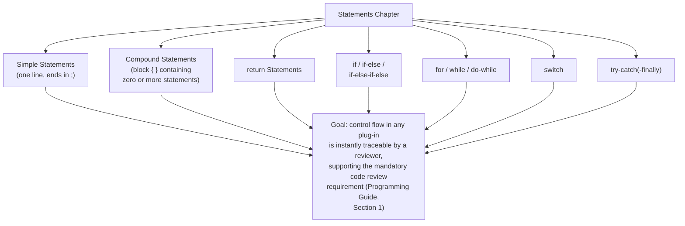

---

## 2. Simple Statements

> Each line should contain **at most one statement**. Never place multiple statements separated by semicolons on the same line — this is sometimes called "statement stacking" and severely harms readability and diff clarity in Source Control.

```java
// ❌ Avoid — multiple statements stacked on one line
int rowCount = 0; int purgedCount = 0; log.info("Starting purge");

// ✅ Preferred — one statement per line
int rowCount = 0;
int purgedCount = 0;
log.info("Starting purge");
```

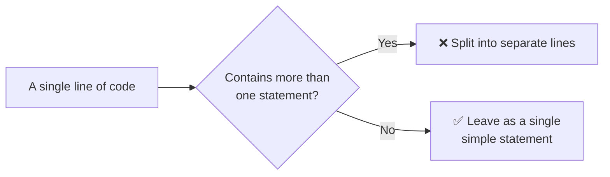

---

## 3. Compound Statements

> Compound statements are statements that contain lists of statements enclosed in braces `{ statements }`. The enclosed statements should be indented one more level than the compound statement (see *Lines and Indentation*, 4-space rule). The opening brace should be at the end of the line that begins the compound statement; the closing brace should begin a line and be indented to match the beginning of the compound statement.

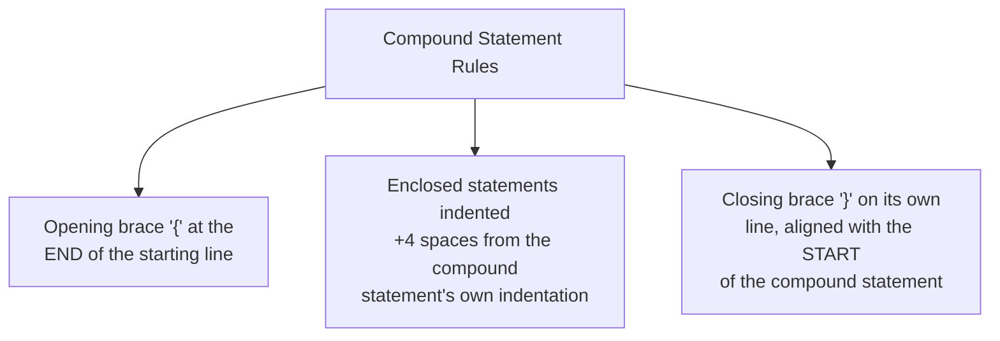

```java
// ✅ Correctly formatted compound statement
if (isRetentionConfigured()) {
    int retentionDays = resolveRetentionDays();
    log.info("Retention configured: " + retentionDays + " days");
}
```

> **Braces are used with all statements that have a compound body**, even when the body contains only a single statement — this is an EET-specific strengthening of the general convention, adopted because it prevents a very common class of bug where a developer later adds a second statement intending it to be part of the `if`/`for`/`while` body, but it silently falls outside the (brace-less) block.

```java
// ❌ Avoid — braces omitted for a single-statement body
if (rowCount == 0)
    log.warning("No rows found");

// ✅ Preferred — braces always present, even for a single statement
if (rowCount == 0) {
    log.warning("No rows found");
}
```

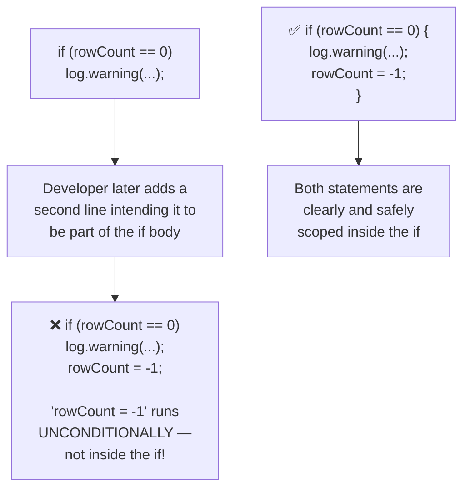

---

## 4. return Statements

> A `return` statement with a value should not use parentheses unless they make the return value more obvious in some way, e.g. wrapping a complex expression. Prefer a single, clear expression over parenthesizing simple values.

```java
// ✅ Simple return — no parentheses needed
return retentionDays;

// ✅ Parentheses justified — clarifies a compound boolean expression
return (rowCount > 0) && (retentionDays > MIN_RETENTION_DAYS);

// ❌ Avoid — unnecessary parentheses around a simple value
return (retentionDays);
```

### Early Returns in OpenJVS Parameter Plug-ins

The Programming Guide (Section 8.3) states that `getUserSelection`/`getWorkflowValues` should throw a `FenixRuntimeException` when a plug-in is not designed to run in a given mode — this is effectively an early-exit pattern that pairs naturally with early `return` statements for guard clauses:

```java
public Table getWorkflowValues(Table argt) {
    if (!isWorkflowSupported()) {
        throw new FenixRuntimeException("This parameter script does not"
                + " support workflow execution");
    }
    return buildDefaultParameters(argt);
}
```

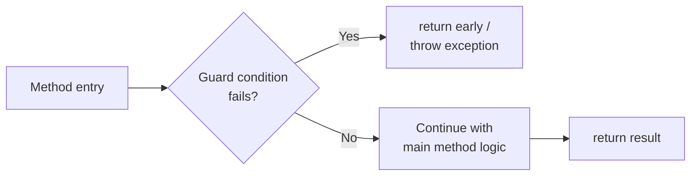

---

## 5. if, if-else, if-else-if-else Statements

> The `if-else` class of statements should have the following form. Braces are always used (per Section 3), and `else`/`else if` appear on the **same line** as the preceding closing brace.

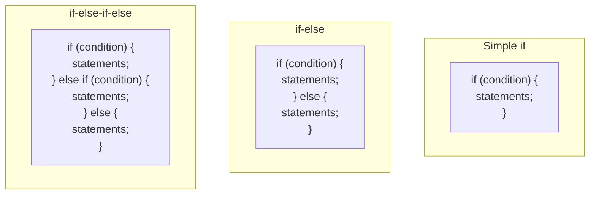

```java
// ✅ Simple if
if (rowCount == 0) {
    log.warning("No rows found");
}

// ✅ if-else
if (rowCount > 0) {
    processRows();
} else {
    log.info("Nothing to process");
}

// ✅ if-else-if-else chain
if (retentionDays <= 0) {
    log.warning("Invalid retention period; using default");
    retentionDays = DEFAULT_RETENTION_DAYS;
} else if (retentionDays > MAX_RETENTION_DAYS) {
    log.warning("Retention period exceeds maximum; capping");
    retentionDays = MAX_RETENTION_DAYS;
} else {
    log.debug("Using configured retention period: " + retentionDays);
}
```

> **Never write `else`/`else if` on its own line separate from the preceding closing brace** — this is a strict EET formatting rule (matches the Lines and Indentation chapter's approach to wrapped conditionals).

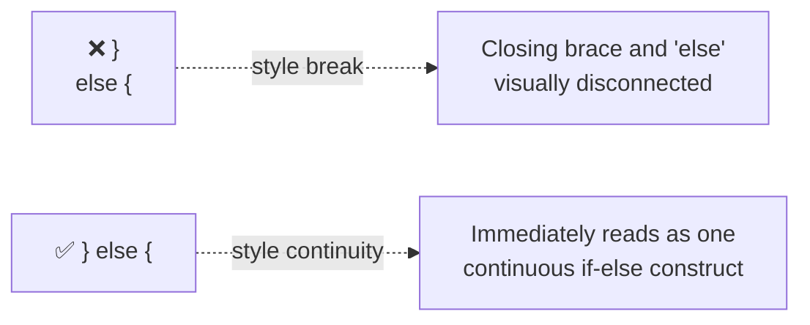

### Long Conditions

When a condition doesn't fit on one line, apply the wrapping rules from *Lines and Indentation* (break before the operator, extra indent to distinguish the condition from the block body):

```java
if ((rowCount > MAX_ROWS)
        || (retentionDays < MIN_RETENTION_DAYS)) {
    log.warning("Purge parameters out of expected range");
    return;
}
```

---

## 6. for Statements

> A `for` statement should have the following form, with a space after the `for` keyword and after each semicolon within the parentheses.

```java
// ✅ Standard for loop
for (int i = 0; i < rowCount; i++) {
    processRow(i);
}
```

### Preferred OpenJVS Idiom: `TableRowIterator`

As established in *Common Framework* (Section 6.11), prefer `TableRowIterator` over manual row-count loops when iterating memory tables:

```java
// ❌ Manual row counting — more error prone, more verbose
int rowCount = table1.getNumRows();
for (int row = 1; row <= rowCount; row++) {
    int value = table1.getInt("value", row);
}

// ✅ Preferred — enhanced for-loop with TableRowIterator
for (int row : new TableRowIterator(table1)) {
    int value = table1.getInt("value", row);
}
```

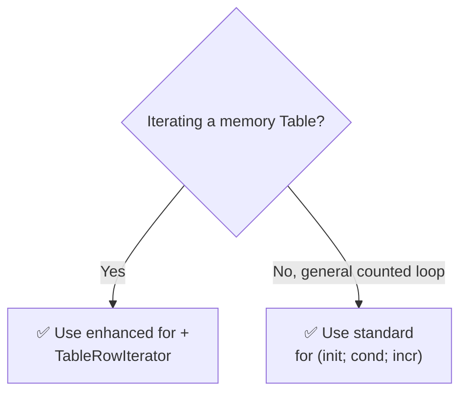

### Empty `for` Loop Sections

When one of the three `for` clauses is omitted, still keep the semicolons in place with no extra space before them:

```java
for (int row : new TableRowIterator(table1, DIRECTION.BACKWARDS)) {
    if (shouldStop(row)) {
        break;
    }
}
```

---

## 7. while Statements

> A `while` statement should have the following form, with the condition fully evaluated before entering the loop body — used when the number of iterations is not known ahead of time.

```java
// ✅ Standard while loop
int retryCount = 0;
while (retryCount < MAX_RETRIES && !connectionEstablished) {
    connectionEstablished = attemptConnection();
    retryCount++;
}
```

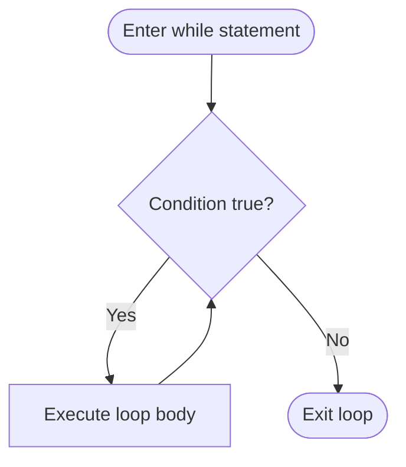

> Prefer `while` over `for` when the loop is driven by a **condition** (e.g. retry logic, polling a queue) rather than by a numeric counter or a `TableRowIterator`-style collection traversal.

---

## 8. do-while Statements

> A `do-while` statement should have the following form, used only when the loop body must execute **at least once** before the condition is evaluated.

```java
// ✅ do-while — guarantees at least one execution
int attempt = 0;
boolean success;
do {
    success = tryProcessBatch(attempt);
    attempt++;
} while (!success && attempt < MAX_ATTEMPTS);
```

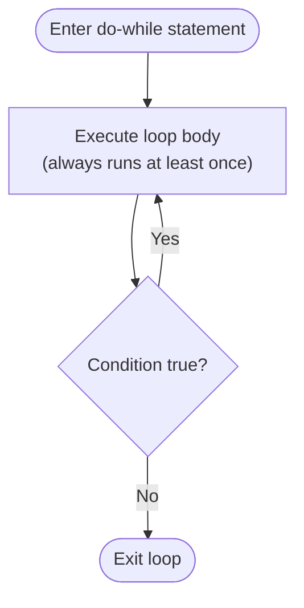

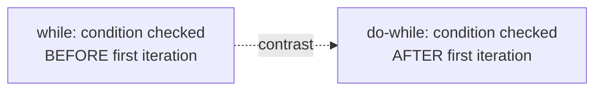

> **`do-while` should be used sparingly** — only when the "at least once" semantic is genuinely required (e.g. "always attempt the first batch, then keep retrying based on a result"). If the loop could legitimately run zero times, use a plain `while` instead.

---

## 9. switch Statements

> A `switch` statement should have the following form, with each `case` label indented at the same level as the `switch` keyword's block content, and statements within a case indented one further level. Every `case` (except intentional fall-through) must end with `break`, `return`, or `throw` — and a fall-through **must be explicitly commented**.

```java
// ✅ Standard switch statement
switch (logLevel) {
    case DEBUG:
        log.debug(message);
        break;
    case WARNING:
        log.warning(message);
        break;
    case ERROR:
        log.error(message);
        break;
    default:
        log.info(message);
        break;
}
```

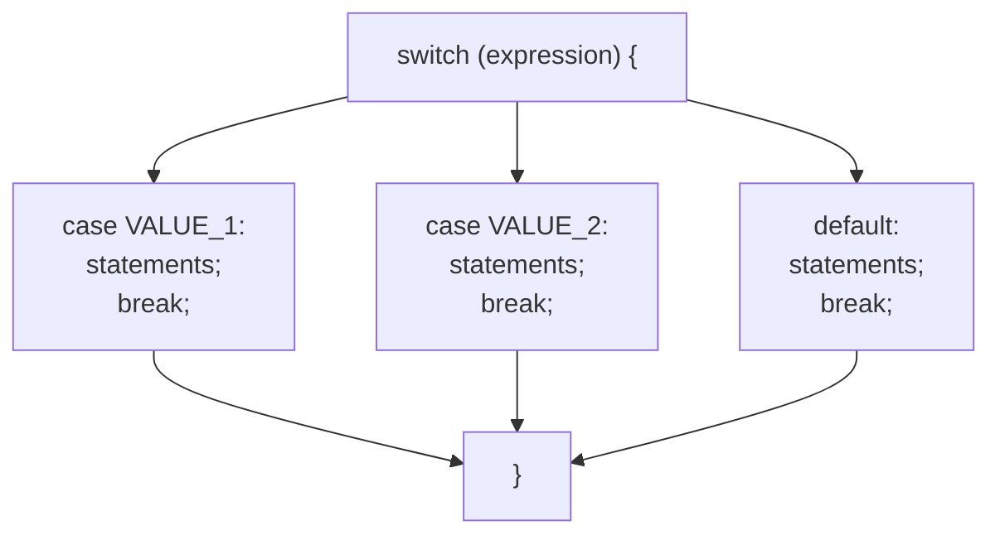

### Intentional Fall-Through

```java
// ✅ Fall-through is intentional and explicitly commented
switch (purgeFrequency) {
    case DAILY:
    case WEEKLY:
        // DAILY and WEEKLY purges share the same worker registration
        registerNewClass(new DbPurgeLogDetail());
        break;
    case MONTHLY:
        registerNewClass(new DbPurgeMarketRiskNordicProfile());
        break;
    default:
        log.warning("Unrecognized purge frequency: " + purgeFrequency);
        break;
}
```

> **Always include a `default` case**, even if it only logs a warning — this guards against silently ignoring unexpected enum values, which is especially important given the EET convention of using enumerations for reference data (see *Common Framework*, Section 6.10).

---

## 10. try-catch Statements

> A `try-catch` statement should have the following form. The `catch` keyword appears on the same line as the preceding closing brace (matching the `if-else` convention in Section 5). Every checked exception that cannot be usefully handled locally should be wrapped into a `FenixRuntimeException` or allowed to propagate as `OException` (see *Comments*, Version History, and *Developing OpenJVS Plugins*, Exception Handling).

```java
// ✅ Standard try-catch
try {
    Table result = DbaseUtil.execISql(sql);
    tables.add(result);
} catch (OException e) {
    throw new FenixRuntimeException("Failed to query candidate rows"
            + " for retention purge", e);
}
```

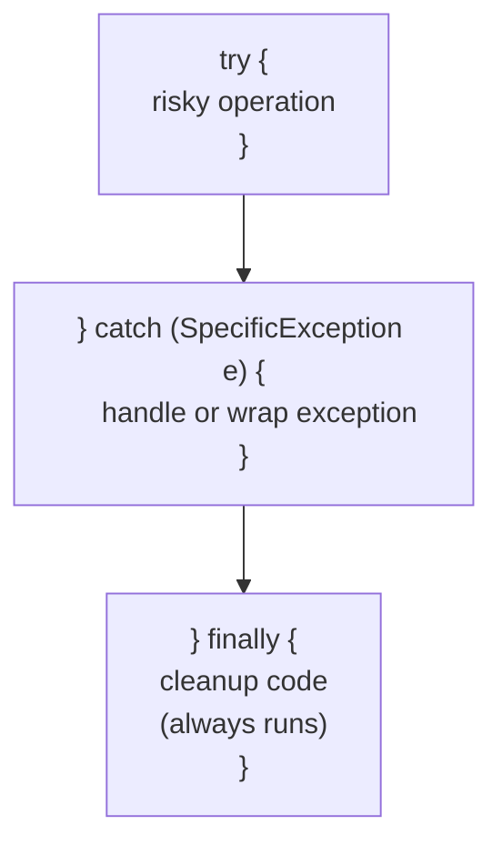

### try-catch-finally

```java
// ✅ try-catch-finally — cleanup guaranteed to run
Table result = null;
try {
    result = DbaseUtil.execISql(sql);
    processResult(result);
} catch (OException e) {
    log.error("Query failed: " + e.getMessage());
    throw new FenixRuntimeException("Query failed", e);
} finally {
    if (result != null) {
        DestroyableObjectStore.remove(result);
    }
}
```

### Multi-Catch and Exception Ordering

When catching multiple exception types, order `catch` blocks from **most specific to least specific** — a more general exception type declared first would make subsequent, more specific `catch` blocks unreachable.

```java
try {
    riskyOperation();
} catch (FenixAlertBrokerException e) {
    // Most specific — handled first
    handleAlertBrokerFailure(e);
} catch (FenixException e) {
    // Less specific EET exception
    handleGeneralFenixFailure(e);
} catch (OException e) {
    // Least specific — allowed to propagate per EET convention
    throw e;
}
```

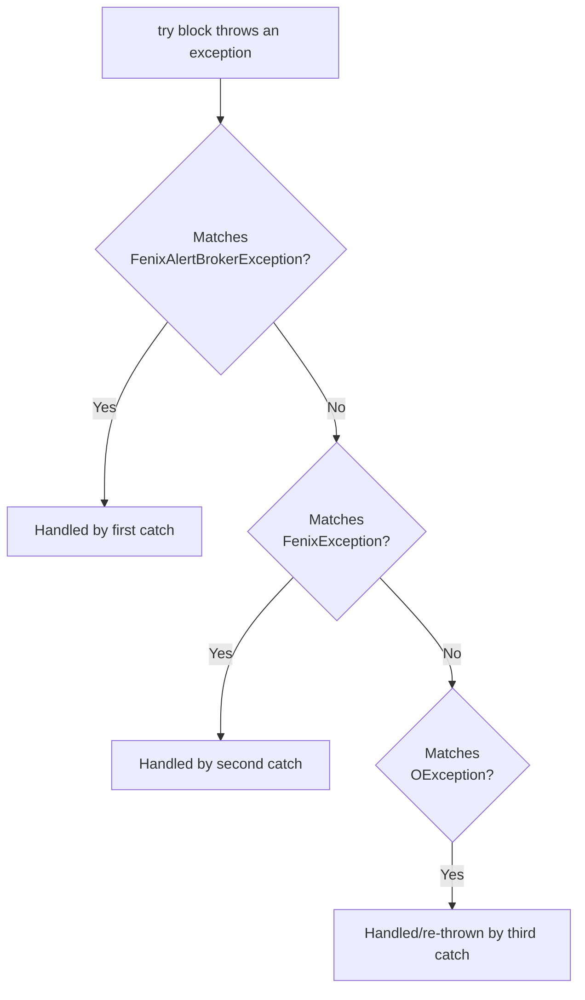

> **Never leave a `catch` block empty.** Per *Developing OpenJVS Plugins* (Section 8.11), if a checked exception genuinely requires no handling, insert a comment explaining why — an empty `catch` block silently swallows failures that `BasicScript`'s top-level exception handling (Section 6.2) is specifically designed to catch and report.

---

## 11. Full Worked Example

Combining every statement form from this chapter into one realistic OpenJVS method:

```java
@Override
public void purgeTable(List<Table> tables) throws OException {
    int retentionDays = resolveRetentionDays();       // simple statement

    if (retentionDays <= 0) {                          // if-else-if-else
        log.warning("Invalid retention; using default");
        retentionDays = DEFAULT_RETENTION_DAYS;
    } else if (retentionDays > MAX_RETENTION_DAYS) {
        log.warning("Retention exceeds maximum; capping");
        retentionDays = MAX_RETENTION_DAYS;
    } else {
        log.debug("Using configured retention: " + retentionDays);
    }

    Table candidates = null;
    try {                                               // try-catch-finally
        candidates = queryCandidateRows(retentionDays);

        for (int row : new TableRowIterator(candidates)) {  // for statement
            switch (classifyRow(candidates, row)) {          // switch statement
                case ELIGIBLE:
                    markForPurge(candidates, row);
                    break;
                case RETAINED:
                    // Retained rows are skipped; no action required
                    break;
                default:
                    log.warning("Unclassified row at index " + row);
                    break;
            }
        }

        int attempt = 0;
        boolean success;
        do {                                              // do-while statement
            success = commitBatch(candidates, attempt);
            attempt++;
        } while (!success && attempt < MAX_ATTEMPTS);

        tables.add(candidates);
    } catch (OException e) {
        throw new FenixRuntimeException("Failed to purge"
                + " user_index_price_output_values", e);
    } finally {
        if (candidates != null) {
            DestroyableObjectStore.remove(candidates);
        }
    }
}

private int resolveRetentionDays() {
    int retryCount = 0;
    while (retryCount < MAX_CONFIG_RETRIES && !isConfigLoaded()) {  // while statement
        loadConfig();
        retryCount++;
    }
    return DEFAULT_RETENTION_DAYS;                       // return statement
}
```

---

## 12. End-to-End Statements Diagram

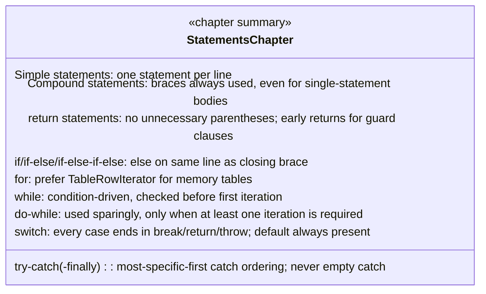

---

## 13. Practical Checklist for Developers

- [ ] **One statement per line** — never stack multiple statements separated by semicolons.
- [ ] **Always use braces** for `if`/`for`/`while`/`do-while` bodies, even single-statement ones.
- [ ] **Place `else`/`else if`/`catch`/`finally` on the same line** as the preceding closing brace.
- [ ] **Avoid unnecessary parentheses** in `return` statements; use them only to clarify complex expressions.
- [ ] **Prefer `TableRowIterator`** over manual row-count `for` loops when iterating memory tables.
- [ ] **Use `while` for condition-driven loops**, `for` for counted/collection loops, and `do-while` only when at least one iteration is guaranteed to be needed.
- [ ] **Always include a `default` case** in `switch` statements, and comment any intentional fall-through.
- [ ] **Order `catch` blocks from most specific to least specific** exception type.
- [ ] **Never leave a `catch` block empty** — log, handle, or explicitly comment why no action is needed.
- [ ] **Declare cleanup-relevant variables before `try`**, defaulted to `null`, matching the pattern established in the *Declarations* chapter.

---

## Related Sections (Full Programming Guide)

- Section 6.2 — `BasicScript` Class (top-level exception handling that all uncaught exceptions ultimately reach)
- Section 6.11 — `TableRowIterator` (the preferred `for`-loop idiom for OpenJVS memory tables)
- Section 8.11 — Exception Handling (`FenixException`/`FenixRuntimeException`, Alert Broker exceptions, and the "don't log what you throw" rule)
- *EGC Fenix Endur OpenJVS Coding Standards — Lines and Indentation* (this folder) — wrapping rules applied to long `if` conditions and method calls within statements
- *EGC Fenix Endur OpenJVS Coding Standards — Declarations* (this folder) — the safe `try`/`finally` variable-declaration pattern referenced in Section 10
