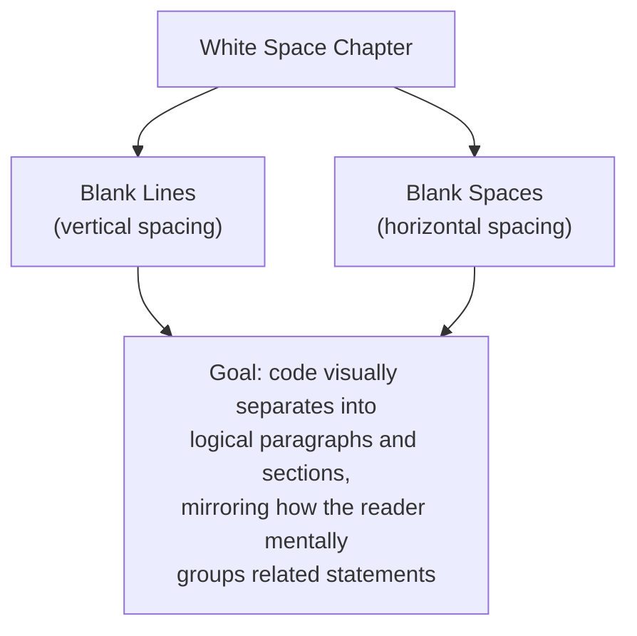
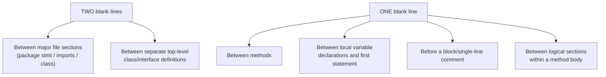
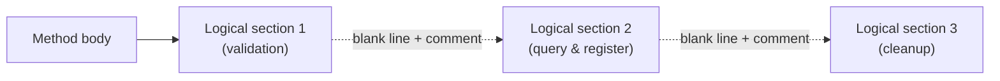
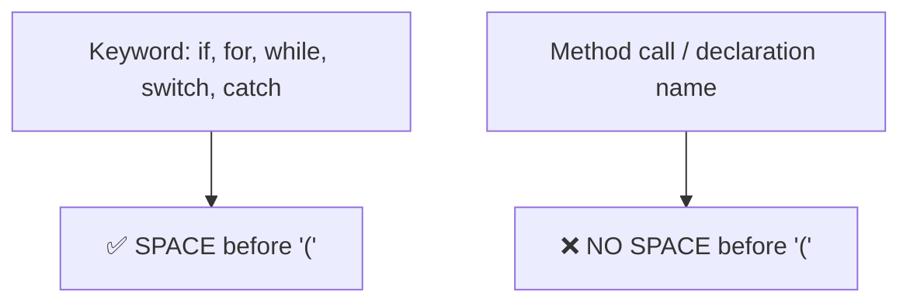
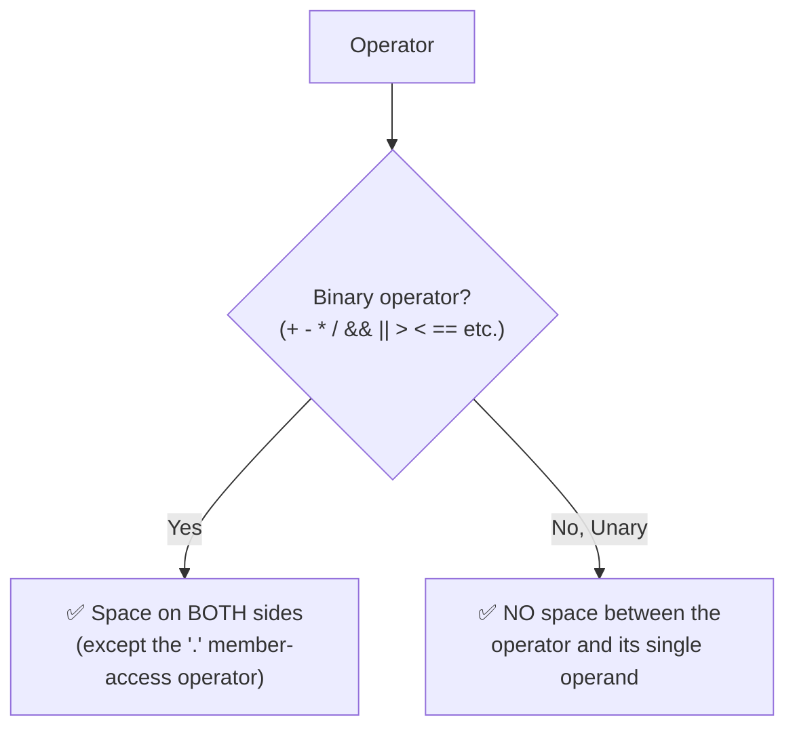
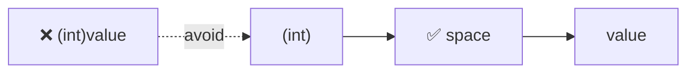
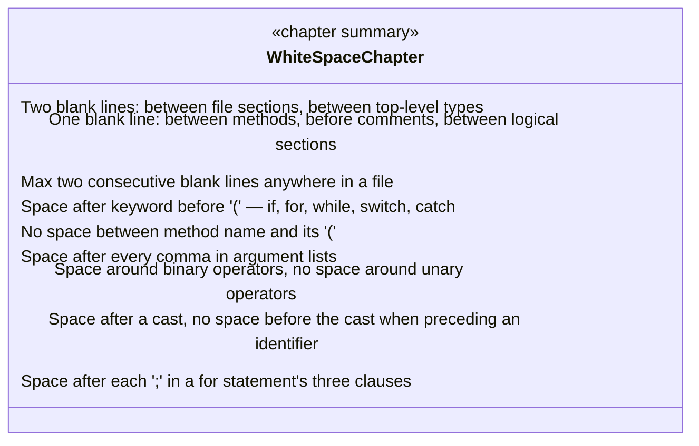

# EGC Fenix Endur OpenJVS Coding Standards — White Space

> Source: This instruction file represents the **White Space** chapter of the companion *EGC Fenix Endur OpenJVS Coding Standards* document (see *Introduction*, *Source File Organization*, *Lines and Indentation*, *Comments*, *Declarations*, and *Statements* in this same folder). It covers **Blank Lines** (vertical white space) and **Blank Spaces** (horizontal white space) — the rules governing how visual "breathing room" is used to group and separate related code.

---

## Table of Contents

1. [Overview: White Space as a Structural Signal](#1-overview-white-space-as-a-structural-signal)
2. [Blank Lines](#2-blank-lines)
3. [Blank Spaces](#3-blank-spaces)
4. [Full Worked Example](#4-full-worked-example)
5. [End-to-End White Space Diagram](#5-end-to-end-white-space-diagram)
6. [Practical Checklist for Developers](#6-practical-checklist-for-developers)

---

## 1. Overview: White Space as a Structural Signal

White space carries no semantic meaning to the Java compiler, but it carries **enormous** meaning to a human reader. Blank lines group related statements into logical paragraphs; blank spaces separate tokens so operators, keywords, and arguments don't visually run together. Consistent white space is what makes a class formatted by one EET developer look and feel identical to one formatted by another — directly supporting the "readable" and "maintainable" objectives set out in the Programming Guide's Introduction (Section 1).



---

## 2. Blank Lines

> Blank lines improve readability by setting off sections of code that are logically related. **Two blank lines** should always be used in the following circumstances:

- Between sections of a source file (see *Source File Organization* — the file-header, package/import, and class-declaration sections)
- Between class and interface definitions (in the rare case that a file contains more than one top-level type)

**One blank line** should always be used in the following circumstances:

- Between methods
- Between the local variable declarations in a method and its first statement
- Before a block or single-line comment
- Between logical sections inside a method, to improve readability



### Two Blank Lines — File Section Separation

```java
package com.eon.eet.fenix.purging;

import java.util.List;

import com.eon.eet.fenix.common.dbase.DbaseUtil;
import com.olf.openjvs.OException;
import com.olf.openjvs.Table;


/**
 * Purges obsolete rows from the user_index_price_output_values user table.
 *
 * @author G. Moore
 */
public class DbPurgeUserIndexPriceOutputValues implements IPurgeTable {
    // ...
}
```

### One Blank Line — Between Methods

```java
public class DbPurgeUserIndexPriceOutputValues implements IPurgeTable {

    private static final int DEFAULT_RETENTION_DAYS = 60;

    @Override
    public void purgeTable(List<Table> tables) throws OException {
        // ...
    }

    private int resolveRetentionDays() {
        return DEFAULT_RETENTION_DAYS;
    }

}
```

### One Blank Line — Separating Declarations from the First Statement

```java
public void purgeTable(List<Table> tables) throws OException {
    int retentionDays = resolveRetentionDays();
    Table candidates = null;

    try {
        candidates = queryCandidateRows(retentionDays);
        tables.add(candidates);
    } finally {
        if (candidates != null) {
            DestroyableObjectStore.remove(candidates);
        }
    }
}
```

### One Blank Line — Separating Logical Sections Within a Method

```java
public void purgeTable(List<Table> tables) throws OException {
    int retentionDays = resolveRetentionDays();

    // Section 1: validate configured retention period
    if (retentionDays <= 0) {
        log.warning("Invalid retention; using default");
        retentionDays = DEFAULT_RETENTION_DAYS;
    }

    // Section 2: query and register candidate rows
    Table candidates = queryCandidateRows(retentionDays);
    tables.add(candidates);
}
```



> **Never use more than two consecutive blank lines anywhere in a file.** Excess blank lines are just as harmful to readability as too few — they force unnecessary scrolling and break the visual rhythm of the class.

---

## 3. Blank Spaces

> Blank spaces should be used in the following circumstances:

### A keyword followed by a parenthesis should be separated by a space

```java
// ✅ Space between keyword and parenthesis
while (true) {
    // ...
}

if (isRetentionConfigured()) {
    // ...
}
```

```java
// ❌ Avoid — no space between keyword and parenthesis
while(true) {
if(isRetentionConfigured()) {
```

> **Note:** a blank space should **not** be used between a method name and its opening parenthesis — this helps to distinguish keywords from method calls (see *Declarations*, Class and Interface Declarations, Section 5, Rule 1).

```java
// ✅ No space between method name and parenthesis
purgeTable(tables);
resolveRetentionDays();

// ❌ Avoid — space incorrectly inserted before the parenthesis
purgeTable (tables);
resolveRetentionDays ();
```



### A blank space should appear after commas in argument lists

```java
// ✅ Space after each comma
DbaseUtil.execISql(sql, resultTable, connectionTimeout);

// ❌ Avoid — missing space after commas
DbaseUtil.execISql(sql,resultTable,connectionTimeout);
```

### All binary operators except `.` should be separated from their operands by spaces

Blank spaces should never separate unary operators (unary minus `-`, increment `++`, decrement `--`) from their operand.

```java
// ✅ Binary operators spaced on both sides
int total = rowCount + purgedCount;
boolean isValid = (rowCount > 0) && (retentionDays > MIN_RETENTION_DAYS);
String sql = "SELECT * FROM " + tableName;

// ✅ Unary operators NOT spaced from their operand
int negated = -retentionDays;
rowCount++;
--attempt;

// ❌ Avoid — missing spaces around binary operators
int total = rowCount+purgedCount;
boolean isValid = (rowCount>0)&&(retentionDays>MIN_RETENTION_DAYS);

// ❌ Avoid — incorrect space inserted for unary operators
int negated = - retentionDays;
rowCount ++;
```



### The expressions in a `for` statement should be separated by blank spaces

```java
// ✅ Spaces after each semicolon in the for statement
for (int i = 0; i < rowCount; i++) {
    processRow(i);
}
```

### Casts should be followed by a blank space, but not preceded by one when adjacent to an identifier

```java
// ✅ Space after the cast, none before it when directly preceding the value
myMethod((byte) aNum, (Object) x);
myMethod((int) (cp + 5), ((int) (cp + 5)));

// ✅ In OpenJVS-flavoured code
int value = (int) rawDoubleValue;
```



### Do not put a space between a unary operator and its operand, but do put a space between the operator and the rest of the expression

```java
// ✅ Correct spacing around a unary minus within a larger expression
someValue = someArray[index] - 1;
someValue = -someArray[index];
```

---

## 4. Full Worked Example

Combining every white-space rule from this chapter into one realistic OpenJVS class:

```java
package com.eon.eet.fenix.purging;

import java.util.List;

import com.eon.eet.fenix.common.FenixRuntimeException;
import com.eon.eet.fenix.common.logging.Log;
import com.olf.openjvs.OException;
import com.olf.openjvs.Table;


/**
 * Purges obsolete rows from the user_index_price_output_values user table.
 *
 * @author G. Moore
 */
public class DbPurgeUserIndexPriceOutputValues implements IPurgeTable {

    private static final int DEFAULT_RETENTION_DAYS = 60;
    private static final int MIN_RETENTION_DAYS = 1;

    private Log log = new Log();

    @Override
    public void purgeTable(List<Table> tables) throws OException {
        int retentionDays = resolveRetentionDays();
        int purgedCount = 0;

        // Section 1: validate configured retention period (blank line above)
        if (retentionDays < MIN_RETENTION_DAYS) {
            log.warning("Invalid retention; using default");
            retentionDays = DEFAULT_RETENTION_DAYS;
        }

        // Section 2: iterate rows and purge those beyond the retention window
        Table candidates = queryCandidateRows(retentionDays);
        for (int row : new TableRowIterator(candidates)) {
            if (isEligibleForPurge(candidates, row)) {
                markForPurge(candidates, row);
                purgedCount++;
            }
        }

        log.info("Purged " + purgedCount + " rows using a " + retentionDays
                + " day retention window");
        tables.add(candidates);
    }

    private int resolveRetentionDays() {
        return DEFAULT_RETENTION_DAYS;
    }

    private boolean isEligibleForPurge(Table table, int row) {
        int ageInDays = table.getInt("age_days", row);
        return ageInDays > DEFAULT_RETENTION_DAYS;
    }

    private void markForPurge(Table table, int row) {
        table.setColumnValueInt("purge_flag", row, 1);
    }

}
```

---

## 5. End-to-End White Space Diagram



---

## 6. Practical Checklist for Developers

- [ ] **Use two blank lines** between major file sections (package/imports/class) and between separate top-level type declarations.
- [ ] **Use one blank line** between methods, between a method's local declarations and its first statement, before comments, and between logical sections within a method body.
- [ ] **Never exceed two consecutive blank lines** anywhere in a file.
- [ ] **Insert a space between a keyword and its opening parenthesis** (`if (`, `for (`, `while (`, `catch (`) — but never between a method name and its parenthesis (`myMethod(`).
- [ ] **Insert a space after every comma** in argument lists and multi-variable contexts.
- [ ] **Surround binary operators with spaces**, but never insert a space between a unary operator and its single operand.
- [ ] **Insert a space after a type cast**, but not before it when directly adjacent to the value being cast.
- [ ] **Space each of the three `for`-statement clauses** consistently after their semicolons.
- [ ] Run the **Eclipse code formatter** (Programming Guide, Section 8.1) so these white-space rules are applied automatically and consistently, rather than manually enforced.

---

## Related Sections (Full Programming Guide)

- Section 8.1 — General Rules for Developing OpenJVS Plugins (*"Run the Eclipse code formatter on the source code"* — the mechanical enforcement mechanism for this chapter's rules)
- *EGC Fenix Endur OpenJVS Coding Standards — Lines and Indentation* (this folder) — indentation width and line-wrapping rules that work alongside white space conventions
- *EGC Fenix Endur OpenJVS Coding Standards — Declarations* (this folder) — the "no space between method name and parenthesis" rule as it applies to class/interface member declarations
- *EGC Fenix Endur OpenJVS Coding Standards — Statements* (this folder) — spacing within `if`, `for`, `while`, `switch`, and `try-catch` statement forms
