# The Common Framework — Full Reference Guide

> Source: Section 6 *"The Common Framework"* of the **Programming Guide for OpenJVS Development — EET Fenix Endur**, including 6.1 Projects of the Common Framework (CommonConfig, Common, CommonExtension), 6.2 BasicScript Class, 6.3 BasicParamScript Class, 6.4 DestroyableObjectStore Class, 6.5 AbstractUdsr Class, 6.6 ContextHelper Class, 6.7 DbaseUtil Class, 6.8 Log Class, 6.9 SendMail Class, 6.10 Enumerations, 6.11 TableRowIterator, and 6.12 DelimitedFileImporter (with 6.12.1 XML file elements and 6.12.2 How to Import a Delimited File). This instruction file expands the section into a complete, diagrammed reference.

---

## Table of Contents

1. [Overview: What Is the Common Framework](#1-overview-what-is-the-common-framework)
2. [6.1 Projects of the Common Framework](#2-61-projects-of-the-common-framework)
   - 6.1.1 [CommonConfig](#611-commonconfig)
   - 6.1.2 [Common](#612-common)
   - 6.1.3 [CommonExtension](#613-commonextension)
3. [6.2 BasicScript Class](#3-62-basicscript-class)
4. [6.3 BasicParamScript Class](#4-63-basicparamscript-class)
5. [6.4 DestroyableObjectStore Class](#5-64-destroyableobjectstore-class)
6. [6.5 AbstractUdsr Class](#6-65-abstractudsr-class)
7. [6.6 ContextHelper Class](#7-66-contexthelper-class)
8. [6.7 DbaseUtil Class](#8-67-dbaseutil-class)
9. [6.8 Log Class](#9-68-log-class)
10. [6.9 SendMail Class](#10-69-sendmail-class)
11. [6.10 Enumerations](#11-610-enumerations)
12. [6.11 TableRowIterator](#12-611-tablerowiterator)
13. [6.12 DelimitedFileImporter](#13-612-delimitedfileimporter)
    - 6.12.1 [The XML File Elements](#1321-the-xml-file-elements)
    - 6.12.2 [How to Import a Delimited File](#1322-how-to-import-a-delimited-file)
14. [End-to-End Class Map](#14-end-to-end-class-map)
15. [Practical Checklist for Developers](#15-practical-checklist-for-developers)

---

## 1. Overview: What Is the Common Framework

The **Common Framework** is the shared library of OpenJVS classes that every Fenix plug-in is built on top of. The guide describes it as:

> "...an **evolving framework** and comprises of a set of classes for **plug-in creation, logging, database access, email, helper classes, Fenix enumerations** etc."

### Why It Exists

- **Consistency** — every plug-in follows the same lifecycle (start logging → business logic → exception handling → cleanup → end logging) because they all extend the same base classes.
- **Reuse** — common problems (database access, CSV import, sending mail, table iteration) are solved once, centrally, instead of being reinvented per project.
- **Governance** — Section 7 of the full guide (CommonExtension Project Shared Package) restricts other projects to referencing *only* the Common Framework (or OLF standard projects), which keeps the dependency graph clean.

### Where to Find More

> The javadoc for the common framework can be found in the shared folder location `\\u-dom1.ussi.net\dfsroot34000\TEAM\ALL_EET\FENIX_ENDUR\JVS_JAVA_DOC` and sub folders thereof.

### Contribution Etiquette

> A developer may also decide that a piece of code being worked on should become part of the common framework. If this is the case the code should be **well documented with javadoc**... It is also advisable to **inform other developers** of the new class.

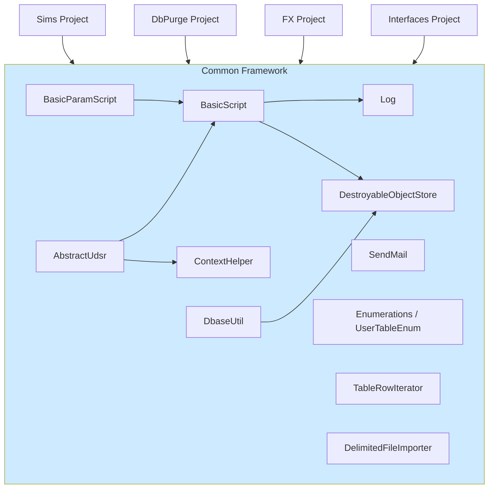
```mermaid
graph TD
    subgraph CommonFramework["Common Framework"]
        BasicScript["BasicScript"]
        BasicParamScript["BasicParamScript"]
        DOS["DestroyableObjectStore"]
        AbstractUdsr["AbstractUdsr"]
        ContextHelper["ContextHelper"]
        DbaseUtil["DbaseUtil"]
        Log["Log"]
        SendMail["SendMail"]
        Enums["Enumerations / UserTableEnum"]
        TRI["TableRowIterator"]
        DFI["DelimitedFileImporter"]
    end

    BasicParamScript --> BasicScript
    AbstractUdsr --> BasicScript
    BasicScript --> Log
    BasicScript --> DOS
    AbstractUdsr --> ContextHelper
    DbaseUtil --> DOS

    Sims["Sims Project"] --> CommonFramework
    DbPurge["DbPurge Project"] --> CommonFramework
    FX["FX Project"] --> CommonFramework
    Interfaces["Interfaces Project"] --> CommonFramework

    style CommonFramework fill:#cdeafe
```

---

## 2. 6.1 Projects of the Common Framework

The Common Framework itself is split across **three physical Endur/SVN projects**, each with a distinct governance rule.

### 6.1.1 CommonConfig

**Package:** `com.eon.eet.fenix.common`

> Project contains **customisable classes** used by the core Common project and also **configuration based classes** (such as reference data enums). The customisable classes cover such things as **alerting and constants repository**. This project will **not be shared by Fenix and GO** and can be customised to requirements. However it contains **mandatory classes required by the Common project**.

| Property | Value |
|---|---|
| Shared between Fenix & GO? | ❌ No |
| Customisable? | ✅ Yes |
| Contains mandatory classes? | ✅ Yes (required by `Common`) |
| Typical contents | Alerting config, Constants Repository access, reference-data enums |

### 6.1.2 Common

**Package:** `com.eon.eet.fenix.common`

> Project contains the **core of the common framework** which is **shared between Fenix and GO**. Classes in here must **NOT use any licensed third party libraries** e.g. OLI_Lib. The use of **open source libraries is acceptable**. The code **must remain compatible** between both Fenix and GO.

| Property | Value |
|---|---|
| Shared between Fenix & GO? | ✅ Yes — this is the whole point of the project |
| Licensed 3rd-party libraries allowed? | ❌ Strictly forbidden |
| Open-source libraries allowed? | ✅ Yes |
| Compatibility requirement | Must work identically for both Fenix and GO |

### 6.1.3 CommonExtension

**Packages:** `com.eon.eet.fenix.common`, `com.eon.eet.fenix.shared`

> Project contains classes that are **specific to Fenix or GO**. This project will **not be shared** by Fenix and GO. Classes here can **extend the core common framework functionality** for Fenix or GO specific requirements. It also contains classes that need to be **shared between 2 or more projects** but are **not considered common functionality** for the whole.

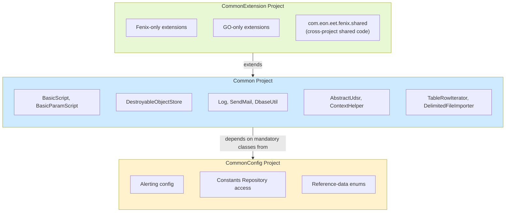
```mermaid
graph TD
    subgraph CommonConfigP["CommonConfig Project"]
        direction TB
        CC1["Alerting config"]
        CC2["Constants Repository access"]
        CC3["Reference-data enums"]
    end
    subgraph CommonP["Common Project"]
        direction TB
        C1["BasicScript, BasicParamScript"]
        C2["DestroyableObjectStore"]
        C3["Log, SendMail, DbaseUtil"]
        C4["AbstractUdsr, ContextHelper"]
        C5["TableRowIterator, DelimitedFileImporter"]
    end
    subgraph CommonExtP["CommonExtension Project"]
        direction TB
        CE1["Fenix-only extensions"]
        CE2["GO-only extensions"]
        CE3["com.eon.eet.fenix.shared<br/>(cross-project shared code)"]
    end

    CommonP -->|depends on mandatory classes from| CommonConfigP
    CommonExtP -->|extends| CommonP

    style CommonConfigP fill:#fff2cc
    style CommonP fill:#cdeafe
    style CommonExtP fill:#e8f7d4
```

### Decision Table: Where Does New Framework Code Go?

| If the code is... | Put it in... |
|---|---|
| Core logic shared identically by Fenix **and** GO, no licensed 3rd-party libs | `Common` |
| Configuration/alerting/constants-repository/enum code, customisable per implementation | `CommonConfig` |
| An extension of the framework specific to only Fenix **or** only GO | `CommonExtension` |
| Code that must be shared across 2+ business projects but isn't "core framework" | `CommonExtension` → `com.eon.eet.fenix.shared` |

---

## 3. 6.2 BasicScript Class

**Package:** `com.eon.eet.fenix.common.script`

### Role

`BasicScript` is the **abstract class that all plug-ins acting as a main script must extend**. It is the class that actually implements `IScript` (see the OpenJVS Architecture instruction file) and gives every plug-in its standard behavior.

> The BasicScript class implements the Openlink Endur interface **IScript**... and provides the implementation of the **`execute(IContainerContext context)`** method. This method is defined as **final** so as it cannot be overridden by subclasses. Instead it provides an **abstract method** named **`execute(Table argt, Table returnt)`** to be implemented by subclasses of this class.

### The Four Built-in Behaviors

`BasicScript`'s implementation of `execute(IContainerContext context)` provides:

1. **Logging of a script starting message.**
2. **Clean handling of any exceptions** that propagate up — logging the exception, sending an alert via the **Alert Broker** if necessary, and a clean exit.
3. **Destroying of any objects** created/stored using `DestroyableObjectStore` (see Section 5 below).
4. **Logging of a script ending message.**

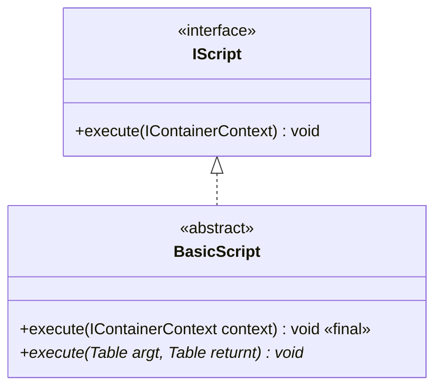
```mermaid
classDiagram
    class IScript {
        <<interface>>
        +execute(IContainerContext) void
    }
    class BasicScript {
        <<abstract>>
        +execute(IContainerContext context) void  «final»
        +execute(Table argt, Table returnt) void*
    }
    IScript <|.. BasicScript
```

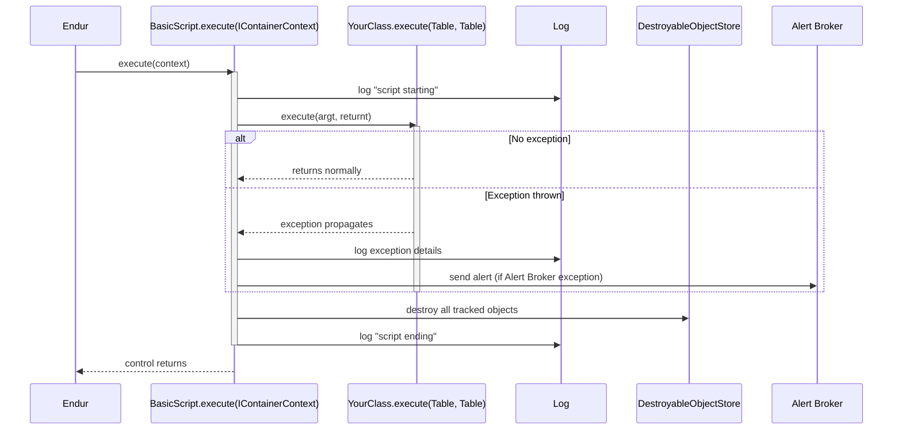
```mermaid
sequenceDiagram
    participant Endur
    participant BS as BasicScript.execute(IContainerContext)
    participant Sub as YourClass.execute(Table, Table)
    participant Log
    participant DOS as DestroyableObjectStore
    participant Alert as Alert Broker

    Endur->>BS: execute(context)
    activate BS
    BS->>Log: log "script starting"
    BS->>Sub: execute(argt, returnt)
    activate Sub
    alt No exception
        Sub-->>BS: returns normally
    else Exception thrown
        Sub-->>BS: exception propagates
        BS->>Log: log exception details
        BS->>Alert: send alert (if Alert Broker exception)
    end
    deactivate Sub
    BS->>DOS: destroy all tracked objects
    BS->>Log: log "script ending"
    deactivate BS
    BS-->>Endur: control returns
```

### Why This Matters

Because `execute(IContainerContext context)` is **final**, no subclass can accidentally skip the logging/exception/cleanup wrapper — it is architecturally guaranteed for every plug-in that correctly extends `BasicScript`.

---

## 4. 6.3 BasicParamScript Class

**Package:** `com.eon.eet.fenix.common.script`

### Role

`BasicParamScript` **extends `BasicScript`** and must be extended by **all plug-ins acting as a parameter script**.

> The BasicParamScript provides the implementation of the **`execute(Table argt, Table returnt)`** method. This method is defined as **final**... Instead it provides two abstract methods, one named **`getUserSelection(Table argt)`** and the other named **`getWorkflowValues(Table argt)`**.

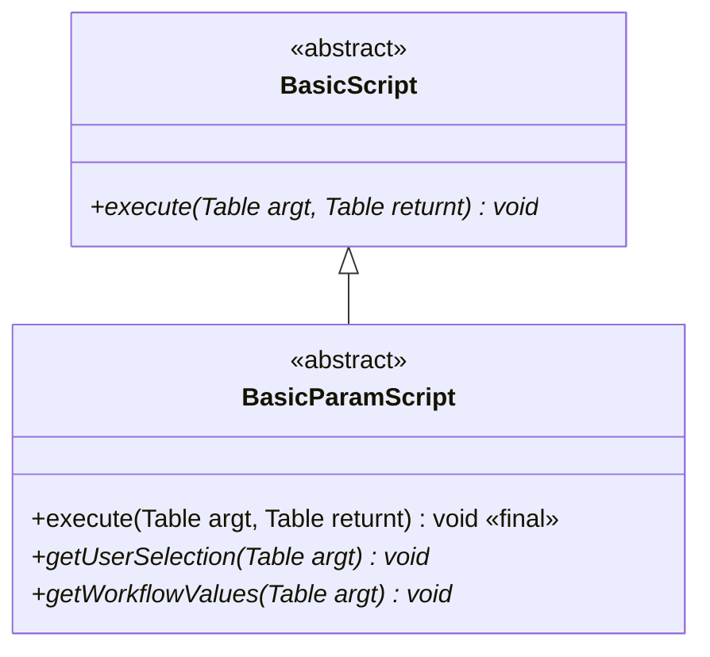
```mermaid
classDiagram
    class BasicScript {
        <<abstract>>
        +execute(Table argt, Table returnt) void*
    }
    class BasicParamScript {
        <<abstract>>
        +execute(Table argt, Table returnt) void  «final»
        +getUserSelection(Table argt) void*
        +getWorkflowValues(Table argt) void*
    }
    BasicScript <|-- BasicParamScript
```

### The Two Abstract Methods

| Method | When Called | Purpose |
|---|---|---|
| **`getUserSelection(Table argt)`** | When the parameter plug-in runs **outside** the workflow (ad-hoc) | Lets the **user** pick parameter values via the **Ask API**. If the user cancels, the script must throw a `RuntimeException` stating the task was cancelled — `BasicParamScript` handles this cleanly. |
| **`getWorkflowValues(Table argt)`** | When the parameter plug-in runs **inside** the workflow | Sets up **default parameter values without user intervention** — because there's no one to ask in an automated workflow. |

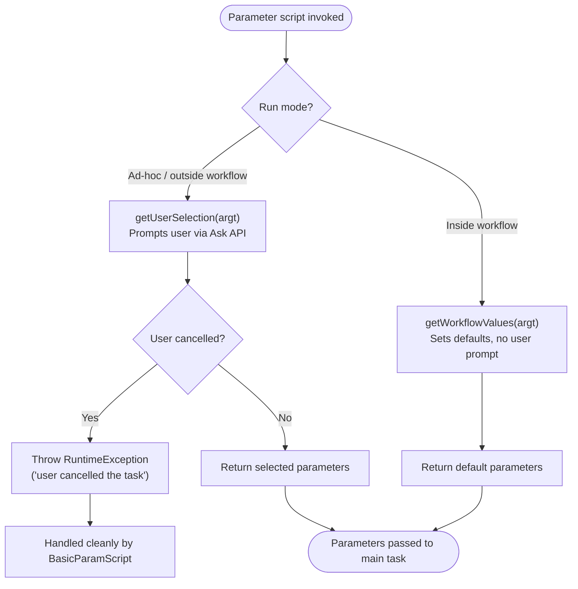
```mermaid
flowchart TD
    Start(["Parameter script invoked"]) --> Q{"Run mode?"}
    Q -- "Ad-hoc / outside workflow" --> A["getUserSelection(argt)<br/>Prompts user via Ask API"]
    Q -- "Inside workflow" --> B["getWorkflowValues(argt)<br/>Sets defaults, no user prompt"]
    A --> C{"User cancelled?"}
    C -- Yes --> D["Throw RuntimeException<br/>('user cancelled the task')"]
    C -- No --> E["Return selected parameters"]
    B --> F["Return default parameters"]
    D --> G["Handled cleanly by BasicParamScript"]
    E --> H(["Parameters passed to main task"])
    F --> H
```

### Coding Rule (cross-referenced from Section 8.3)

- Class name must end with **`Param`**.
- If not designed to run in the workflow, `getWorkflowValues` should throw a `FenixRuntimeException`.
- If not designed to run ad-hoc, `getUserSelection` should throw a `FenixRuntimeException`.

---

## 5. 6.4 DestroyableObjectStore Class

**Package:** `com.eon.eet.fenix.common`

### Role

Manages any OpenJVS class that inherits from **`IntPtr`** (native-memory-backed classes like `Table`, `Transaction`, `ODateTime`-related helpers, etc. — see the OpenJVS Architecture instruction file). Objects created/stored here are **registered against the currently running script and thread**. When the script terminates, everything it registered is **destroyed automatically** — but **only if the script inherits from `BasicScript`**.

> Use of this class frees up the developer from having to worry about destroying such objects as **Tables, Transactions, ODateTime** etc.

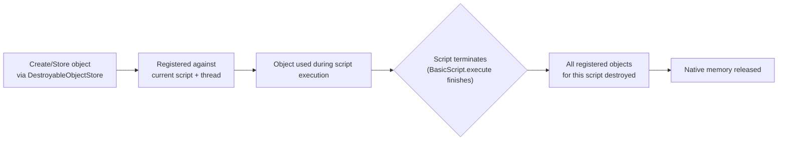
```mermaid
flowchart LR
    Create["Create/Store object<br/>via DestroyableObjectStore"] --> Registry["Registered against<br/>current script + thread"]
    Registry --> Use["Object used during script execution"]
    Use --> Terminate{"Script terminates<br/>(BasicScript.execute finishes)"}
    Terminate --> Destroy["All registered objects<br/>for this script destroyed"]
    Destroy --> Free["Native memory released"]
```

### Core API Patterns (from the guide)

| Operation | Example |
|---|---|
| **Create a table** | `Table portfolios = DestroyableObjectStore.tableNew();` |
| **Store a table created elsewhere** | `Table refInfo = Ref.getInfo(); DestroyableObjectStore.store(refInfo);` |
| **Retrieve a transaction** | `Transaction tran = DestroyableObjectStore.retrieveTransaction(tranNum);` |
| **Remove (destroy) an object early** | `ODateTime now = DestroyableObjectStore.dtNew(); ... DestroyableObjectStore.remove(now);` |
| **Store a query id** (also cleared on termination) | `int queryId = Query.tableQueryInsert(indexList, 1); DestroyableObjectStore.store(queryId);` |

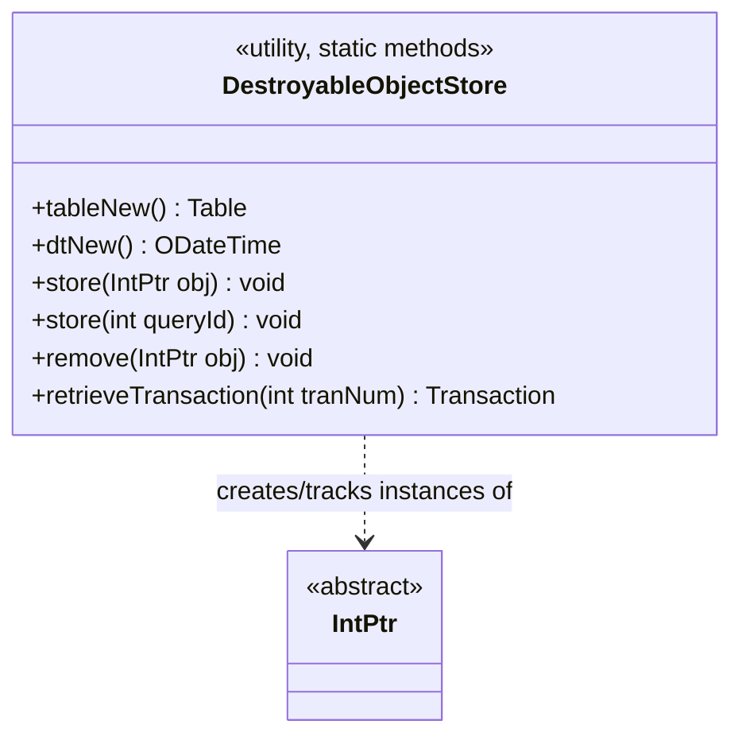
```mermaid
classDiagram
    class DestroyableObjectStore {
        <<utility, static methods>>
        +tableNew() Table
        +dtNew() ODateTime
        +store(IntPtr obj) void
        +store(int queryId) void
        +remove(IntPtr obj) void
        +retrieveTransaction(int tranNum) Transaction
    }
    class IntPtr {
        <<abstract>>
    }
    DestroyableObjectStore ..> IntPtr : creates/tracks instances of
```

### Golden Rule

> Therefore it is important that scripts **inherit from BasicScript** and use the **DestroyableObjectStore** to manage `IntPtr` objects.

If a class does **not** extend `BasicScript`, `DestroyableObjectStore` has no script-termination hook to trigger cleanup — so this pattern only works end-to-end when the whole plug-in hierarchy is followed correctly.

---

## 6. 6.5 AbstractUdsr Class

**Package:** `com.eon.eet.fenix.common.udsr`

### Role

`AbstractUdsr` **extends `BasicScript`** and must be extended by **all plug-ins acting as a UDSR** (User Defined Simulation Result).

> The AbstractUdsr class provides the implementation of the `execute(Table argt, Table returnt)` method. This method is defined as **final**... Instead it provides a number of **abstract and default methods** that support the various operations of a UDSR.

### UDSR Operations Table

| UDSR Operation | `AbstractUdsr` Method Called | Abstract or Default? |
|---|---|---|
| Calculate | `calculate(ContextHelper context)` | Abstract |
| Format | `format(ContextHelper context)` | Abstract |
| Aggregate | `aggregate(ContextHelper context)` | **Default** (has built-in behavior) |
| Finalize Aggregate | `finalizeAggregate(ContextHelper context)` | Abstract |
| DW Extract | `dwExtract(ContextHelper context)` | **Default** (has built-in behavior) |

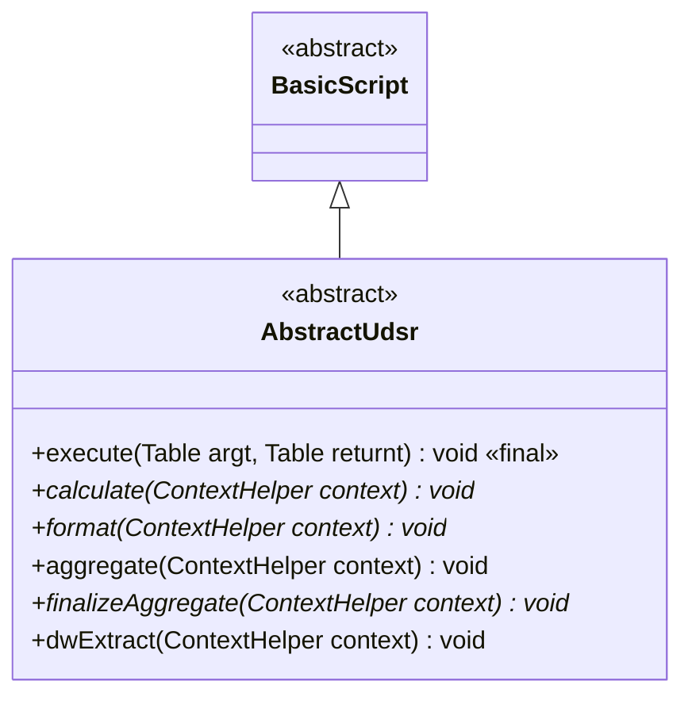
```mermaid
classDiagram
    class BasicScript {
        <<abstract>>
    }
    class AbstractUdsr {
        <<abstract>>
        +execute(Table argt, Table returnt) void  «final»
        +calculate(ContextHelper context) void*
        +format(ContextHelper context) void*
        +aggregate(ContextHelper context) void
        +finalizeAggregate(ContextHelper context) void*
        +dwExtract(ContextHelper context) void
    }
    BasicScript <|-- AbstractUdsr
```

### Default Behavior Details

- **`dwExtract`** (non-abstract, default behavior): saves **all columns** of a result set into the **data warehouse table** configured in the UDSR's Admin Manager setup. It automatically adds `extraction_id` and `result_type` columns before saving.
- **`aggregate`** (non-abstract, default behavior): by default **combines results distributed over a grid** into a single result set.

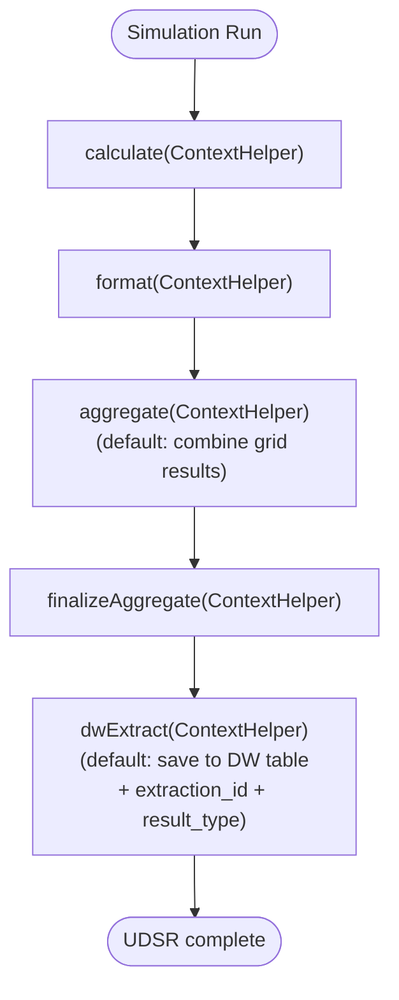
```mermaid
flowchart TD
    Sim(["Simulation Run"]) --> Calc["calculate(ContextHelper)"]
    Calc --> Fmt["format(ContextHelper)"]
    Fmt --> Agg["aggregate(ContextHelper)<br/>(default: combine grid results)"]
    Agg --> FinAgg["finalizeAggregate(ContextHelper)"]
    FinAgg --> DW["dwExtract(ContextHelper)<br/>(default: save to DW table<br/>+ extraction_id + result_type)"]
    DW --> Done(["UDSR complete"])
```

### Coding Rule (cross-referenced from Section 8.5)

- Package: `com.eon.eet.fenix.sims.udsr`.
- Class name must start with **`Udsr`**.
- Always provide result-set formatting in the `format` method.

---

## 7. 6.6 ContextHelper Class

**Package:** `com.eon.eet.fenix.common.udsr`

### Role

> The `ContextHelper` class provides **easy access to the various result sets produced as part of a simulation run**. It is provided as an argument to the methods of the `AbstractUdsr` class.

> The class provides many methods for retrieving **general results, transaction results, leg results, simulation definition** etc.

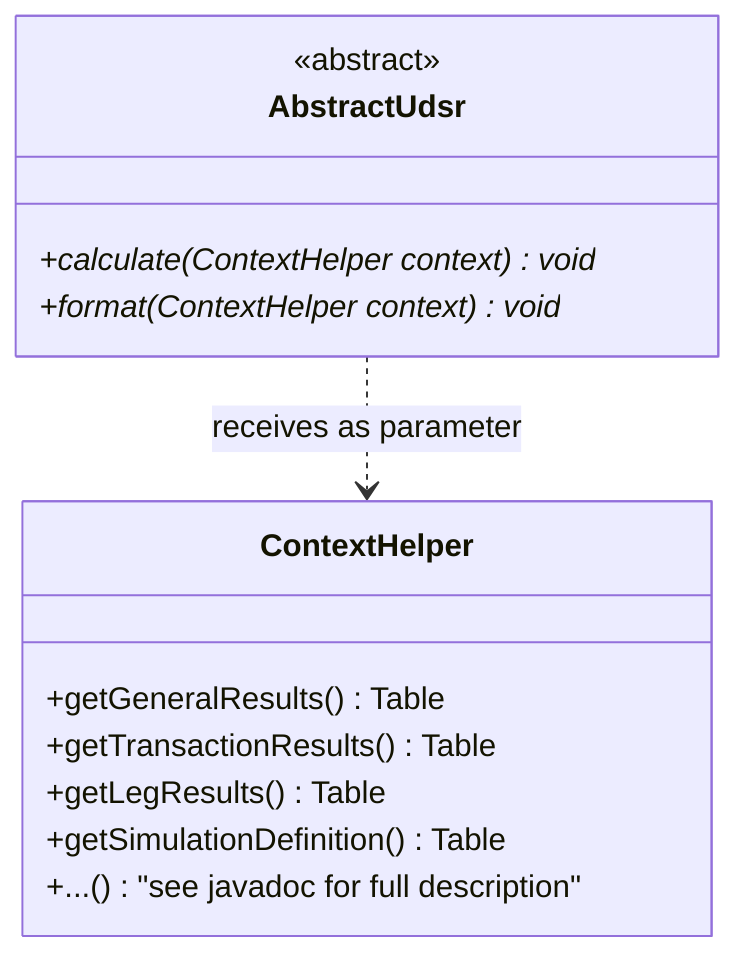
```mermaid
classDiagram
    class ContextHelper {
        +getGeneralResults() Table
        +getTransactionResults() Table
        +getLegResults() Table
        +getSimulationDefinition() Table
        +...() "see javadoc for full description"
    }
    class AbstractUdsr {
        <<abstract>>
        +calculate(ContextHelper context) void*
        +format(ContextHelper context) void*
    }
    AbstractUdsr ..> ContextHelper : receives as parameter
```

`ContextHelper` is essentially the **"argt/returnt equivalent" for UDSRs** — just as `IContainerContext` gives a main script access to `argt`/`returnt`, `ContextHelper` gives a UDSR access to all the simulation result sets it needs.

---

## 8. 6.7 DbaseUtil Class

**Package:** `com.eon.eet.fenix.common.dbase`

### Role

> The `DbaseUtil` class provides useful methods for **direct database access**. All the methods in this class have **relevant exception handling**. All tables created by this class are also **stored in the `DestroyableObjectStore`**.

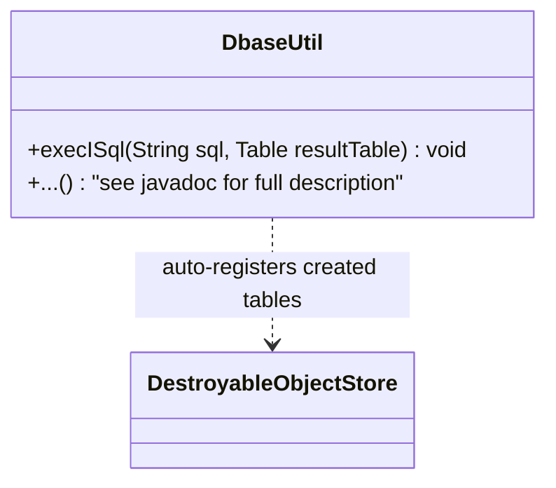
```mermaid
classDiagram
    class DbaseUtil {
        +execISql(String sql, Table resultTable) void
        +...() "see javadoc for full description"
    }
    class DestroyableObjectStore
    DbaseUtil ..> DestroyableObjectStore : auto-registers created tables
```

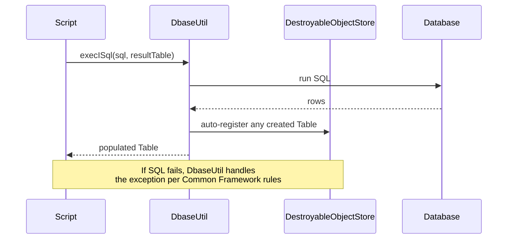
```mermaid
sequenceDiagram
    participant Script
    participant DbaseUtil
    participant DOS as DestroyableObjectStore
    participant DB as Database

    Script->>DbaseUtil: execISql(sql, resultTable)
    DbaseUtil->>DB: run SQL
    DB-->>DbaseUtil: rows
    DbaseUtil->>DOS: auto-register any created Table
    DbaseUtil-->>Script: populated Table
    Note over Script,DOS: If SQL fails, DbaseUtil handles<br/>the exception per Common Framework rules
```

**Practical benefit:** you never need to manually wrap a `DbaseUtil` call in a `DestroyableObjectStore.store(...)` call for the table it returns — that bookkeeping is done for you.

---

## 9. 6.8 Log Class

**Package:** `com.eon.eet.fenix.common.logging`

### Role

The `Log` class is the **basis for all logging** in OpenJVS. The guide points to the dedicated **Logging** section (Section 8.9/8.10 of the full guide) for full details, but the key architectural facts relevant here are:

| Fact | Detail |
|---|---|
| Base class | `AbstractLog` defines `debug/info/warning/error(String message)` as abstract methods |
| `Log` class | Inherits `AbstractLog`, overrides the four methods, adds more, and writes via a **Log Writer** (`FileLogWriter`, `OConsoleLogWriter`, `NtEventLogWriter`, `FileTaskNameLogWriter`, `SuppressLogWriter`) |
| Built into `BasicScript` | `BasicScript` has a `Log` instance built in with convenience methods — plugins extending `BasicScript` should use those, **not** instantiate their own `Log` |
| Non-`BasicScript` classes | May create their own `new Log()` instance, but it must **NEVER be declared static** |

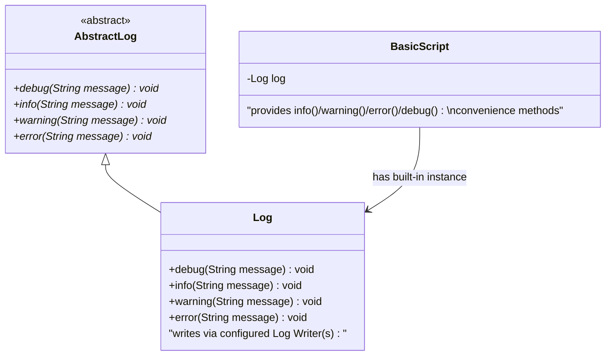
```mermaid
classDiagram
    class AbstractLog {
        <<abstract>>
        +debug(String message) void*
        +info(String message) void*
        +warning(String message) void*
        +error(String message) void*
    }
    class Log {
        +debug(String message) void
        +info(String message) void
        +warning(String message) void
        +error(String message) void
        "writes via configured Log Writer(s)"
    }
    class BasicScript {
        -Log log
        "provides info()/warning()/error()/debug()\nconvenience methods"
    }
    AbstractLog <|-- Log
    BasicScript --> Log : has built-in instance
```

> See the **Logging** instruction/section for full detail on log writers, Constants Repository configuration, and logging levels.

---

## 10. 6.9 SendMail Class

**Package:** `com.eon.eet.fenix.common.mail`

### Role

Provides the ability to **send emails out of a Java plug-in**. The guide's full "Sending E-Mail" section (8.12) is referenced here; the key architectural points:

| Fact | Detail |
|---|---|
| Primary transport | **JavaMail API** via SMTP server |
| Fallback transport | If SMTP is unavailable, sends an **XML email request via Connex** to the **GO Glassfish J2EE server**, which sends the email on Fenix's behalf |
| Configuration | SMTP server, from-address, and Connex cluster configured via **Constants Repository** context `'eMail'` |
| Recipient resolution | Category-based — addresses defined in user table **`user_email_configuration`**, not hard-coded |
| Environment safety | `user_email_configuration` has a **`dbname`** column so dev/test/UAT never accidentally emails production addresses |
| Method | `sendMail(String category, String subject, String message)` |

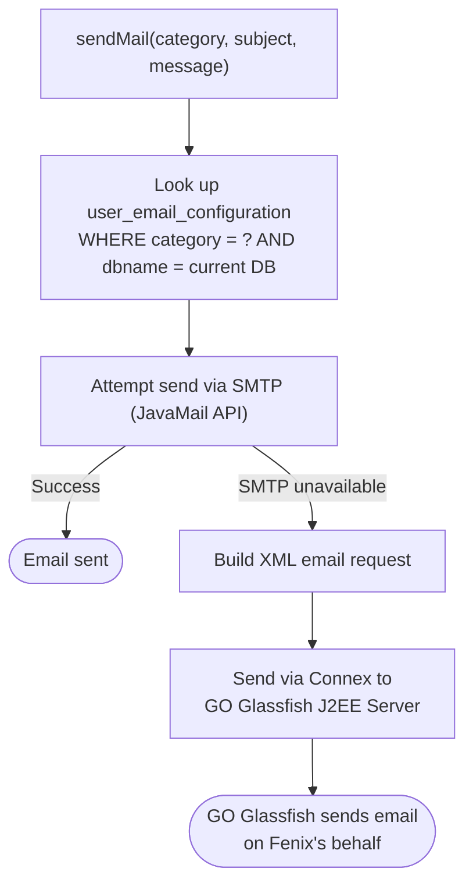
```mermaid
flowchart TD
    Call["sendMail(category, subject, message)"] --> Lookup["Look up user_email_configuration<br/>WHERE category = ? AND dbname = current DB"]
    Lookup --> Try["Attempt send via SMTP (JavaMail API)"]
    Try -->|Success| Done(["Email sent"])
    Try -->|SMTP unavailable| Fallback["Build XML email request"]
    Fallback --> Connex["Send via Connex to<br/>GO Glassfish J2EE Server"]
    Connex --> Done2(["GO Glassfish sends email<br/>on Fenix's behalf"])
```

See [Section 5.4's IContainerContext instruction file / Common Framework] and the dedicated "Sending E-Mail" instructions for full detail if the topic recurs elsewhere.

---

## 11. 6.10 Enumerations

**Package:** `com.eon.eet.fenix.common.ref`

### Role

> **EET specific enumerations** relating to **static reference data** should be created within this package. Enumeration class names must follow the EET standards as set out in the **EET OpenJVS Coding Standards Guide**.

### `UserTableEnum.java`

**Package:** `com.eon.eet.fenix.common.table`

> This enumeration class contains a **list of EET user tables**. The enumeration should be used when **referencing a user table** within a JVS plug-in.

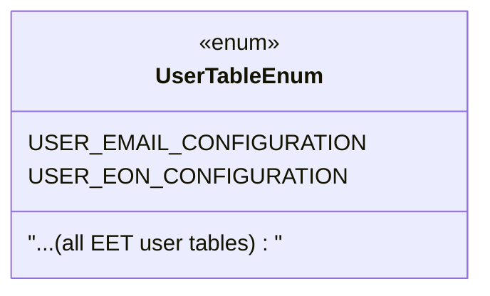
```mermaid
classDiagram
    class UserTableEnum {
        <<enum>>
        USER_EMAIL_CONFIGURATION
        USER_EON_CONFIGURATION
        "... (all EET user tables)"
    }
```

**Why this matters:** hard-coding a user table name as a raw string (e.g., `"user_email_configuration"`) throughout the codebase is fragile — a typo or a table rename breaks things silently. Referencing `UserTableEnum.USER_EMAIL_CONFIGURATION` instead centralizes the table name and lets the compiler catch mistakes.

---

## 12. 6.11 TableRowIterator

**Package:** `com.eon.eet.fenix.common.table`

### Role

Provides an **alternative way to iterate through all the rows of a table**, usable directly in a `for` loop, without first calling `getNumRows()`.

### Before / After Comparison

**Without `TableRowIterator`:**
```java
int rowCount = table1.getNumRows();
for (int row = 1; row <= rowCount; row++) {
    int value = table1.getInt("value", row);
}
```

**With `TableRowIterator`:**
```java
for (int row : new TableRowIterator(table1)) {
    int value = table1.getInt("value", row);
}
```

### Direction Control

Iteration can go **forwards** (default) or **backwards**:

```java
new TableRowIterator(table1, DIRECTION.BACKWARDS);
new TableRowIterator(table1, DIRECTION.FORWARDS);
```

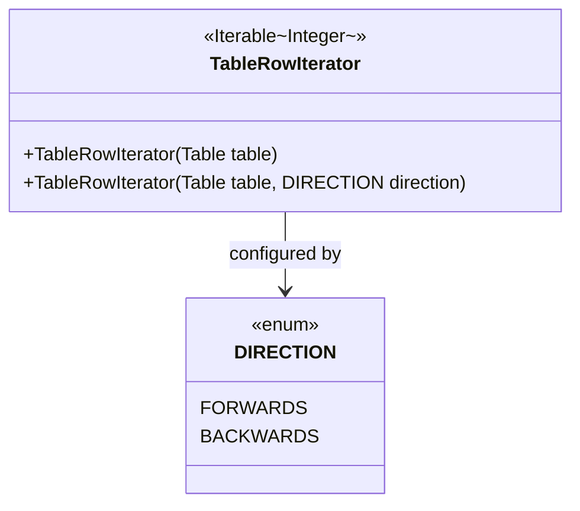
```mermaid
classDiagram
    class TableRowIterator {
        <<Iterable~Integer~>>
        +TableRowIterator(Table table)
        +TableRowIterator(Table table, DIRECTION direction)
    }
    class DIRECTION {
        <<enum>>
        FORWARDS
        BACKWARDS
    }
    TableRowIterator --> DIRECTION : configured by
```

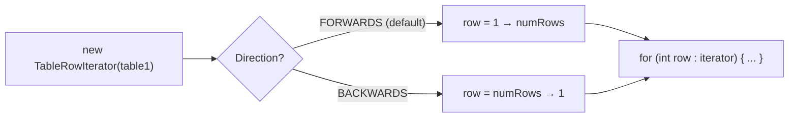
```mermaid
flowchart LR
    A["new TableRowIterator(table1)"] --> B{"Direction?"}
    B -- "FORWARDS (default)" --> C["row = 1 → numRows"]
    B -- "BACKWARDS" --> D["row = numRows → 1"]
    C --> E["for (int row : iterator) { ... }"]
    D --> E
```

---

## 13. 6.12 DelimitedFileImporter

**Package:** `com.eon.eet.fenix.common.file`

### Role

> Provides functionality to import CSV files into a memory table easily. A **single line of code plus an xml definition file** is all that is needed to import a CSV file. The class will provide **validation and error handling** for the import.

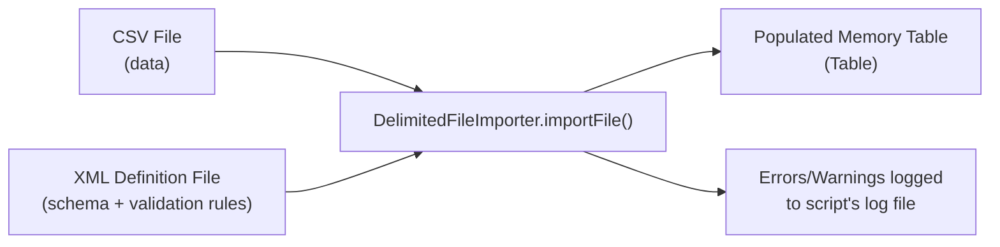
```mermaid
flowchart LR
    CSV["CSV File<br/>(data)"] --> Importer["DelimitedFileImporter.importFile()"]
    XMLDef["XML Definition File<br/>(schema + validation rules)"] --> Importer
    Importer --> MemTable["Populated Memory Table<br/>(Table)"]
    Importer --> LogFile["Errors/Warnings logged<br/>to script's log file"]
```

### 13.1 The XML File Elements

The XML definition describes the CSV's columns, types, and (optionally) validation rules.

#### Top-Level `<file>` Element Attributes

| Attribute | Meaning |
|---|---|
| `noNamespaceSchemaLocation` | The XSD schema reference — must be specified exactly as documented |
| `xmlns:xsi` | The XML schema instance namespace — must be specified exactly as documented |
| `validation_error` (`continue` \| `fail`) | **`continue`**: log an error message and keep processing. **`fail`**: throw an exception on the first validation error. |
| `header` | Number of header rows in the CSV file to skip |
| `delimiter` | The delimiter character used in the file (default: comma) |

#### `<col>` Element Attributes (one per CSV column, **must be in file order**)

| Attribute | Meaning |
|---|---|
| `name` | Column name |
| `type` | One of `integer`, `double`, `string`, `date_string`, `date_julian` |
| `format` | Input date format (Java `SimpleDateFormat` pattern) — for date columns |
| `formatOut` | For `date_string` type only — reformats the date string stored in the memory table |
| `min` | Integer/double: minimum value. String: minimum length. |
| `max` | Integer/double: maximum value. String: maximum length. |

#### Nested Elements

| Element | Meaning |
|---|---|
| `<value>` | Nested inside `<col>` — defines the **allow-list of valid values** for that column |
| `<replace>` | Nested inside `<col>` — defines **value substitution** rules (e.g., replace `"BUY"` with `"0"`) during import |

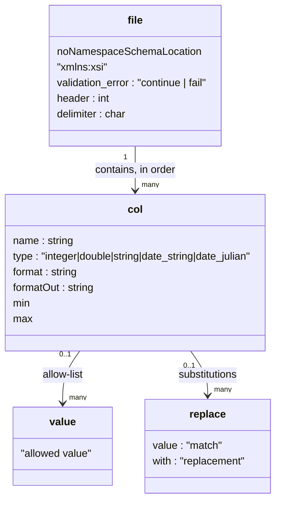
```mermaid
classDiagram
    class file {
        noNamespaceSchemaLocation
        "xmlns:xsi"
        validation_error : "continue | fail"
        header : int
        delimiter : char
    }
    class col {
        name : string
        type : "integer|double|string|date_string|date_julian"
        format : string
        formatOut : string
        min
        max
    }
    class value {
        "allowed value"
    }
    class replace {
        value : "match"
        with : "replacement"
    }
    file "1" --> "many" col : contains, in order
    col "0..1" --> "many" value : allow-list
    col "0..1" --> "many" replace : substitutions
```

#### Example (from the guide's XML sample)

```xml
<?xml version="1.0" encoding="UTF-8"?>
<file xsi:noNamespaceSchemaLocation="delimited_file_import.xsd"
      xmlns:xsi="http://www.w3.org/2001/XMLSchema-instance"
      validation_error="continue" header="1" delimiter=",">
    <col name="HDR" type="string" />
    <col name="VOL" type="string" />
    <col name="value_set" type="string" min="1" max="5" />
    <col name="trade_date" type="date_julian" format="dd-MMM-yyyy" />
    <col name="settle_date" type="date_string" format="dd-MMM-yyyy" formatOut="dd-MMM-yy" />
    <col name="modified_flag" type="integer" min="0" max="1" />
    <col name="ins_type" type="string">
        <value>PWR-SWAP</value>
        <value>COMM-CO2</value>
        <value>COMM-ELCERT</value>
    </col>
    <col name="buy_sell_1" type="string">
        <replace value="BUY" with="B" />
        <replace value="SELL" with="S" />
    </col>
    <col name="buy_sell_3" type="integer">
        <value>BUY</value>
        <value>SELL</value>
        <replace value="BUY" with="0" />
        <replace value="SELL" with="1" />
    </col>
</file>
```

This single example demonstrates: string min/max length, julian-date parsing, string-date reformatting, integer min/max, an allow-list, a simple value replacement, and a **combined** allow-list + replacement (validate the incoming string matches an allowed value, *then* store it as a replaced integer).

### 13.2 How to Import a Delimited File

#### Step 1 — Create the XML Definition File

Author the XML file as described above.

#### Step 2 — Import the Definition File into Endur

> The xml definition file must be imported into the **`/User/Import File Definitions`** directory using the **Endur Directory Browser**.

#### Step 3 — Call the Import Method from Code

```java
Table csvFile = new DelimitedFileImporter.importFile(
    String filename, String definitionFilename);
```

| Parameter | Meaning |
|---|---|
| `filename` | Full path to the CSV file being imported |
| `definitionFilename` | Name of the definition file saved in the Endur user directory (`/User/Import File Definitions`) |

```mermaid
sequenceDiagram
    participant Dev as Developer
    participant DirBrowser as Endur Directory Browser
    participant Script as OpenJVS Script
    participant Importer as DelimitedFileImporter
    participant CSV as CSV File
    participant Log

    Dev->>DirBrowser: Import XML definition file into<br/>/User/Import File Definitions
    Script->>Importer: importFile(filename, definitionFilename)
    Importer->>CSV: read rows per XML definition
    loop for each CSV row
        Importer->>Importer: validate column values
        alt validation fails AND validation_error="continue"
            Importer->>Log: log error, skip/continue row
        else validation fails AND validation_error="fail"
            Importer-->>Script: throw exception (abort import)
        else validation passes
            Importer->>Importer: append row to memory table<br/>(applying replace rules)
        end
    end
    Importer-->>Script: return populated Table
```

#### Validation Behavior Summary

| `validation_error` setting | Behavior on a bad row |
|---|---|
| `continue` | Error/warning **logged into the script's log file**; import continues with the next line |
| `fail` | Method **throws an exception** on the very first validation error encountered, aborting the import |

---

## 14. End-to-End Class Map

Putting the whole Common Framework together as one picture:

```mermaid
classDiagram
    class IScript {
        <<interface>>
        +execute(IContainerContext) void
    }
    class BasicScript {
        <<abstract>>
        -Log log
        +execute(IContainerContext) void «final»
        +execute(Table argt, Table returnt) void*
    }
    class BasicParamScript {
        <<abstract>>
        +execute(Table argt, Table returnt) void «final»
        +getUserSelection(Table) void*
        +getWorkflowValues(Table) void*
    }
    class AbstractUdsr {
        <<abstract>>
        +execute(Table argt, Table returnt) void «final»
        +calculate(ContextHelper) void*
        +format(ContextHelper) void*
        +aggregate(ContextHelper) void
        +dwExtract(ContextHelper) void
    }
    class ContextHelper {
        +getGeneralResults() Table
        +getTransactionResults() Table
    }
    class DestroyableObjectStore {
        +tableNew() Table
        +store(IntPtr) void
        +remove(IntPtr) void
    }
    class DbaseUtil {
        +execISql(String, Table) void
    }
    class Log {
        +info(String) void
        +error(String) void
    }
    class SendMail {
        +sendMail(String, String, String) void
    }
    class TableRowIterator {
        +TableRowIterator(Table)
    }
    class DelimitedFileImporter {
        +importFile(String, String) Table
    }
    class UserTableEnum {
        <<enum>>
    }

    IScript <|.. BasicScript
    BasicScript <|-- BasicParamScript
    BasicScript <|-- AbstractUdsr
    AbstractUdsr ..> ContextHelper
    BasicScript --> Log
    BasicScript --> DestroyableObjectStore
    DbaseUtil --> DestroyableObjectStore
    DelimitedFileImporter --> DestroyableObjectStore
    DelimitedFileImporter --> Log
```

---

## 15. Practical Checklist for Developers

- [ ] **Identify which of the three projects** (`CommonConfig`, `Common`, `CommonExtension`) new framework code belongs in, using the [decision table](#decision-table-where-does-new-framework-code-go).
- [ ] **Never implement `IScript` directly** — extend `BasicScript`, `BasicParamScript`, or `AbstractUdsr` as appropriate.
- [ ] **Use `DestroyableObjectStore`** for every `IntPtr`-derived object (`Table`, `Transaction`, `ODateTime`, etc.) instead of managing native memory manually.
- [ ] **Use the `Log` convenience methods already built into `BasicScript`** — don't instantiate a new `Log` in a `BasicScript` subclass, and never declare a standalone `Log` instance `static`.
- [ ] **Use `DbaseUtil`** for direct database access instead of raw JDBC/SQL handling — it already integrates with `DestroyableObjectStore` and has exception handling.
- [ ] **Use `SendMail.sendMail(category, subject, message)`** and configure recipients via `user_email_configuration` — never hard-code email addresses.
- [ ] **Reference `UserTableEnum`** instead of hard-coded table name strings.
- [ ] **Use `TableRowIterator`** instead of manual `getNumRows()` loops for cleaner, more readable code.
- [ ] **Use `DelimitedFileImporter` + an XML definition file** for any CSV import — don't hand-roll CSV parsing/validation.
- [ ] **For UDSR plug-ins**, extend `AbstractUdsr`, implement `calculate`/`format`/`finalizeAggregate`, and rely on the default `aggregate`/`dwExtract` unless a custom behavior is genuinely required.

---

## Related Sections (Full Programming Guide)

- Section 5 — OpenJVS Architecture (`IScript`, `IContainerContext`, `IntPtr`, JNI — the foundation this framework builds on)
- Section 7 — The CommonExtension Project Shared Package (governance rule: only reference Common Framework / OLF standard projects)
- Section 8 — Developing OpenJVS Plugins (naming conventions per plug-in type; Logging; Exception Handling; Sending E-Mail in full detail)
- Section 9 — Data Purging (built on top of `BasicScript` via `AbstractDbPurgeSet`)
