# The CommonExtension Project Shared Package — Full Reference Guide

> Source: Section 7 *"The CommonExtension Project Shared Package"* of the **Programming Guide for OpenJVS Development — EET Fenix Endur**. This instruction file expands that section into a complete, diagrammed reference explaining the project-reference governance rule and the `com.eon.eet.fenix.shared` escape hatch that makes it workable in practice.

---

## Table of Contents

1. [Overview: The Problem This Section Solves](#1-overview-the-problem-this-section-solves)
2. [The Core Governance Rule](#2-the-core-governance-rule)
3. [Why the Rule Exists](#3-why-the-rule-exists)
4. [The `com.eon.eet.fenix.shared` Escape Hatch](#4-the-comeoneetfenixshared-escape-hatch)
5. [Where `CommonExtension` Fits Among the Common Framework Projects](#5-where-commonextension-fits-among-the-common-framework-projects)
6. [Decision Flow: Can My Project Reference That Class?](#6-decision-flow-can-my-project-reference-that-class)
7. [Worked Examples](#7-worked-examples)
8. [Consequences of Breaking the Rule](#8-consequences-of-breaking-the-rule)
9. [Practical Checklist for Developers](#9-practical-checklist-for-developers)

---

## 1. Overview: The Problem This Section Solves

By the time a developer reaches Section 7 of the Programming Guide, two facts are already established:

1. **Section 4.3** defined a fixed catalog of business/feature OpenJVS projects (`Sims`, `DbPurge`, `FX`, `Interfaces`, `Recon`, `Reports`, `Tools`, `Tpm`, etc.).
2. **Section 6** defined the **Common Framework**, split across `CommonConfig`, `Common`, and `CommonExtension`.

A natural question arises: *what if `Sims` needs a helper class that `DbPurge` also happens to have written — can `Sims` just reference `DbPurge` directly?*

Section 7 answers this with a firm **"no"**, and then provides the sanctioned alternative.

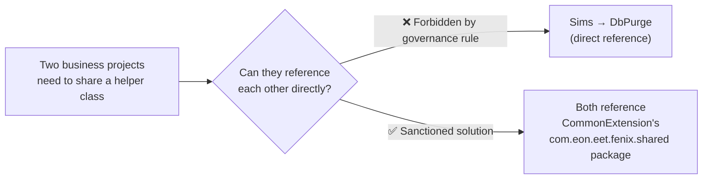

---

## 2. The Core Governance Rule

> **OpenJVS projects are only allowed to reference the core EGC Common framework projects or OLF standard projects.** It is **strictly forbidden** for EGC projects to reference other EGC projects other than the framework projects.

Breaking this into its precise components:

| Allowed to reference | Not allowed to reference |
|---|---|
| ✅ **Common** (core framework) | ❌ Any other **business/feature EGC project** (`Sims`, `DbPurge`, `FX`, `Interfaces`, `Recon`, `Reports`, `Tools`, `Tpm`, `OneOff`, `OpServices`, `Other`, `Prototyping`) |
| ✅ **CommonConfig** (framework config) | |
| ✅ **CommonExtension** (framework extensions + the shared package) | |
| ✅ **OLF Standard** projects (OpenLink's own standard libraries) | |

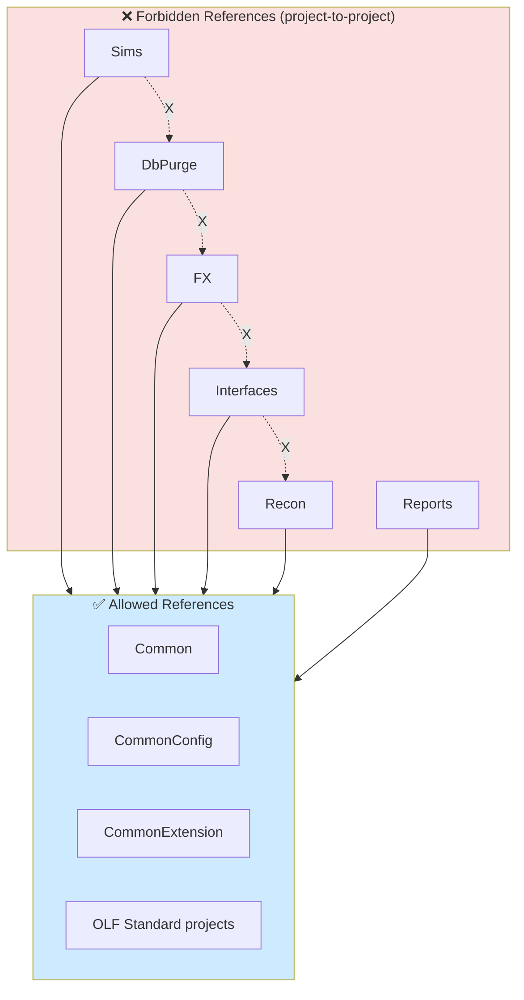

This is a stricter, more explicit restatement of the reference rule already implied in Sections 4.1 and 4.3 — Section 7 exists specifically to close the loophole of *business projects referencing each other*.

---

## 3. Why the Rule Exists

The guide gives a single, direct justification:

> This is because **inter-related projects make it more difficult to deploy code or remove any code that is no longer used**.

Unpacking this into concrete engineering consequences:

| Consequence of allowing cross-project references | Explanation |
|---|---|
| **Harder deployments** | If `Sims` depends on classes in `DbPurge`, then deploying/updating `DbPurge` risks breaking `Sims` — the two projects become coupled in their release timing, even though they represent unrelated business domains. |
| **Harder decommissioning** | If a project needs to be **retired or replaced**, every other project that quietly reached into it for a "borrowed" class now has a hidden dependency that must first be found and untangled. |
| **Unclear ownership** | A shared utility class living inside `DbPurge` (a purging-specific project) but being used by `FX` (a hedging project) confuses who "owns" that class and who is responsible for maintaining it. |
| **Dependency graph explosion** | Without this rule, the project dependency graph could grow into an uncontrolled web (`Sims → DbPurge → FX → Interfaces → ...`), instead of the clean **hub-and-spoke** shape the framework is designed to have. |

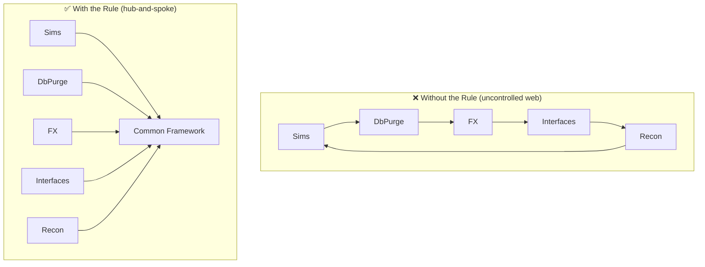

The **hub-and-spoke** shape on the right is what Section 7's rule enforces: every business project depends only on the framework hub, never on each other. This means any single business project can be deployed, changed, or removed **without any ripple effect** on the others.

---

## 4. The `com.eon.eet.fenix.shared` Escape Hatch

### The Problem With a Rule That's *Too* Strict

A pure "never reference another business project" rule is clean in theory, but the guide acknowledges reality:

> **There are situations however where it is necessary to share code between projects.**

If two business projects genuinely need the same helper logic, and cross-referencing each other is forbidden, where does that shared code go? Creating a whole new dedicated project for every such case would be excessive.

### The Solution

> With this in mind the **CommonExtension package `com.eon.eet.fenix.shared`** has been created. Classes located in this package and sub-packages can be **shared amongst projects** but **do not form part of the common framework**.

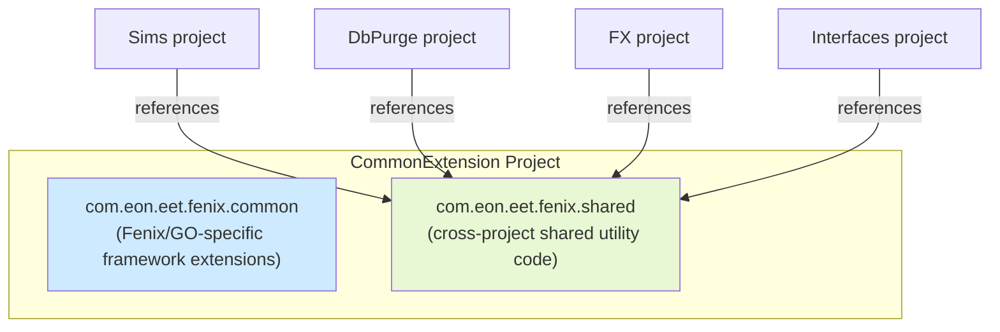

### Key Distinction: `com.eon.eet.fenix.shared` Is *Not* "Common Framework"

This is the subtle but important point of Section 7:

| | `Common` project classes | `com.eon.eet.fenix.shared` classes |
|---|---|---|
| Lives in project | `Common` | `CommonExtension` |
| Considered "Common Framework"? | ✅ Yes — core, foundational | ❌ No — explicitly **not** part of the common framework |
| Purpose | Universal plug-in infrastructure (logging, exception handling, base classes) used by essentially *everything* | Narrow, targeted code shared between **2 or more specific projects** that happen to need the same logic |
| Who should use it | All plug-in developers | Only the specific projects that need that particular shared utility |

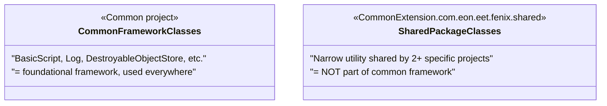

This distinction matters because it keeps the **`Common`** project's scope disciplined — it stays a small, stable, universally-applicable core — while still giving developers a legitimate place to put genuinely shared (but narrower) utility code, without resorting to forbidden project-to-project references.

---

## 5. Where `CommonExtension` Fits Among the Common Framework Projects

Recall from Section 6.1 of the Common Framework instruction set that `CommonExtension` already had a defined purpose:

> Project contains classes that are specific to Fenix or GO... It also contains classes that need to be **shared between 2 or more projects but are not considered common functionality for the whole**.

Section 7 is the detailed elaboration of that second half of the sentence — it names the exact package (`com.eon.eet.fenix.shared`) where this sharing happens.

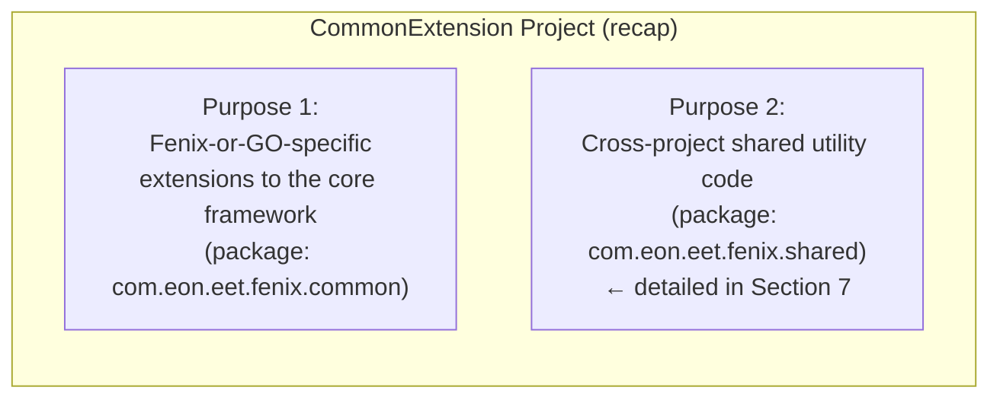

| Package inside `CommonExtension` | Purpose | Governed by |
|---|---|---|
| `com.eon.eet.fenix.common` | Fenix/GO-specific extensions of core framework behavior | Section 6.1.3 |
| `com.eon.eet.fenix.shared` | Narrow code shared across 2+ business projects, explicitly *not* framework | Section 7 (this document) |

---

## 6. Decision Flow: Can My Project Reference That Class?

Use this flowchart whenever you're tempted to import a class from another project:

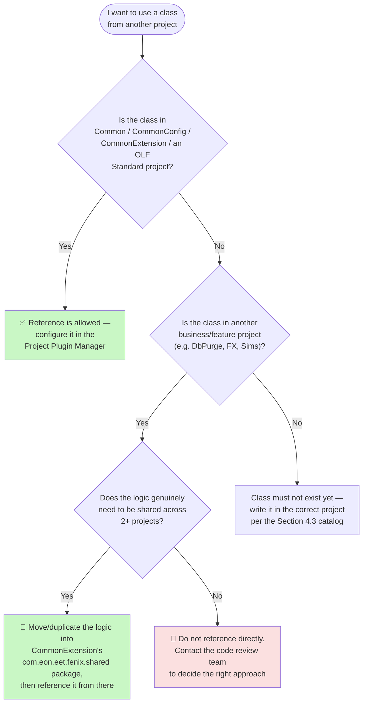

---

## 7. Worked Examples

### Example 1 — Forbidden Direct Reference

**Scenario:** The `Sims` project wants to reuse a date-formatting helper class that already exists in `DbPurge`.

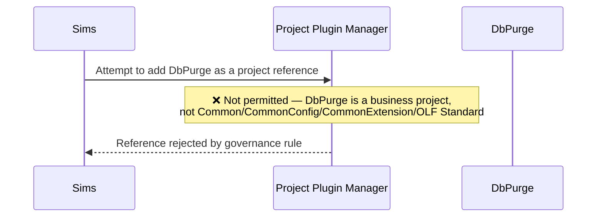

**Correct resolution:** Move the date-formatting helper class into `CommonExtension`'s `com.eon.eet.fenix.shared` package (or an appropriate sub-package), then have **both** `Sims` and `DbPurge` reference `CommonExtension` instead of each other.

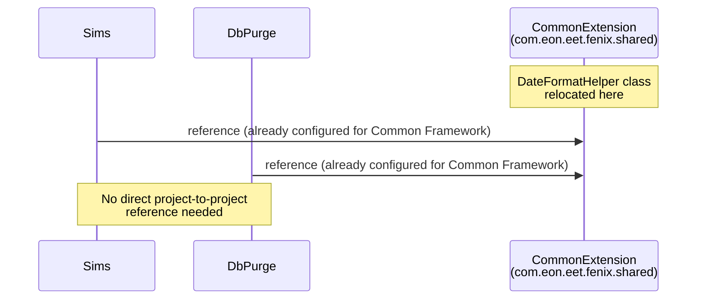

### Example 2 — Correct Use From the Start

**Scenario:** Both the `FX` and `Interfaces` projects need a shared XML-parsing utility that isn't general enough to belong in core `Common`.

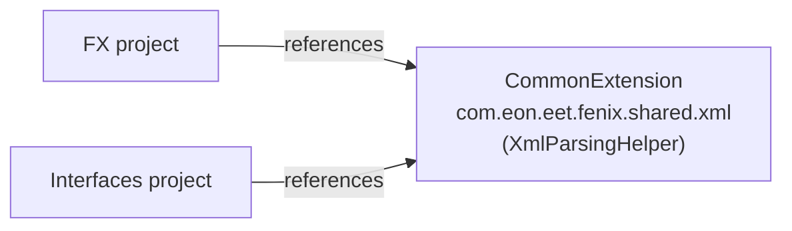

Because the class lives in `com.eon.eet.fenix.shared` (inside `CommonExtension`, which every project is already permitted to reference), **no special exception or new project reference approval is needed** beyond what's already configured for the Common Framework.

---

## 8. Consequences of Breaking the Rule

If a developer bypasses this governance rule (e.g., manually configuring `Sims` to reference `DbPurge` in the Project Plugin Manager, or copy-pasting code instead of centralizing it):

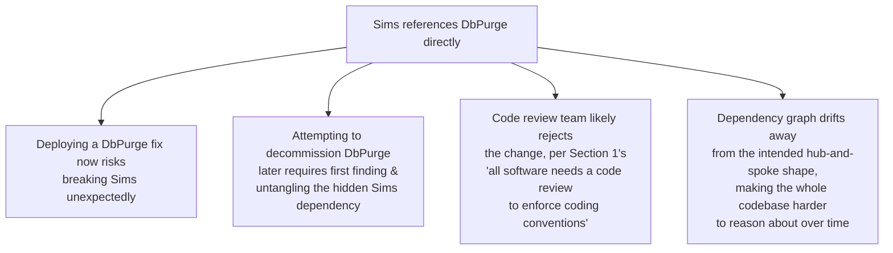

---

## 9. Practical Checklist for Developers

- [ ] **Before adding a project reference** in the Project Plugin Manager, confirm the target project is one of: `Common`, `CommonConfig`, `CommonExtension`, or an OLF Standard project.
- [ ] **Never configure a business/feature project to reference another business/feature project** (e.g., `Sims → DbPurge`), even if it seems like a small, convenient shortcut.
- [ ] **When code genuinely needs to be shared across 2+ specific projects**, place it in `CommonExtension`'s `com.eon.eet.fenix.shared` package (or an appropriate sub-package) — not in core `Common`, and not by duplicating it in each project.
- [ ] **Remember `com.eon.eet.fenix.shared` classes are explicitly *not* part of the Common Framework** — keep them narrowly scoped to their actual sharing need, don't treat the package as a dumping ground for anything reusable.
- [ ] **If unsure whether something belongs in `Common` vs. `CommonExtension`'s shared package**, escalate to the code review team (per the general escalation pattern established in Section 4.3).
- [ ] **When reviewing code**, watch for signs a developer has tried to work around the rule (e.g., duplicated utility classes across projects, or unusual project reference configurations) and redirect that code into the shared package instead.

---

## Related Sections (Full Programming Guide)

- Section 4.1 — OpenJVS Projects (Project Plugin Manager, project references)
- Section 4.3 — Current EET OpenJVS Projects (the full catalog of business/feature projects this rule governs)
- Section 6.1.3 — CommonExtension (the project's dual purpose: Fenix/GO-specific extensions + the shared package)
- Section 8.1 — General Rules for Developing OpenJVS Plugins (package naming conventions that reinforce this governance model)
