# Data Purging — Full Reference Guide

> Source: Section 9 *"Data Purging"* of the **Programming Guide for OpenJVS Development — EET Fenix Endur**, covering 9.1 The Purging Framework (9.1.1 AbstractDbPurgeSet Class, 9.1.2 DbPurge[Daily/Weekly/Monthly/Annually]Main Classes, 9.1.3 IPurgeTable Interface), 9.2 User Table Purging, 9.3 Core Table Purging, and 9.3.1 Purging Framework Constants Repository Entries. This instruction file expands the section into a complete, diagrammed reference.

---

## Table of Contents

1. [Overview: What the Purging Framework Solves](#1-overview-what-the-purging-framework-solves)
2. [9.1 The Purging Framework](#2-91-the-purging-framework)
   - 9.1.1 [AbstractDbPurgeSet Class](#211-abstractdbpurgeset-class)
   - 9.1.2 [DbPurge\[Daily/Weekly/Monthly/Annually\]Main Classes](#212-dbpurgedailyweeklymonthlyannuallymain-classes)
   - 9.1.3 [IPurgeTable Interface](#213-ipurgetable-interface)
3. [9.2 User Table Purging](#3-92-user-table-purging)
4. [9.3 Core Table Purging](#4-93-core-table-purging)
   - 9.3.1 [Purging Framework Constants Repository Entries](#41-purging-framework-constants-repository-entries)
5. [End-to-End Purge Run Walkthrough](#5-end-to-end-purge-run-walkthrough)
6. [Practical Checklist for Developers](#6-practical-checklist-for-developers)

---

## 1. Overview: What the Purging Framework Solves

Endur databases accumulate data continuously — deals, transactions, logs, index prices, import audit records, and custom EET user tables all grow without bound unless something proactively trims them. The **Purging Framework** is the Common Framework's answer to this problem:

> The purging framework has been designed as a **one stop place** where all database table purging is carried out. The framework is able to purge **both Endur core tables and custom user tables** at a **daily, weekly, monthly and annually** frequency. The framework consists of **control classes** that initiate and execute **worker classes** that carry out the actual table purging.

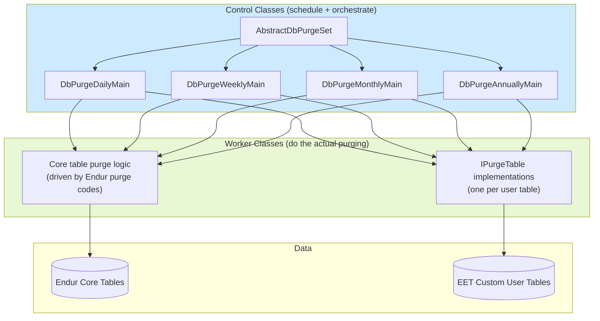

**Two distinct purge targets, one unified framework:**

| Purge Target | Configured Via | Worker Mechanism |
|---|---|---|
| **Core Endur tables** | `user_eon_configuration` parameters + **Endur purging configuration** | Endur purge codes (e.g. `ADT_PURGE_CANCELLED_DEAL`) |
| **Custom EET user tables** | Developer-written classes | `IPurgeTable` interface implementations |

---

## 2. 9.1 The Purging Framework

### 2.1 AbstractDbPurgeSet Class

> **Abstract class** from which the purging **set classes** extend. The current purging sets include **`DbPurgeDailyMain`, `DbPurgeWeeklyMain`, `DbPurgeMonthlyMain`** and **`DbPurgeAnnuallyMain`**. This abstract class **extends `BasicScript`** and provides the implementation of the **`execute`** method. The execute method **iterates through each registered worker class** and calls the worker's **`purgeTable`** method. Each worker class needs to be registered by the purging set class using the **`registerNewClass`** method of this abstract class.

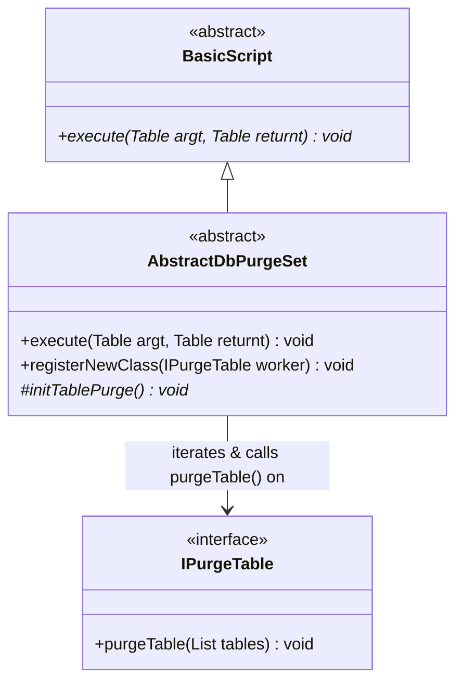

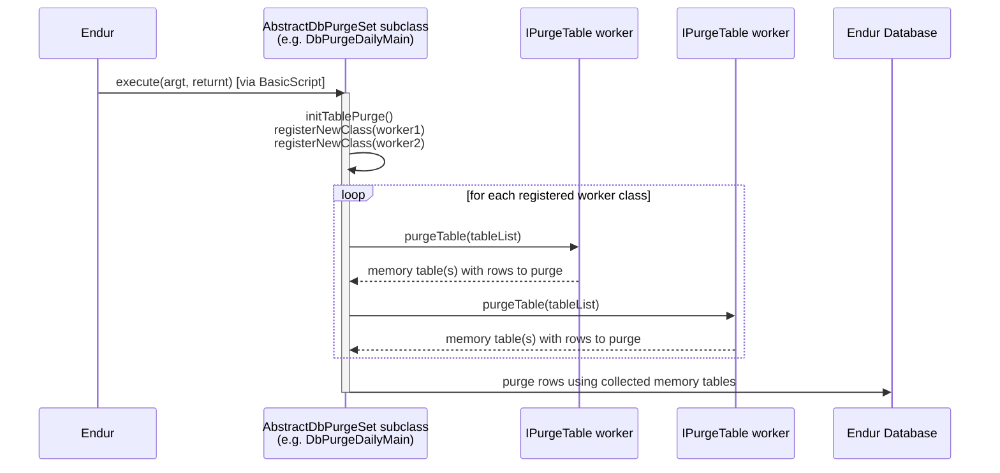

**Key architectural point:** `AbstractDbPurgeSet` is the **orchestrator** — it knows *how* to run a purge cycle (iterate workers, call `purgeTable`, apply the results to the database) but knows **nothing** about *which* tables to purge. That knowledge lives entirely in the registered `IPurgeTable` worker classes.

### 2.2 DbPurge[Daily/Weekly/Monthly/Annually]Main Classes

> These classes define purging sets that run either **daily, weekly, monthly or annually**. They extend the **`AbstractDbPurgeSet`** class. The classes are referred to in the **Endur workflow** with appropriate run schedules.

**⚠️ Special case — the Annual purge:**

> Note that **Endur does not provide an annual schedule**, therefore the annual purging set is **scheduled to run every day** and checks the parameter **`'Annual DB Purge Date'`** (found in the **`user_eon_configuration`** table) to determine the **day of the year** the purge should actually run.

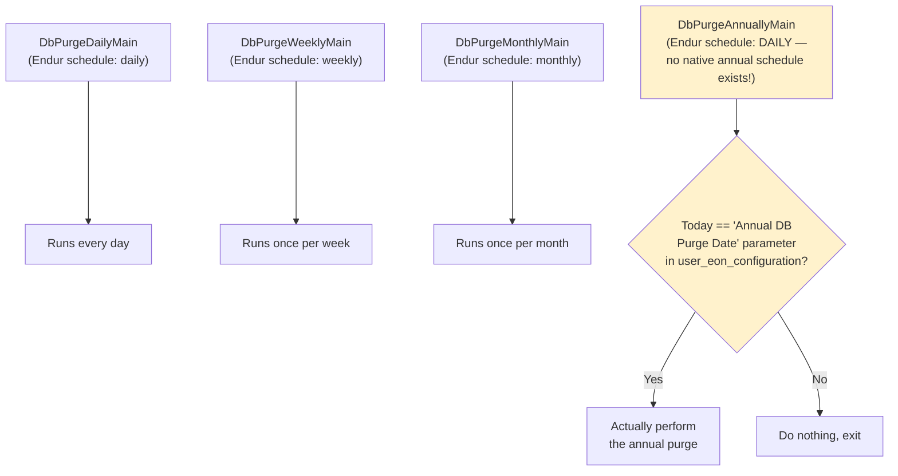

### Registering Worker Classes

> Worker classes that are to be included in these purging sets need to be **instantiated and registered** with the set by including the following code in the purging set's **`initTablePurge`** method:

```java
registerNewClass(new DbPurgeLogDetail());
```

...where `DbPurgeLogDetail` is the worker class.

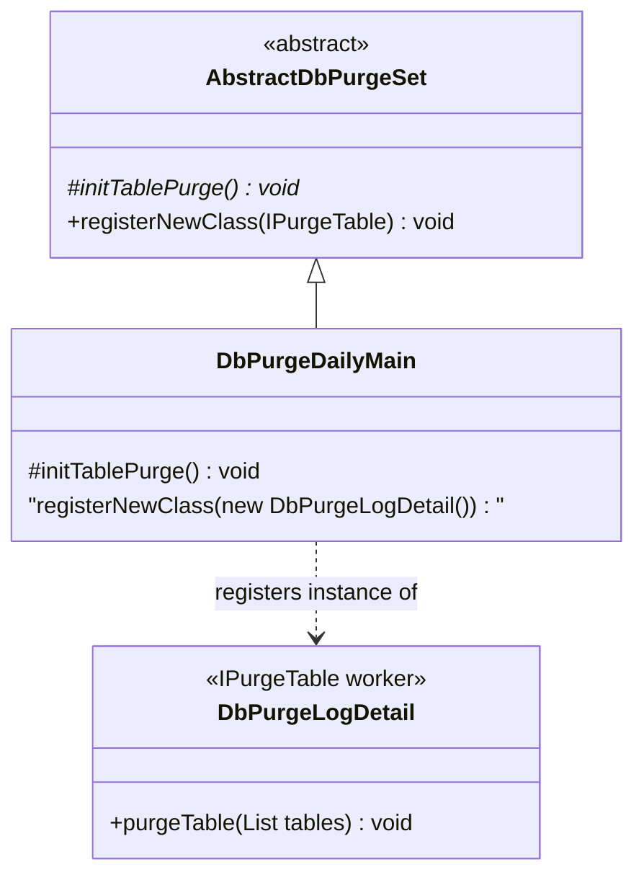

### 2.3 IPurgeTable Interface

> The interface that **must be implemented by all purging worker classes**. The interface defines the method **`purgeTable`** that must be implemented by the worker class. This method should **retrieve data to be purged into one or more memory tables**, which must be **added to the list object** provided to the method as a parameter. The framework then **uses the tables in the list object to purge the database tables**.

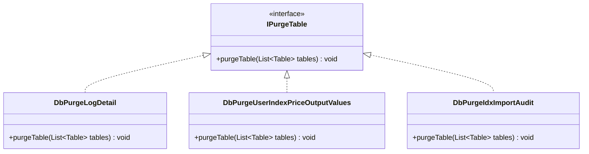

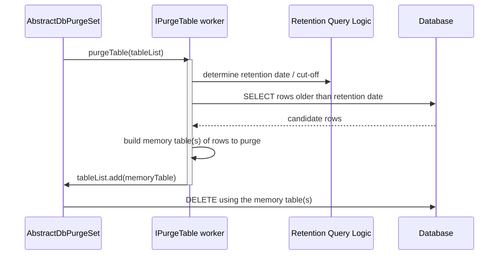

---

## 3. 9.2 User Table Purging

> **User tables that increase in size over a period of time should be purged on a regular basis.** Depending on the contents of the user table, the purge should be **daily, weekly, monthly or annually**. To define a user table purge you must:

| Step | Action |
|---|---|
| **1** | Create a class that implements **`IPurgeTable`**. The class name must **represent the user table being purged** and must be contained within the package **`com.eon.eet.fenix.purging`**. **Only one user table should be purged per purging class.** |
| **2** | Implement the **`purgeTable`** method to provide memory tables that contain data to purge. |
| **3** | Modify the **`initTablePurge`** method of the purging set class associated with the frequency the user table is to be purged (`DbPurgeDailyMain`, `DbPurgeWeeklyMain`, `DbPurgeMonthlyMain`, or `DbPurgeAnnuallyMain`). The method needs to **register an instance** of the new purging class. |

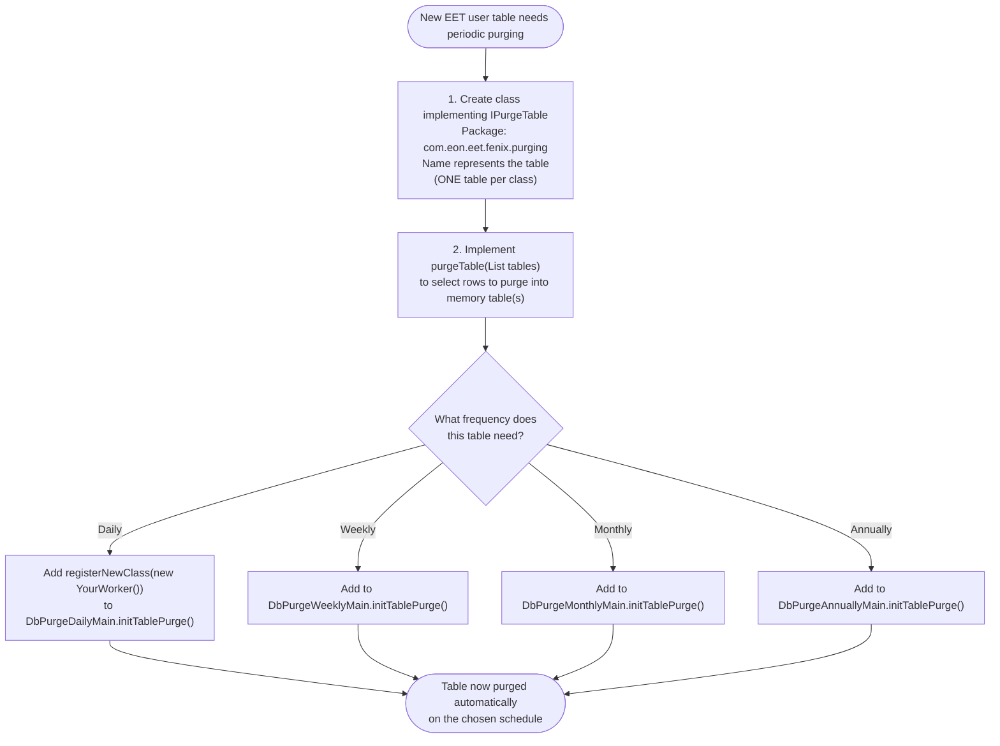

### Worked Example

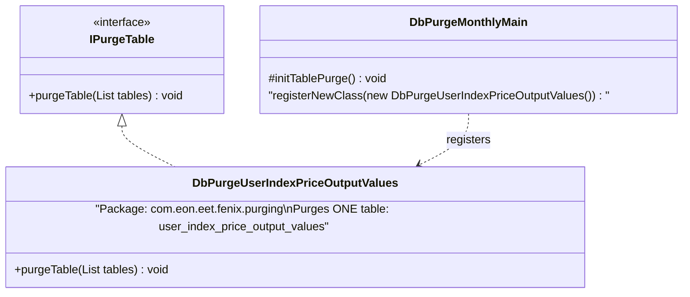

---

## 4. 9.3 Core Table Purging

> The purging framework uses the **Endur purging configuration** to determine **datasets and retaining dates** for purging the core tables. The purging framework uses parameters in the **`user_eon_configuration`** table to determine **which core tables should be purged and when**.

### The Four Parameter Names

> The parameter names are as follows and reflect the purge frequency:

- **Purge Data Types Daily**
- **Purge Data Types Monthly**
- **Purge Data Types Weekly**
- **Purge Data Types Annually**

> The value of each parameter is a **comma separated list of Endur purge codes** as found in the Endur purging configuration, e.g.

```
ADT_PURGE_CANCELLED_DEAL,ADT_PURGE_DELETED_DEAL
```

> To include a core table purge, simply **add the Endur purge code** to the relevant parameter and ensure it is **correctly configured in the Endur purging configuration**.

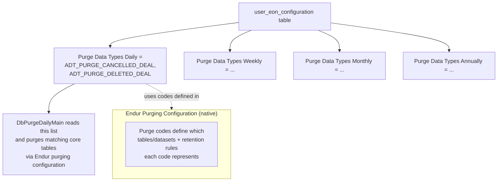

### Failure/Warning Behavior

> If any of the parameters **does not exist** in the `user_eon_configuration` table, or the parameter value is **empty**, then **no purging is carried out** and a **warning message is output** to the appropriate purging script's log file.

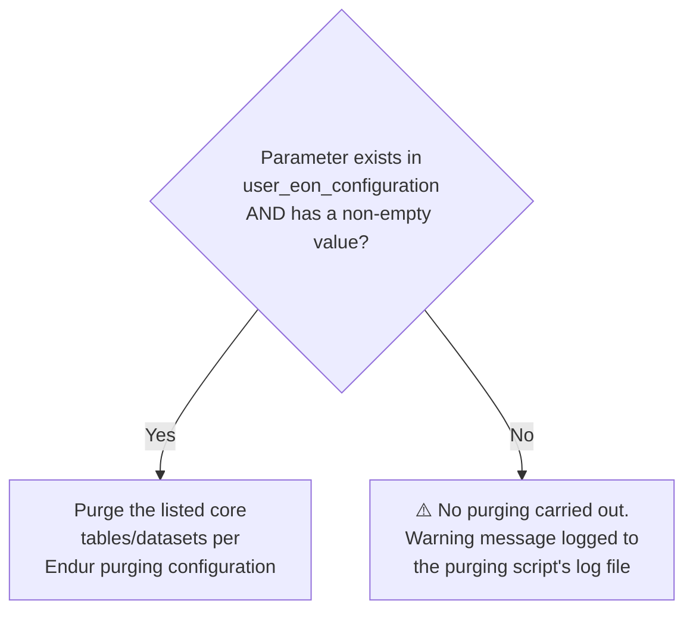

### 4.1 Purging Framework Constants Repository Entries

The purging framework's own *operational* controls (as opposed to *what* to purge, which is `user_eon_configuration`'s job) live in the **Constants Repository**, under context **`DbPurge`**:

| Context | Sub Context | Variable Name | Type | Description |
|---|---|---|---|---|
| `DbPurge` | — | **Disabled Purge Classes** | String | A **comma separated list** of `IPurgeTable` classes to be **disabled** from running during a purge run. |
| `DbPurge` | — | **Max Purge Rows Per Table** | Integer | Maximum number of rows allowed to be purged **per table in a single purge run**. |
| `DbPurge` | — | **Purge Batch Size** | (unspecified/numeric) | Number of rows to purge in a **single batch**. E.g. if set to `10` and 100 rows need purging, the purge runs in **10 batches of 10 rows** until all 100 are purged. |

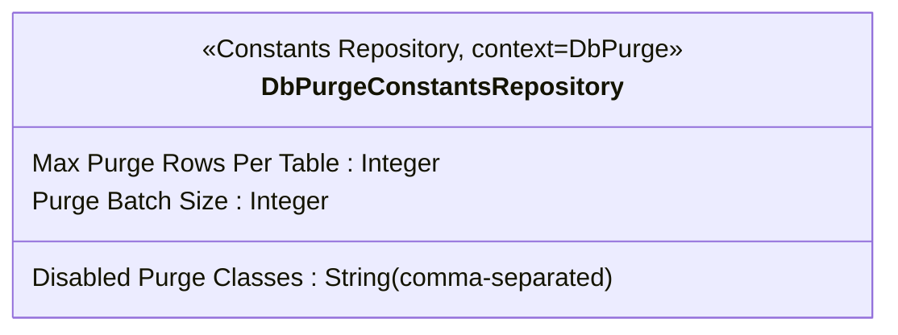

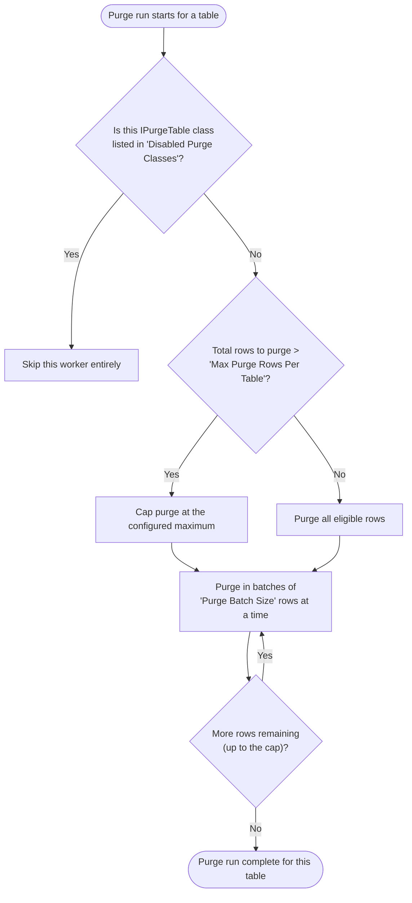

**Why batching matters:** purging 100,000 rows in one giant `DELETE` can lock tables for a long time and strain the database. `Purge Batch Size` breaks the work into small, manageable chunks (e.g., 10 rows at a time) so the purge is gentler on the live database.

**Why "Max Purge Rows Per Table" matters:** protects against runaway purges — e.g., if a retention-date bug accidentally flags millions of rows, the cap prevents a single purge run from doing catastrophic, unbounded deletion.

**Why "Disabled Purge Classes" matters:** gives operations/support staff a way to **temporarily turn off** a misbehaving purge worker (e.g., during an investigation) **without redeploying code** — just update the Constants Repository entry.

---

## 5. End-to-End Purge Run Walkthrough

Putting Sections 9.1–9.3 together — a full daily purge cycle from Endur's scheduler through to the database:

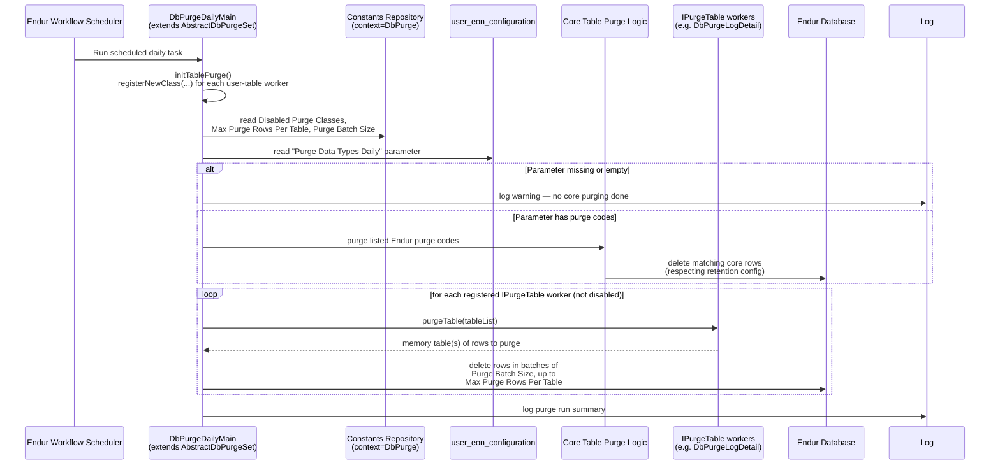

---

## 6. Practical Checklist for Developers

- [ ] **New EET user table growing unbounded?** Create an `IPurgeTable` implementation in `com.eon.eet.fenix.purging`, named after the table, purging exactly **one** table per class.
- [ ] **Register the worker** in the correct `DbPurge[Daily/Weekly/Monthly/Annually]Main.initTablePurge()` method via `registerNewClass(...)`.
- [ ] **Remember the Annual purge quirk** — `DbPurgeAnnuallyMain` runs *every day* but only actually purges on the date configured in `user_eon_configuration`'s `'Annual DB Purge Date'` parameter.
- [ ] **For core table purging**, add the correct Endur purge code(s) to the relevant `Purge Data Types [Daily/Weekly/Monthly/Annually]` parameter in `user_eon_configuration`, and confirm the code is properly set up in Endur's own purging configuration.
- [ ] **Never assume a missing/empty core-purge parameter fails loudly** — it silently skips purging and only logs a warning; check log files if core purging doesn't seem to be running.
- [ ] **Use the `DbPurge` Constants Repository entries** (`Disabled Purge Classes`, `Max Purge Rows Per Table`, `Purge Batch Size`) to operationally control purge behavior without code changes.
- [ ] **Don't purge in one giant batch** — respect `Purge Batch Size` to avoid long-running locks on production tables.
- [ ] **`purgeTable(List tables)` must add memory tables to the provided list**, not perform deletes itself — the framework (`AbstractDbPurgeSet`) owns the actual database delete step.

---

## Related Sections (Full Programming Guide)

- Section 6 — The Common Framework (`BasicScript`, `DestroyableObjectStore` — `AbstractDbPurgeSet` extends `BasicScript` and purge workers should use `DestroyableObjectStore` for any tables they create)
- Section 8 — Developing OpenJVS Plugins (general naming/package rules that also apply to purge worker classes)
- Section 4.3 — Current EET OpenJVS Projects (the `DbPurge` project: `com.eon.eet.fenix.purging`, "Code related to database purging")
