# Debugging Code — Full Reference Guide

> Source: Section 11 *"Debugging Code"* of the **Programming Guide for OpenJVS Development — EET Fenix Endur**, covering 11.1 Initiating a Debug Session, 11.2 Initiating a JVM for Debugging, 11.3 Setting Breakpoints, and 11.4 Starting a Debug Session (11.4.1 Debug View, 11.4.2 Variable/Breakpoint/Expression Views, 11.4.3 Displaying Contents of Memory Tables, 11.4.4 Stepping Through Code). This instruction file expands the section into a complete, diagrammed reference for debugging OpenJVS plug-ins running inside Endur.

---

## Table of Contents

1. [Overview: Debugging Native Java Running Inside Endur](#1-overview-debugging-native-java-running-inside-endur)
2. [11.1 Initiating a Debug Session](#2-111-initiating-a-debug-session)
3. [11.2 Initiating a JVM for Debugging](#3-112-initiating-a-jvm-for-debugging)
4. [11.3 Setting Breakpoints](#4-113-setting-breakpoints)
5. [11.4 Starting a Debug Session](#5-114-starting-a-debug-session)
   - 11.4.1 [Debug View](#511-debug-view)
   - 11.4.2 [Variable/Breakpoint/Expression Views](#512-variablebreakpointexpression-views)
   - 11.4.3 [Displaying Contents of Memory Tables](#513-displaying-contents-of-memory-tables)
   - 11.4.4 [Stepping Through Code](#514-stepping-through-code)
6. [End-to-End Debug Session Walkthrough](#6-end-to-end-debug-session-walkthrough)
7. [Practical Checklist for Developers](#7-practical-checklist-for-developers)

---

## 1. Overview: Debugging Native Java Running Inside Endur

> The **Eclipse IDE has a very powerful debugger** which can be used for debugging OpenJVS classes. However in order to use the debugger the **Eclipse IDE session must be associated with an Endur session**. For this, Eclipse needs to be **launched from a running Endur instance**. In the Fenix environments an Endur task has been created named **`Eclipse IDE`** which launches Eclipse from Endur and associates it with the currently open Endur session.

This precondition is identical to the one governing plugin import in Section 10.3 — debugging and importing both require Eclipse to be a "child" of a live Endur session, not a standalone Eclipse instance.

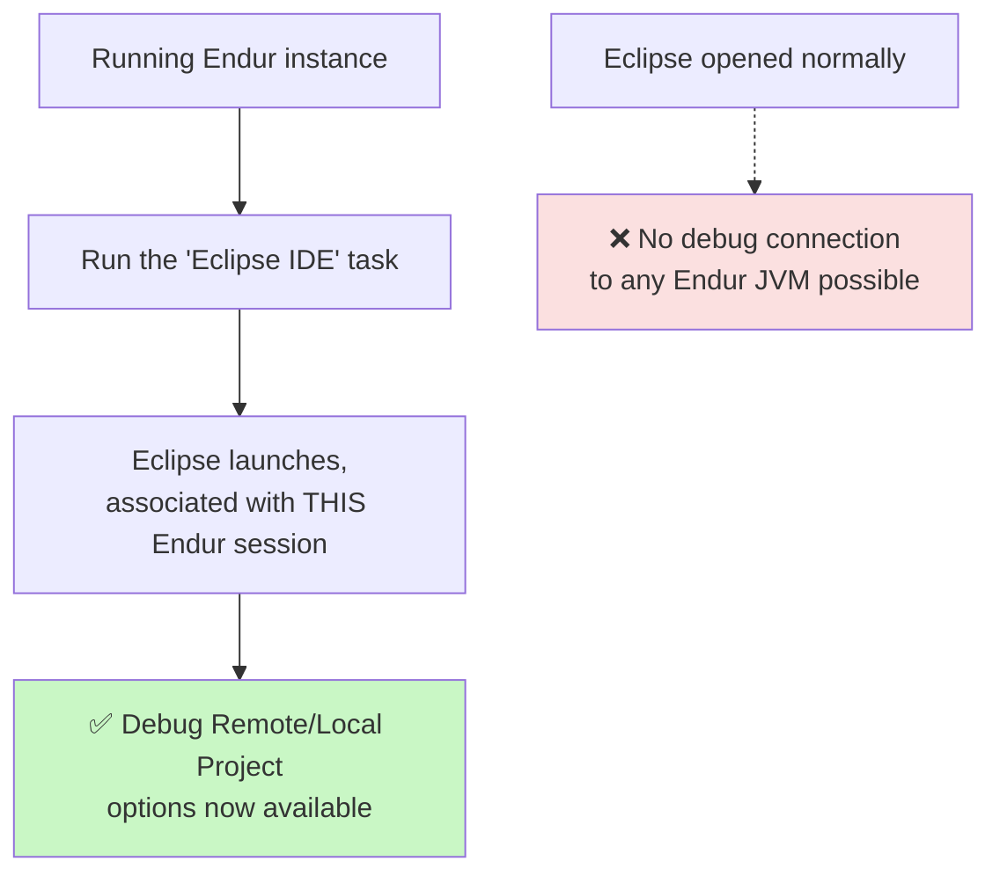

### The Four-Stage Debugging Journey

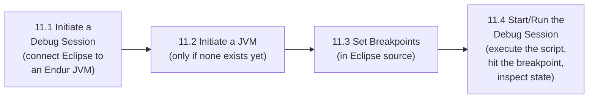

---

## 2. 11.1 Initiating a Debug Session

### Purpose

> The **OpenLink OpenJVS Eclipse plugin** is used to launch a debugging session and connect it to an **Endur Java JVM instance**.

### Step-by-Step Process

| Step | Action |
|---|---|
| 1 | Right-click an **Eclipse OpenJVS project** and select **`OpenLink -> Debug Remote Project`**. *(Note: if `Debug Remote Project` does not work, use `Debug Local Project` instead.)* |
| 2 | A window displays the **available sessions** to connect to. Choose a session and click **`OK`**. You *can* choose a session running on an **app server** to debug OpenJVS code running there, but **normally you choose your own session**. |
| 3 | Another window displays the **JVMs available to connect to**. If debugging a **parameter script**, choose **`Trading Manager`**; otherwise choose **`Script Engine x`**, then click `OK`. If **no JVMs are available**, one must be **manually started** (see Section 3 below). |

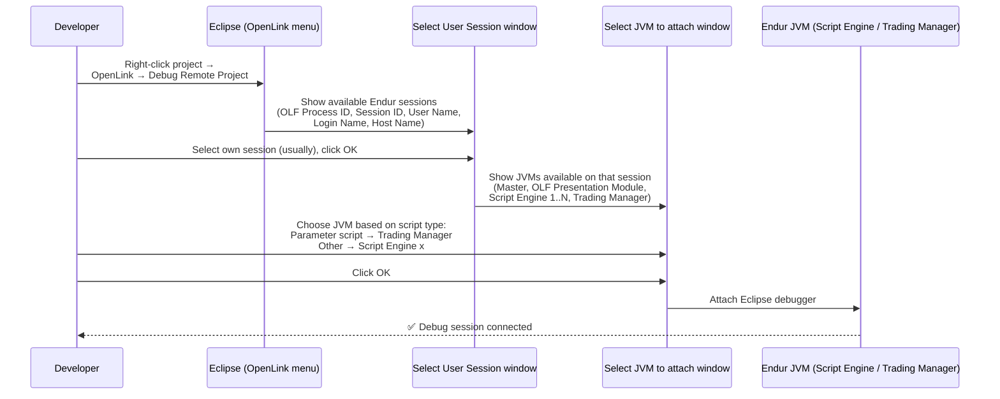

### Which JVM Should You Choose?

| Plug-in Type Being Debugged | Choose |
|---|---|
| **Parameter script** (extends `BasicParamScript`) | **Trading Manager** |
| **Any other plug-in type** (Main, Output, UDSR, OpServices, Connex) | **Script Engine x** |

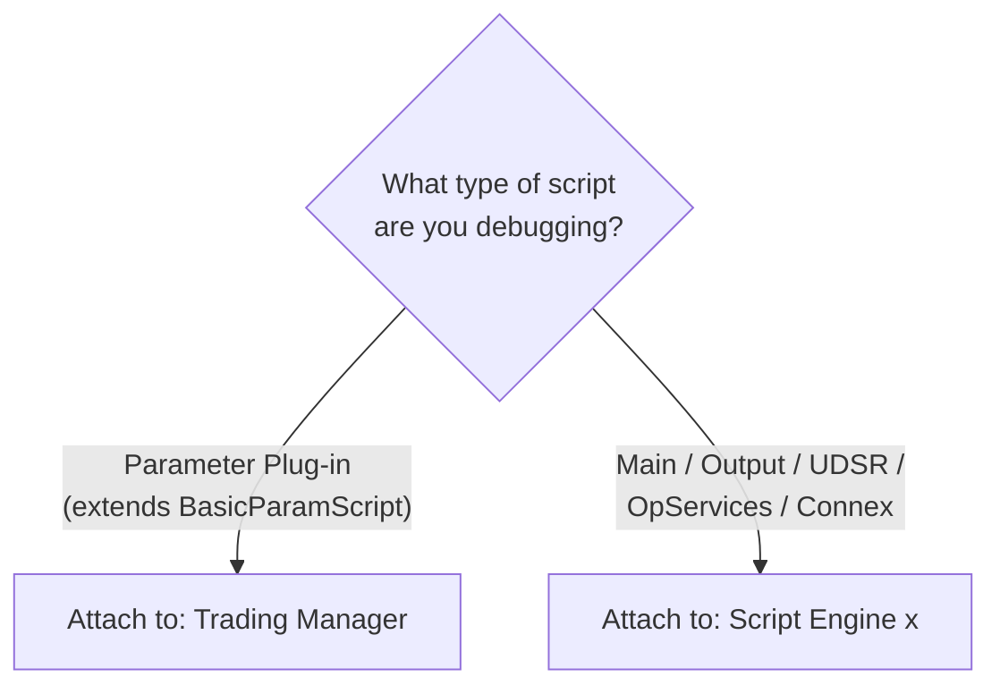

### Selecting the Right Session

The **Select User Session** window lists columns: **OLF Process ID**, **Session ID**, **User Name**, **Login Name**, **Host Name**. In practice:

- Choose **your own session** (matching your login name) for standard development debugging.
- Choose a **different (e.g., app server) session** only when you specifically need to debug OpenJVS code executing on that server rather than your own client session.

---

## 3. 11.2 Initiating a JVM for Debugging

### Why This Step Is Sometimes Needed

> It may be necessary to **manually initiate a JVM** on a script engine if one does not already exist. Generally a JVM will be started **if an OpenJVS script has already been executed** on a script engine.

### Two Ways to Get a JVM Running

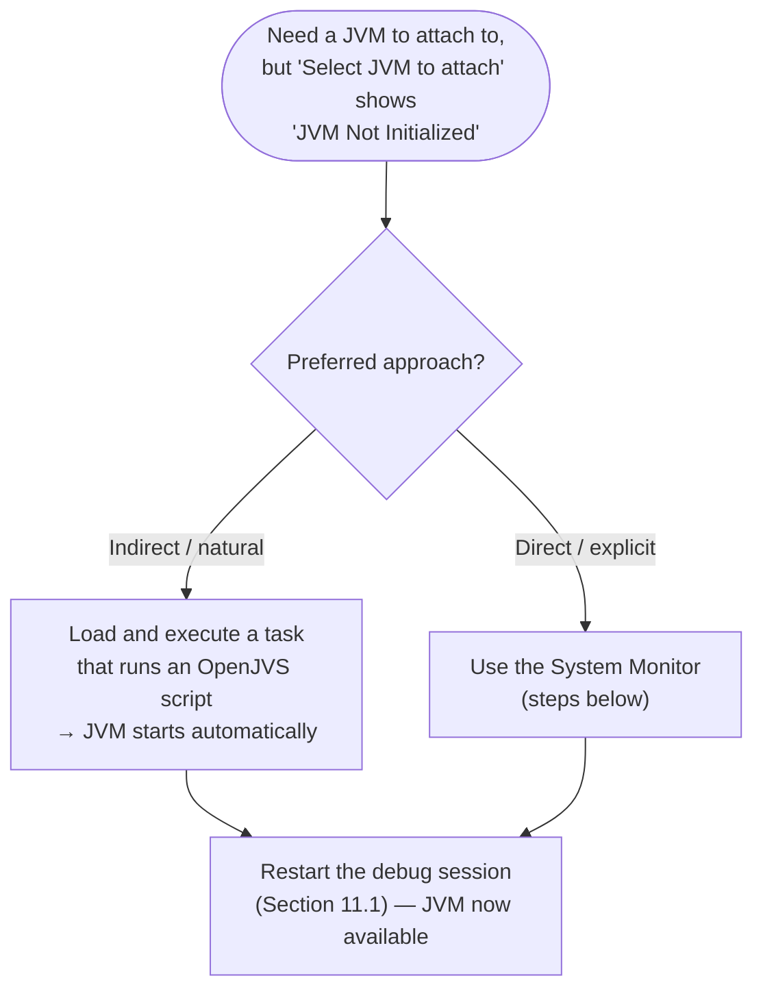

### Manual Initiation via System Monitor

| Step | Action |
|---|---|
| 1 | Start the **System Monitor** (from Endur's `OpenLink` toolbar). |
| 2 | In the **bottom pane**, highlight the **script engine** to start the JVM on, then choose **`Debug -> Init Java VM`** from the menu bar. |
| 3 | **Close** the System Monitor and **restart the debug session** as described in Section 11.1. |

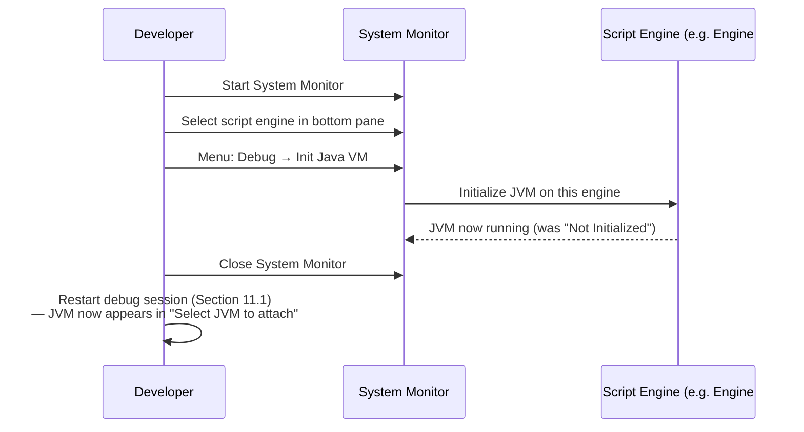

### System Monitor Overview (Context)

The System Monitor's **Script Engines** tab shows a **Jobs** panel (Job ID/Task Name, Script, Job Status, Posted Status, Submitter, Engine Number, Repeat Interval) and an **Engines** panel (Engine #, Status, PID, Job ID/Task Name, Mem Size, Virtual Mem Size, Time of Status) with controls: **New Engine**, **Stop Engine**, **Stop All Engines**, and a **Number of Engines** field.

---

## 4. 11.3 Setting Breakpoints

### The Critical Precondition

> Breakpoints are set using the **source code within the Eclipse IDE project**. Therefore for correct debugging it is **essential that the code being debugged is identical** between what has been imported into Endur and the java source file in Eclipse.

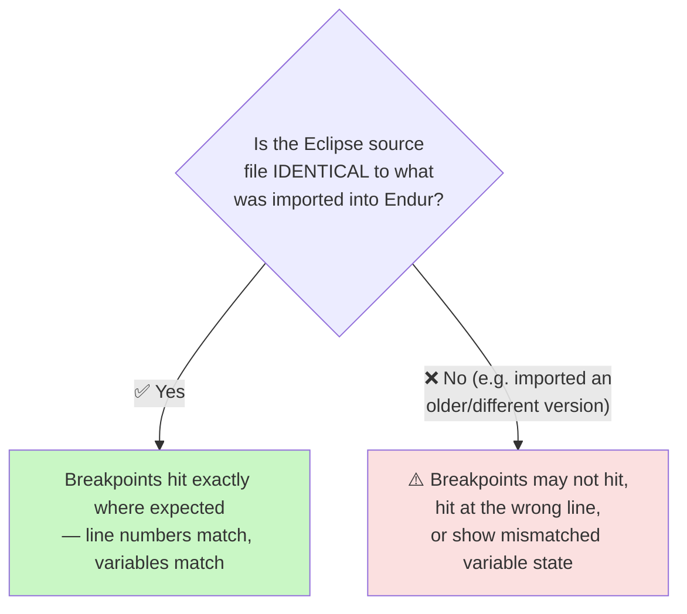

This is exactly why Section 10 ("Importing Code to Endur") matters so much for debugging: whichever import method was used (Simple Editor, Bulk Import, or the Eclipse `Save Plugin to DB`), the class imported into Endur **must match** the Eclipse source you're setting breakpoints in.

### How to Set a Breakpoint

1. Open the **java source file** in the Eclipse editor.
2. **Double-click** within the **left margin** at the line where the breakpoint is to be set.

### Toggling Breakpoints via Right-Click

A **right-click** in the left margin shows a pop-up menu with:

| Menu Item | Purpose |
|---|---|
| **Toggle Breakpoint** | Add/remove a breakpoint at this line |
| **Disable Breakpoint** | Keep the breakpoint defined but inactive |
| **Go to Annotation** | Navigate to the annotation at this line |
| **Add Bookmark...** | Bookmark this line (unrelated to debugging) |
| **Add Task...** | Create an Eclipse task marker |
| **Show Quick Diff** | Toggle quick-diff gutter markers |
| **Show Line Numbers** | Toggle line number display |
| **Folding** | Code folding submenu |
| **Preferences...** | Editor preferences |
| **Breakpoint Properties...** | Configure conditional/hit-count breakpoint rules |

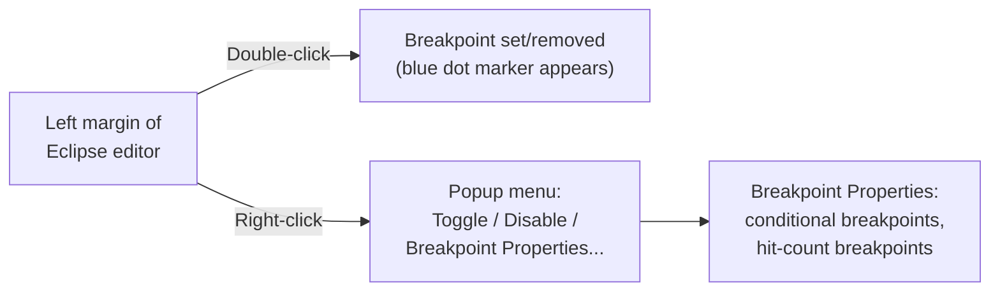

---

## 5. 11.4 Starting a Debug Session

### How a Debug Session Actually Starts

> Once a debug session has been **initiated** (Section 11.1), a debug session can be **started** by simply **running the OpenJVS script** — usually by loading and executing an appropriate task from the **`Trading Manager`**. There are other ways of running tasks, and anyone familiar with Endur will know how.

> When the OpenJVS script is executed and the breakpoint reached, **control will be passed to the Eclipse debug session**. A window will display asking to **switch the perspective**.

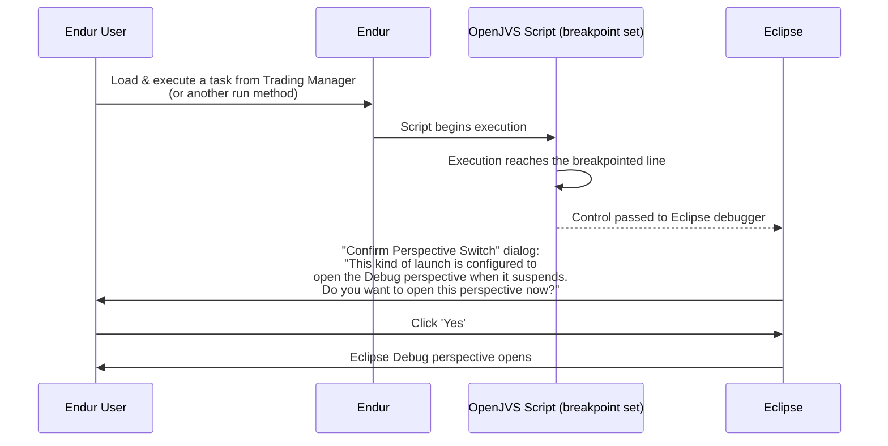

Clicking **`Yes`** opens the **Eclipse Debug perspective**, which arranges several sub-windows explained in the following four subsections.

### 5.1 Debug View

> The **'Debug View'** shows the **current threads that are running**. It will be located at the **top left**. One of these threads will be in a **suspended state** — this is the thread that contains the current breakpoint. The thread shows the **java class stack** that has led to the breakpoint. Clicking on the class at the top of the stack will show the **source file at the current breakpoint**.

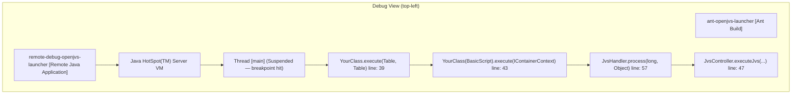

**Reading the call stack (bottom → top):** `JvsController.executeJvs(...)` (Endur's native entry point) called `JvsHandler.process(...)`, which invoked `BasicScript.execute(IContainerContext)` (the `final` wrapper method — see the Common Framework instruction file), which delegated to **your class's** `execute(Table, Table)` — exactly where the breakpoint is currently suspended.

### 5.2 Variable/Breakpoint/Expression Views

> These views are shown in a **tabbed format** and allow **variable inspection, breakpoint management, and the evaluation of expressions** on variables. The views are shown in the **top right**.

#### The Variable View

> Allows the **inspection of variables** and can be used in some cases to **change the value of variables** for **'what if' testing**.

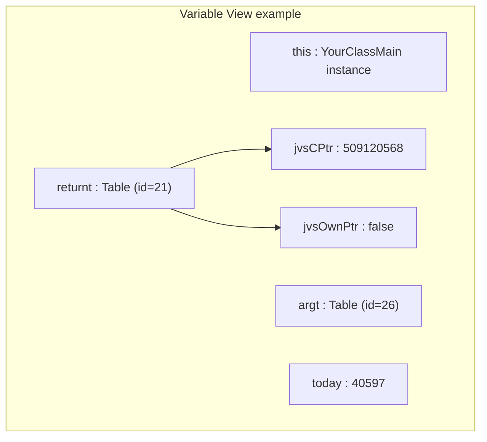

Note that `Table` objects display their **native `IntPtr` fields** (`jvsCPtr`, `jvsOwnPtr`) — a direct visual confirmation of the OpenJVS Architecture concept that `Table` inherits `IntPtr` and holds a native memory handle (see the OpenJVS Architecture instruction file).

#### The Breakpoints View

> Allows **management of breakpoints** including **removal of breakpoints, setting conditional breakpoints and hit count breakpoints**. **Right click** on a listed breakpoint to show the options.

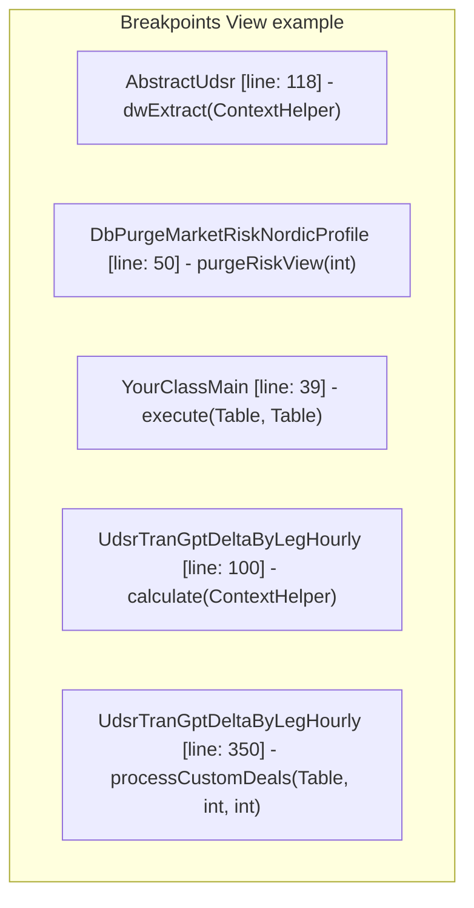

Each entry can be **individually enabled/disabled** (checkbox), and right-clicking exposes **Breakpoint Properties** for conditional expressions (e.g., "only stop if `dealNum == 12345`") or hit-count triggers (e.g., "only stop on the 5th hit").

#### The Expression View

> Allows **expressions to be entered and evaluated**. Expressions can be **anything that can be actioned on a current in-scope class or variable**, such as getting the length of a string.

```mermaid
graph LR
    Expr["Expression View"] --> Ex1["\"sql.length()\" → 223"]
    Expr --> Ex2["Add new expression..."]
```

**Example use case:** while suspended inside a purging worker with a `StringBuffer sql` variable in scope, typing `sql.length()` into the Expression View evaluates it live against the current suspended state.

### 5.3 Displaying Contents of Memory Tables

> Those familiar with AVS scripts realise how useful it can be to **show the contents of memory tables** during debug sessions. To achieve this when debugging OpenJVS code, use the **`Display`** view. Add an expression that will evaluate an **in-scope `Table` object's `viewTable()` method**.

> Once the expression has been entered, **highlight the whole expression** and type **`Control+Shift+I`**. This will result in the **table being displayed**.

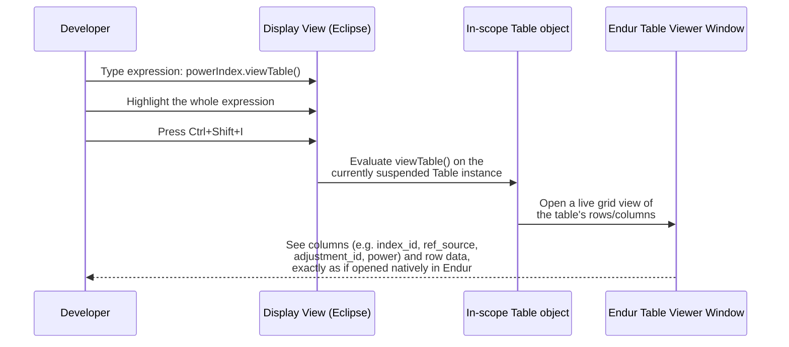

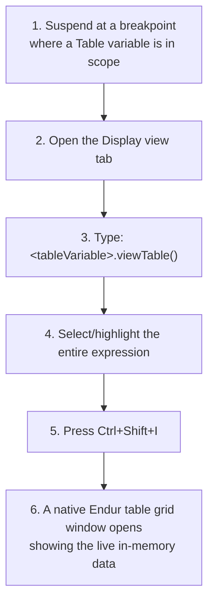

**Why this matters:** this is the single most powerful inspection technique for OpenJVS debugging — it lets a developer see the **actual row/column data** of any `Table` object at the exact moment of suspension, rather than just an opaque object reference.

### 5.4 Stepping Through Code

> To step through code during a debug session, use the **toolbar displayed in the 'Debug' view**.

| Icon Action | Meaning |
|---|---|
| **Continue execution** | Resume running until the next breakpoint or program end |
| **Pause/suspend execution** | Manually halt a running thread |
| **Terminate debug session** | Stop debugging entirely |
| **Step into code** | Enter the method being called on the current line |
| **Step over code** | Execute the current line without entering called methods |
| **Step return from current function** | Run until the current method returns to its caller |

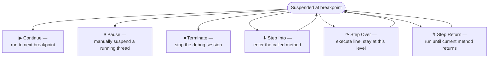

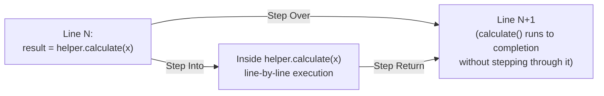

---

## 6. End-to-End Debug Session Walkthrough

Putting all four sub-sections together — the complete journey from "I want to debug this class" to "I can see live table data and step through logic":

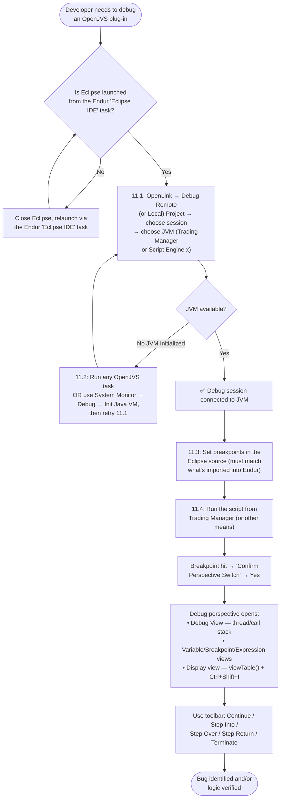

---

## 7. Practical Checklist for Developers

- [ ] **Launch Eclipse via the Endur `Eclipse IDE` task**, never as a standalone Eclipse instance, before attempting to debug.
- [ ] **Use `Debug Remote Project`**, falling back to `Debug Local Project` if it doesn't work.
- [ ] **Choose your own session** in the Select User Session window unless specifically debugging code on an app server.
- [ ] **Attach to `Trading Manager` for Parameter plug-ins**, and **`Script Engine x` for everything else**.
- [ ] **If no JVM is listed**, either run any OpenJVS task first, or use **System Monitor → Debug → Init Java VM**, then restart the debug session.
- [ ] **Verify the Eclipse source file is identical** to what's been imported into Endur before trusting breakpoint line numbers/variable state.
- [ ] **Set breakpoints by double-clicking the left margin**; use right-click → **Breakpoint Properties** for conditional/hit-count breakpoints when debugging loops over many deals/rows.
- [ ] **Confirm the "Perspective Switch" dialog with `Yes`** to reach the full Debug perspective.
- [ ] **Use the Display view + `viewTable()` + `Ctrl+Shift+I`** to inspect the real contents of any in-scope `Table` object — this is the fastest way to verify data correctness mid-script.
- [ ] **Use Step Into vs. Step Over deliberately** — step into unfamiliar/suspect code, step over well-trusted framework calls (e.g., `Log`, `DestroyableObjectStore`) to avoid noise.

---

## Related Sections (Full Programming Guide)

- Section 5 — OpenJVS Architecture (`IntPtr`/`Table` — explains the `jvsCPtr`/`jvsOwnPtr` fields visible in the Variable View)
- Section 6 — The Common Framework (`BasicScript.execute(IContainerContext)` — visible in the Debug View's call stack)
- Section 10 — Importing Code to Endur (all three import methods must keep Endur and Eclipse source in sync for breakpoints to work correctly)
- Section 12 — Source Control (checking out the correct project/branch in Eclipse before debugging)
