# Developing OpenJVS Plugins — Full Reference Guide

> Source: Section 8 *"Developing OpenJVS Plugins"* of the **Programming Guide for OpenJVS Development — EET Fenix Endur**, covering 8.1 General Rules, 8.2 Main Plug-in, 8.3 Parameter Plug-in, 8.4 Output Plug-in, 8.5 User Defined Simulation Result, 8.6 Operational Services Plug-in, 8.7 Connex Method Scripts, 8.8 Other Supporting Classes, 8.9 Finalize Method, 8.10 Logging (Implementation details, The Log class, Log Writers, How to Assign Log Writers, Setting Logging Levels, Logging Considerations, Logging of Deal and Transaction Numbers), 8.11 Exception Handling (Implementation of Exceptions, Alert Broker Exceptions), and 8.12 Sending E-Mail. This instruction file expands the section into a complete, diagrammed reference.

---

## Table of Contents

1. [Overview: The Plugin Development Contract](#1-overview-the-plugin-development-contract)
2. [8.1 General Rules](#2-81-general-rules)
3. [8.2 Main Plug-in](#3-82-main-plug-in)
4. [8.3 Parameter Plug-in](#4-83-parameter-plug-in)
5. [8.4 Output Plug-in](#5-84-output-plug-in)
6. [8.5 User Defined Simulation Result](#6-85-user-defined-simulation-result)
7. [8.6 Operational Services Plug-in](#7-86-operational-services-plug-in)
8. [8.7 Connex Method Scripts](#8-87-connex-method-scripts)
9. [8.8 Other Supporting Classes](#9-88-other-supporting-classes)
10. [8.9 Finalize Method](#10-89-finalize-method)
11. [8.10 Logging](#11-810-logging)
    - 8.10.1 [Implementation Details](#1101-implementation-details)
    - 8.10.2 [The Log Class](#1102-the-log-class)
    - 8.10.3 [Log Writers](#1103-log-writers)
    - 8.10.4 [How to Assign Log Writers](#1104-how-to-assign-log-writers)
    - 8.10.5 [Setting Logging Levels](#1105-setting-logging-levels)
    - 8.10.6 [Logging Considerations](#1106-logging-considerations)
    - 8.10.7 [Logging of Deal and Transaction Numbers](#1107-logging-of-deal-and-transaction-numbers)
12. [8.11 Exception Handling](#12-811-exception-handling)
    - 8.11.1 [Implementation of Exceptions](#1211-implementation-of-exceptions)
    - 8.11.1.1 [Alert Broker Exceptions](#12111-alert-broker-exceptions)
13. [8.12 Sending E-Mail](#13-812-sending-e-mail)
14. [End-to-End Plug-in Lifecycle Diagram](#14-end-to-end-plug-in-lifecycle-diagram)
15. [Practical Checklist for Developers](#15-practical-checklist-for-developers)

---

## 1. Overview: The Plugin Development Contract

> The **Eclipse IDE** is the editor of choice for developing OpenJVS plugins. OpenLink provide an Eclipse plug-in to aide development of JVS scripts. Debugging and use of the OpenLink OpenJVS Eclipse plugin can **only be achieved by running Eclipse from an Endur session remotely**.

The foundational rule of this whole section:

> Standard OpenLink OpenJVS coding rules state that **all plug-in classes must implement the OpenJVS `IScript` interface**. This interface provides the entry point method `execute(IContainerContext context)`... However the common framework provides a number of **ancestor classes** for developing various plug-in types. The common class that implements the `IScript` interface directly is **`BasicScript`**... **Never implement the `IScript` interface directly unless there is a good reason to do so.**

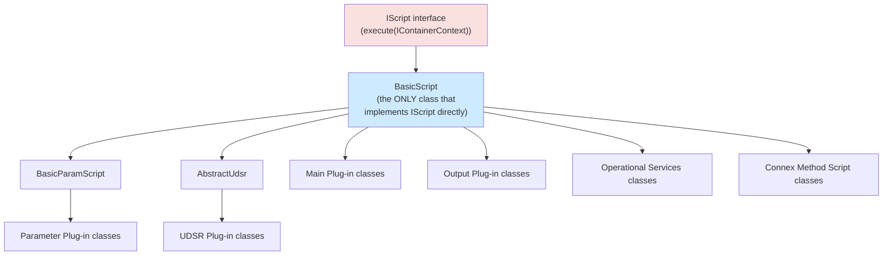

> To ensure that all plug-ins created have the same structure **every plug-in is a subclass of `BasicScript`**. The class `BasicScript` provides a wrapper for the logging structure.

This section (8) is essentially the **rulebook** for which ancestor class to extend and how to name each of the six plug-in types Endur supports, followed by three cross-cutting concerns every plug-in must handle correctly: **logging**, **exception handling**, and **sending email**.

---

## 2. 8.1 General Rules

These rules apply to **every** OpenJVS class, regardless of plug-in type:

| # | Rule |
|---|---|
| 1 | The **package name must start** `com.eon.eet.fenix`. |
| 2 | If the class is part of the **common framework**, the package name must start `com.eon.eet.fenix.common`. |
| 3 | The final part of the package name depends on the plug-in's **purpose** — e.g. `com.eon.eet.fenix.workflow`. |
| 4 | **Use the common framework. Don't re-invent the wheel.** |
| 5 | **Use `DestroyableObjectStore`** when creating tables etc. |
| 6 | Follow the rules for **logging and exception handling** (Sections 8.10/8.11 below). |
| 7 | **Extend from the correct parent class** as appropriate. |
| 8 | Know the **EET coding standards** and code to them. |
| 9 | **Run the Eclipse code formatter** on the source code. |
| 10 | Check **Source Control** rules to determine where in the hierarchy a class should be located. |

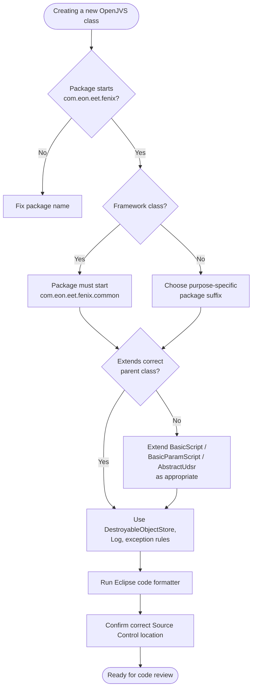

---

## 3. 8.2 Main Plug-in

**Rules:**
- Always extend **`com.eon.eet.fenix.common.script.BasicScript`**.
- Class name **must end with `Main`**.

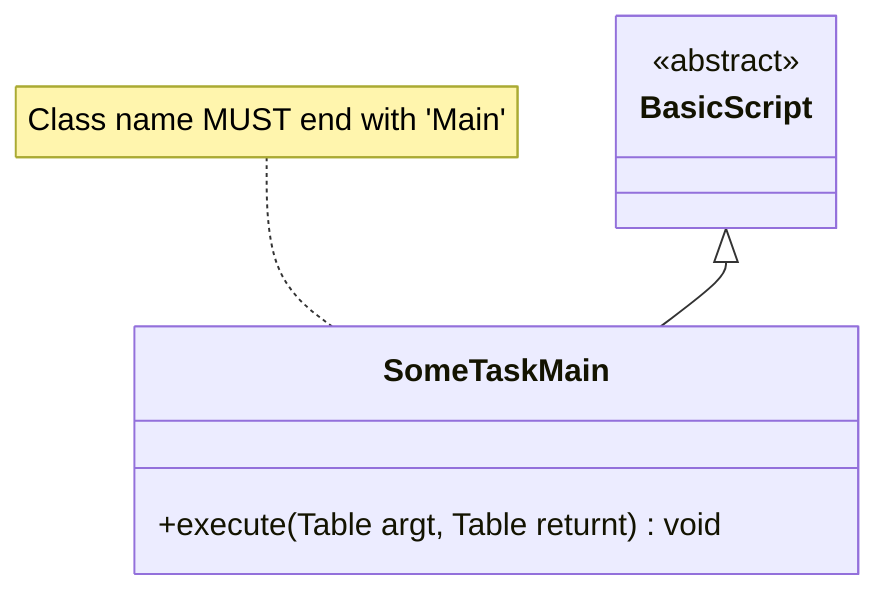

A Main plug-in is the "default" plug-in type — the primary business logic script run as an Endur task.

---

## 4. 8.3 Parameter Plug-in

**Rules:**
- Always extend **`com.eon.eet.fenix.common.script.BasicParamScript`**.
- Class name **must end with `Param`**.
- If **not designed to run in the workflow**, `getWorkflowValues` must throw a `FenixRuntimeException` with an appropriate message.
- If **not designed to run ad-hoc**, `getUserSelection` must throw a `FenixRuntimeException` with an appropriate message.

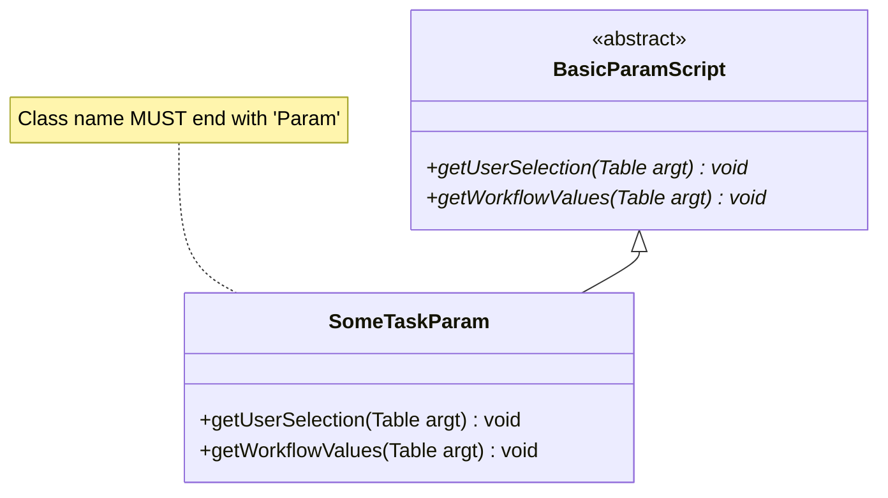

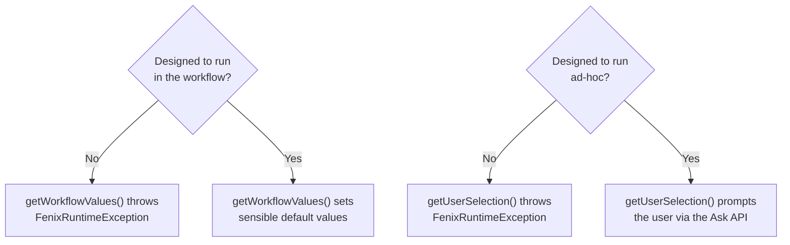

(See the Common Framework instruction file for the full `getUserSelection` / `getWorkflowValues` behavior detail.)

---

## 5. 8.4 Output Plug-in

**Rules:**
- Always extend **`com.eon.eet.fenix.common.script.BasicScript`**.
- Class name **must end with `Output`**.

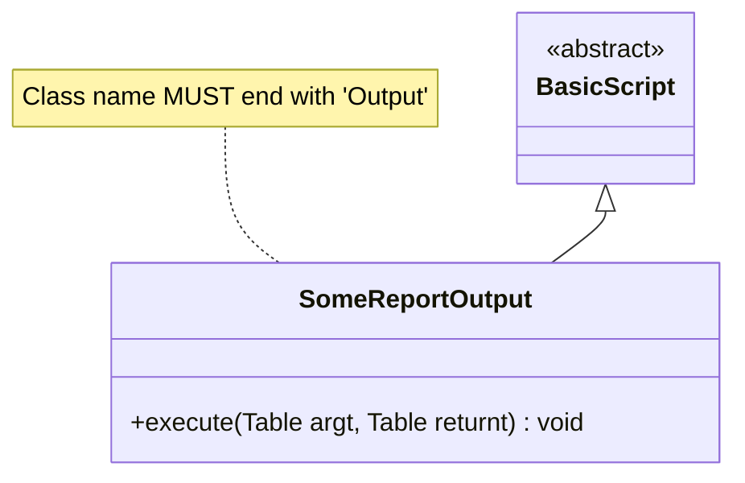

An Output plug-in is a `BasicScript` descendant dedicated to producing output (e.g., a report or export), distinguished purely by its naming convention rather than a separate ancestor class.

---

## 6. 8.5 User Defined Simulation Result

**Rules:**
- Always extend **`com.eon.eet.fenix.common.udsr.AbstractUdsr`**.
- Plug-in must live in package **`com.eon.eet.fenix.sims.udsr`**.
- Class name **must start with `Udsr`**.
- Always provide result-set formatting in the **`format`** method.

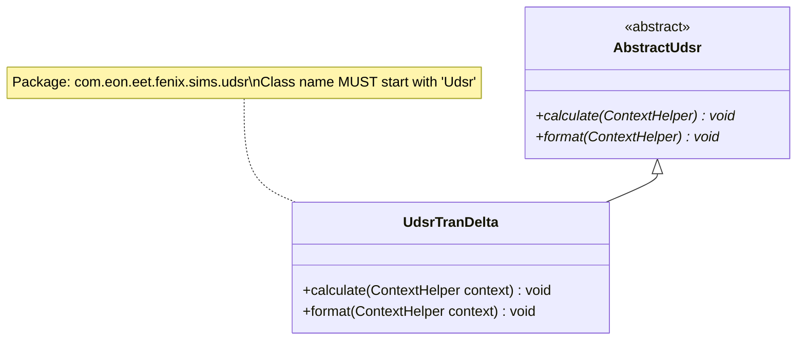

(See the Common Framework instruction file, Section 6.5, for the full `AbstractUdsr` operation table — Calculate, Format, Aggregate, Finalize Aggregate, DW Extract.)

---

## 7. 8.6 Operational Services Plug-in

**Rules:**
- Always extend **`com.eon.eet.fenix.common.script.BasicScript`**.
- Package: **`com.eon.eet.fenix.opservices`** and sub-packages.
- Class name **must start with `Ops`**.
- If a **post-processing** script → name ends with **`Post`**.
- If a **pre-processing** script → name ends with **`Pre`**.
- ⚠️ **Cross-reference (from Section 4.3):** if an Ops Services plug-in is related to an **external interface**, it should instead live in the **`Interfaces`** project with an appropriate package name.

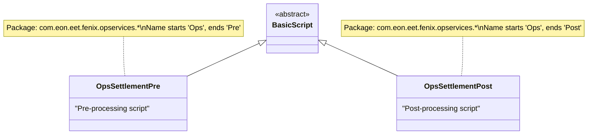

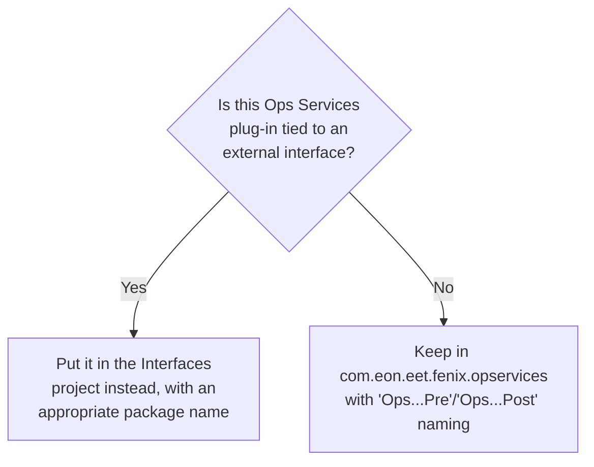

---

## 8. 8.7 Connex Method Scripts

**Rules:**
- Always extend **`com.eon.eet.fenix.common.script.BasicScript`**.
- Package: **`com.eon.eet.fenix.connex`** and sub-packages.
- Class name **must start with `Oc`** (Openlink Connex).
- If a **connex post-processing** script → name ends with **`Post`**.
- If a **connex pre-processing** script → name ends with **`Pre`**.

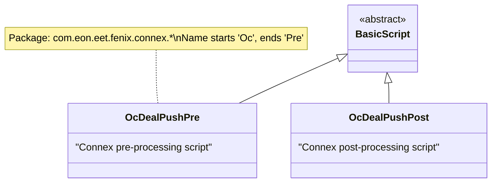

### Naming Convention Summary Across All Plug-in Types

| Plug-in Type | Extends | Package | Name Prefix | Name Suffix |
|---|---|---|---|---|
| **Main** | `BasicScript` | (purpose-specific) | — | `Main` |
| **Parameter** | `BasicParamScript` | (purpose-specific) | — | `Param` |
| **Output** | `BasicScript` | (purpose-specific) | — | `Output` |
| **UDSR** | `AbstractUdsr` | `com.eon.eet.fenix.sims.udsr` | `Udsr` | — |
| **Operational Services** | `BasicScript` | `com.eon.eet.fenix.opservices.*` | `Ops` | `Pre` / `Post` |
| **Connex Method** | `BasicScript` | `com.eon.eet.fenix.connex.*` | `Oc` | `Pre` / `Post` |

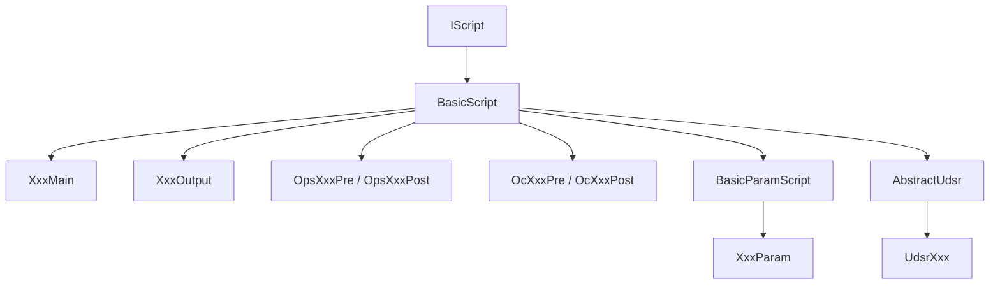

---

## 9. 8.8 Other Supporting Classes

> There is **no limitation** to developing other 'normal' java classes to support OpenJVS plug-ins. If a separate java class is required and makes sense then go ahead and create it. However **all classes must follow the general rules** outlined above.

**Logging requirement for supporting classes:**

> Classes should provide **ample logging** as needed, and for this the class must get an instance of the `Log` as shown below. This should be assigned to a **private member variable** of the class.

```java
private Log log = new Log();
…
log.info("Processing data");
…
```

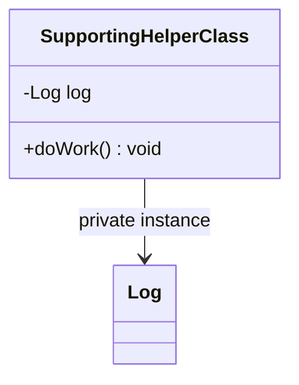

⚠️ **Reminder (cross-referenced from Section 8.10.2):** this pattern — `private Log log = new Log();` — is **only** for classes that do **not** extend `BasicScript`. A class extending `BasicScript` should use its **built-in** logging convenience methods instead, and an instance of `Log` must **never** be declared `static`.

---

## 10. 8.9 Finalize Method

> The bottom line is **DO NOT USE** the `finalize` method. It is **unclear in OpenJVS as to when garbage collection takes place** and hence when the `finalize` method gets called. Therefore any code cleanup will need to be done **at the end of the main processing script or before**. To this end consider using a **`try..finally`** statement.

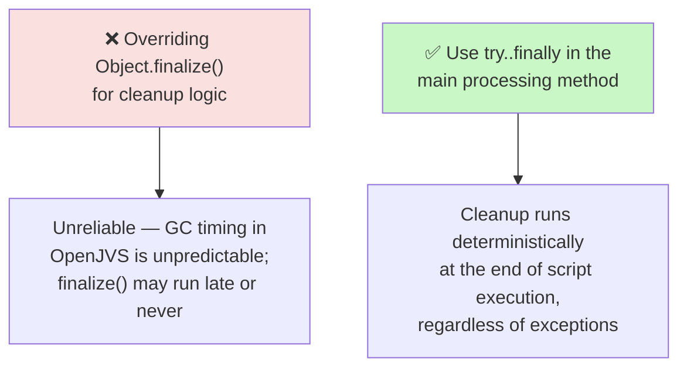

```java
try {
    // main processing logic
} finally {
    // deterministic cleanup — runs whether or not an exception occurred
}
```

This rule directly complements `DestroyableObjectStore` (Common Framework, Section 6.4): native-memory cleanup is handled automatically at script termination via `BasicScript`, so **manual** cleanup that isn't covered by `DestroyableObjectStore` should use `try..finally`, never `finalize()`.

---

## 11. 8.10 Logging

> Endur is a **very big and sometimes non-transparent system**. This is why Endur needs a **good logging solution** to track errors.

### 11.1 Implementation Details

> To guarantee that the logging implementation is stable, the structure was created starting with an **abstract class**, where the basic logging methods are present.

- **`AbstractLog`** defines four abstract methods:
  - `abstract debug(String message)`
  - `abstract info(String message)`
  - `abstract warning(String message)`
  - `abstract error(String message)`
- The class **`Log`** **inherits `AbstractLog`**, overrides the four methods, and adds additional methods. `Log` provides the functionality to log messages **via a log writer**.

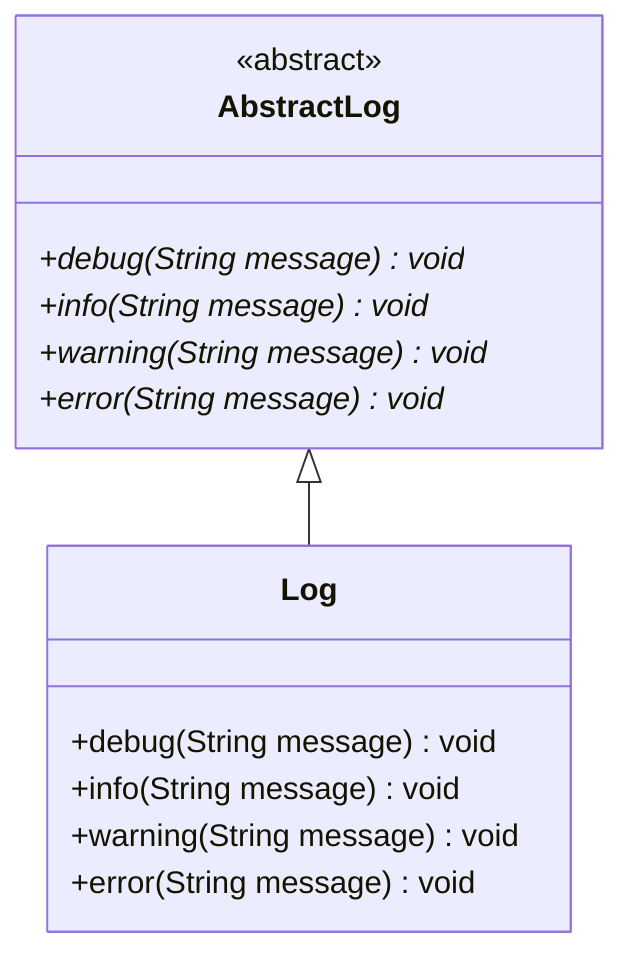

### 11.2 The Log Class

> The `Log` class is the **basis for all logging**. It contains various methods for logging info, warning, error and debug log messages. The `BasicScript` class has an instance of the `Log` class **built in** with convenience methods.

**Two usage rules:**

| Situation | Rule |
|---|---|
| Class **extends `BasicScript`** | **Do not** instantiate a new `Log` — use `BasicScript`'s built-in convenience methods (`info(...)`, `warning(...)`, `error(...)`, `debug(...)`) directly. |
| Class does **not** extend `BasicScript` | May create a **new instance** of `Log` — but it must **NEVER be declared static**. |

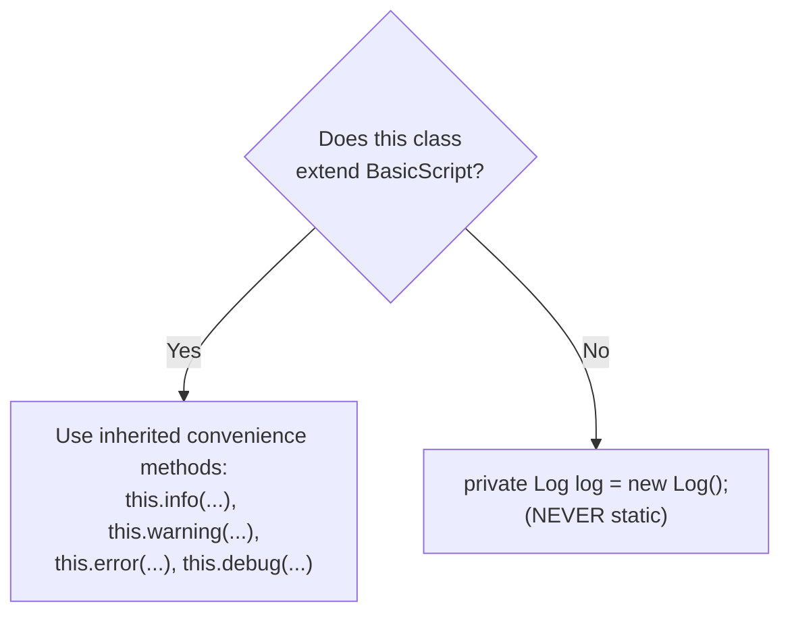

### 11.3 Log Writers

> Log writers are used by the `Log` class to direct log messages to various places i.e. a log file, the oconsole, nt event log, user table etc.

| Log Writer Class | Description |
|---|---|
| **`FileLogWriter`** | Writes to a log file in the standard daily reports folder, named after the **script name**. |
| **`FileTaskNameLogWriter`** | Writes to a log file named after the **script name AND task name**. |
| **`OConsoleLogWriter`** | Writes log messages to **OConsole**. |
| **`NtEventLogWriter`** | Writes log messages to the **Windows NT Event Log**. |
| **`SuppressLogWriter`** | **Suppresses** log messages (**not recommended**). |

> Additional log writers can be created if needed. For a class to be a log writer it must **implement the `ILogWriter` interface** and have the **same package as the `Log` class**.

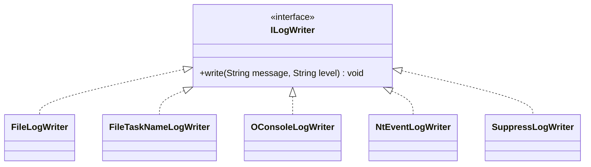

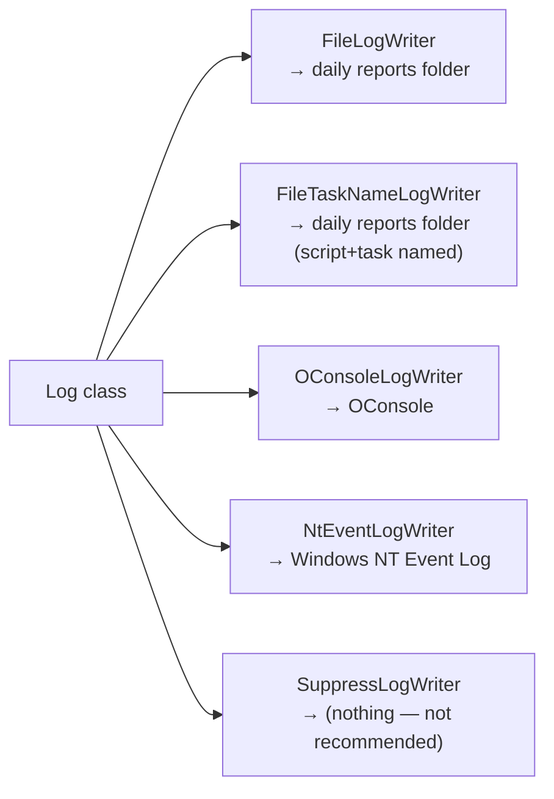

### 11.4 How to Assign Log Writers

> The **Constants Repository** is used to associate log writers to scripts. If no log writer has been assigned to a script, the default is to use **`FileLogWriter`** and **`OConsoleLogWriter`**.

**Example Constants Repository entries:**

| Context | Sub-Context | Variable Name | Type | String Value |
|---|---|---|---|---|
| Logging | Writer | `ReportMain` | String | `FileLogWriter,OConsoleLogWriter` |
| Logging | Writer | `ReportMain:ERROR` | String | `NtEventLogWriter` |
| Logging | Writer | `ALL` | String | `FileLogWriter, OConsoleLogWriter` |
| Logging | Writer | `ALL:DEBUG` | String | `FileLogWriter` |

**Reading this table:**
- Script `ReportMain`: **INFO/WARNING/DEBUG** → `FileLogWriter` + `OConsoleLogWriter`; **ERROR** → only `NtEventLogWriter`.
- All **other** scripts: **INFO/WARNING/ERROR** → `FileLogWriter` + `OConsoleLogWriter`; **DEBUG** → only `FileLogWriter`.

> The Constants Repository variable name defines the script and log level that the log writers apply to. The entry **`ALL`** will be used if there is no entry for the script. If no `ALL` entry is found, the default is `FileLogWriter` + `OConsoleLogWriter`.

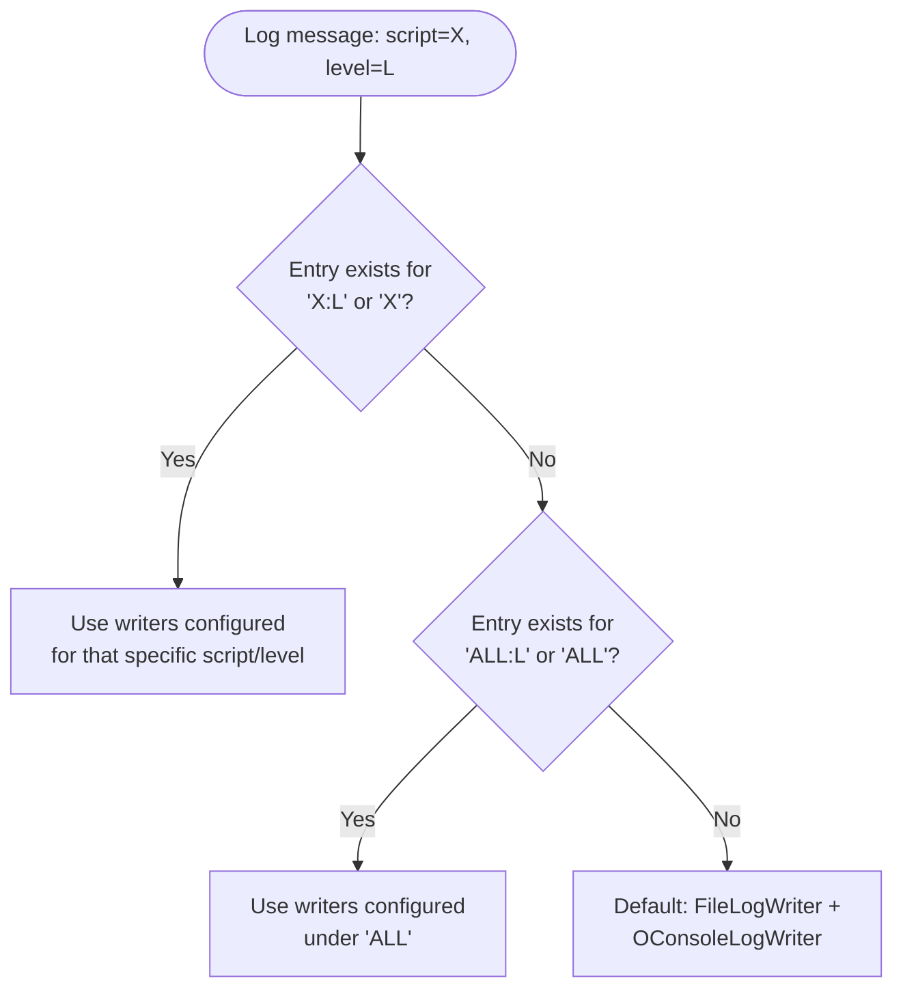

### 11.5 Setting Logging Levels

> The debug level can be set for individual scripts by placing an entry in the **Constant Repository**. Context = **`Logging`**, sub-context = **`LogLevel`**, variable name = the **main entry script name**. Value = one of **`info`, `warn`, `error`, `debug`**.

**Example:**

| Context | Sub Context | Variable Name | Type | String Value |
|---|---|---|---|---|
| Logging | LogLevel | `OcNeonDealPush` | String | `debug` |

> The **default log level** if no entry is in the Constant Repository is **`info`**.

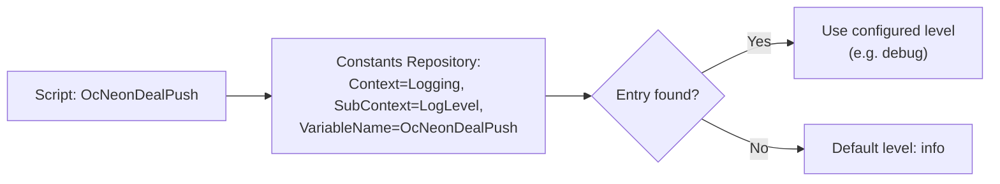

### 11.6 Logging Considerations

> Logging is obviously extremely useful... But careful decisions need to be made as to what categories should be used. **Too much logging** and the log files become cluttered and hard to follow; **not enough logging** and there will not be enough information to determine what the script is doing.

| Log Category | Use For |
|---|---|
| **DEBUG** | Detailed information, may include variable values — useful for debugging the plug-in. |
| **INFO** | Plug-in progress info — what the plug-in is currently doing. |
| **WARNING** | Something unexpected happened but does **not** cause significant issues; plug-in can continue. |
| **ERROR** | A significant issue that needs attention and causes the plug-in to be **unable to continue** the current process. |

**The golden rule on logging exceptions:**

> The general rule of thumb is that **if your piece of code is handling the exception then log it**; however **if your code is throwing the exception then DO NOT log it** — let the calling method handle it. The abstract class `BasicScript` will log all exceptions that propagate up to that level.

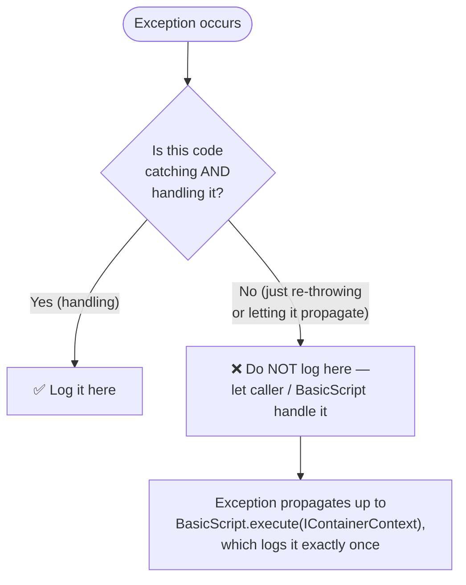

This prevents the classic anti-pattern of the **same exception being logged multiple times** as it bubbles up through several catch blocks.

### 11.7 Logging of Deal and Transaction Numbers

> Scripts that process deals should **log which deal they are processing**. This aids investigation into what happened to a deal when something goes wrong.

**Three methods provided by the logging framework:**

| Method | Effect |
|---|---|
| `public void setTranNumForLogging(int tranNum)` | All subsequent log messages are **prepended with the transaction number**, until cleared. If a deal number is later set, the deal number takes precedence in the log prefix. |
| `public void setDealNumForLogging(int dealNum)` | All subsequent log messages are **prepended with the deal number**, until cleared. This **overrides** a previously set transaction number in the log prefix. |
| `public void clearLoggingDealAndTranNum()` | Clears the logged deal/transaction number so messages are **no longer prepended**. |

```mermaid
sequenceDiagram
    participant Script
    participant Log

    Script->>Log: setTranNumForLogging(12345)
    Note over Log: All messages now prefixed "[Tran 12345]"
    Script->>Log: info("Processing started")
    Note over Log: Logs: "[Tran 12345] Processing started"
    Script->>Log: setDealNumForLogging(999)
    Note over Log: Deal number now takes priority:\n"[Deal 999]" overrides tran prefix
    Script->>Log: info("Validating deal")
    Note over Log: Logs: "[Deal 999] Validating deal"
    Script->>Log: clearLoggingDealAndTranNum()
    Note over Log: Prefix cleared
    Script->>Log: info("Script complete")
    Note over Log: Logs: "Script complete" (no prefix)
```

---

## 12. 8.11 Exception Handling

### Core Principles

> Generally **all exceptions thrown should be unchecked exceptions**. Checked exceptions should only be thrown if the exception is useful to the calling method **and** it is possible for the calling method to take an alternative action.

> Checked exceptions thrown by methods that are called should be **caught and handled appropriately**. If the exception cannot be recovered from, **package it into a `RuntimeException`** and throw that. Checked exceptions should **not be re-thrown** unless there is a very good reason. If a checked exception doesn't need handling, **add a comment explaining why**.

> The **exception to this rule is `OException`** — since it's thrown throughout the OpenJVS API, it's acceptable to let it propagate up the stack and be handled by `BasicScript`.

> **Before throwing an exception, run any necessary cleanup code.**

```mermaid
flowchart TD
    Start(["Method encounters a problem"]) --> Q1{"Is it OException<br/>from the OpenJVS API?"}
    Q1 -- Yes --> Propagate["✅ Let it propagate —\nBasicScript will handle it"]
    Q1 -- No --> Q2{"Is it a checked exception<br/>the caller can meaningfully act on?"}
    Q2 -- Yes --> Rethrow["Throw the checked exception\n(rare — document why)"]
    Q2 -- No --> Wrap["Wrap it into a\nFenixRuntimeException /\nRuntimeException with context,\nthen throw"]
    Wrap --> Cleanup["Run necessary cleanup\nBEFORE throwing"]
```

### Context Information Is Vital

> When throwing a new exception or catching/packaging/re-throwing, it is **vital that context information is added** to the exception message. Only then is it possible to determine **for which object or which situation** a method fails.

**Good example (from the guide):**

```java
if ((p = propertiesByName.get(propName)) == null) {
    throw new FenixRuntimeException("Property " + propName +
        " not defined for entity " + this.getEntity());
}
```

**⚠️ Cautionary example — hidden `NullPointerException`:**

```java
try {
    ...
} catch (Exception e) {
    throw new OBException("Exception when submitting order " +
        order.getId() + " with customer " +
        order.getCustomer().getId(), e);
}
```

> The above exception throw will **fail when the order is null or the customer of the order is null**. This `NullPointerException` will then **hide the real exception**.

```mermaid
sequenceDiagram
    participant Caller
    participant Method
    participant NewExc as "new OBException(...)"

    Caller->>Method: submitOrder(order)
    Method->>Method: catch (Exception e)
    Method->>NewExc: order.getCustomer().getId()
    Note over NewExc: ⚠️ If order or customer is null,\na NEW NullPointerException is thrown\nHERE, while building the message —\nmasking the original exception 'e'
    NewExc-->>Method: NullPointerException (masking bug)
    Method-->>Caller: Misleading exception!
```

**Lesson:** be careful that the *act of adding context* to an exception message doesn't itself throw a new, unrelated exception that hides the original problem.

### 12.1 Implementation of Exceptions

> The exception classes **`FenixException`** and **`FenixRuntimeException`** are provided by the common framework. It might be reasonable to add new Exceptions — it is **highly recommended to extend one of the existing `FenixExceptions`** to recognize an EET Exception easily.

```mermaid
classDiagram
    class RuntimeException {
        <<java.lang>>
    }
    class Exception {
        <<java.lang>>
    }
    class FenixException {
        "checked — extends Exception"
    }
    class FenixRuntimeException {
        "unchecked — extends RuntimeException"
    }
    class YourCustomException {
        "e.g. FenixValidationException"
    }

    Exception <|-- FenixException
    RuntimeException <|-- FenixRuntimeException
    FenixRuntimeException <|-- YourCustomException
```

**Use `FenixException`/`FenixRuntimeException` (or descendants) so it is immediately recognizable that an exception originated from EET code**, as opposed to a generic Java or OpenJVS API exception.

### 12.1.1 Alert Broker Exceptions

> The exceptions **`FenixAlertBrokerException`** and **`FenixAlertBrokerRuntimeException`** are provided for when an exception needs to be **sent to the alert broker**. These exceptions allow an **alert broker message id** to be provided in their constructors. Any descendants should **call the super constructor** and provide the alert broker message id.

> When one of these exceptions (or a descendant) is **caught by `BasicScript`**, `BasicScript` will **send an alert to the alert broker** using the message id and message contained within the thrown exception.

```mermaid
classDiagram
    class FenixException {
    }
    class FenixRuntimeException {
    }
    class FenixAlertBrokerException {
        +FenixAlertBrokerException(alertMessageId, message)
    }
    class FenixAlertBrokerRuntimeException {
        +FenixAlertBrokerRuntimeException(alertMessageId, message)
    }
    class YourAlertException {
        +YourAlertException(message)
        "calls super(ALERT_ID, message)"
    }

    FenixException <|-- FenixAlertBrokerException
    FenixRuntimeException <|-- FenixAlertBrokerRuntimeException
    FenixAlertBrokerRuntimeException <|-- YourAlertException
```

```mermaid
sequenceDiagram
    participant Plugin as YourPlugin.execute(argt, returnt)
    participant Exc as YourAlertException
    participant BS as BasicScript.execute(IContainerContext)
    participant Log
    participant Alert as Alert Broker

    Plugin->>Exc: throw new YourAlertException("Deal validation failed")
    Note over Exc: super(ALERT_MESSAGE_ID, message)
    Exc-->>BS: exception propagates up
    activate BS
    BS->>Log: log exception details
    BS->>Alert: sendAlert(ALERT_MESSAGE_ID, message)
    deactivate BS
```

**Why this matters:** this is the mechanism that turns a Java exception into a **real-world operational alert** (e.g., paging an ops team) — without every plug-in needing to manually call an Alert Broker API. Simply throwing the right exception type is enough; `BasicScript` does the rest.

---

## 13. 8.12 Sending E-Mail

> The class **`SendMail`** provides the ability to send emails out of a Java plug-in. Using the **JavaMail API** it will initially attempt to send emails via an **SMTP server**. If an SMTP server is unavailable, it will send an email request (as an **XML document**) to the **GO Glassfish J2EE server via Connex**. The GO Glassfish J2EE server interprets the XML document and sends the email on Fenix's behalf.

> The SMTP server, from-address, and Connex cluster to use are configured via entries in the **Constants Repository** with context **`'eMail'`**.

### Recipient Configuration (Category-Based, Not Hard-Coded)

> To send an email you have to define an email address with a **category** in the user table **`user_email_configuration`**. Therefore email addresses are **not hard-coded** — new addresses can be added without changing a script, which means **people without a scripting background** (e.g. business analysts) can manage recipients.

> To send an email use the method **`sendMail(String category, String subject, String message)`**. Sending emails works **category-wise** — it sends to the addresses defined in the user table for the given category.

### Environment Safety (dbname Column)

> To avoid sending emails to **production email addresses** during development, testing and UAT, the user table `user_email_configuration` contains a column named **`dbname`**. When sending an email, `SendMail` enquires on what database name the Endur instance is connected to and matches this to the row with the **same `dbname` column value**.

```mermaid
flowchart TD
    Call["sendMail(category, subject, message)"] --> Lookup["Query user_email_configuration<br/>WHERE category = ? AND dbname = &lt;current Endur DB&gt;"]
    Lookup --> Recipients["Resolve recipient address list<br/>(no hard-coded addresses)"]
    Recipients --> TrySmtp["Attempt send via SMTP<br/>(JavaMail API)"]
    TrySmtp -->|Success| Sent(["Email delivered"])
    TrySmtp -->|SMTP unavailable| BuildXml["Build XML email request"]
    BuildXml --> Connex["Send via Connex to<br/>GO Glassfish J2EE Server"]
    Connex --> GlassfishSend["GO Glassfish parses XML<br/>and sends the email"]
    GlassfishSend --> Sent
```

```mermaid
sequenceDiagram
    participant Plugin
    participant SendMail
    participant UserTable as user_email_configuration
    participant SMTP as SMTP Server
    participant Connex
    participant Glassfish as GO Glassfish J2EE Server

    Plugin->>SendMail: sendMail("RISK_ALERT", subject, message)
    SendMail->>UserTable: lookup addresses for category<br/>+ current dbname
    UserTable-->>SendMail: recipient list
    SendMail->>SMTP: attempt send
    alt SMTP available
        SMTP-->>SendMail: sent OK
    else SMTP unavailable
        SendMail->>Connex: send XML email request
        Connex->>Glassfish: forward XML request
        Glassfish->>Glassfish: parse XML, send email
    end
    SendMail-->>Plugin: done
```

**Why this design matters:**

| Design choice | Benefit |
|---|---|
| Category-based recipients in `user_email_configuration` | Non-developers can change recipients; no code changes/deployments needed |
| SMTP-primary, Connex-fallback | Resilience — email still gets sent even if the direct SMTP path is down |
| `dbname` column matching | **Prevents accidentally emailing production distribution lists** from a dev/test/UAT environment |
| Constants Repository `'eMail'` context | Centralizes SMTP server, from-address, and Connex cluster configuration outside of code |

---

## 14. End-to-End Plug-in Lifecycle Diagram

Putting Sections 8.1–8.12 together — the full lifecycle of a well-built OpenJVS plug-in:

```mermaid
sequenceDiagram
    participant Endur
    participant BS as BasicScript (any plug-in type)
    participant Log
    participant Plugin as Your Plugin Logic
    participant DOS as DestroyableObjectStore
    participant Exc as FenixAlertBrokerRuntimeException
    participant Alert as Alert Broker
    participant Mail as SendMail

    Endur->>BS: execute(IContainerContext context)
    activate BS
    BS->>Log: log "script starting"
    BS->>Plugin: execute(argt, returnt)  [per plug-in type contract]
    activate Plugin
    Plugin->>DOS: create/manage Table, Transaction, etc.
    Plugin->>Log: this.info(...) / this.debug(...) [only if handling, not just propagating]
    alt Business error occurs
        Plugin->>Exc: throw new FenixAlertBrokerRuntimeException(id, msg)
        Exc-->>BS: propagates (NOT logged again by Plugin)
    else Success path
        Plugin->>Mail: SendMail.sendMail(category, subject, message)  [optional]
    end
    deactivate Plugin
    BS->>Log: log exception (if any)
    BS->>Alert: sendAlert(id, msg)  [if Alert Broker exception]
    BS->>DOS: destroy all tracked objects
    BS->>Log: log "script ending"
    deactivate BS
    BS-->>Endur: control returns
```

---

## 15. Practical Checklist for Developers

- [ ] **Package name starts `com.eon.eet.fenix`**, with `com.eon.eet.fenix.common` reserved for framework classes.
- [ ] **Extend the correct ancestor for the plug-in type**: `BasicScript` (Main/Output/OpServices/Connex), `BasicParamScript` (Parameter), `AbstractUdsr` (UDSR).
- [ ] **Apply the correct naming convention**: `XxxMain`, `XxxParam`, `XxxOutput`, `UdsrXxx`, `OpsXxxPre`/`OpsXxxPost`, `OcXxxPre`/`OcXxxPost`.
- [ ] **Route Ops-Services-for-external-interfaces into the `Interfaces` project** instead, per Section 4.3.
- [ ] **Never override `finalize()`** — use `try..finally` for deterministic cleanup.
- [ ] **Use `BasicScript`'s built-in logging** if extending it; otherwise create a non-static `Log` instance.
- [ ] **Configure log writers/levels via the Constants Repository**, not hard-coded in the class.
- [ ] **Set deal/transaction numbers for logging** (`setDealNumForLogging`/`setTranNumForLogging`) on any script that processes deals.
- [ ] **Only log an exception where it's handled**, never where it's just thrown/propagated.
- [ ] **Throw unchecked exceptions**, extend `FenixException`/`FenixRuntimeException`, and add rich context to every exception message (while being careful not to trigger a *new* exception while building that message).
- [ ] **Use `FenixAlertBrokerException`/`FenixAlertBrokerRuntimeException`** (with an alert broker message id) whenever an issue needs to reach the Alert Broker.
- [ ] **Use `SendMail.sendMail(category, subject, message)`** with category-based recipients from `user_email_configuration` — never hard-code email addresses.

---

## Related Sections (Full Programming Guide)

- Section 5 — OpenJVS Architecture (`IScript`, `IContainerContext` — the interfaces `BasicScript` implements/bridges)
- Section 6 — The Common Framework (`BasicScript`, `BasicParamScript`, `AbstractUdsr`, `DestroyableObjectStore`, `Log`, `SendMail` in full class-level detail)
- Section 7 — The CommonExtension Project Shared Package (governance for cross-project code reuse)
- Section 9 — Data Purging (a concrete, large-scale example of `BasicScript`-based plug-in architecture via `AbstractDbPurgeSet`)
- Section 10 — Importing Code to Endur (how these plug-in classes get compiled/deployed)
- Section 11 — Debugging Code (setting breakpoints inside these plug-in classes)
