# UML Tutorial — Complete End-to-End Guide

> Reference: This guide is written in the spirit of Section 3 *"Unified Modelling Language (UML)"* of the **Programming Guide for OpenJVS Development (EET Fenix Endur)**, which points readers to the Sparx Systems UML tutorial (`www.sparxsystems.com/uml-tutorial.html`) to gain familiarity with UML before doing OpenJVS/Java object-oriented development. This document expands that single reference line into a full, self-contained UML learning resource, organized the same way most classic UML tutorials (Rational/Sparx "4+1 View Model") are organized:
>
> 1. **Use Case Model**
> 2. **Dynamic Model**
> 3. **Logical Model**
> 4. **Component Model**
> 5. **Physical Model**

---

## Table of Contents

1. [Introduction to UML](#1-introduction-to-uml)
2. [Use Case Model](#2-use-case-model)
   - 2.1 [Actors](#21-actors)
   - 2.2 [Use Cases](#22-use-cases)
   - 2.3 [Use Case Diagrams](#23-use-case-diagrams)
   - 2.4 [Sequence Diagrams (Use Case Realization)](#24-sequence-diagrams-use-case-realization)
   - 2.5 [Implementation Diagrams](#25-implementation-diagrams)
3. [Dynamic Model](#3-dynamic-model)
   - 3.1 [Sequence Diagrams](#31-sequence-diagrams)
   - 3.2 [Activity Diagrams](#32-activity-diagrams)
   - 3.3 [Statechart Diagrams](#33-statechart-diagrams)
   - 3.4 [Process Model](#34-process-model)
4. [Logical Model](#4-logical-model)
   - 4.1 [Class Model](#41-class-model)
   - 4.2 [Inheritance](#42-inheritance)
5. [Component Model](#5-component-model)
   - 5.1 [Component Notation](#51-component-notation)
   - 5.2 [Component Diagrams](#52-component-diagrams)
   - 5.3 [Interfaces](#53-interfaces)
   - 5.4 [Components and Nodes](#54-components-and-nodes)
   - 5.5 [Requirements](#55-requirements)
   - 5.6 [Constraints](#56-constraints)
   - 5.7 [Scenarios](#57-scenarios)
   - 5.8 [Traceability](#58-traceability)
   - 5.9 [Server Components](#59-server-components)
   - 5.10 [Security Components](#510-security-components)
6. [Physical Model](#6-physical-model)
   - 6.1 [Deployment View](#61-deployment-view)
   - 6.2 [Physical Model](#62-physical-model)
7. [Summary Cheat Sheet](#7-summary-cheat-sheet)

---

## 1. Introduction to UML

**UML (Unified Modeling Language)** is a general-purpose, graphical modeling language used to visualize, specify, construct, and document the artifacts of a software system. It was created by Grady Booch, James Rumbaugh, and Ivar Jacobson (the "Three Amigos") at Rational Software, and is now maintained as a standard by the **Object Management Group (OMG)**.

### Why UML Matters

- It gives developers, architects, and business analysts a **common visual language**.
- It separates **what the system does** (behavior) from **how it is structured** (structure).
- It supports the full software lifecycle: requirements → analysis → design → implementation → deployment.
- Diagrams generated from a UML model are **traceable** back to requirements, meaning every design element can be justified.

### The "4+1" / Five-View Architecture

Classic UML tutorials (including the Sparx Systems tutorial referenced in the OpenJVS guide) organize UML diagrams into **five model views**, each answering a different architectural question:

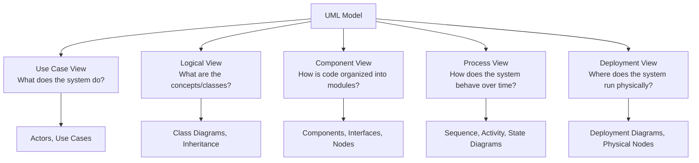
```mermaid
graph TD
    A[UML Model] --> B[Use Case View<br/>What does the system do?]
    A --> C[Logical View<br/>What are the concepts/classes?]
    A --> D[Component View<br/>How is code organized into modules?]
    A --> E[Process View<br/>How does the system behave over time?]
    A --> F[Deployment View<br/>Where does the system run physically?]

    B --> B1[Actors, Use Cases]
    C --> C1[Class Diagrams, Inheritance]
    D --> D1[Components, Interfaces, Nodes]
    E --> E1[Sequence, Activity, State Diagrams]
    F --> F1[Deployment Diagrams, Physical Nodes]
```

| View | Primary Question | Primary Diagrams |
|---|---|---|
| **Use Case View** | What should the system do, for whom? | Use Case Diagram, Actor list |
| **Logical View** | What are the classes, objects, and relationships? | Class Diagram, Object Diagram |
| **Component View** | How is the system's code/modules organized? | Component Diagram, Interface Diagram |
| **Process/Dynamic View** | How do objects communicate and change state over time? | Sequence, Activity, State, Collaboration Diagrams |
| **Deployment View** | Where does the software physically execute? | Deployment Diagram |

### UML 2.x Diagram Taxonomy

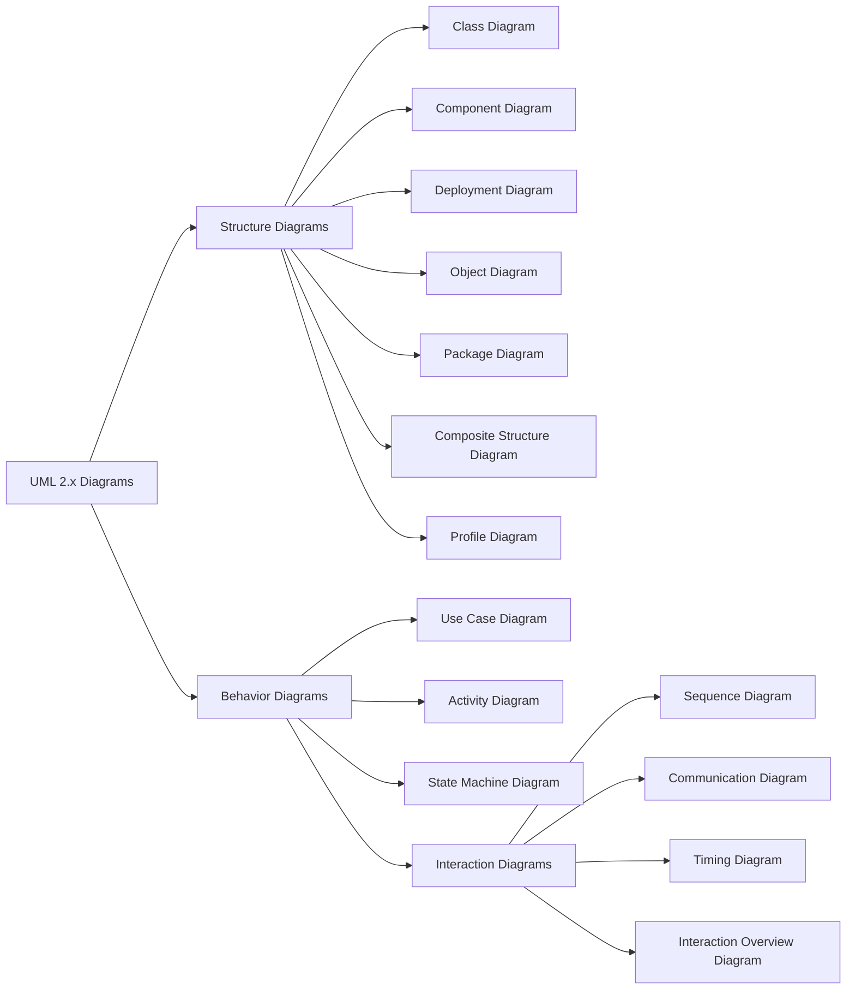
```mermaid
graph LR
    UML[UML 2.x Diagrams] --> Structure[Structure Diagrams]
    UML --> Behavior[Behavior Diagrams]

    Structure --> Class[Class Diagram]
    Structure --> Component[Component Diagram]
    Structure --> Deployment[Deployment Diagram]
    Structure --> Object[Object Diagram]
    Structure --> Package[Package Diagram]
    Structure --> Composite[Composite Structure Diagram]
    Structure --> Profile[Profile Diagram]

    Behavior --> UseCase[Use Case Diagram]
    Behavior --> Activity[Activity Diagram]
    Behavior --> State[State Machine Diagram]
    Behavior --> Interaction[Interaction Diagrams]

    Interaction --> Sequence[Sequence Diagram]
    Interaction --> Communication[Communication Diagram]
    Interaction --> Timing[Timing Diagram]
    Interaction --> Overview[Interaction Overview Diagram]
```

---

## 2. Use Case Model

The **Use Case Model** captures **functional requirements** — what the system must do from the perspective of its users. It is the starting point of most UML-based analysis, and typically the first model built before the Logical, Component, or Deployment models.

### 2.1 Actors

An **Actor** represents any external entity that interacts with the system: a human user, an external system, a device, or time itself (a scheduler/cron trigger).

**Characteristics of an Actor:**
- Sits **outside** the system boundary.
- Has a **role**, not necessarily a specific individual (e.g., "Trader," not "John Smith").
- Can be a **Primary Actor** (initiates the use case to achieve a goal) or a **Secondary/Supporting Actor** (the system needs help from them to complete the goal, e.g., an external interface or database).
- Notated as a **stick figure** with a role name underneath, or as a classifier with the `«actor»` stereotype for non-human actors (systems, timers).

**Types of Actors:**

| Type | Description | Example (from Endur/OpenJVS context) |
|---|---|---|
| **Primary/Human Actor** | A person who triggers the use case | Trader, Risk Manager, Operations User |
| **Secondary/System Actor** | An external system the use case depends on | GO Glassfish J2EE server, SMTP Server, Connex Cluster |
| **Timer Actor** | Time-driven trigger | Scheduled workflow task (e.g., `DbPurgeDailyMain`) |
| **Device Actor** | Hardware interacting with the system | Market data feed handler |

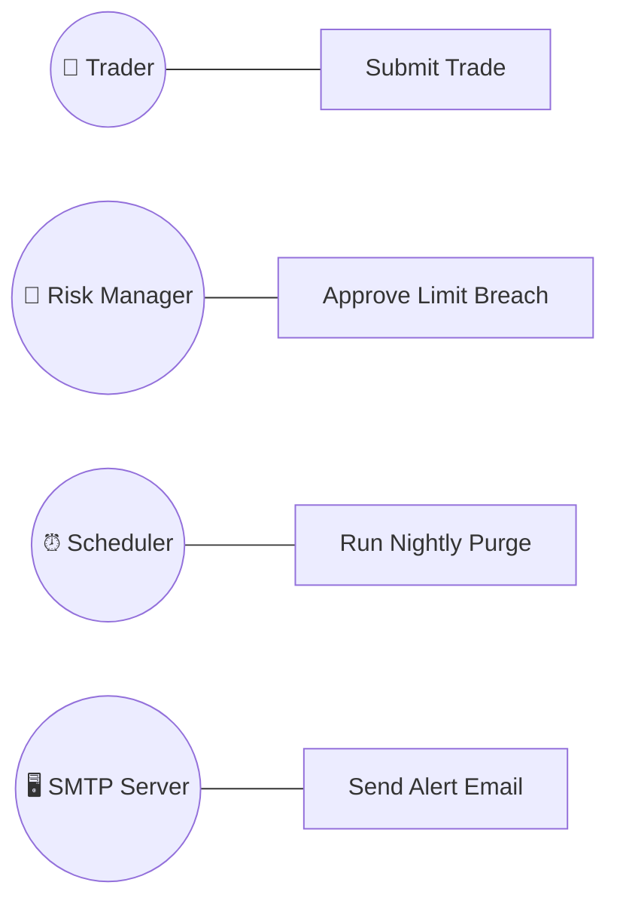
```mermaid
graph LR
    A((👤 Trader)) --- UC1[Submit Trade]
    B((👤 Risk Manager)) --- UC2[Approve Limit Breach]
    C((⏰ Scheduler)) --- UC3[Run Nightly Purge]
    D((🖥️ SMTP Server)) --- UC4[Send Alert Email]
```

### 2.2 Use Cases

A **Use Case** describes a discrete piece of functionality that provides a measurable result of value to an actor. It is drawn as an **oval/ellipse** with a descriptive verb-noun name (e.g., "Purge User Table", "Import Delimited File").

**A well-formed use case specification includes:**
1. **Name** — short, verb-based.
2. **Actors** — primary and secondary.
3. **Preconditions** — what must be true before the use case starts.
4. **Main (Basic) Flow** — the "happy path" step-by-step interaction.
5. **Alternate Flows** — variations, e.g., validation failure.
6. **Exception Flows** — error handling paths.
7. **Postconditions** — the state of the system after successful completion.

**Example — Use Case Specification: "Import Delimited File"**

| Field | Value |
|---|---|
| Name | Import Delimited File |
| Primary Actor | OpenJVS Developer / Scheduled Script |
| Preconditions | XML definition file exists in `/User/Import File Definitions` |
| Main Flow | 1. Script calls `DelimitedFileImporter.importFile()`. 2. System reads XML definition. 3. System parses CSV rows. 4. System validates each column. 5. System populates memory table. |
| Alternate Flow | If `validation_error="continue"`, log the error and proceed to next row. |
| Exception Flow | If `validation_error="fail"`, throw an exception and abort import. |
| Postcondition | Memory table contains validated data ready for further processing. |

### Relationships Between Use Cases

| Relationship | Notation | Meaning |
|---|---|---|
| **Association** | Solid line | Actor participates in the use case |
| **Include** | Dashed arrow, `«include»` | Base use case *always* incorporates the behavior of another (mandatory, reusable sub-flow) |
| **Extend** | Dashed arrow, `«extend»` | Optional behavior inserted into a base use case at an *extension point* (conditional) |
| **Generalization** | Solid line + hollow triangle | A specialized use case/actor inherits the behavior of a general one |

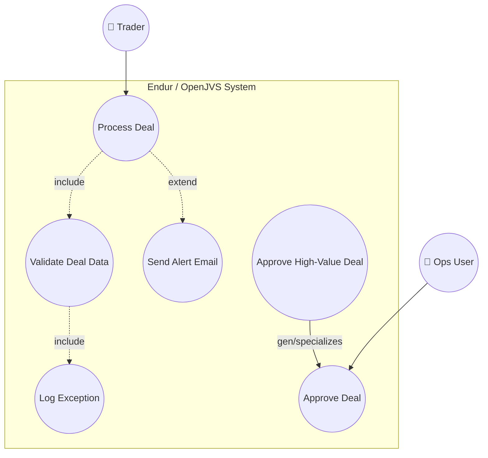
```mermaid
graph TD
    subgraph System_Boundary["Endur / OpenJVS System"]
        UC1((Process Deal))
        UC2((Validate Deal Data))
        UC3((Send Alert Email))
        UC4((Log Exception))
        UC5((Approve Deal))
        UC6((Approve High-Value Deal))
    end

    Trader((👤 Trader)) --> UC1
    Ops((👤 Ops User)) --> UC5
    UC1 -.include.-> UC2
    UC1 -.extend.-> UC3
    UC2 -.include.-> UC4
    UC6 --gen/specializes--> UC5
```

### 2.3 Use Case Diagrams

A **Use Case Diagram** is the graphical summary of actors, use cases, the system boundary, and their relationships. It is intentionally high-level — it does **not** show internal implementation, only external, observable behavior.

**Notation summary:**

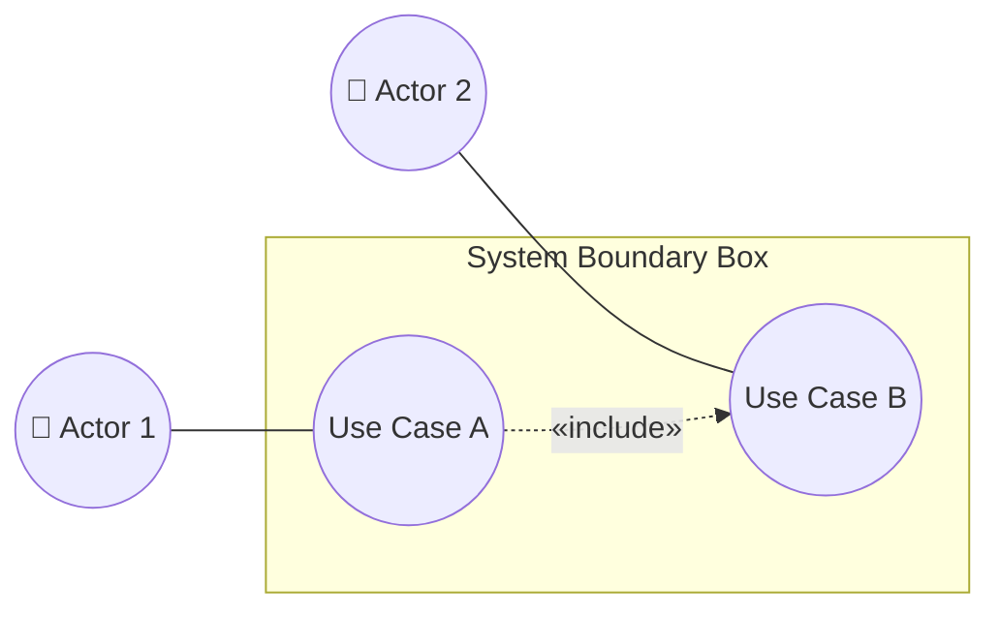
```mermaid
graph LR
    subgraph "System Boundary Box"
        direction TB
        UC_A(("Use Case A"))
        UC_B(("Use Case B"))
    end
    Actor1((👤 Actor 1)) --- UC_A
    Actor2((👤 Actor 2)) --- UC_B
    UC_A -.«include».-> UC_B
```

**Full worked example — Data Purging Subsystem (based on the OpenJVS Purging Framework):**

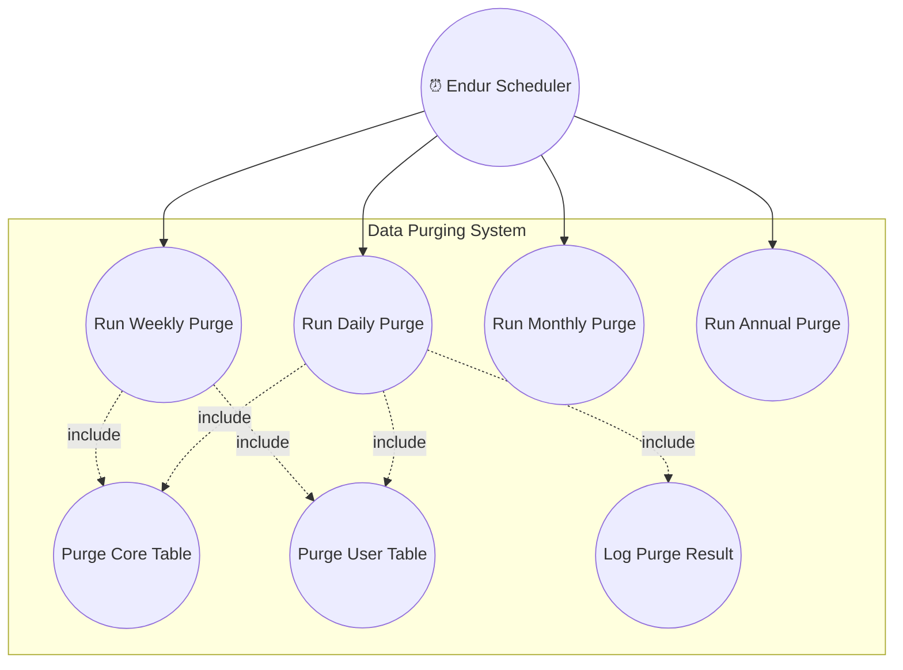
```mermaid
graph TD
    subgraph "Data Purging System"
        UC1((Run Daily Purge))
        UC2((Run Weekly Purge))
        UC3((Run Monthly Purge))
        UC4((Run Annual Purge))
        UC5((Purge Core Table))
        UC6((Purge User Table))
        UC7((Log Purge Result))
    end

    Scheduler((⏰ Endur Scheduler)) --> UC1
    Scheduler --> UC2
    Scheduler --> UC3
    Scheduler --> UC4

    UC1 -.include.-> UC5
    UC1 -.include.-> UC6
    UC2 -.include.-> UC5
    UC2 -.include.-> UC6
    UC1 -.include.-> UC7
```

### 2.4 Sequence Diagrams (Use Case Realization)

Once a use case is understood conceptually, it is **realized** — i.e., mapped onto interacting objects/classes that will implement it. This realization is documented with a **Sequence Diagram**, which shows the exact **order of messages** exchanged between the actor and system objects to accomplish the use case.

This is the bridge between the **Use Case Model** (what) and the **Logical/Dynamic Model** (how). See [Section 3.1](#31-sequence-diagrams) for full sequence-diagram notation; below is a use-case-realization-focused example.

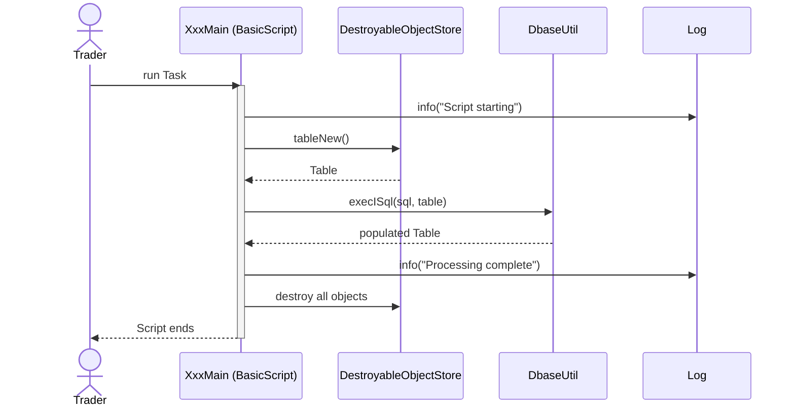
```mermaid
sequenceDiagram
    actor Trader
    participant Main as XxxMain (BasicScript)
    participant DOS as DestroyableObjectStore
    participant DB as DbaseUtil
    participant Log as Log

    Trader->>Main: run Task
    activate Main
    Main->>Log: info("Script starting")
    Main->>DOS: tableNew()
    DOS-->>Main: Table
    Main->>DB: execISql(sql, table)
    DB-->>Main: populated Table
    Main->>Log: info("Processing complete")
    Main->>DOS: destroy all objects
    Main-->>Trader: Script ends
    deactivate Main
```

### 2.5 Implementation Diagrams

In classic UML tutorials, "**Implementation Diagrams**" is the umbrella term for the two structural diagram types that show how a use-case realization is actually *built and deployed*:

1. **Component Diagrams** — show the physical/logical packaging of code (source files, executables, libraries, DLLs, `.jar` files, plugins).
2. **Deployment Diagrams** — show the physical hardware nodes that components run on.

These are covered in full in [Section 5 (Component Model)](#5-component-model) and [Section 6 (Physical Model)](#6-physical-model). In the context of the Use Case Model, an "implementation diagram" simply confirms **traceability**: each use case realization must ultimately map to one or more components deployed onto one or more nodes.

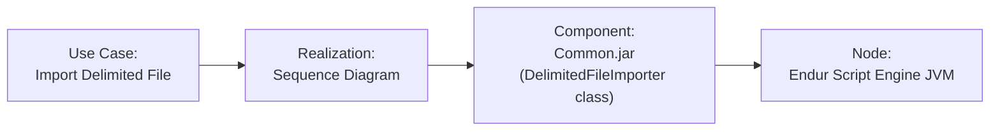
```mermaid
graph LR
    UC[Use Case:<br/>Import Delimited File] --> Real[Realization:<br/>Sequence Diagram]
    Real --> Comp["Component:<br/>Common.jar<br/>(DelimitedFileImporter class)"]
    Comp --> Node["Node:<br/>Endur Script Engine JVM"]
```

---

## 3. Dynamic Model

The **Dynamic Model** (a.k.a. **Behavioral Model**) describes how the system behaves **over time** — the sequence of interactions, changes of state, and workflow logic that occur when the system executes.

### 3.1 Sequence Diagrams

A **Sequence Diagram** shows objects as vertical **lifelines** and messages between them as **horizontal arrows**, ordered top-to-bottom by time. It is the most common way to model a single scenario/interaction in detail.

**Key Notation:**

| Element | Symbol | Meaning |
|---|---|---|
| **Lifeline** | Vertical dashed line under a named box | Represents an object's existence over time |
| **Activation Bar** | Thin rectangle on lifeline | Object is actively executing/processing |
| **Synchronous Message** | Solid line, filled arrowhead | Caller waits for response |
| **Asynchronous Message** | Solid line, open arrowhead | Caller does not wait |
| **Return Message** | Dashed line, open arrowhead | Value returned from a call |
| **Self-Message** | Loop back to same lifeline | Object calls its own method |
| **Combined Fragment** | Labeled box (`alt`, `opt`, `loop`) | Conditional/looping logic |
| **Destroy Marker** | `X` at bottom of lifeline | Object lifecycle ends |

**Example 1 — Basic Object Interaction**

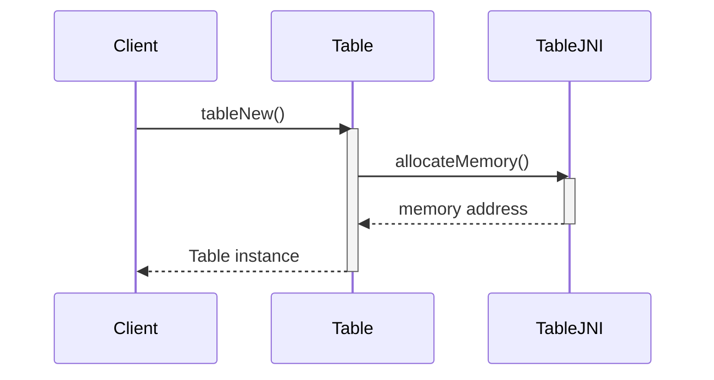
```mermaid
sequenceDiagram
    participant Client
    participant Table
    participant TableJNI

    Client->>Table: tableNew()
    activate Table
    Table->>TableJNI: allocateMemory()
    activate TableJNI
    TableJNI-->>Table: memory address
    deactivate TableJNI
    Table-->>Client: Table instance
    deactivate Table
```

**Example 2 — Exception Handling Flow with Combined Fragments**

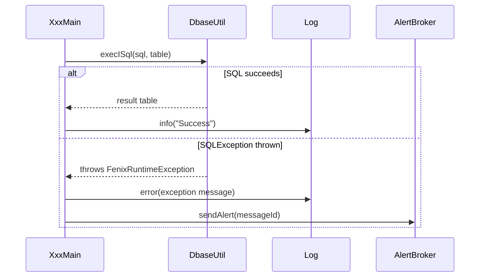
```mermaid
sequenceDiagram
    participant Script as XxxMain
    participant DB as DbaseUtil
    participant Log
    participant Alert as AlertBroker

    Script->>DB: execISql(sql, table)
    alt SQL succeeds
        DB-->>Script: result table
        Script->>Log: info("Success")
    else SQLException thrown
        DB-->>Script: throws FenixRuntimeException
        Script->>Log: error(exception message)
        Script->>Alert: sendAlert(messageId)
    end
```

**Example 3 — Loop Fragment (Table Row Iteration)**

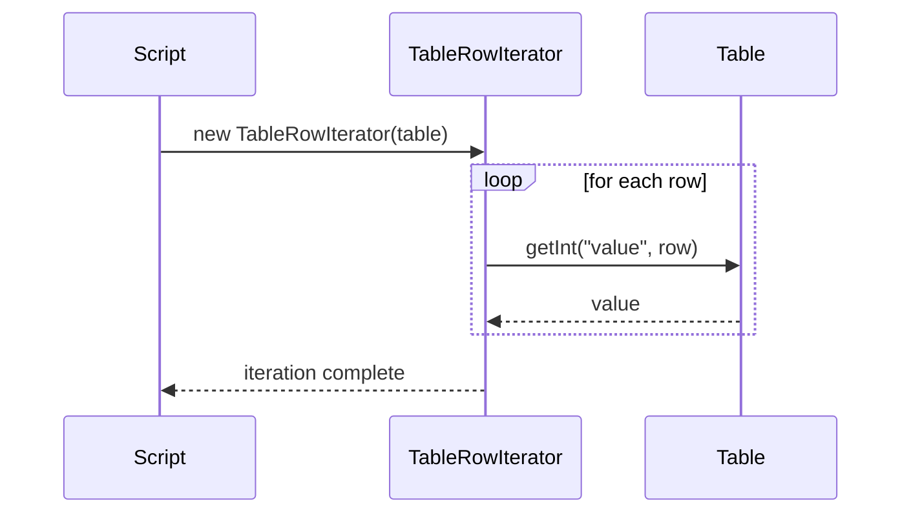
```mermaid
sequenceDiagram
    participant Script
    participant Iterator as TableRowIterator
    participant Table

    Script->>Iterator: new TableRowIterator(table)
    loop for each row
        Iterator->>Table: getInt("value", row)
        Table-->>Iterator: value
    end
    Iterator-->>Script: iteration complete
```

### 3.2 Activity Diagrams

An **Activity Diagram** models the **workflow / control flow** of a process — similar to a flowchart, but with UML-specific notation for concurrency (fork/join), decisions, and swimlanes representing responsibility.

**Notation:**

| Element | Symbol | Meaning |
|---|---|---|
| **Initial Node** | Solid filled circle | Start of the workflow |
| **Activity/Action** | Rounded rectangle | A step or task |
| **Decision Node** | Diamond | Branching logic (if/else) |
| **Fork/Join** | Solid bar | Parallel/concurrent flows split or merge |
| **Final Node** | Circle with ring (bullseye) | End of the workflow |
| **Swimlane** | Vertical/horizontal partition | Which actor/component is responsible |

**Example — Data Purging Workflow (from the Purging Framework):**


```mermaid
flowchart TD
    Start((Start)) --> A[Load Purge Configuration]
    A --> B{Purge Type?}
    B -- Daily --> C[Run DbPurgeDailyMain]
    B -- Weekly --> D[Run DbPurgeWeeklyMain]
    B -- Monthly --> E[Run DbPurgeMonthlyMain]
    B -- Annually --> F{Is Today the<br/>Annual Purge Date?}
    F -- Yes --> G[Run DbPurgeAnnuallyMain]
    F -- No --> Z((End))
    C --> H[Iterate Registered<br/>IPurgeTable Classes]
    D --> H
    E --> H
    G --> H
    H --> I[purgeTable&#40;&#41;<br/>collects rows to delete]
    I --> J{Rows > Max<br/>Purge Rows?}
    J -- Yes --> K[Purge in Batches]
    J -- No --> L[Purge in Single Pass]
    K --> M[Log Result]
    L --> M
    M --> Z2((End))
```

**Example — Exception Handling Activity Diagram with Swimlanes:**


```mermaid
flowchart TD
    subgraph Script["OpenJVS Script"]
        S1[Start execute&#40;&#41;] --> S2[Call Business Logic]
        S2 --> S3{Exception Thrown?}
    end
    subgraph BasicScript["BasicScript &#40;Framework&#41;"]
        B1[Catch Exception] --> B2[Log Exception]
        B2 --> B3{Is Alert Broker<br/>Exception?}
        B3 -- Yes --> B4[Send Alert to Broker]
        B3 -- No --> B5[Skip Alert]
        B4 --> B6[Destroy Stored Objects]
        B5 --> B6
        B6 --> B7[Exit Script Cleanly]
    end
    S3 -- Yes --> B1
    S3 -- No --> B6
```

### 3.3 Statechart Diagrams

A **Statechart Diagram** (a.k.a. **State Machine Diagram**) models the **lifecycle of a single object** — the states it can be in, and the events/triggers that cause it to transition between states. This is especially useful for objects with complex lifecycles (e.g., a Deal, a Trade, a Workflow Task, a JVM Debug Session).

**Notation:**

| Element | Symbol | Meaning |
|---|---|---|
| **Initial State** | Solid filled circle | Object creation |
| **State** | Rounded rectangle | A condition/situation during the object's life |
| **Transition** | Arrow labeled `event [guard] / action` | Change from one state to another |
| **Final State** | Circle with ring | Object destroyed / end of lifecycle |
| **Composite State** | Nested rectangle | A state containing sub-states |

**Example — Deal/Transaction Lifecycle:**

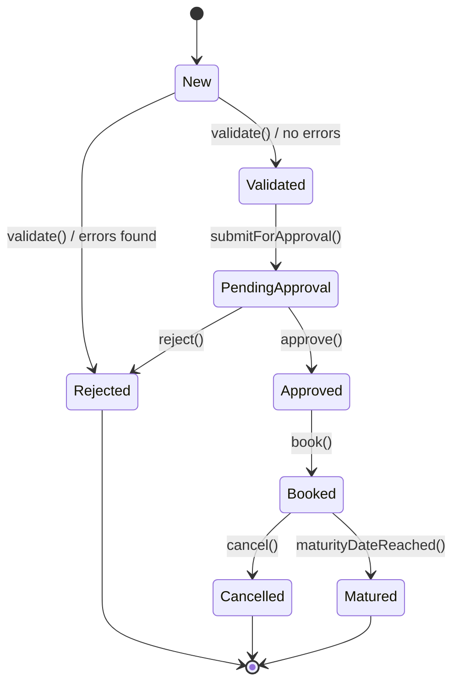
```mermaid
stateDiagram-v2
    [*] --> New
    New --> Validated : validate() / no errors
    New --> Rejected : validate() / errors found
    Validated --> PendingApproval : submitForApproval()
    PendingApproval --> Approved : approve()
    PendingApproval --> Rejected : reject()
    Approved --> Booked : book()
    Booked --> Cancelled : cancel()
    Booked --> Matured : maturityDateReached()
    Rejected --> [*]
    Cancelled --> [*]
    Matured --> [*]
```

**Example — Debug Session Lifecycle (from Section 11 of the OpenJVS Guide):**

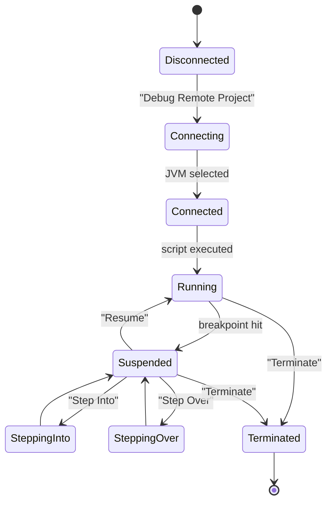
```mermaid
stateDiagram-v2
    [*] --> Disconnected
    Disconnected --> Connecting : "Debug Remote Project"
    Connecting --> Connected : JVM selected
    Connected --> Running : script executed
    Running --> Suspended : breakpoint hit
    Suspended --> Running : "Resume"
    Suspended --> SteppingInto : "Step Into"
    Suspended --> SteppingOver : "Step Over"
    SteppingInto --> Suspended
    SteppingOver --> Suspended
    Running --> Terminated : "Terminate"
    Suspended --> Terminated : "Terminate"
    Terminated --> [*]
```

### 3.4 Process Model

The **Process Model** (or *Process View*) is the architectural view that documents the system's **runtime behavior**, including:

- **Concurrency and threads** — which processes/threads execute which components.
- **Synchronization** — how shared resources (e.g., memory tables, database connections) are protected.
- **Performance and scalability** — throughput, latency, batch sizes.
- **Communication mechanisms** — synchronous calls, message queues, remote procedure calls (e.g., Connex method calls in Endur).

The Process Model is typically expressed using a combination of **Sequence Diagrams** (message order), **Activity Diagrams with swimlanes** (parallel activities), and **deployment annotations** (which process/node executes which activity).

**Example — Process View of the Purging Framework (multiple script engines processing purge sets concurrently):**

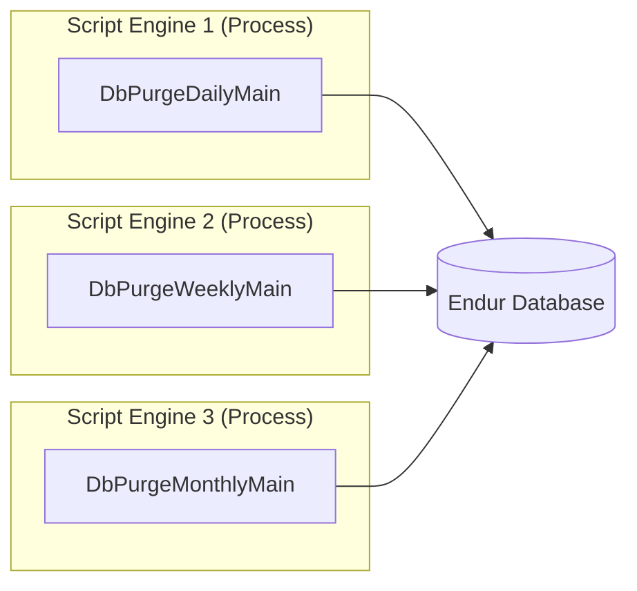
```mermaid
flowchart LR
    subgraph Node1["Script Engine 1 (Process)"]
        P1[DbPurgeDailyMain]
    end
    subgraph Node2["Script Engine 2 (Process)"]
        P2[DbPurgeWeeklyMain]
    end
    subgraph Node3["Script Engine 3 (Process)"]
        P3[DbPurgeMonthlyMain]
    end
    DB[(Endur Database)]
    P1 --> DB
    P2 --> DB
    P3 --> DB
```

**Key considerations documented in a Process Model:**

| Concern | Example from OpenJVS/Endur |
|---|---|
| **Process boundary** | Each Script Engine JVM is a separate OS process |
| **Thread safety** | `Log` instances must never be `static` because multiple threads/scripts may run concurrently |
| **Batch/throughput control** | `Purge Batch Size` Constants Repository entry controls rows purged per DB round-trip |
| **Resource cleanup** | `DestroyableObjectStore` ensures IntPtr-based native memory is released when a script's thread terminates |
| **External communication** | `SendMail` first tries SMTP synchronously, falls back to an async Connex/XML message to the GO Glassfish J2EE server |

---

## 4. Logical Model

The **Logical Model** (or *Logical View*) captures the static **structure** of the system: the classes, their attributes and operations, and the relationships between them (association, aggregation, composition, dependency, and inheritance). This is the model most developers think of first when they hear "UML diagram."

### 4.1 Class Model

A **Class Diagram** shows classes as rectangles divided into three compartments:

```
┌───────────────────────────┐
│        ClassName          │
├───────────────────────────┤
│ - attribute1 : Type       │
│ + attribute2 : Type       │
├───────────────────────────┤
│ + operation1() : ReturnT  │
│ # operation2(param: Type) │
└───────────────────────────┘
```

**Visibility notation:**

| Symbol | Visibility |
|---|---|
| `+` | Public |
| `-` | Private |
| `#` | Protected |
| `~` | Package/default |

**Relationship types:**

| Relationship | Notation | Meaning | Example |
|---|---|---|---|
| **Association** | Plain line | "Uses/knows about" | `BasicScript` uses `Log` |
| **Aggregation** | Line + hollow diamond | "Has-a" (whole/part, independent lifecycle) | `DbPurgeDailyMain` aggregates many `IPurgeTable` workers |
| **Composition** | Line + filled diamond | "Owns-a" (whole/part, dependent lifecycle) | `Table` is composed of rows (destroyed together) |
| **Dependency** | Dashed arrow | "Depends on temporarily" | `DelimitedFileImporter` depends on an XML schema file |
| **Realization** | Dashed arrow + hollow triangle | Class implements an interface | `BasicScript` realizes `IScript` |
| **Generalization** | Solid line + hollow triangle | Inheritance ("is-a") | `Table` inherits `IntPtr` |

**Full class diagram — Common Framework core classes:**

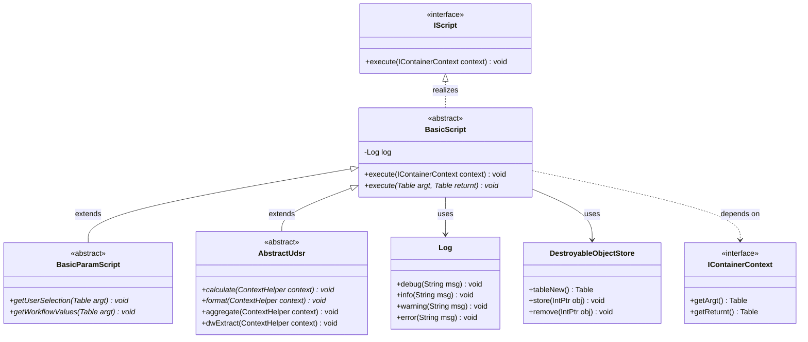
```mermaid
classDiagram
    class IScript {
        <<interface>>
        +execute(IContainerContext context) void
    }
    class IContainerContext {
        <<interface>>
        +getArgt() Table
        +getReturnt() Table
    }
    class BasicScript {
        <<abstract>>
        -Log log
        +execute(IContainerContext context) void
        +execute(Table argt, Table returnt) void*
    }
    class BasicParamScript {
        <<abstract>>
        +getUserSelection(Table argt) void*
        +getWorkflowValues(Table argt) void*
    }
    class AbstractUdsr {
        <<abstract>>
        +calculate(ContextHelper context) void*
        +format(ContextHelper context) void*
        +aggregate(ContextHelper context) void
        +dwExtract(ContextHelper context) void
    }
    class DestroyableObjectStore {
        +tableNew() Table
        +store(IntPtr obj) void
        +remove(IntPtr obj) void
    }
    class Log {
        +debug(String msg) void
        +info(String msg) void
        +warning(String msg) void
        +error(String msg) void
    }

    IScript <|.. BasicScript : realizes
    BasicScript <|-- BasicParamScript : extends
    BasicScript <|-- AbstractUdsr : extends
    BasicScript --> Log : uses
    BasicScript --> DestroyableObjectStore : uses
    BasicScript ..> IContainerContext : depends on
```

**Full class diagram — IntPtr hierarchy (native memory wrapper classes):**

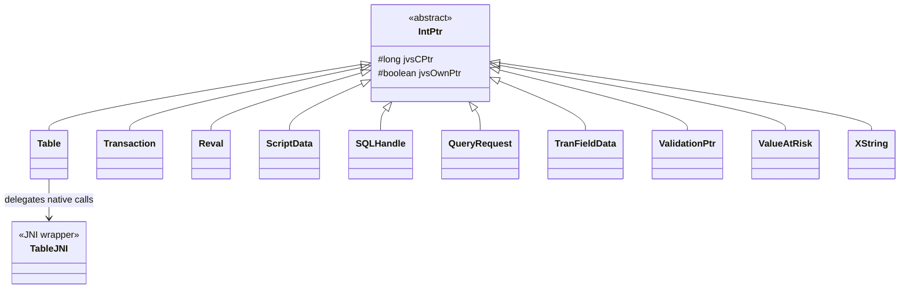
```mermaid
classDiagram
    class IntPtr {
        <<abstract>>
        #long jvsCPtr
        #boolean jvsOwnPtr
    }
    class Table
    class Transaction
    class Reval
    class ScriptData
    class SQLHandle
    class QueryRequest
    class TranFieldData
    class ValidationPtr
    class ValueAtRisk
    class XString
    class TableJNI {
        <<JNI wrapper>>
    }

    IntPtr <|-- Table
    IntPtr <|-- Transaction
    IntPtr <|-- Reval
    IntPtr <|-- ScriptData
    IntPtr <|-- SQLHandle
    IntPtr <|-- QueryRequest
    IntPtr <|-- TranFieldData
    IntPtr <|-- ValidationPtr
    IntPtr <|-- ValueAtRisk
    IntPtr <|-- XString
    Table --> TableJNI : delegates native calls
```

### 4.2 Inheritance

**Inheritance** (generalization) models an **"is-a"** relationship where a subclass acquires the attributes and operations of a superclass, and may override or extend them.

**Notation:** A solid line with a **hollow (unfilled) triangle** arrowhead pointing to the parent/superclass.

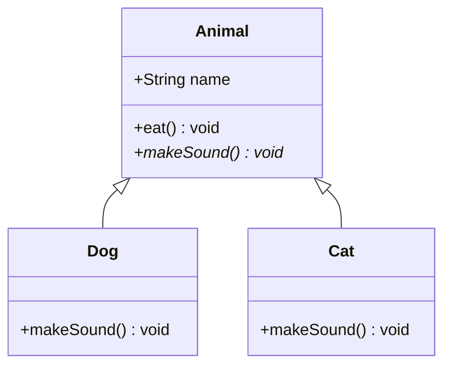
```mermaid
classDiagram
    class Animal {
        +String name
        +eat() void
        +makeSound() void*
    }
    class Dog {
        +makeSound() void
    }
    class Cat {
        +makeSound() void
    }
    Animal <|-- Dog
    Animal <|-- Cat
```

**Key inheritance concepts:**

| Concept | Description |
|---|---|
| **Abstract Class** | Cannot be instantiated directly; defines a template with one or more abstract (unimplemented) methods. Shown in *italics* or with `{abstract}`. |
| **Concrete Class** | Fully implemented; can be instantiated. |
| **Overriding** | Subclass provides its own implementation of an inherited method. |
| **Final Method** | Cannot be overridden — used by the framework to lock down control flow (e.g., `execute(IContainerContext)` in `BasicScript` is `final`). |
| **Multiple Inheritance (interfaces only in Java)** | A class can implement multiple interfaces, but extend only one class. |
| **Polymorphism** | Enables treating different subclasses uniformly through their common supertype/interface. |

**Real-world example from the OpenJVS Guide — Plug-in Type Hierarchy:**

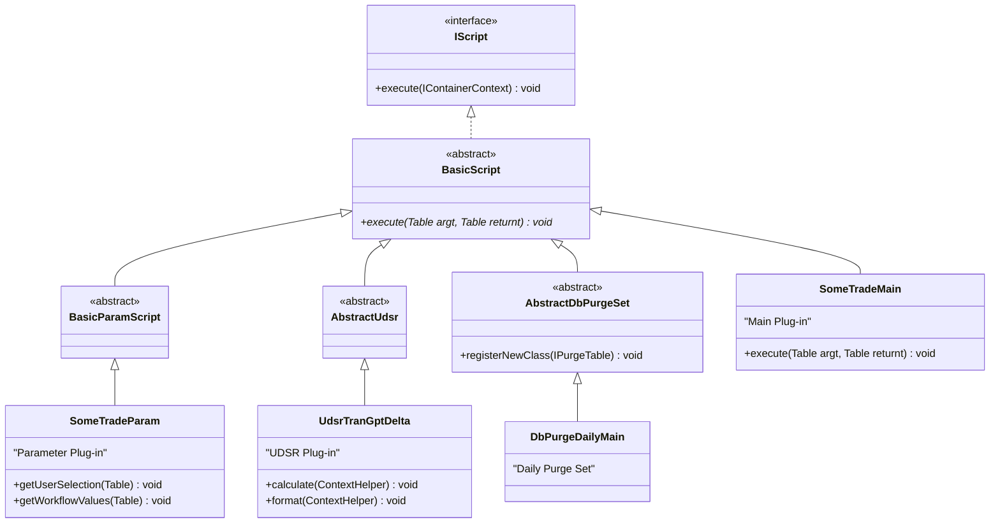
```mermaid
classDiagram
    class IScript {
        <<interface>>
        +execute(IContainerContext) void
    }
    class BasicScript {
        <<abstract>>
        +execute(Table argt, Table returnt) void*
    }
    class BasicParamScript {
        <<abstract>>
    }
    class AbstractUdsr {
        <<abstract>>
    }
    class AbstractDbPurgeSet {
        <<abstract>>
        +registerNewClass(IPurgeTable) void
    }
    class SomeTradeMain {
        "Main Plug-in"
        +execute(Table argt, Table returnt) void
    }
    class SomeTradeParam {
        "Parameter Plug-in"
        +getUserSelection(Table) void
        +getWorkflowValues(Table) void
    }
    class UdsrTranGptDelta {
        "UDSR Plug-in"
        +calculate(ContextHelper) void
        +format(ContextHelper) void
    }
    class DbPurgeDailyMain {
        "Daily Purge Set"
    }

    IScript <|.. BasicScript
    BasicScript <|-- BasicParamScript
    BasicScript <|-- AbstractUdsr
    BasicScript <|-- AbstractDbPurgeSet
    BasicScript <|-- SomeTradeMain
    BasicParamScript <|-- SomeTradeParam
    AbstractUdsr <|-- UdsrTranGptDelta
    AbstractDbPurgeSet <|-- DbPurgeDailyMain
```

This mirrors exactly the naming/inheritance rules from Section 8 of the OpenJVS guide: **Main** plug-ins extend `BasicScript`, **Param** plug-ins extend `BasicParamScript`, **Udsr** plug-ins extend `AbstractUdsr`, etc. — a textbook application of UML inheritance to enforce architectural consistency.

---

## 5. Component Model

The **Component Model** (*Component View*) documents how the system's logical classes are **physically packaged** into deployable, replaceable units of software — modules, libraries, executables, or services — and how those units depend on one another through well-defined interfaces.

### 5.1 Component Notation

A **Component** is drawn as a rectangle with a small **component icon** (two small rectangles protruding from the left edge) or using the `«component»` stereotype keyword.

```
┌───────────────────────────┐
│  ⬜⬜                      │
│   Common.jar               │
│   «component»               │
└───────────────────────────┘
```

**Component ports and provided/required interfaces (UML 2 "lollipop and socket" notation):**

```mermaid
graph LR
    subgraph Comp1["«component» DbPurge"]
    end
    subgraph Comp2["«component» Common"]
    end
    Comp1 -- "requires" --o Comp2
    Comp2 -- "provides" --o Comp1
```

### 5.2 Component Diagrams

A **Component Diagram** shows the components of a system and the **dependencies** between them — critical for enforcing rules such as *"OpenJVS projects are only allowed to reference the core EGC Common framework projects or OLF standard projects"* (Section 7 of the OpenJVS guide).

```mermaid
graph TD
    Common["«component»<br/>Common"]
    CommonConfig["«component»<br/>CommonConfig"]
    CommonExtension["«component»<br/>CommonExtension"]
    Sims["«component»<br/>Sims"]
    DbPurge["«component»<br/>DbPurge"]
    FX["«component»<br/>FX"]
    Interfaces["«component»<br/>Interfaces"]
    OLF["«component»<br/>OLF_Standard"]

    Sims --> Common
    DbPurge --> Common
    FX --> Common
    Interfaces --> Common
    Common --> CommonConfig
    Common --> OLF
    Sims --> CommonExtension
    DbPurge --> CommonExtension

    style Common fill:#cdeafe
    style CommonConfig fill:#cdeafe
```

**Rule enforced by this diagram:** `Sims`, `DbPurge`, `FX`, and `Interfaces` may depend on `Common`/`CommonConfig`/`CommonExtension`/`OLF_Standard`, but they must **never** depend directly on each other (no `Sims → DbPurge` arrow is allowed). This is exactly the architectural constraint documented in Section 7 of the OpenJVS Programming Guide.

### 5.3 Interfaces

An **Interface** defines a contract — a set of operations a component **provides** to others without exposing its internal implementation. UML shows interfaces two ways:

1. **Lollipop notation**: a small circle attached to the providing component (`—o`).
2. **Socket notation**: a small half-circle attached to the requiring component (`)—`), showing it *requires* that interface.
3. **Classifier notation**: a rectangle with `«interface»` stereotype, connected via a dashed "realization" arrow.

```mermaid
classDiagram
    class IPurgeTable {
        <<interface>>
        +purgeTable(List tables) void
    }
    class DbPurgeLogDetail {
        +purgeTable(List tables) void
    }
    class DbPurgeUserIndexPriceOutputValues {
        +purgeTable(List tables) void
    }
    IPurgeTable <|.. DbPurgeLogDetail : realizes
    IPurgeTable <|.. DbPurgeUserIndexPriceOutputValues : realizes
```

```mermaid
classDiagram
    class ILogWriter {
        <<interface>>
        +write(String message, String level) void
    }
    class FileLogWriter
    class FileTaskNameLogWriter
    class OConsoleLogWriter
    class NtEventLogWriter
    class SuppressLogWriter

    ILogWriter <|.. FileLogWriter
    ILogWriter <|.. FileTaskNameLogWriter
    ILogWriter <|.. OConsoleLogWriter
    ILogWriter <|.. NtEventLogWriter
    ILogWriter <|.. SuppressLogWriter
```

### 5.4 Components and Nodes

A **Node** (covered fully in [Section 6](#6-physical-model)) is the physical/execution container (a server, JVM, or device) that **hosts** one or more components. The Component Model shows the *logical* grouping of code; the relationship "component **deployed to** node" is the bridge to the Physical Model.

```mermaid
graph TD
    subgraph Node["Node: Endur Script Engine JVM"]
        C1["«component» Common.jar"]
        C2["«component» Sims.jar"]
        C3["«component» DbPurge.jar"]
    end
    C2 --> C1
    C3 --> C1
```

### 5.5 Requirements

**Requirements** are the textual statements of *what the system must do* or *what qualities it must have*. In UML, requirements can be modeled explicitly with the `«requirement»` stereotype (common in SysML/UML extensions) and linked to use cases, components, or test cases via **traceability relationships** (`«satisfy»`, `«verify»`, `«trace»`).

**Types of requirements:**

| Type | Description | Example |
|---|---|---|
| **Functional** | What the system must do | "The system shall import a delimited CSV file into a memory table." |
| **Non-functional** | Qualities of the system | "Log writers must be configurable per script without code changes." |
| **Business Rule** | Domain constraint | "All OpenJVS package names must start with `com.eon.eet.fenix`." |
| **Interface Requirement** | Contract with external system | "SendMail must fall back to Connex/XML if SMTP is unavailable." |

```mermaid
graph LR
    Req1["«requirement»<br/>REQ-01: Import CSV<br/>with column validation"]
    UC["Use Case:<br/>Import Delimited File"]
    Comp["Component:<br/>DelimitedFileImporter"]
    Test["Test Case:<br/>TC-Import-01"]

    Req1 -. "«satisfy»" .-> UC
    UC -. "«trace»" .-> Comp
    Comp -. "«verify»" .-> Test
```

### 5.6 Constraints

A **Constraint** is a rule that restricts the value(s) or behavior of one or more model elements. UML represents constraints as text enclosed in **curly braces `{ }`**, often expressed formally using **OCL (Object Constraint Language)**, attached to the relevant diagram element with a dashed line.

**Examples of constraints found in the OpenJVS Programming Guide:**

| Constraint | Applies To |
|---|---|
| `{package must start with com.eon.eet.fenix}` | All OpenJVS classes |
| `{class name must end with 'Main'}` | Main plug-in classes |
| `{class name must end with 'Param'}` | Parameter plug-in classes |
| `{must never be declared static}` | `Log` instance field |
| `{max rows per purge <= "Max Purge Rows Per Table"}` | `IPurgeTable.purgeTable()` |
| `{execute(IContainerContext) is final}` | `BasicScript` |

```mermaid
classDiagram
    class BasicScript {
        <<abstract>>
        +execute(IContainerContext) void
    }
    note for BasicScript "{execute(IContainerContext) is final\nand cannot be overridden by subclasses}"
```

### 5.7 Scenarios

A **Scenario** is one concrete, specific path through a use case — a single example of the interaction, with real (or representative) data, as opposed to the generalized use case description. Scenarios are what get turned into **Sequence Diagrams** ([Section 3.1](#31-sequence-diagrams)) and into **test cases**.

**Example scenarios for the "Import Delimited File" use case:**

| Scenario | Description | Diagram Used |
|---|---|---|
| **Scenario 1 — Happy Path** | Well-formed CSV, all rows pass validation | Sequence Diagram (no `alt` branch taken) |
| **Scenario 2 — Validation Continue** | One row fails a `min`/`max` check, `validation_error="continue"` | Sequence Diagram with `alt`/`loop` fragment logging and skipping |
| **Scenario 3 — Validation Fail-Fast** | First bad row throws exception, `validation_error="fail"` | Sequence Diagram ending in exception path |
| **Scenario 4 — Missing Definition File** | XML definition file not found in `/User/Import File Definitions` | Exception scenario, `FenixRuntimeException` |

```mermaid
sequenceDiagram
    participant Script
    participant Importer as DelimitedFileImporter
    participant XML as XML Definition
    participant CSV as CSV File

    Script->>Importer: importFile(filename, definitionFilename)
    Importer->>XML: load & parse definition
    alt definition file missing
        XML-->>Importer: FileNotFoundException
        Importer-->>Script: throw FenixRuntimeException
    else definition loaded OK
        Importer->>CSV: read rows
        loop for each CSV row
            Importer->>Importer: validate column values
            alt validation fails AND mode=continue
                Importer->>Importer: log error, skip row
            else validation fails AND mode=fail
                Importer-->>Script: throw exception (abort)
            else validation passes
                Importer->>Importer: append row to memory table
            end
        end
        Importer-->>Script: return populated Table
    end
```

### 5.8 Traceability

**Traceability** is the discipline of linking model elements across all views so that a change (or defect) in one place can be traced to its origin and its consequences. Good UML tooling maintains a **traceability matrix** connecting:

```mermaid
graph LR
    R["Requirement"] --> UC["Use Case"]
    UC --> SEQ["Sequence Diagram<br/>(Scenario)"]
    SEQ --> CLS["Class(es)<br/>(Logical Model)"]
    CLS --> COMP["Component<br/>(Component Model)"]
    COMP --> NODE["Node<br/>(Deployment Model)"]
    UC --> TEST["Test Case"]
```

**Example traceability matrix:**

| Requirement | Use Case | Class(es) | Component | Node | Test Case |
|---|---|---|---|---|---|
| REQ-01 Import CSV | Import Delimited File | `DelimitedFileImporter` | `Common.jar` | Script Engine JVM | TC-Import-01 |
| REQ-02 Purge core tables | Run Daily Purge | `DbPurgeDailyMain`, `IPurgeTable` | `DbPurge.jar` | Script Engine JVM | TC-Purge-01 |
| REQ-03 Send alert email | Send Alert Email | `SendMail` | `Common.jar` | GO Glassfish J2EE Server | TC-Mail-01 |

Traceability is what allows a code reviewer (as mentioned in Section 1 of the OpenJVS guide — *"All application software will need to pass a code review to enforce coding conventions"*) to confirm every class exists **because** a requirement demanded it, not as ad-hoc code.

### 5.9 Server Components

**Server Components** are the components that provide shared, centralized services to many clients — typically deployed on **application server nodes** rather than client/desktop nodes. In the OpenJVS/Endur architecture, these include:

| Server Component | Responsibility | Node |
|---|---|---|
| **GO Glassfish J2EE Server** | Receives Connex/XML email requests when SMTP is unavailable; sends email on Fenix's behalf | J2EE Application Server |
| **Endur Script Engine** | Executes OpenJVS plug-in classes (`Main`, `Param`, `Udsr`, `Ops`, `Oc` scripts) | Script Engine JVM Node |
| **Trading Manager** | Hosts parameter script execution and workflow orchestration | Trading Manager JVM Node |
| **Connex Cluster** | Message routing between Endur and external/GO systems | Connex Server Node |
| **Database Server** | Stores core Endur tables and EET user tables | RDBMS Server Node |

```mermaid
graph TD
    subgraph Client["Client Tier"]
        Eclipse["Eclipse IDE + OpenJVS Plugin"]
    end
    subgraph AppTier["Application/Server Tier"]
        ScriptEngine["Script Engine JVM(s)"]
        TradingMgr["Trading Manager JVM"]
        Connex["Connex Cluster"]
        Glassfish["GO Glassfish J2EE Server"]
    end
    subgraph DataTier["Data Tier"]
        DB[(Endur Database)]
    end

    Eclipse -->|Debug/Deploy| ScriptEngine
    Eclipse -->|Debug/Deploy| TradingMgr
    ScriptEngine --> DB
    TradingMgr --> DB
    ScriptEngine -->|SMTP fails, fallback| Connex
    Connex --> Glassfish
    Glassfish -->|sends email| Connex
```

### 5.10 Security Components

**Security Components** encapsulate authentication, authorization, auditing, and data-protection concerns, ideally isolated behind clean interfaces so business components need not know security implementation details.

**Security-relevant components identified from the OpenJVS guide:**

| Security Component | Responsibility |
|---|---|
| **Endur Security Groups / User Permissions** | Controls which users can view/edit plugins (`Owner`, `Security Groups` columns in Directory Browser) |
| **Alert Broker** | Centralizes exception notification, preventing silent failures (a security/operational-integrity control) |
| **Constants Repository Access Control** | Restricts who may change logging levels, log writers, purge settings |
| **`user_email_configuration` dbname column** | Prevents emails from being accidentally sent to production addresses during dev/test/UAT — a **data-leakage safeguard** |
| **NtEventLogWriter** | Routes ERROR-level events to the Windows NT Event Log for centralized security/audit monitoring |

```mermaid
classDiagram
    class SecurityContext {
        <<component>>
        +checkPermission(user, action) boolean
    }
    class AlertBroker {
        <<component>>
        +sendAlert(messageId, message) void
    }
    class EmailConfigGuard {
        <<component>>
        +resolveRecipients(category, dbname) List
    }
    BasicScript ..> SecurityContext : "checks before execute()"
    BasicScript ..> AlertBroker : "notifies on FenixAlertBrokerException"
    SendMail ..> EmailConfigGuard : "prevents prod emails in test env"
```

**Security modeling best practice:** represent trust boundaries using **package/component boundaries** in the diagram (e.g., "Internal Trusted Zone" vs. "External Systems Zone") and annotate cross-boundary component dependencies with `«secure channel»` or `«encrypted»` stereotypes where relevant.

---

## 6. Physical Model

The **Physical Model** (*Deployment View*) is the final, most concrete UML view. It shows **where** the software actually runs — the hardware, operating systems, networks, and physical artifacts.

### 6.1 Deployment View

A **Deployment Diagram** uses **Nodes** (3D boxes) to represent physical or virtual computing resources, and shows components/artifacts deployed inside them, connected by **communication paths** (lines, optionally labeled with the protocol used).

**Notation:**

| Element | Symbol | Meaning |
|---|---|---|
| **Node** | 3D box | Physical device or execution environment (server, JVM, container) |
| **Device** | Node stereotype `«device»` | Physical hardware |
| **Execution Environment** | Node stereotype `«execution environment»` | e.g., JVM, OS |
| **Artifact** | Rectangle with document icon, `«artifact»` | Physical file — `.jar`, `.class`, `.dll`, `.exe`, config file |
| **Communication Path** | Line between nodes | Physical/network connection, often labeled with protocol (TCP/IP, HTTPS) |
| **Deploy Relationship** | Dashed arrow, `«deploy»` | Artifact is deployed onto a node |

**Full Deployment Diagram — Endur/OpenJVS Environment:**

```mermaid
graph TD
    subgraph EndurServer["«device» Endur Application Server"]
        subgraph SE1["«execution environment» Script Engine 1 JVM"]
            A1["«artifact» Common.jar"]
            A2["«artifact» Sims.jar"]
        end
        subgraph SE2["«execution environment» Script Engine 2 JVM"]
            A3["«artifact» DbPurge.jar"]
        end
        subgraph TM["«execution environment» Trading Manager JVM"]
            A4["«artifact» CommonExtension.jar"]
        end
    end

    subgraph DBServer["«device» Database Server"]
        DBArt["«artifact» Endur Database"]
    end

    subgraph AppServer["«device» GO Glassfish J2EE Server"]
        MailArt["«artifact» Mail Service EAR"]
    end

    subgraph DevMachine["«device» Developer Workstation"]
        EclipseArt["«artifact» Eclipse IDE + OpenJVS Plugin"]
    end

    subgraph SMTPServer["«device» SMTP Server"]
    end

    EndurServer -- "TCP/IP (SQL)" --> DBServer
    EndurServer -- "Connex/XML" --> AppServer
    EndurServer -- "SMTP (primary)" --> SMTPServer
    DevMachine -- "Remote Debug (JDWP)" --> EndurServer
    DevMachine -- "SVN (Subversion)" --> SVNRepo["«device» Subversion Repository Server"]
```

**Reading this diagram:**
- Each **Script Engine JVM** is an *execution environment* node hosting compiled OpenJVS `.jar` artifacts.
- The **Developer Workstation** connects to the Endur Application Server via a **remote debug** communication path (JDWP protocol) — this is precisely the mechanism described in Section 11 of the OpenJVS guide (*"Debug Remote Project"*).
- The **SMTP Server** and **GO Glassfish J2EE Server** are alternate communication paths for the `SendMail` component, matching the primary/fallback logic in Section 8.12.
- The **Subversion Repository Server** is a separate node supporting the Source Control process (Section 12).

**Simplified deployment diagram (network topology view):**

```mermaid
graph LR
    Dev["Developer Workstation<br/>(Eclipse IDE)"] -->|Remote Debug| Endur["Endur Server<br/>(Script Engines,<br/>Trading Manager)"]
    Endur -->|SQL| DB[("Database Server")]
    Endur -->|SMTP| Mail["SMTP Server"]
    Endur -->|Connex| Glassfish["GO Glassfish<br/>J2EE Server"]
    Dev -->|SVN| SVN["Subversion Server"]
```

### 6.2 Physical Model

The **Physical Model** goes one layer deeper than the Deployment View by cataloging the **actual physical/binary artifacts** — files on disk, directory structures, and their mapping to source control — that make the logical/component model real.

**Physical artifact mapping (directly reflecting Sections 4.2, 4.3, and 12 of the OpenJVS guide):**

```mermaid
graph TD
    subgraph Endur_FS["Endur Directory Structure (Physical)"]
        Plugins["Plugins/"]
        Site["Site/"]
        Common_Dir["Common/"]
        DbPurge_Dir["DbPurge/"]
        Sims_Dir["Sims/"]
        Pkg["com/eon/eet/fenix/common/..."]
    end
    Plugins --> Site
    Site --> Common_Dir
    Site --> DbPurge_Dir
    Site --> Sims_Dir
    Common_Dir --> Pkg

    subgraph SVN_Repo["Subversion Repository (Physical)"]
        SC["SourceCode/"]
        Dev["Development/"]
        OJVS["OpenJVS/"]
        C2["Common/"]
        D2["DbPurge/"]
        S2["Sims/"]
    end
    SC --> Dev
    Dev --> OJVS
    OJVS --> C2
    OJVS --> D2
    OJVS --> S2

    Common_Dir -. "checked out / imported" .-> C2
    DbPurge_Dir -. "checked out / imported" .-> D2
    Sims_Dir -. "checked out / imported" .-> S2
```

**Key elements of a Physical Model:**

| Element | Description | Example |
|---|---|---|
| **Physical File/Artifact** | An actual file on disk (`.java`, `.class`, `.jar`, `.xml`) | `example_delimited_file_definition.xml` |
| **Directory Structure** | How artifacts are organized on the file system | `Plugins/Site/<ProjectName>/<package path>` |
| **Repository Mapping** | How the physical Endur folder structure maps to source control | `SourceCode/Development/OpenJVS/<ProjectName>` |
| **Build/Packaging Output** | Compiled binary artifact deployed to a node | Compiled `.class` bytecode stored alongside source in Endur |
| **Configuration Artifact** | Externalized settings, not compiled code | Constants Repository entries, `user_eon_configuration` table rows |

**Physical Model vs. Deployment View — the distinction:**

| Aspect | Deployment View | Physical Model |
|---|---|---|
| **Focus** | *Where* software executes (nodes, networks) | *What* physical files exist and how they map to directories/repositories |
| **Granularity** | Coarse — servers, JVMs, devices | Fine — individual files, folders, packages |
| **Primary Diagram** | Deployment Diagram | Deployment Diagram + physical directory/package diagrams |
| **Typical Question Answered** | "Which server runs the Script Engine?" | "Where on disk does `DbPurgeLogDetail.java` live, and what SVN path does it map to?" |

---

## 7. Summary Cheat Sheet

| Model / View | Answers | Key Diagrams | Key Elements |
|---|---|---|---|
| **Use Case Model** | What must the system do, for whom? | Use Case Diagram, Sequence (realization), Implementation Diagram | Actors, Use Cases, `«include»`/`«extend»` |
| **Dynamic Model** | How does the system behave over time? | Sequence, Activity, Statechart, Process/Concurrency views | Lifelines, messages, states, transitions, swimlanes |
| **Logical Model** | What are the concepts/classes and their relationships? | Class Diagram, Object Diagram | Classes, attributes, operations, inheritance, associations |
| **Component Model** | How is the code physically packaged and connected? | Component Diagram, Interface Diagram | Components, interfaces, requirements, constraints, scenarios, traceability |
| **Physical Model** | Where does it run, and what files exist? | Deployment Diagram | Nodes, artifacts, communication paths |

### End-to-End Traceability Flow

```mermaid
graph LR
    A[Actor] --> UC[Use Case]
    UC --> SD[Sequence Diagram]
    SD --> CD[Class Diagram]
    CD --> COMP[Component Diagram]
    COMP --> DEP[Deployment Diagram]

    style A fill:#ffe0b3
    style UC fill:#ffe0b3
    style SD fill:#c9f7c5
    style CD fill:#c9e7ff
    style COMP fill:#f7c5f0
    style DEP fill:#f7f5c5
```

### Quick-Reference: Relationship Arrows

| Arrow | Name | Used In |
|---|---|---|
| `───▶` (open arrow, dashed) | Dependency | Class, Component diagrams |
| `───▷` (hollow triangle, solid line) | Generalization / Inheritance | Class diagrams |
| `┈┈▷` (hollow triangle, dashed line) | Realization (implements interface) | Class, Component diagrams |
| `───◇` (hollow diamond) | Aggregation | Class diagrams |
| `───◆` (filled diamond) | Composition | Class diagrams |
| `───▶` (filled arrow, solid line) | Association / synchronous message | Class, Sequence diagrams |
| `┈┈▶` (open arrow, dashed line) | Return message | Sequence diagrams |
| `┈┈▶` (dashed, labeled `«include»`/`«extend»`) | Use case relationship | Use Case diagrams |

---

## Further Reading

- **OMG UML Specification 2.5.1** — the authoritative standard: <https://www.omg.org/spec/UML/2.5.1/PDF>
- **Sparx Systems UML Tutorial** — the resource originally referenced by the OpenJVS Programming Guide: `www.sparxsystems.com/uml-tutorial.html`
- Martin Fowler, *UML Distilled: A Brief Guide to the Standard Object Modeling Language*
- Grady Booch, James Rumbaugh, Ivar Jacobson, *The Unified Modeling Language User Guide*

> **Tip for OpenJVS/Endur developers:** Before writing a new plug-in, sketch a quick Use Case + Class diagram (even on paper) showing which `BasicScript`/`BasicParamScript`/`AbstractUdsr` ancestor you will extend, which Common Framework classes you depend on, and which project (per Section 4.3 of the OpenJVS guide) it belongs to. This five-minute modeling step enforces the architectural rules in Sections 7 and 8 of the Programming Guide before any code is written.
