# Importing Code to Endur — Full Reference Guide

> Source: Section 10 *"Importing Code to Endur"* of the **Programming Guide for OpenJVS Development — EET Fenix Endur**, covering 10.1 Endur Simple Editor, 10.2 Endur Plugin Bulk Import, and 10.3 Eclipse IDE OpenJVS plugin. This instruction file expands the section into a complete, diagrammed reference for how compiled OpenJVS Java classes actually get from a developer's workstation into the running Endur environment.

---

## Table of Contents

1. [Overview: Three Ways In, One Destination](#1-overview-three-ways-in-one-destination)
2. [10.1 Endur Simple Editor](#2-101-endur-simple-editor)
3. [10.2 Endur Plugin Bulk Import](#3-102-endur-plugin-bulk-import)
4. [10.3 Eclipse IDE OpenJVS Plugin](#4-103-eclipse-ide-openjvs-plugin)
5. [Comparing All Three Methods](#5-comparing-all-three-methods)
6. [End-to-End Import Workflow](#6-end-to-end-import-workflow)
7. [Practical Checklist for Developers](#7-practical-checklist-for-developers)

---

## 1. Overview: Three Ways In, One Destination

> OpenJVS classes can be imported into Endur in **one of three ways**:
> - using the **Endur Simple Editor**
> - using the **Endur Plugin Bulk Import** function
> - using the **Eclipse IDE OpenJVS plugin**

Regardless of which path is used, the destination is always the same: the compiled Java class ends up stored inside Endur's own plugin storage — under `Plugins/Site/<ProjectName>/<package path>` (see the OpenJVS, Java and Endur instruction file, Section 4.2 Directory Browser) — where it can be assigned to tasks, workflows, and run like any other OpenJVS plug-in.

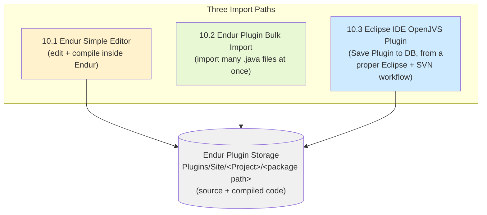

**Key theme across all three sub-sections:** each method trades off **convenience** against **traceability/source-control safety** differently — understanding that trade-off is the whole point of this section.

---

## 2. 10.1 Endur Simple Editor

### What It Is

> The **Endur Simple Editor** is a **very basic text editor** for editing OpenJVS classes **directly within Endur**. Use the **'Launch Available Services'** option of Endur to open the editor.

### How to Access It

1. Open Endur's **`Launch Available Services`** dialog.
2. Search for **`simple`** (Service Group Filter: All Services).
3. Select **`Plugin Editor - Simple`** and click **OK**.

### What You Can Do With It

> Once the editor is open it can be used to **open and edit existing OpenJVS classes** that have already been imported into Endur, or **import java class files from the file system**.

> **Saving a file from within the editor will also compile it.**

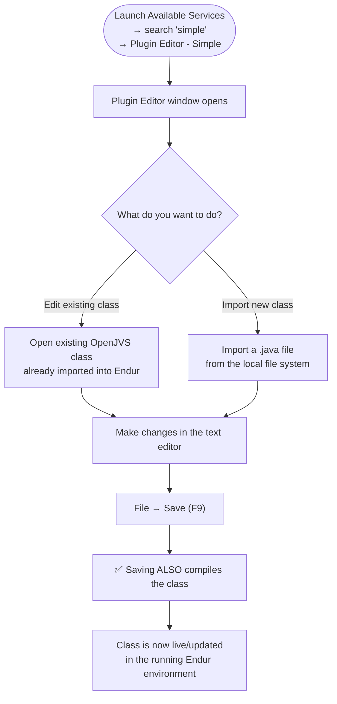

The Plugin Editor window shows metadata fields (**Owner**, **Group**, **Last Updated**) alongside the source code, and has a **File** menu with: `Save Window Location`, `New`, `Open`, `Delete`, `Save (F9)`, `Properties`, `Import`, `Export`, `Print`, `Exit`. An **Error Messages** panel at the bottom shows compilation problems.

### ⚠️ The Critical Warning

> Double click on a Java class within the directory browser to open the source code in the OpenJVS simple editor. Note that it is **highly discouraged to edit java classes using the simple editor** as the changes here are **not reflected in Subversion source control**.

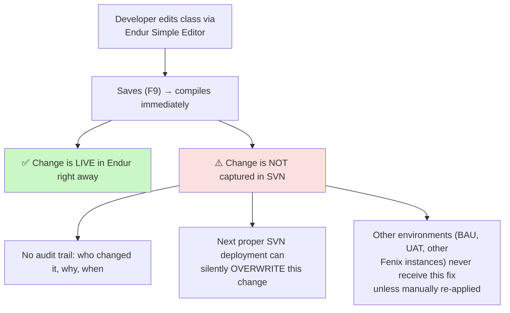

### When Is This Method Appropriate?

| Use case | Appropriate? |
|---|---|
| Quick, read-only inspection of an existing class | ✅ Yes |
| Genuine emergency hotfix, **immediately back-ported to SVN afterwards** | ⚠️ Acceptable, but must be followed up |
| Standard day-to-day development | ❌ **No** — use the Eclipse IDE OpenJVS plugin workflow (Section 4) instead |
| Bulk changes across many classes | ❌ **No** — use Plugin Bulk Import (Section 3) instead |

---

## 3. 10.2 Endur Plugin Bulk Import

### What It Is

> **Multiple OpenJVS classes can be imported together** using the **Plugin Bulk Import** function. Use the **'Launch Available Services'** option of Endur to access the bulk import function (search **`bulk`**, select **`Plugin Bulk Import`**).

### Step-by-Step Process

The process has **two halves**: first exporting flat `.java` files from Eclipse, then bulk-importing them into Endur.

#### Half 1 — Export from Eclipse IDE to a Flat Folder

| Step | Action |
|---|---|
| 1 | Right-click the project(s)/file(s) in the Eclipse **Project Explorer**, select **`Export`**. |
| 2 | Highlight **`File System`**, click **`Next`**. |
| 3 | Enter the **`To directory`** where files will be exported, and choose **`Create only selected directories`**. |
| 4 | Click **`Filter Types`** and choose only **`*.java`** files. |
| 5 | Click **`OK`**, then **`Finish`** to export. |

> The **advantage** of exporting the classes using Eclipse is that the java classes will be exported into a **single flat folder** without the complete folder structure representing the java packages. This makes it easier to import the classes **without having to traverse through a folder structure**.

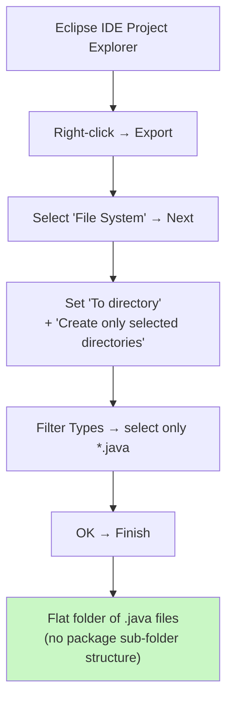

#### Half 2 — Bulk Import Into Endur

| Step | Action |
|---|---|
| 1 | Launch **`Plugin Bulk Import`**, navigate to the exported flat folder, **multi-select** the `.java` classes to import. |
| 2 | Click **`Open`** → the **Bulk Import window** appears. Ensure: **`Plugin Type`** = `Main`, **`Overwrite`** = `Yes` (where appropriate), **`Categories`** set correctly, and — **most importantly** — the **`Project Name`** is set correctly. |
| 3 | Click **`Process`** to import the java classes, then click **`Exit`**. |

> The OpenJVS classes have now been imported into Endur and can be **assigned to tasks etc**.

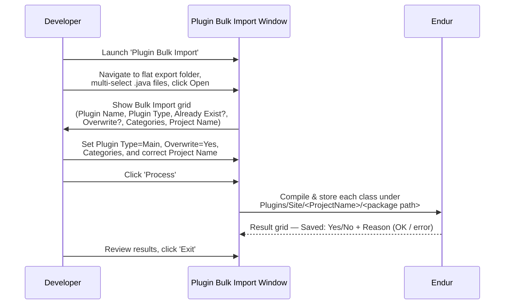

### Result Verification

The final "Plugin Bulk Import" results window shows, per file: **Saved** (Yes/No), **File Name**, **Plugin Name** (the fully-qualified class name), and **Reason** (e.g., `OK`). This gives an explicit, reviewable confirmation of exactly what was imported and whether each import succeeded.

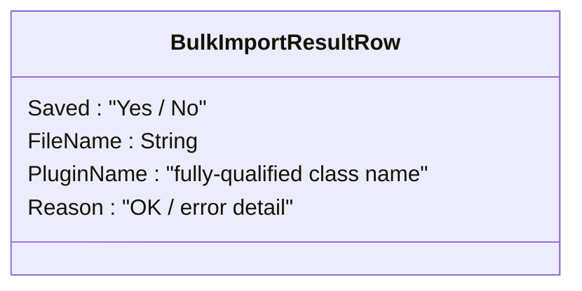

### Why This Method Exists

Bulk Import solves the problem of **deploying many related classes together** (e.g., a whole `DbPurge` release with `AbstractDbPurgeSet`, `DbPurgeDailyMain`, `DbPurgeWeeklyMain`, several `IPurgeTable` workers, etc.) without having to import each class **one at a time** through the Simple Editor.

---

## 4. 10.3 Eclipse IDE OpenJVS Plugin

### What It Is

> The **OpenJVS plugin** is an **Eclipse IDE plugin supplied by OpenLink**. The plugin allows various actions to be performed including the **importing of OpenJVS classes into Endur**.

### The Critical Precondition

> However this functionality is **only available if the Eclipse session is associated with an Endur session**. For this, Eclipse needs to be **launched from an Endur session**. In the Fenix environments an Endur task has been created named **`Eclipse IDE`** which launches Eclipse from Endur and **associates it with the currently open Endur session**.

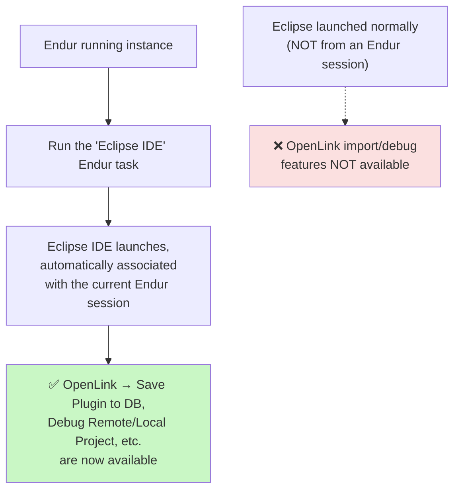

### Import Steps

| Step | Action |
|---|---|
| 1 | Right-click an Eclipse **OpenJVS project**, select **`OpenLink -> Save Plugin to DB`**. |
| 2 | A window shows the **available plugins** associated with the project that can be imported into Endur. **Tick the 'Selected' column** for the ones to import, then click **`OK`**. |
| 3 | The OpenJVS classes are **imported into Endur**. |

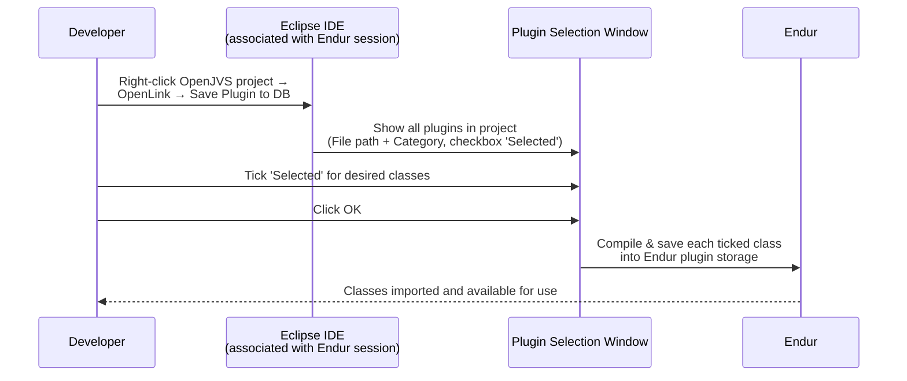

### The Full OpenLink Context Menu (from Eclipse)

Beyond just importing, the OpenLink right-click menu on an Eclipse OpenJVS project exposes a much richer set of operations, all of which require the Eclipse-session-associated-with-Endur precondition:

| Menu Item | Purpose |
|---|---|
| **Show Session Information** | Displays which Endur session Eclipse is currently associated with |
| **Associate project to session** | (Toggle) links/unlinks this project with the current Endur session |
| **New Plugin...** | Create a brand-new OpenJVS plugin class |
| **New Workspace Project...** | Create a new Eclipse workspace project |
| **Import Project from DB...** | Pull an existing Endur project **down** into Eclipse |
| **Save Project to DB** | Save the **whole project's** structure/metadata to Endur |
| **Save Plugin to DB** | Save/import **selected classes** (the import method described above) |
| **Update Project References** | Sync the project's reference configuration from Endur |
| **Refresh Project from DB** | Pull the latest project state from Endur down to Eclipse |
| **Refresh Plugin from DB** | Pull the latest version of a specific plugin from Endur |
| **Delete Project from DB** / **Delete Plugin from DB** | Remove a project/plugin from Endur |
| **Compile Project** | Compile without necessarily saving to DB |
| **Debug Local Project** / **Debug Remote Project** | Start a debug session (see the Debugging Code guide) |
| **Preferences...** | Configure OpenLink Eclipse plugin settings |

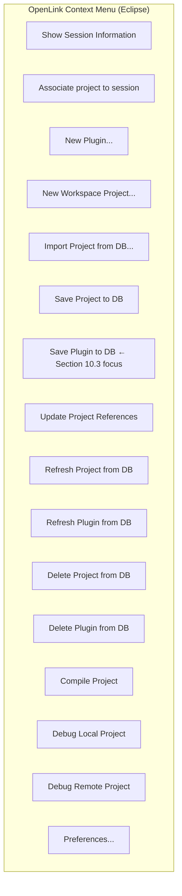

### Why This Is the Recommended Development Path

Unlike the Simple Editor, this workflow is designed to sit **on top of** a proper Eclipse + Subversion setup (see Section 12 — Source Control):

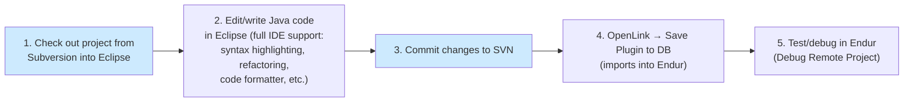

Because the source lives in SVN **first**, and Endur is treated as the **deployment target**, this path avoids the traceability problems inherent in the Simple Editor method.

---

## 5. Comparing All Three Methods

| Aspect | 10.1 Endur Simple Editor | 10.2 Endur Plugin Bulk Import | 10.3 Eclipse IDE OpenJVS Plugin |
|---|---|---|---|
| **Best for** | Quick inspection / emergency one-off fix | Deploying **many** classes at once (a release) | Standard day-to-day development |
| **Editing experience** | Very basic text editor | N/A (import only — editing happens in Eclipse) | Full Eclipse IDE (syntax highlighting, refactoring, formatter) |
| **Source control integration** | ❌ None — bypasses SVN entirely | ⚠️ Indirect — relies on files having been properly exported from an Eclipse project already under SVN | ✅ Full — designed to sit on top of an SVN-backed Eclipse project |
| **Number of classes per operation** | One at a time | Many (bulk, multi-select) | One or many (via Save Plugin to DB selection) |
| **Compiles on save/import?** | ✅ Yes, immediately | ✅ Yes, during Process step | ✅ Yes, during Save Plugin to DB |
| **Requires Endur session association?** | No (accessed via Launch Available Services) | No (accessed via Launch Available Services) | ✅ Yes — Eclipse must be launched from an Endur session |
| **Risk level** | ⚠️ High if used for real development (untracked changes) | Low-medium (still requires discipline to keep SVN and Endur in sync) | Low (source-of-truth stays in SVN) |

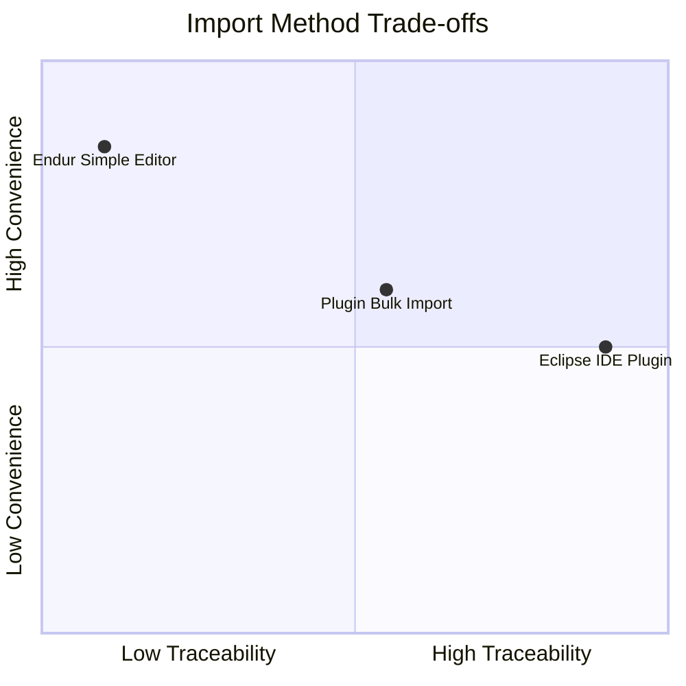

---

## 6. End-to-End Import Workflow

A realistic combined workflow, showing how a developer typically **starts** with Eclipse + SVN, and only reaches for the other two methods situationally:

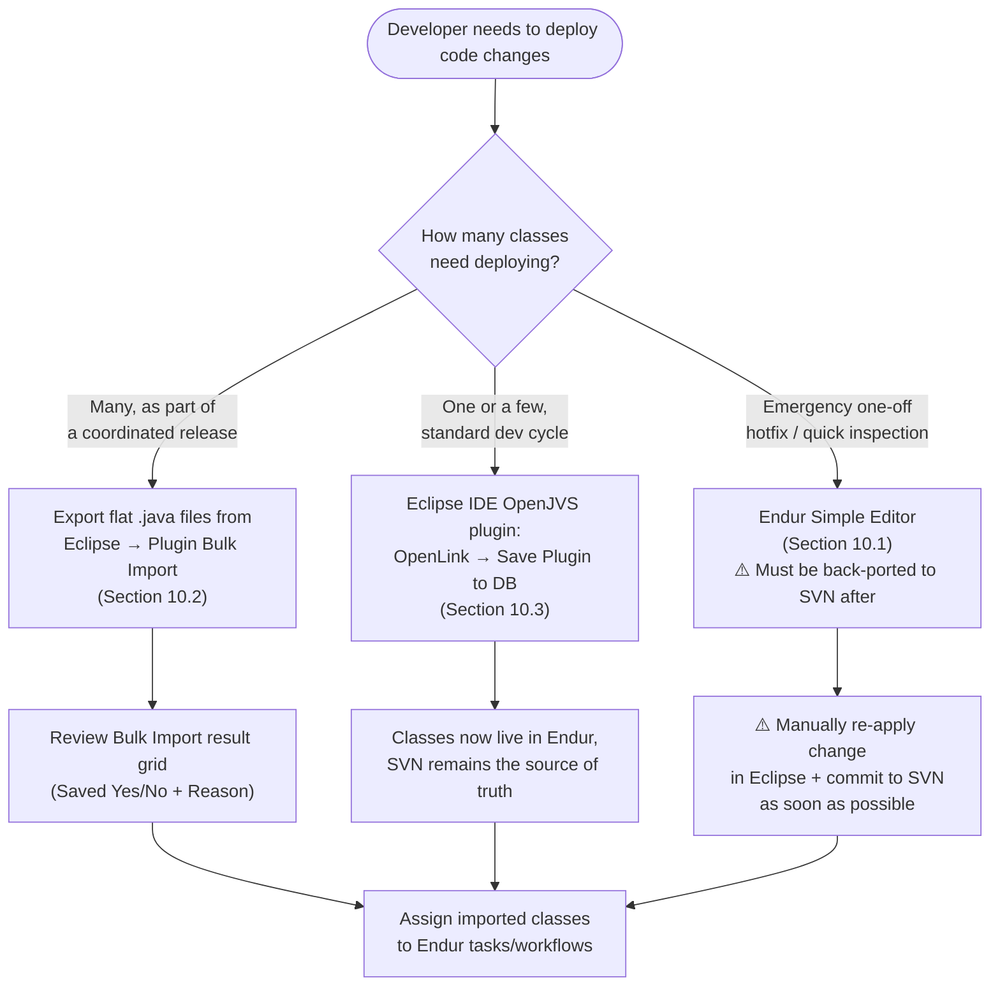

---

## 7. Practical Checklist for Developers

- [ ] **Default to the Eclipse IDE OpenJVS plugin workflow** (`OpenLink → Save Plugin to DB`) for all standard development — it keeps SVN as the source of truth.
- [ ] **Confirm Eclipse was launched from the Endur `Eclipse IDE` task** before expecting any `OpenLink` menu options to work — a standalone Eclipse session cannot import/debug against Endur.
- [ ] **Use Plugin Bulk Import** when deploying a coordinated set of related classes (e.g., a full purging-framework release) — export as flat `.java` files from Eclipse first (Filter Types → `*.java`, "Create only selected directories").
- [ ] **Double-check `Plugin Type`, `Overwrite`, `Categories`, and especially `Project Name`** before clicking `Process` in Bulk Import — an incorrect Project Name will misplace the class.
- [ ] **Review the Bulk Import result grid** (`Saved: Yes/No`, `Reason`) after every bulk import to confirm every file succeeded.
- [ ] **Avoid the Endur Simple Editor for real development** — if it's ever used for an emergency fix, **immediately** replicate the change in Eclipse and commit it to SVN afterward.
- [ ] **Remember saving in any of these tools compiles the class** — a save/import with compile errors will surface them (Simple Editor's Error Messages panel; Bulk Import's Reason column).

---

## Related Sections (Full Programming Guide)

- Section 4.2 — Directory Browser (where imported classes physically land: `Plugins/Site/<Project>/<package path>`)
- Section 8 — Developing OpenJVS Plugins (the classes being imported must follow the naming/package rules from this section)
- Section 11 — Debugging Code (the Eclipse IDE OpenJVS plugin's Debug Local/Remote Project options, which depend on the same Endur-session association precondition described here)
- Section 12 — Source Control (the Subversion workflow that the Eclipse IDE OpenJVS plugin path is designed to sit on top of)
