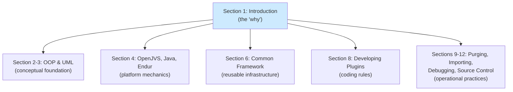
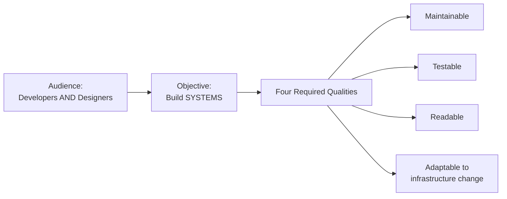
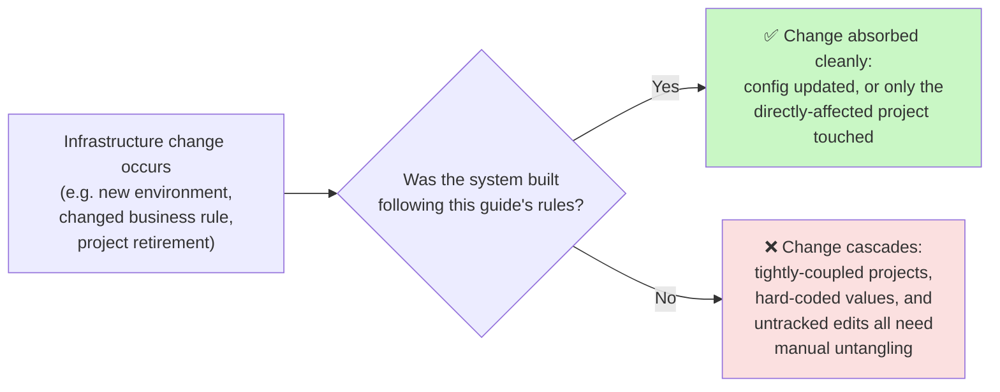
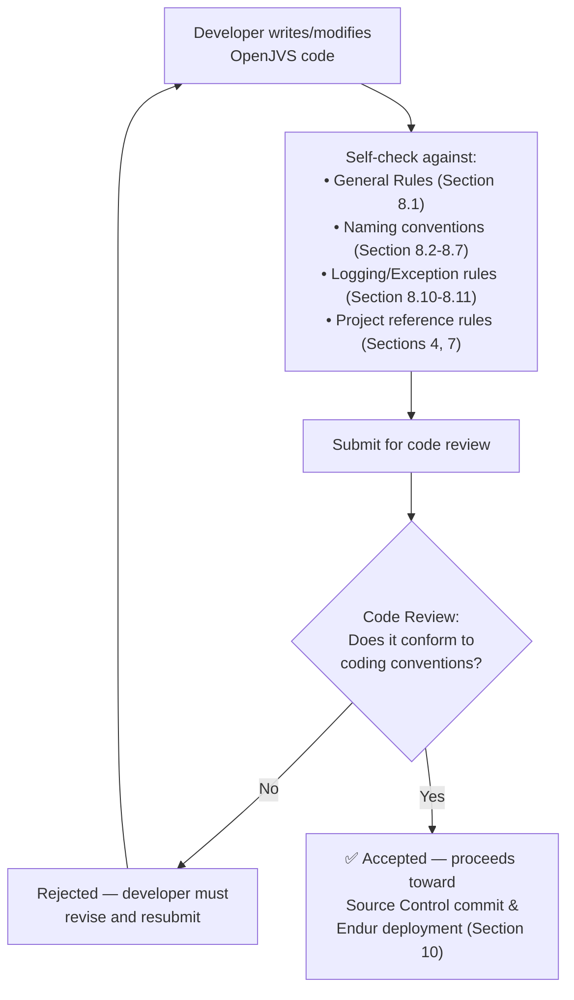
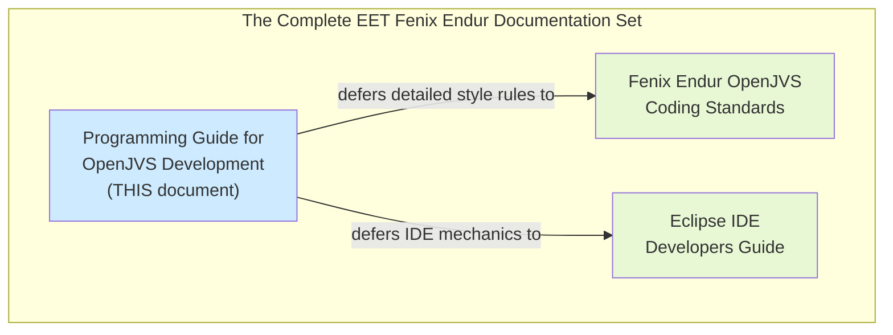
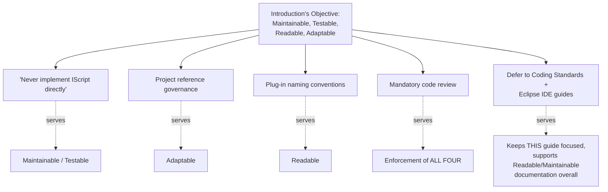

# Introduction — Full Reference Guide

> Source: Section 1 *"Introduction"* of the **Programming Guide for OpenJVS Development — EET Fenix Endur**. This instruction file expands that short but foundational section into a complete, diagrammed reference explaining *why* this whole Programming Guide exists, what quality bar it sets, and which companion documents govern OpenJVS development alongside it.

---

## Table of Contents

1. [Overview: The Purpose of This Section](#1-overview-the-purpose-of-this-section)
2. [The Major Objective](#2-the-major-objective)
3. [The Four Quality Pillars](#3-the-four-quality-pillars)
4. [The Mandatory Code Review Requirement](#4-the-mandatory-code-review-requirement)
5. [Companion Documents](#5-companion-documents)
6. [How the Introduction Frames the Rest of the Guide](#6-how-the-introduction-frames-the-rest-of-the-guide)
7. [Practical Checklist for Developers](#7-practical-checklist-for-developers)

---

## 1. Overview: The Purpose of This Section

Section 1 is only three sentences long in the source document, but it is the **mission statement** for the entire *Programming Guide for OpenJVS Development*. Every subsequent section — OOP and UML background, OpenJVS/Java/Endur mechanics, the Common Framework, plug-in development rules, data purging, importing code, debugging, and source control — exists **in service of** the objective stated here.

---

## 2. The Major Objective

> "The major objective of this document is to provide for **application developers and designers** to develop systems that are **maintainable, testable, readable and adaptable to changes in the infrastructure**."

Breaking this single sentence down into its component parts:

| Phrase | Meaning |
|---|---|
| **"application developers and designers"** | The guide's audience is **both** hands-on coders **and** the people making higher-level design decisions — it's not purely a syntax reference. |
| **"develop systems"** | The scope is **systems**, not just individual scripts — implying the guide cares about how pieces fit together (projects, frameworks, dependencies), not only about isolated code snippets. |
| **"maintainable, testable, readable and adaptable to changes in the infrastructure"** | Four explicit, named quality attributes the guide is optimized to produce (detailed in Section 3 below). |

---

## 3. The Four Quality Pillars

Each of the four qualities named in the objective statement maps directly onto concrete practices found **later** in the guide. Understanding this mapping is what makes Section 1 more than just a throwaway preamble — it is the **rationale** behind almost every rule in the rest of the document.

```mermaid
graph TD
    subgraph Pillars["The Four Quality Pillars"]
        M["Maintainable"]
        T["Testable"]
        R["Readable"]
        A["Adaptable"]
    end

    M --> M1["Common Framework reuse<br/>(Section 6) — don't re-invent the wheel"]
    M --> M2["DestroyableObjectStore<br/>(Section 6.4) — no manual memory leaks"]
    M --> M3["Source Control discipline<br/>(Section 12) — SVN as source of truth"]

    T --> T1["Consistent plug-in structure via<br/>BasicScript (Section 6.2, 8)"]
    T --> T2["Debugging support<br/>(Section 11) — breakpoints, Display view"]
    T --> T3["Clear exception handling rules<br/>(Section 8.11) — predictable failure modes"]

    R --> R1["Naming conventions per plug-in type<br/>(Section 8.2-8.7) — XxxMain, XxxParam, etc."]
    R --> R2["Eclipse code formatter<br/>(Section 8.1 General Rules)"]
    R --> R3["EET Coding Standards Guide<br/>(companion document)"]

    A --> A1["CommonExtension shared package<br/>(Section 7) — avoids brittle cross-<br/>project coupling"]
    A --> A2["Project reference governance<br/>(Sections 4, 7) — clean dependency graph"]
    A --> A3["Constants Repository-driven config<br/>(logging, purging, email) — change<br/>behavior without code changes"]

    style Pillars fill:#cdeafe
```

### 3.1 Maintainable

**Definition in context:** code that can be **understood, fixed, and extended** by someone other than its original author, without excessive risk or effort.

**How the rest of the guide enforces this:**
- Every plug-in extends a **Common Framework** ancestor (`BasicScript`, `BasicParamScript`, `AbstractUdsr`) so behavior is consistent across the entire codebase (Section 6).
- **`DestroyableObjectStore`** automatically manages native memory cleanup, removing a whole category of maintenance-nightmare memory leak bugs (Section 6.4).
- **Source Control** (Section 12) ensures every change has a traceable history — a maintainer can always find out *when* and *why* something changed.

### 3.2 Testable

**Definition in context:** code structured so its behavior can be **verified in isolation**, and so problems can be **diagnosed efficiently** when they occur.

**How the rest of the guide enforces this:**
- The `final` `execute(IContainerContext)` method in `BasicScript` guarantees **every plug-in has the same predictable entry/exit behavior** (start log → business logic → exception handling → cleanup → end log) — a stable contract to test against (Section 6.2).
- The **Eclipse IDE debugger integration** (Section 11) — breakpoints, Variable/Expression views, `viewTable()` inspection — exists specifically to make verifying runtime behavior tractable.
- **Exception handling rules** (Section 8.11) ensure failures are surfaced clearly (via logging and the Alert Broker) rather than silently swallowed, which would make testing/diagnosis far harder.

### 3.3 Readable

**Definition in context:** code whose **purpose and structure are immediately obvious** to any developer familiar with the conventions, without needing to reverse-engineer intent.

**How the rest of the guide enforces this:**
- **Strict naming conventions** by plug-in type — `XxxMain`, `XxxParam`, `XxxOutput`, `UdsrXxx`, `OpsXxxPre`/`Post`, `OcXxxPre`/`Post` (Section 8.2–8.7) — mean a developer can tell a class's *role* just from its name.
- **Mandatory package naming rules** (`com.eon.eet.fenix...`) create a predictable, navigable codebase structure (Section 8.1).
- Running the **Eclipse code formatter** on all source code (Section 8.1) removes stylistic inconsistency as a source of confusion.

### 3.4 Adaptable to Changes in the Infrastructure

**Definition in context:** systems designed so that **change — in Endur itself, in business requirements, or in the surrounding technical environment — can be absorbed without cascading rewrites.**

**How the rest of the guide enforces this:**
- The **project reference governance rule** (Sections 4, 7) — business projects may only reference the Common Framework, never each other directly — keeps the dependency graph a clean hub-and-spoke shape that can flex as individual projects change or are retired.
- The **`com.eon.eet.fenix.shared`** package (Section 7) provides a sanctioned way to share code across projects **without** hard-wiring them together.
- **Configuration-driven behavior** — Constants Repository entries for logging levels/writers (Section 8.10), purge batch sizes (Section 9.3.1), and email routing (Section 8.12) — means operational behavior can be tuned **without redeploying code**, directly supporting adaptability to changing operational needs.

---

## 4. The Mandatory Code Review Requirement

> "**All application software will need to pass a code review to enforce coding conventions.**"

This single sentence establishes a **hard governance gate**: conformance to this guide (and its companion standards documents) is not optional or advisory — it is **checked and enforced** before software is accepted.

### Why This Matters Structurally

This requirement is what gives every other rule in the guide **teeth**. Without a mandatory code review:

- The naming conventions in Section 8 would be **suggestions**, easily ignored under deadline pressure.
- The project reference governance in Section 7 would be **unenforceable** — nothing would stop a developer from directly referencing another business project.
- The "never use `finalize()`", "log only where handled", and "use `FenixException`/`FenixRuntimeException`" rules (Section 8) would erode over time without a checkpoint catching violations.

The **code review team** referenced throughout the guide (e.g., Section 4.3's "if you are unsure then contact the code review team to discuss the best location for your code") is the **human enforcement mechanism** for everything this Introduction establishes as the goal.

---

## 5. Companion Documents

> "This document should be **read in conjunction with** the **Fenix Endur OpenJVS Coding Standards** and the **Eclipse IDE Developers Guide**."

This Programming Guide **deliberately does not attempt to be a complete, standalone reference**. It explicitly defers detail to two sibling documents:

| Document | What It Covers | Where This Guide References It |
|---|---|---|
| **Fenix Endur OpenJVS Coding Standards** | Detailed style/syntax conventions — e.g., exact rules for enumeration class naming (Section 6.10: *"Enumeration class names must follow the EET standards as set out in the EET OpenJVS Coding Standards Guide"*) | Section 6.10 (Enumerations), Section 8.1 (General Rules: *"Know the EET coding standards and code to the standards"*) |
| **Eclipse IDE Developers Guide** | Mechanics of setting up and using Eclipse with the OpenLink OpenJVS plugin — e.g., how to launch Eclipse from Endur, how to check out SVN projects | Section 8 (*"See the separate guide on how to set up and use the Eclipse IDE"*), Section 11 (debug session setup), Section 12 (*"The separate Eclipse IDE guide provides details how to check out a java project from Subversion"*) |

**Why this layered-documentation approach matters:** it lets this Programming Guide stay focused on **architecture, framework usage, and governance rules** (the "what and why"), while the Coding Standards and Eclipse IDE guides own the **fine-grained style rules and tooling mechanics** (the "exact how"). A developer should expect to consult **all three documents**, not treat this guide in isolation.

---

## 6. How the Introduction Frames the Rest of the Guide

Reading Section 1 first equips a developer to understand **why** later sections make the choices they do. A few direct examples:

| Later Rule | Traces Back to Introduction's... |
|---|---|
| "Never implement `IScript` directly" (Section 8) | **Maintainable** + **Testable** — a single, consistent entry point (`BasicScript`) is easier to maintain and test than N different ad-hoc implementations |
| "OpenJVS projects are only allowed to reference the core EGC Common framework projects or OLF standard projects" (Section 7) | **Adaptable to changes in the infrastructure** — a clean dependency graph tolerates project-level change |
| "Class name must end with 'Main'/'Param'/'Output'..." (Section 8.2–8.7) | **Readable** — naming immediately communicates role |
| "All application software will need to pass a code review" (Section 1 itself) | Directly stated — the **enforcement mechanism** for everything else |
| "See the separate Eclipse IDE guide" / "EET OpenJVS Coding Standards Guide" (recurring throughout) | Directly stated — the **companion document** relationship |

---

## 7. Practical Checklist for Developers

- [ ] **Before writing code, internalize the four quality pillars** — maintainable, testable, readable, adaptable — as the lens through which every design decision in this guide should be judged.
- [ ] **Remember the audience is both developers AND designers** — architectural/project-structure decisions matter as much as line-level code quality.
- [ ] **Expect a code review** on all application software — proactively self-check against the General Rules (Section 8.1) and naming conventions (Section 8.2–8.7) before submitting.
- [ ] **Do not treat this Programming Guide as the sole reference** — also consult the **Fenix Endur OpenJVS Coding Standards** for detailed style rules and the **Eclipse IDE Developers Guide** for tooling/IDE setup mechanics.
- [ ] **When in doubt about where code belongs or how to structure it**, default to whichever option better serves maintainability, testability, readability, and adaptability — and escalate to the code review team if still unsure (as instructed throughout later sections, e.g. Section 4.3).

---

## Related Sections (Full Programming Guide)

- Section 2 — Object Orientated Programming (OOP) (conceptual foundation referenced immediately after the Introduction)
- Section 3 — Unified Modelling Language (UML) (conceptual foundation referenced immediately after the Introduction)
- Section 6 — The Common Framework (the primary mechanism for achieving "maintainable" and "testable")
- Section 7 — The CommonExtension Project Shared Package (the primary mechanism for achieving "adaptable to changes in the infrastructure")
- Section 8 — Developing OpenJVS Plugins (the primary mechanism for achieving "readable", via naming conventions and general rules)
- Section 12 — Source Control (the operational discipline underpinning "maintainable")
