# Object Orientated Programming (OOP) — Complete End-to-End Guide

> Reference: This guide is written in the spirit of Section 2 *"Object Orientated Programming (OOP)"* of the **Programming Guide for OpenJVS Development (EET Fenix Endur)**, which points readers to the Oracle Java OOP concepts tutorial (`http://download.oracle.com/javase/tutorial/java/concepts/`) to gain familiarity with OOP before doing OpenJVS/Java development. This document expands that single reference line into a full, self-contained OOP learning resource — grounded in real Java syntax and, where useful, in concrete examples from the OpenJVS/Endur Common Framework so the concepts are immediately connectable to real EET Fenix code.

---

## Table of Contents

1. [Introduction to OOP](#1-introduction-to-oop)
2. [Objects](#2-objects)
3. [Classes](#3-classes)
4. [Encapsulation](#4-encapsulation)
5. [Inheritance](#5-inheritance)
6. [Polymorphism](#6-polymorphism)
7. [Abstraction](#7-abstraction)
8. [Interfaces](#8-interfaces)
9. [Abstract Classes vs. Interfaces](#9-abstract-classes-vs-interfaces)
10. [Constructors](#10-constructors)
11. [Method Overloading vs. Method Overriding](#11-method-overloading-vs-method-overriding)
12. [Access Modifiers / Visibility](#12-access-modifiers--visibility)
13. [Composition vs. Inheritance ("Has-a" vs "Is-a")](#13-composition-vs-inheritance-has-a-vs-is-a)
14. [Packages](#14-packages)
15. [The Four Pillars — Summary Diagram](#15-the-four-pillars--summary-diagram)
16. [OOP Principles Applied in OpenJVS/Endur](#16-oop-principles-applied-in-openjvsendur)
17. [Summary Cheat Sheet](#17-summary-cheat-sheet)

---

## 1. Introduction to OOP

**Object-Oriented Programming (OOP)** is a programming paradigm built around the concept of **objects** — bundles of **state** (data/fields) and **behavior** (methods/functions) that model real-world or conceptual entities. Java (and therefore OpenJVS, which is a Java library — see the OpenJVS Architecture reference) is a fundamentally object-oriented language, meaning almost everything you write is either a class, an object, or a member of one.

### Why OOP Matters

- It lets you **model real-world concepts** (a `Trade`, a `Table`, a `LogWriter`) directly as code structures.
- It supports **code reuse** via inheritance — write logic once in a base class, reuse it in many subclasses.
- It enables **flexibility** via polymorphism — code can work with a general type while actually running specialized behavior.
- It **hides complexity** via encapsulation and abstraction — consumers of a class don't need to know its internals to use it safely.

### The Four Pillars of OOP

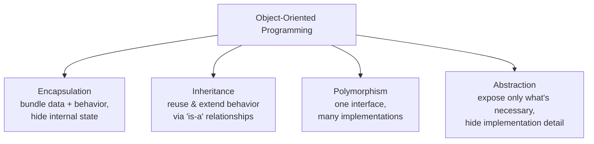

Every section below eventually maps back to one (or more) of these four pillars.

---

## 2. Objects

An **object** is a runtime instance of a class — a concrete "thing" that has:

- **State** — the values currently held in its fields/attributes.
- **Behavior** — the methods it can perform, which may read or change its state.
- **Identity** — a unique existence in memory, distinct from other objects even if their state happens to be identical.

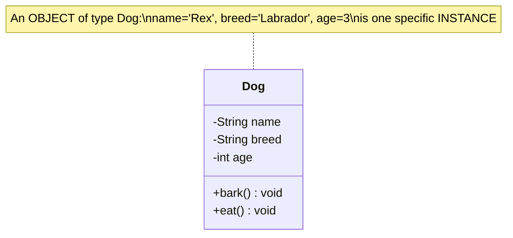

**Real-world analogy:** a *class* is like a blueprint for a house; an *object* is an actual house built from that blueprint. You can build many houses (objects) from one blueprint (class), and each house can have different paint colors or furniture (different field values), while sharing the same structural design (methods).

```java
// "Dog" is the class (blueprint). "myDog" and "yourDog" are two separate objects.
Dog myDog = new Dog("Rex", "Labrador", 3);
Dog yourDog = new Dog("Bella", "Poodle", 5);
```

Every time `new` is called, the JVM allocates memory for a fresh object and returns a reference to it. `myDog` and `yourDog` are separate objects even though they were built from the exact same class.

---

## 3. Classes

A **class** is the **blueprint/template** that defines what fields (state) and methods (behavior) its objects will have. It does not itself hold real data — it's a specification.

### Anatomy of a Class

```java
public class Dog {
    // Fields (state)
    private String name;
    private String breed;
    private int age;

    // Constructor
    public Dog(String name, String breed, int age) {
        this.name = name;
        this.breed = breed;
        this.age = age;
    }

    // Methods (behavior)
    public void bark() {
        System.out.println(name + " says Woof!");
    }

    public int getAge() {
        return age;
    }
}
```

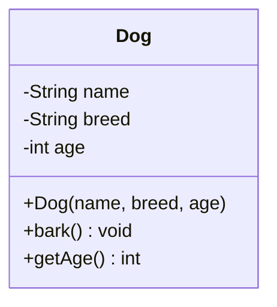

| Class Diagram Compartment | Contents |
|---|---|
| **Top** | Class name |
| **Middle** | Fields (attributes) — with visibility symbols (`-` private, `+` public, `#` protected) |
| **Bottom** | Methods (operations) — including the constructor |

### Classes as Custom Data Types

Once defined, a class becomes a usable **type**, just like Java's built-in `int` or `String`:

```java
Dog d;               // declares a variable of type Dog
d = new Dog(...);     // instantiates (creates) an object of type Dog
```

---

## 4. Encapsulation

**Encapsulation** is the practice of **bundling data (fields) and the methods that operate on that data into a single unit (a class)**, while **restricting direct external access** to the internal state.

### The Core Idea: Hide, Then Expose Deliberately

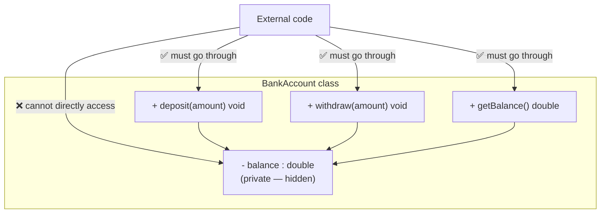

### Why Encapsulate?

| Without Encapsulation | With Encapsulation |
|---|---|
| Any code can set `account.balance = -999999;` — an invalid state | `withdraw()` can validate: *"balance cannot go below zero"* before changing the field |
| Changing the internal representation (e.g., storing balance in cents instead of dollars) breaks every piece of code that touched the field directly | Internal representation can change freely as long as the public methods keep the same contract |
| No central place to add logging, validation, or side effects | `deposit()`/`withdraw()` are natural places to add validation, logging, or notifications |

### Example: Getters and Setters

```java
public class BankAccount {
    private double balance;  // hidden state

    public double getBalance() {          // controlled read access
        return balance;
    }

    public void deposit(double amount) {  // controlled write access, with validation
        if (amount <= 0) {
            throw new IllegalArgumentException("Deposit must be positive");
        }
        balance += amount;
    }

    public void withdraw(double amount) {
        if (amount > balance) {
            throw new IllegalStateException("Insufficient funds");
        }
        balance -= amount;
    }
}
```

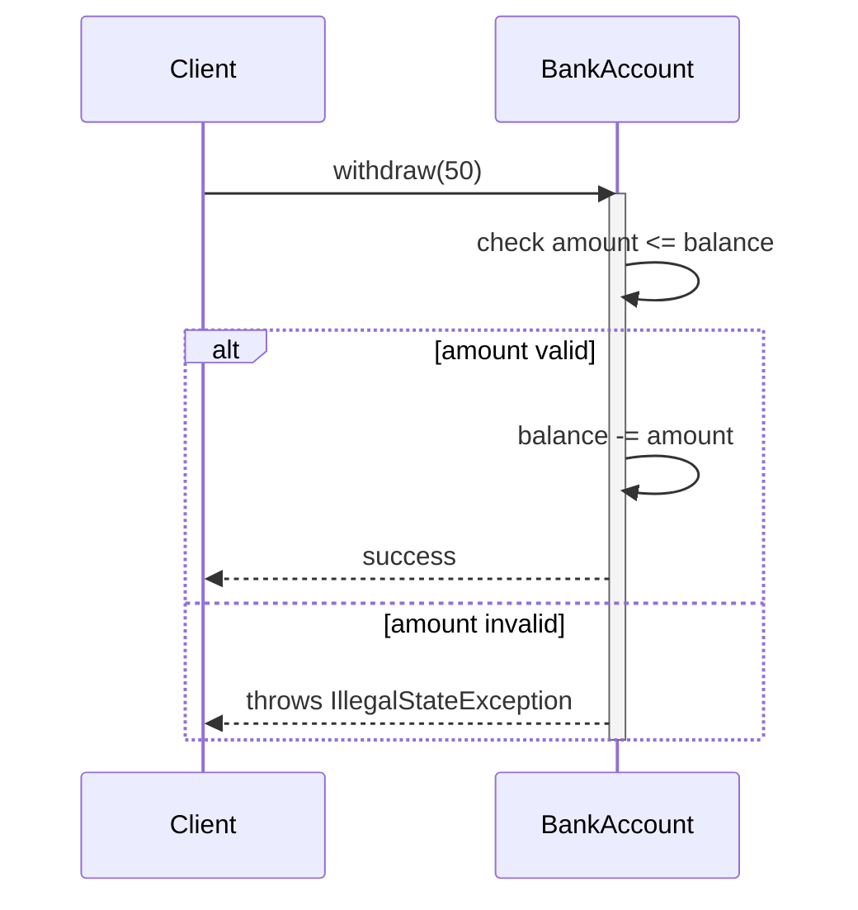

**Rule of thumb:** fields should almost always be `private`; expose behavior through `public` methods that validate and control how the state can change.

---

## 5. Inheritance

**Inheritance** allows a class (the **subclass**/**child**) to acquire the fields and methods of another class (the **superclass**/**parent**), modeling an **"is-a" relationship**.

### Basic Syntax

```java
public class Animal {
    protected String name;

    public void eat() {
        System.out.println(name + " is eating.");
    }
}

public class Dog extends Animal {
    public void bark() {
        System.out.println(name + " says Woof!");
    }
}
```

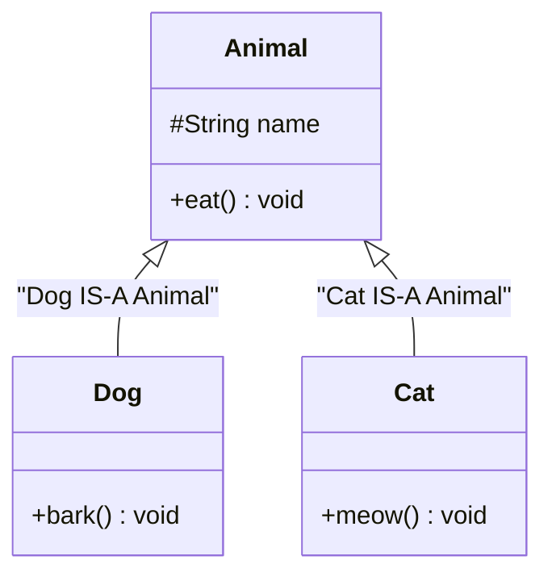

A `Dog` object **automatically has** the `eat()` method and `name` field from `Animal`, **plus** its own `bark()` method — without rewriting `eat()`.

### Single Inheritance (Java Rule)

Java classes can extend **only one** superclass (unlike some other languages that support multiple inheritance of classes). This keeps the inheritance hierarchy a clean **tree**, not a tangled graph.

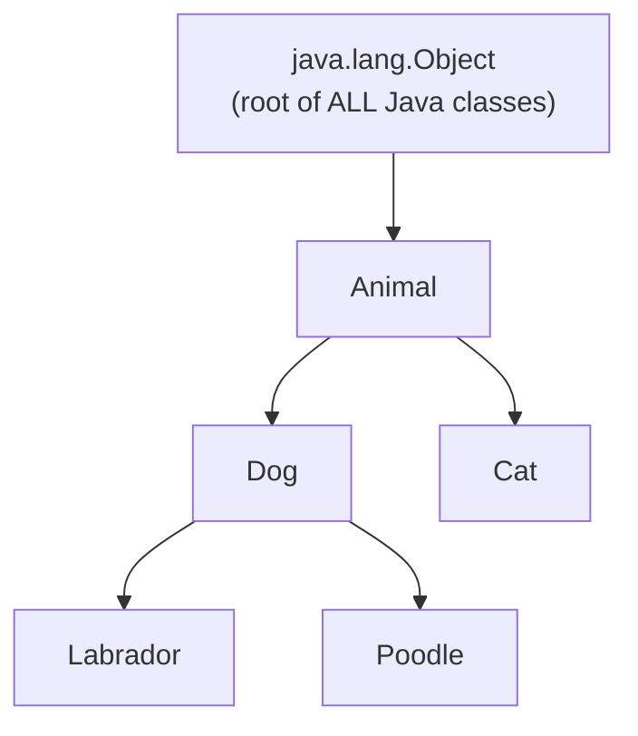

Every class in Java implicitly extends `java.lang.Object` if it doesn't explicitly extend anything else — meaning **all objects share a minimal common set of behavior** (`toString()`, `equals()`, `hashCode()`, etc.).

### `super` Keyword

`super` refers to the immediate parent class — used to call the parent's constructor or an overridden method's original implementation:

```java
public class Dog extends Animal {
    public Dog(String name) {
        super();          // calls Animal's constructor
        this.name = name;
    }

    @Override
    public void eat() {
        super.eat();      // run Animal's eat() first
        System.out.println("...and Dog wags its tail while eating.");
    }
}
```

### Multi-Level Inheritance

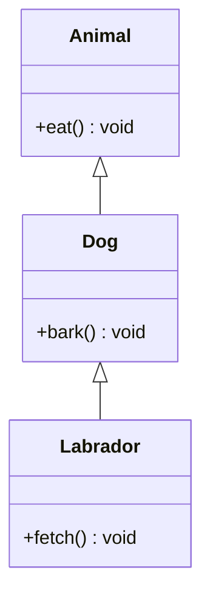

`Labrador` inherits from `Dog`, which inherits from `Animal` — so a `Labrador` object has `eat()`, `bark()`, **and** `fetch()`.

### Inheritance in OpenJVS/Endur (Concrete Example)

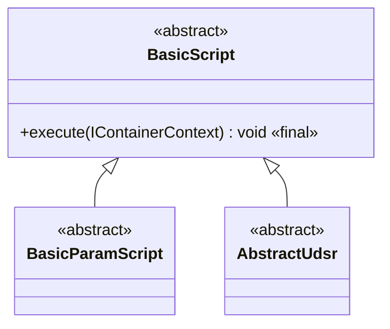

Every OpenJVS plug-in type reuses `BasicScript`'s logging/exception-handling/cleanup behavior through inheritance — the exact same mechanism as `Dog extends Animal` above, just applied to a real production framework.

---

## 6. Polymorphism

**Polymorphism** ("many forms") means a single interface/method call can behave **differently depending on the actual runtime type** of the object it's invoked on.

### Two Kinds of Polymorphism

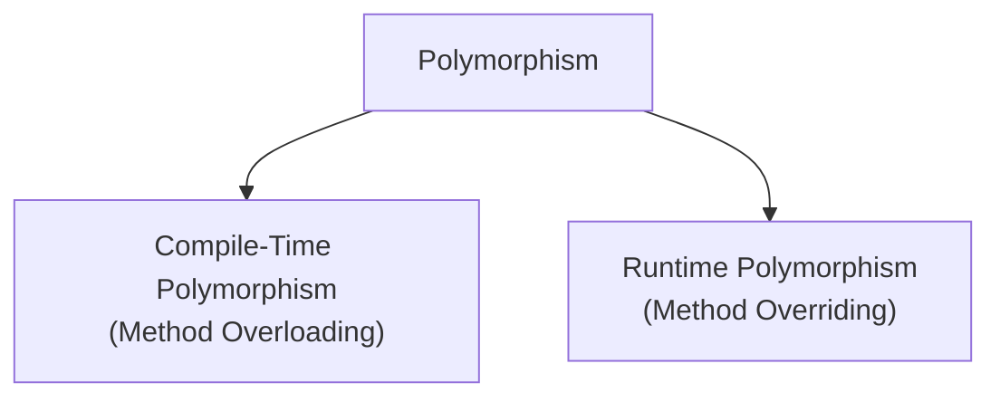

### Runtime Polymorphism (the "classic" OOP polymorphism)

```java
public class Animal {
    public void makeSound() {
        System.out.println("Some generic animal sound");
    }
}

public class Dog extends Animal {
    @Override
    public void makeSound() {
        System.out.println("Woof!");
    }
}

public class Cat extends Animal {
    @Override
    public void makeSound() {
        System.out.println("Meow!");
    }
}
```

```java
Animal[] animals = { new Dog(), new Cat(), new Animal() };
for (Animal a : animals) {
    a.makeSound();   // calls the RIGHT version automatically, based on actual object type
}
// Output: Woof!  Meow!  Some generic animal sound
```

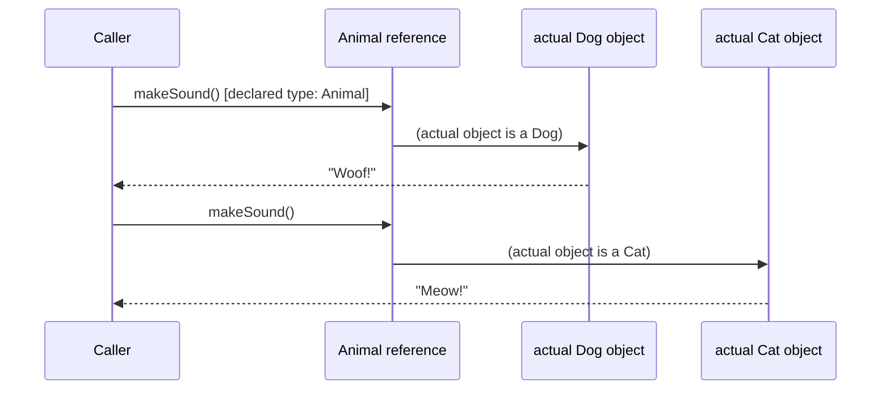

**Key insight:** the calling code only knows about `Animal`, but the **actual object's class** decides which `makeSound()` implementation actually runs. This is called **dynamic dispatch** or **late binding**.

### Why This Matters

Polymorphism lets you write code that operates on a **general type** (like `Animal`, or in OpenJVS, `IPurgeTable`) without needing to know or care about every specific subtype — and yet, at runtime, the correct specialized behavior still executes.

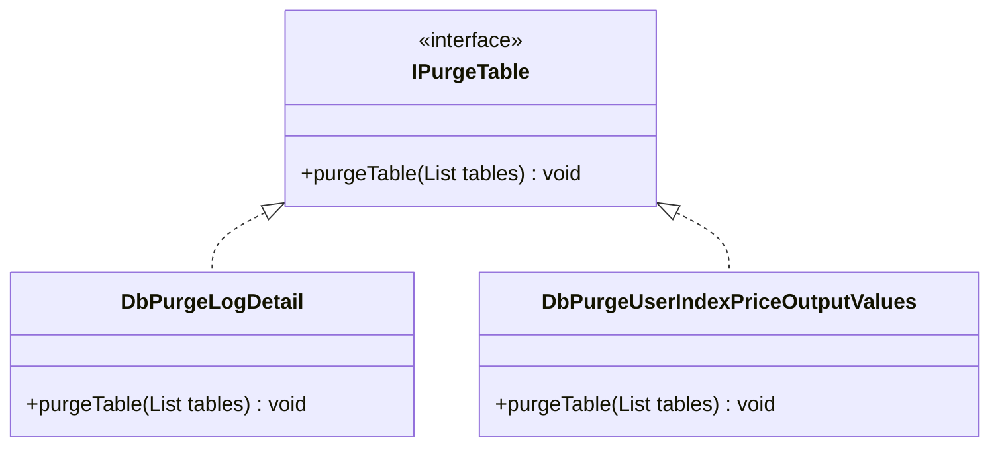

The purging framework's `AbstractDbPurgeSet` calls `worker.purgeTable(tableList)` on every registered worker **without knowing or caring** whether that worker is `DbPurgeLogDetail` or `DbPurgeUserIndexPriceOutputValues` — each worker's own `purgeTable()` implementation runs automatically. That's polymorphism at work in a real production system.

### Compile-Time Polymorphism (Method Overloading)

Covered in detail in [Section 11](#11-method-overloading-vs-method-overriding) below — multiple methods with the **same name but different parameter lists**, resolved at **compile time** based on the arguments passed.

---

## 7. Abstraction

**Abstraction** means exposing only the **essential features** of an object while **hiding the complex implementation details** behind a simpler interface.

### Real-World Analogy

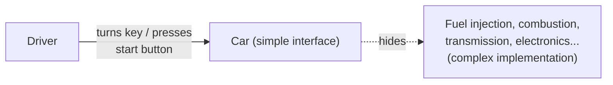

A driver doesn't need to understand combustion chemistry or transmission mechanics to drive a car — they just need the simple abstraction: steering wheel, pedals, key/button.

### Abstraction in Code

```java
public abstract class Shape {
    public abstract double calculateArea();  // WHAT every shape must do

    public void printArea() {                // shared behavior, uses the abstraction
        System.out.println("Area: " + calculateArea());
    }
}

public class Circle extends Shape {
    private double radius;

    public Circle(double radius) { this.radius = radius; }

    @Override
    public double calculateArea() {          // HOW a circle specifically does it
        return Math.PI * radius * radius;
    }
}

public class Rectangle extends Shape {
    private double width, height;

    public Rectangle(double width, double height) {
        this.width = width;
        this.height = height;
    }

    @Override
    public double calculateArea() {          // HOW a rectangle specifically does it
        return width * height;
    }
}
```

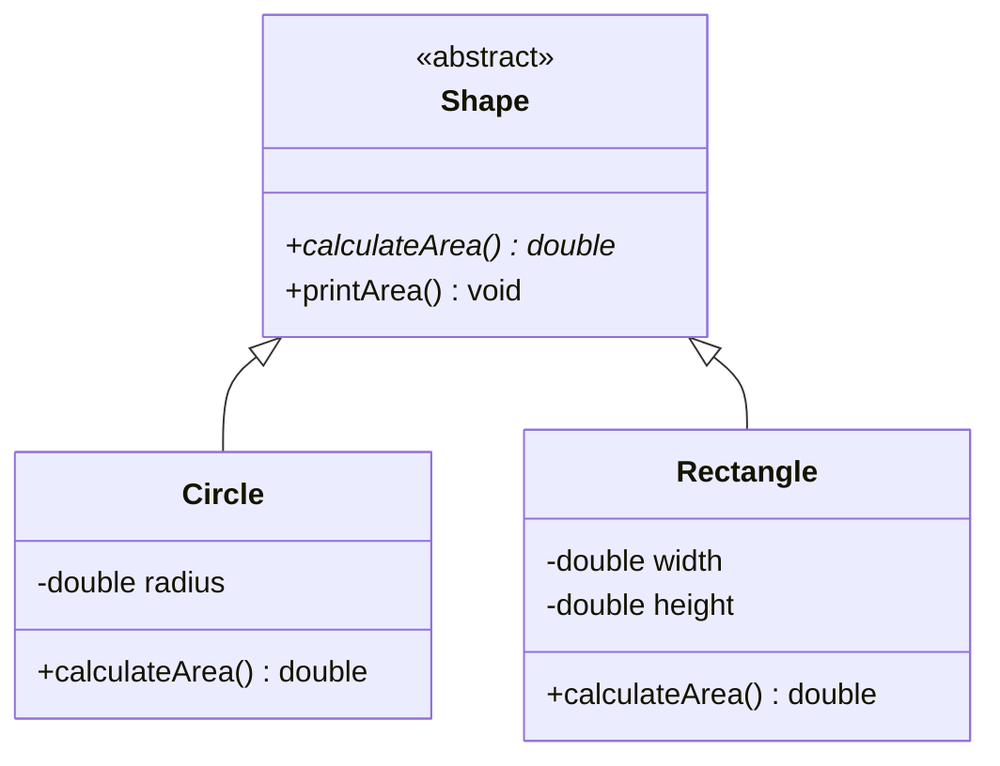

Calling code just does `shape.printArea()` — it doesn't need to know **how** area is calculated for that particular shape; the abstraction (`calculateArea()`) hides that detail, and each subclass fills in its own specifics.

### Abstraction vs. Encapsulation — the Common Confusion

| | Encapsulation | Abstraction |
|---|---|---|
| **Focus** | *How* data is protected (access control: `private` fields, `public` methods) | *What* is shown to the outside world (conceptual simplicity) |
| **Mechanism** | Access modifiers (`private`, `protected`, `public`) | Abstract classes, interfaces, method signatures |
| **Question answered** | "Can external code directly touch this data?" | "Does external code need to know how this works internally?" |
| **Analogy** | A locked box — you can't reach in and grab the wires | A car's dashboard — you only see the speedometer, not the engine internals |

---

## 8. Interfaces

An **interface** defines a **contract** — a set of method signatures that any implementing class **must** provide — without specifying *how* those methods work.

### Basic Syntax

```java
public interface Drivable {
    void accelerate();
    void brake();
}

public class Car implements Drivable {
    @Override
    public void accelerate() {
        System.out.println("Car speeds up.");
    }

    @Override
    public void brake() {
        System.out.println("Car slows down.");
    }
}
```

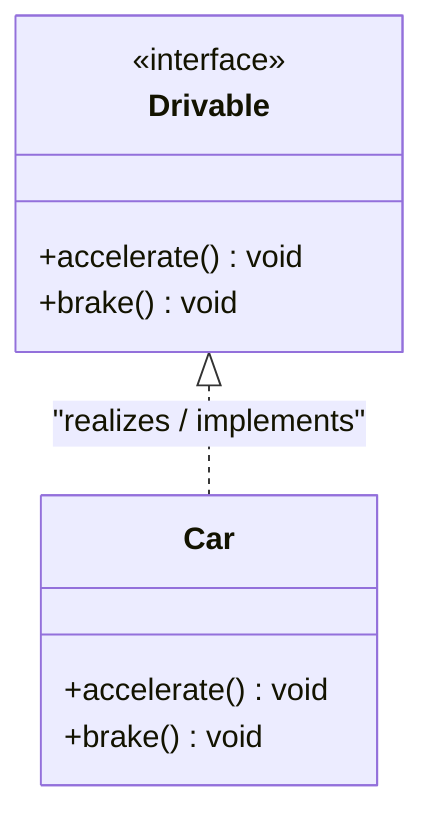

### Key Rules

- A class **implements** an interface using the `implements` keyword (as opposed to `extends` for classes).
- A class can implement **multiple interfaces** (unlike single-class inheritance):

```java
public class AmphibiousCar implements Drivable, Floatable { ... }
```

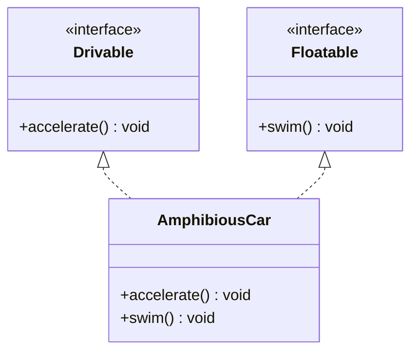

- Interfaces can also **extend other interfaces**.
- Since Java 8, interfaces may include `default` methods (with a body) and `static` methods, but traditionally interfaces only declare method signatures.

### Interfaces in OpenJVS/Endur

```java
public interface IScript {
    void execute(IContainerContext context);
}

public interface ILogWriter {
    void write(String message, String level);
}

public interface IPurgeTable {
    void purgeTable(java.util.List tables);
}
```

These are exactly the same concept as `Drivable` above — a contract that `BasicScript`, `FileLogWriter`, and `DbPurgeLogDetail` (respectively) must fulfill.

---

## 9. Abstract Classes vs. Interfaces

Both abstract classes and interfaces let you define a contract that subclasses must fulfill — but they differ in important ways.

| Aspect | Abstract Class | Interface |
|---|---|---|
| **Keyword** | `abstract class` | `interface` |
| **Instantiable?** | ❌ No (cannot do `new AbstractClass()`) | ❌ No |
| **Can have fields with state?** | ✅ Yes | ⚠️ Only `public static final` constants |
| **Can have constructors?** | ✅ Yes (called via `super()` from subclasses) | ❌ No |
| **Can have method implementations?** | ✅ Yes — mix of abstract and concrete methods | ⚠️ Only `default`/`static` methods (Java 8+); otherwise no |
| **Inheritance count** | A class can extend only **one** abstract class | A class can implement **multiple** interfaces |
| **Use when...** | Subclasses share significant common state/behavior, and there's a clear "is-a" hierarchy | You need a "can-do" capability contract, possibly across unrelated classes |

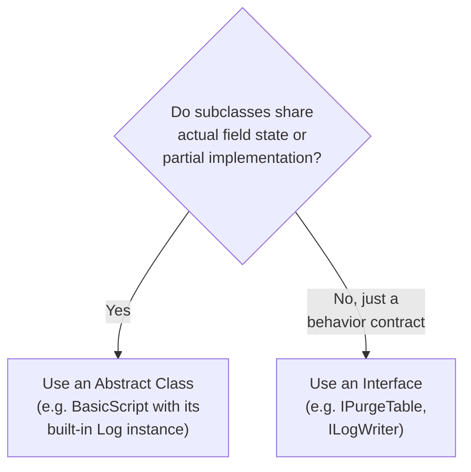

### Worked Example from OpenJVS: Both Used Together

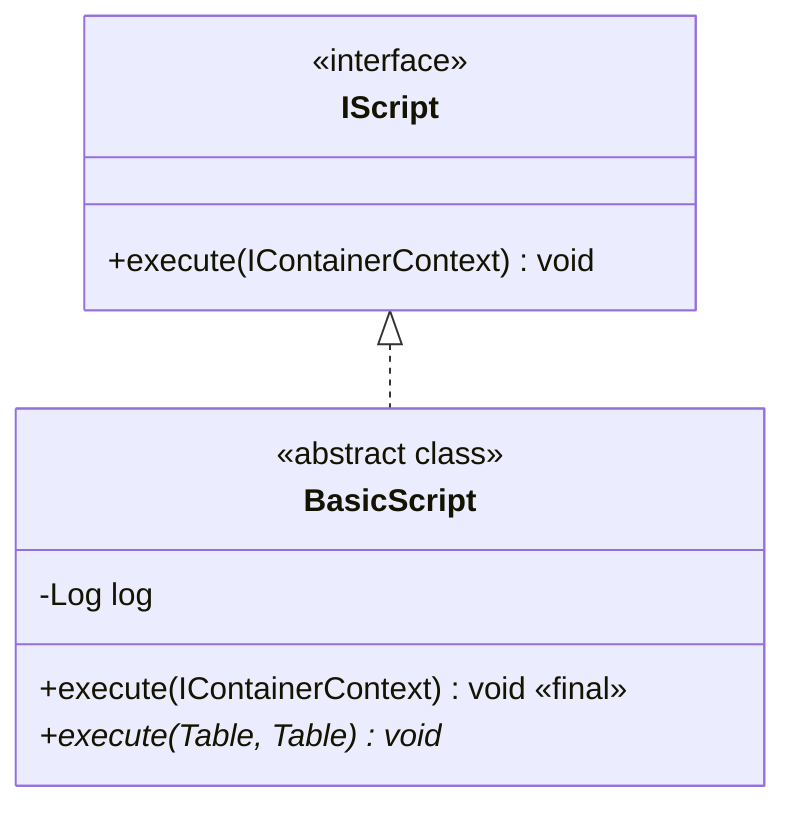

`IScript` is an **interface** (pure contract: "any script must have an `execute` entry point"). `BasicScript` is an **abstract class** that implements that interface **and** adds real shared state (`Log log`) and partial implementation (the `final` wrapper method) — exactly illustrating why both tools exist and are often combined.

---

## 10. Constructors

A **constructor** is a special method used to **initialize a new object** at the moment it's created with `new`. It shares the class's name and has no return type.

```java
public class Point {
    private int x, y;

    // Constructor
    public Point(int x, int y) {
        this.x = x;
        this.y = y;
    }
}
```

```java
Point p = new Point(3, 4);  // constructor runs, setting x=3, y=4
```

### The `this` Keyword

`this` refers to **the current object instance** — commonly used to disambiguate a field from a same-named constructor/method parameter:

```java
public Point(int x, int y) {
    this.x = x;   // "this.x" = the field; "x" = the parameter
    this.y = y;
}
```

### Constructor Overloading

A class can have **multiple constructors** with different parameter lists (an application of method overloading, see Section 11):

```java
public class Point {
    private int x, y;

    public Point() {              // default constructor
        this(0, 0);               // delegates to the two-arg constructor
    }

    public Point(int x, int y) {  // parameterized constructor
        this.x = x;
        this.y = y;
    }
}
```

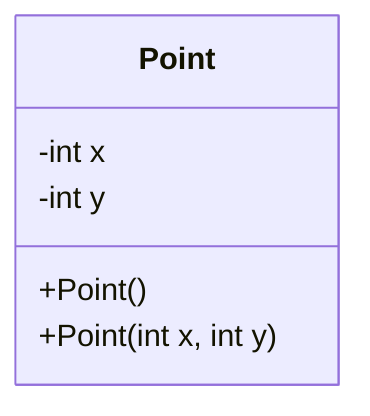

### Default Constructor

If a class defines **no constructors at all**, Java automatically supplies a no-argument default constructor. As soon as you define **any** constructor yourself, that automatic default disappears.

---

## 11. Method Overloading vs. Method Overriding

These two terms sound similar but are **fundamentally different mechanisms** — a very common point of confusion for beginners.

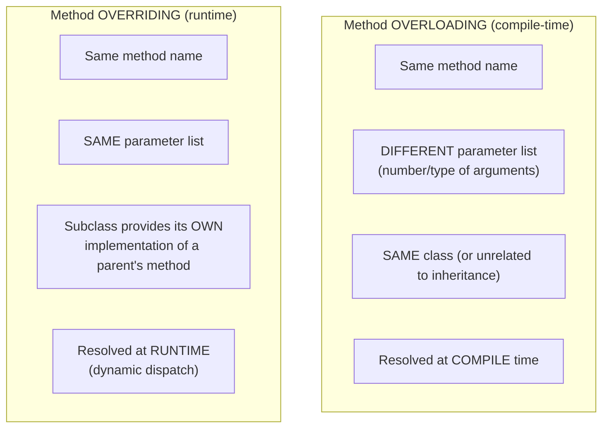

### Method Overloading Example

```java
public class Calculator {
    public int add(int a, int b) {
        return a + b;
    }

    public double add(double a, double b) {   // different parameter TYPES
        return a + b;
    }

    public int add(int a, int b, int c) {      // different parameter COUNT
        return a + b + c;
    }
}
```

```java
calc.add(2, 3);        // calls add(int, int)     -> 5
calc.add(2.5, 3.5);     // calls add(double, double) -> 6.0
calc.add(1, 2, 3);      // calls add(int, int, int) -> 6
```

The compiler decides **which** `add` to call based purely on the arguments' types/count — this happens before the program even runs.

### Method Overriding Example

```java
public class Animal {
    public void makeSound() {
        System.out.println("Generic animal sound");
    }
}

public class Dog extends Animal {
    @Override                       // signals intent to override, compiler checks it matches
    public void makeSound() {
        System.out.println("Woof!");
    }
}
```

Here `makeSound()` has the **exact same signature** in both classes — `Dog`'s version **replaces** `Animal`'s version when called on a `Dog` object (this is the mechanism behind [polymorphism](#6-polymorphism), Section 6).

### Rules for Valid Overriding

| Rule | Detail |
|---|---|
| Same method name | Required |
| Same parameter list | Required (otherwise it's overloading, not overriding, even if unintended!) |
| Return type | Must be the same, or a **covariant** (subtype) return type |
| Access level | Cannot be **more restrictive** than the parent's (e.g., can't override `public` with `private`) |
| `@Override` annotation | Not required by the compiler, but **strongly recommended** — it catches accidental signature mismatches at compile time |

```mermaid
flowchart TD
    Attempt["Subclass defines a method<br/>with the same name as parent"] --> Q{"Exact same parameter list<br/>AND compatible return type?"}
    Q -- Yes --> Override["✅ This is OVERRIDING<br/>(runtime polymorphism applies)"]
    Q -- No --> Overload["⚠️ This is actually OVERLOADING<br/>(a brand new, separate method —<br/>parent's version still exists unchanged)"]
```

---

## 12. Access Modifiers / Visibility

Access modifiers control **which parts of a program can see and use** a class, field, or method — the mechanical tool behind [encapsulation](#4-encapsulation).

| Modifier | Same Class | Same Package | Subclass (different package) | Everywhere |
|---|---|---|---|---|
| **`private`** | ✅ | ❌ | ❌ | ❌ |
| **(default / package-private)** | ✅ | ✅ | ❌ | ❌ |
| **`protected`** | ✅ | ✅ | ✅ | ❌ |
| **`public`** | ✅ | ✅ | ✅ | ✅ |

```mermaid
graph TD
    Private["private<br/>(class only)"] --> Default["default / package-private<br/>(+ same package)"]
    Default --> Protected["protected<br/>(+ subclasses everywhere)"]
    Protected --> Public["public<br/>(+ everyone)"]
    style Private fill:#fbe0e0
    style Default fill:#fff2cc
    style Protected fill:#e8f7d4
    style Public fill:#cdeafe
```

### Typical Usage Pattern

```java
public class Employee {
    private double salary;         // hidden — encapsulated internal state
    protected String department;   // visible to subclasses, e.g. Manager extends Employee
    public String name;            // visible to everyone (though public fields are usually discouraged)

    public double getSalary() {    // public "gateway" method to read private state
        return salary;
    }
}
```

**Best practice:** default to the **most restrictive** modifier that still works, and only widen visibility when there's a genuine need — this is the practical embodiment of encapsulation.

---

## 13. Composition vs. Inheritance ("Has-a" vs "Is-a")

Not every relationship between classes should be modeled with inheritance. **Composition** models a **"has-a"** relationship by having one class hold a **reference to another** as a field, instead of extending it.

```mermaid
classDiagram
    class Engine {
        +start() void
    }
    class Car {
        -Engine engine
        +startCar() void
    }
    Car --> Engine : "has-a (composition)"
```

```java
public class Engine {
    public void start() {
        System.out.println("Engine starting...");
    }
}

public class Car {
    private Engine engine = new Engine();  // Car HAS-A Engine

    public void startCar() {
        engine.start();   // delegate to the composed object
        System.out.println("Car is now running.");
    }
}
```

### Inheritance ("Is-a") vs. Composition ("Has-a") — Decision Guide

```mermaid
flowchart TD
    Q{"Is the relationship truly<br/>'X IS a kind of Y'?<br/>(e.g. Dog IS an Animal)"}
    Q -- Yes --> UseInherit["Use Inheritance<br/>(class X extends Y)"]
    Q -- "No, but X<br/>USES/CONTAINS a Y" --> UseCompose["Use Composition<br/>(class X has a field of type Y)"]
```

**Common software design guidance: "favor composition over inheritance"** — composition tends to be more flexible (you can swap the composed object at runtime, and it avoids fragile deep inheritance chains), while inheritance should be reserved for genuine "is-a" relationships.

### Example Misuse (Anti-Pattern)

```java
// ❌ Bad: a Car is NOT a kind of Engine — this is a "has-a" relationship, not "is-a"
public class Car extends Engine { ... }

// ✅ Good: model it as composition instead
public class Car {
    private Engine engine;
}
```

---

## 14. Packages

A **package** is a namespace mechanism used to **group related classes together** and avoid naming collisions.

```java
package com.eon.eet.fenix.common.script;

public abstract class BasicScript { ... }
```

```mermaid
graph TD
    com["com"] --> eon["eon"]
    eon --> eet["eet"]
    eet --> fenix["fenix"]
    fenix --> common["common"]
    common --> script["script"]
    script --> BasicScript["BasicScript.java"]
    script --> BasicParamScript["BasicParamScript.java"]
```

### Why Packages Matter

- **Avoid name collisions** — two different libraries can each have a class named `Table` without conflict, as long as they're in different packages (`com.olf.openjvs.Table` vs. some other `com.example.Table`).
- **Organize by responsibility** — related classes live together (e.g., all logging classes in `com.eon.eet.fenix.common.logging`).
- **Control default visibility** — package-private (default) access lets classes in the same package cooperate closely while still being invisible to unrelated code.

This is exactly the mechanism behind the OpenJVS package naming rules described in the Programming Guide (e.g., all EET classes must live under `com.eon.eet.fenix...`) — packages are a core, foundational OOP tool, not something specific to Endur.

---

## 15. The Four Pillars — Summary Diagram

```mermaid
graph TD
    subgraph Encapsulation["🔒 Encapsulation"]
        E1["private fields"]
        E2["public getters/setters"]
        E3["validated state changes"]
    end
    subgraph Inheritance["🧬 Inheritance"]
        I1["extends keyword"]
        I2["'is-a' relationship"]
        I3["code reuse via superclass"]
    end
    subgraph Polymorphism["🎭 Polymorphism"]
        P1["method overriding"]
        P2["dynamic dispatch"]
        P3["one interface, many behaviors"]
    end
    subgraph Abstraction["🎯 Abstraction"]
        A1["abstract classes / interfaces"]
        A2["expose WHAT, hide HOW"]
        A3["simplify complex systems"]
    end

    Encapsulation -.enables safe.-> Inheritance
    Inheritance -.enables.-> Polymorphism
    Abstraction -.often implemented via.-> Inheritance
    Abstraction -.often implemented via.-> Polymorphism
```

| Pillar | One-Line Definition | Java Mechanism |
|---|---|---|
| **Encapsulation** | Hide internal state, expose controlled behavior | `private` fields + `public` getters/setters |
| **Inheritance** | Reuse and extend behavior via "is-a" relationships | `extends` keyword |
| **Polymorphism** | One method call, many possible runtime behaviors | Method overriding + dynamic dispatch |
| **Abstraction** | Expose essential features, hide implementation detail | `abstract class` / `interface` |

---

## 16. OOP Principles Applied in OpenJVS/Endur

Since this guide exists specifically to prepare a developer for OpenJVS work, here is a direct mapping of every OOP concept above onto real Common Framework classes:

| OOP Concept | OpenJVS/Endur Example |
|---|---|
| **Class** | `BasicScript`, `Table`, `Log`, `DestroyableObjectStore` |
| **Object** | A specific `Table` instance returned by `DestroyableObjectStore.tableNew()` |
| **Encapsulation** | `Table`'s native memory handle (`jvsCPtr`) is hidden — you interact only through methods like `getInt(col, row)` |
| **Inheritance** | `BasicParamScript extends BasicScript`; `AbstractUdsr extends BasicScript` |
| **Polymorphism** | `AbstractDbPurgeSet` calls `purgeTable()` on any `IPurgeTable` worker without knowing its concrete class |
| **Abstraction** | `IScript`'s `execute(IContainerContext)` hides the complexity of how Endur actually invokes plug-ins |
| **Interface** | `IScript`, `ILogWriter`, `IPurgeTable`, `IContainerContext` |
| **Abstract Class** | `BasicScript`, `BasicParamScript`, `AbstractUdsr`, `AbstractDbPurgeSet`, `AbstractLog` |
| **Constructors** | Every `Fenix...Exception` class constructor takes a message (and sometimes an alert broker ID) |
| **Method Overriding** | Every plug-in's `execute(Table argt, Table returnt)` overrides the abstract method declared in `BasicScript` |
| **Composition** | `BasicScript` **has-a** `Log` instance (composition), rather than `BasicScript` being a kind of `Log` |
| **Packages** | `com.eon.eet.fenix.common.script`, `com.eon.eet.fenix.common.logging`, `com.eon.eet.fenix.purging`, etc. |

```mermaid
classDiagram
    class IScript {
        <<interface>>
        +execute(IContainerContext) void
    }
    class BasicScript {
        <<abstract>>
        -Log log
        +execute(IContainerContext) void «final»
        +execute(Table, Table) void*
    }
    class BasicParamScript {
        <<abstract>>
        +getUserSelection(Table) void*
        +getWorkflowValues(Table) void*
    }
    class YourMainPlugin {
        +execute(Table argt, Table returnt) void
    }
    class Log

    IScript <|.. BasicScript : abstraction + polymorphism
    BasicScript <|-- BasicParamScript : inheritance
    BasicScript <|-- YourMainPlugin : inheritance + overriding
    BasicScript --> Log : composition
    BasicScript --> BasicScript : encapsulated log field is private
```

This single diagram demonstrates **all four OOP pillars simultaneously** in one real, production-grade class hierarchy — exactly why the Programming Guide insists developers understand OOP *before* diving into OpenJVS plug-in development.

---

## 17. Summary Cheat Sheet

| Term | Quick Definition |
|---|---|
| **Class** | Blueprint defining fields + methods |
| **Object** | A runtime instance of a class |
| **Field / Attribute** | A variable that holds an object's state |
| **Method** | A function defined inside a class |
| **Constructor** | Special method that initializes a new object |
| **`this`** | Reference to the current object instance |
| **`super`** | Reference to the immediate parent class |
| **Encapsulation** | Hiding internal state behind controlled access |
| **Inheritance** | A class acquiring fields/methods from a parent class (`extends`) |
| **Polymorphism** | Same method call, different behavior depending on actual object type |
| **Abstraction** | Exposing only essential features, hiding implementation detail |
| **Interface** | A pure behavioral contract (`implements`) |
| **Abstract Class** | A partially-implemented base class that cannot be instantiated |
| **Overloading** | Same method name, different parameter list, resolved at compile time |
| **Overriding** | Subclass replaces a parent method's implementation, resolved at runtime |
| **Access Modifier** | `private` / (default) / `protected` / `public` — controls visibility |
| **Composition** | A class holding a reference to another class ("has-a") |
| **Package** | A namespace grouping related classes |

### Quick Decision Flow: Which OOP Tool Do I Need?

```mermaid
flowchart TD
    Start(["I'm designing a new class/feature"]) --> Q1{"Do I need to hide<br/>internal data from misuse?"}
    Q1 -- Yes --> UseEnc["Use Encapsulation:<br/>private fields + public methods"]
    Q1 -- No --> Q2{"Do multiple classes share<br/>significant common state/behavior?"}
    Q2 -- Yes --> Q3{"Is it a true 'is-a'<br/>relationship?"}
    Q3 -- Yes --> UseInherit["Use Inheritance (extends)"]
    Q3 -- No --> UseCompose["Use Composition<br/>(field reference instead)"]
    Q2 -- No --> Q4{"Do I need a pure<br/>behavior CONTRACT,<br/>possibly across unrelated classes?"}
    Q4 -- Yes --> UseInterface["Use an Interface"]
    Q4 -- No --> Q5{"Do different subtypes need<br/>to respond differently<br/>to the same method call?"}
    Q5 -- Yes --> UsePoly["Use Polymorphism<br/>(method overriding)"]
    Q5 -- No --> Simple["Plain class/method is enough"]
```

---

## Further Reading

- **Oracle Java Tutorials — Object-Oriented Programming Concepts**: the resource originally referenced by the OpenJVS Programming Guide: `http://download.oracle.com/javase/tutorial/java/concepts/`
- Joshua Bloch, *Effective Java* — especially Item 18: "Favor composition over inheritance"
- The companion **UML Tutorial** guide in this workspace (`UML-Tutorial.md`) — UML's Class Diagrams and Inheritance notation are the direct visual language for the OOP concepts covered here
- The **Common Framework** instruction file in this workspace — shows these exact OOP concepts applied throughout the real `BasicScript`/`BasicParamScript`/`AbstractUdsr` hierarchy

> **Tip for OpenJVS/Endur developers:** Before writing a new plug-in class, ask yourself: *"What am I inheriting from, what am I encapsulating, and what contract (interface) am I fulfilling?"* If you can answer all three clearly, your class almost certainly follows the architectural rules laid out in Sections 6–8 of the Programming Guide.
