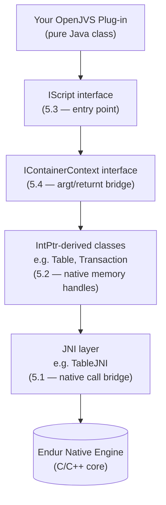
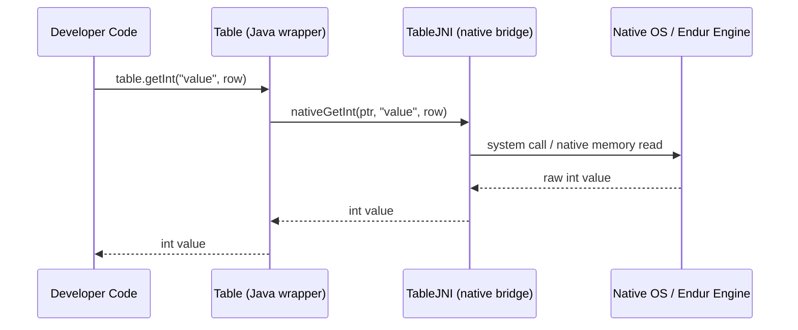
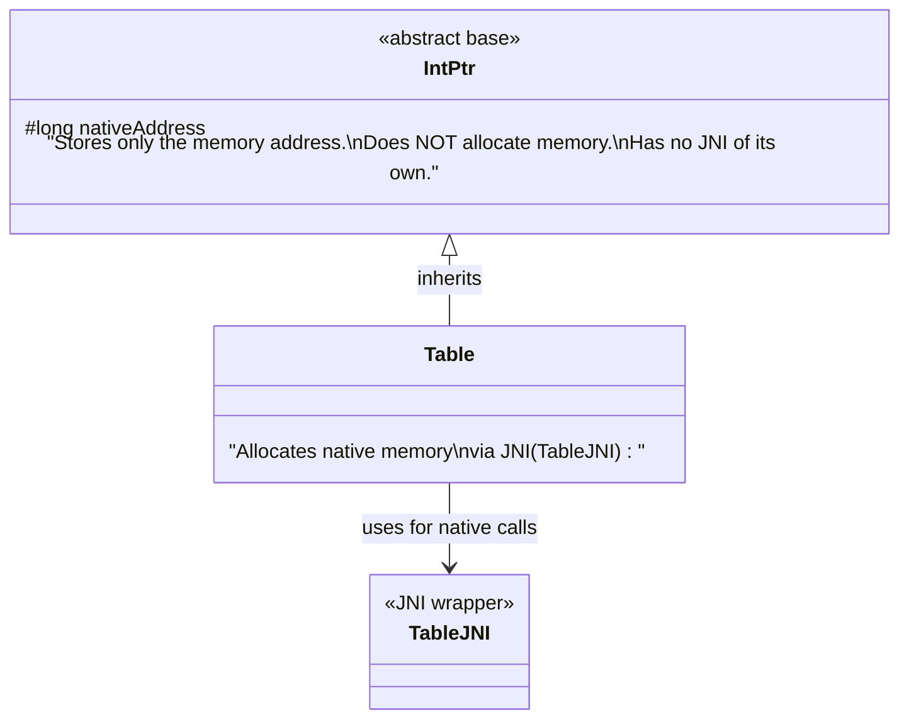
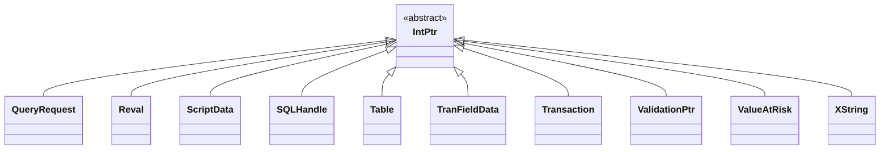
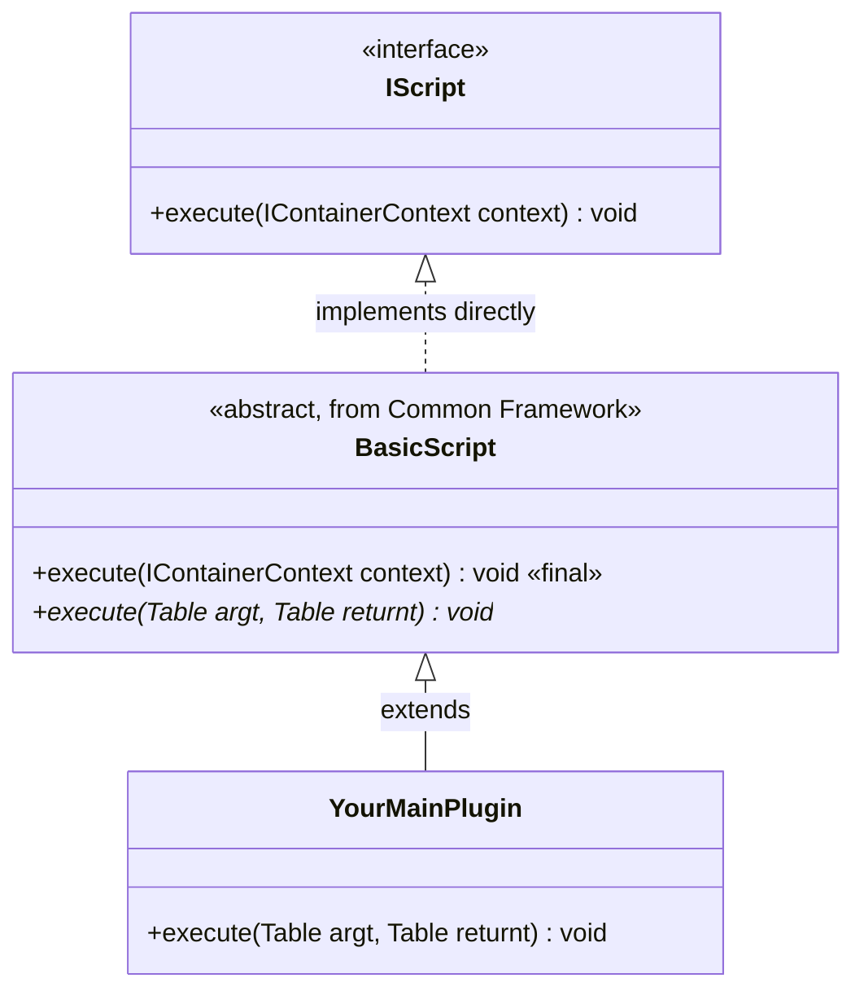
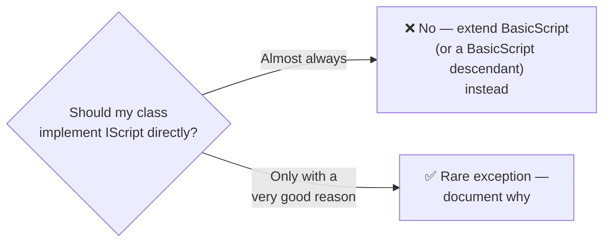
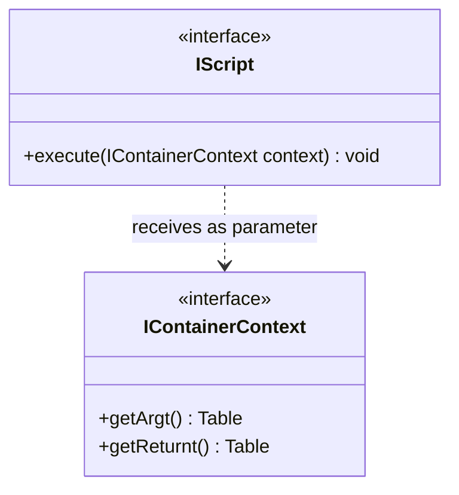
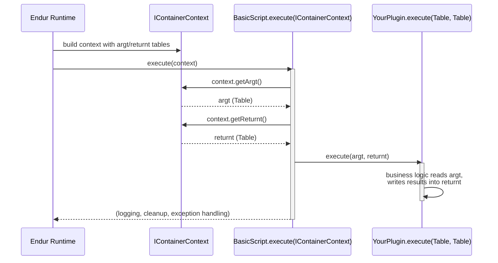
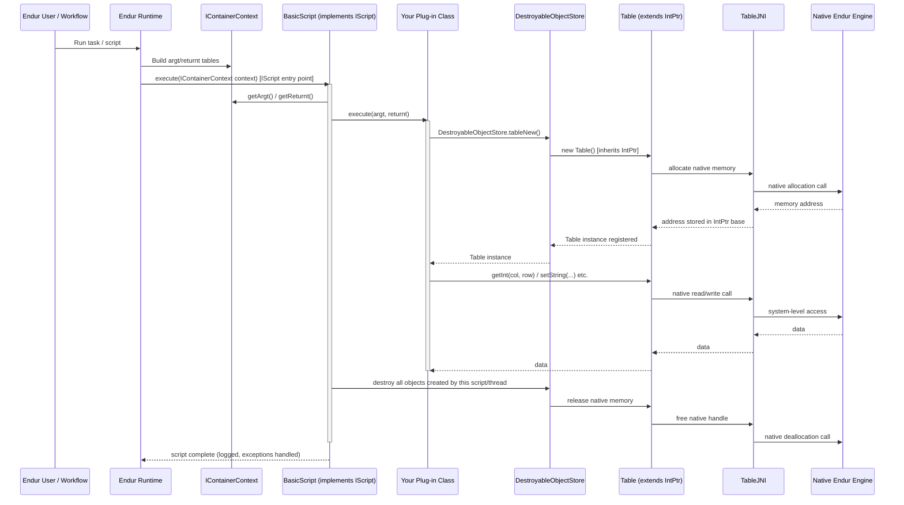

# OpenJVS Architecture — Full Reference Guide

> Source: Section 5 *"OpenJVS Architecture"* (5.1 Java Native Interface (JNI), 5.2 Class IntPtr, 5.3 Interface IScript, 5.4 Interface IContainerContext) of the **Programming Guide for OpenJVS Development — EET Fenix Endur**. This instruction file expands that section into a complete, diagrammed reference explaining *how* OpenJVS actually talks to Endur under the hood.

---

## Table of Contents

1. [Overview: Why OpenJVS Architecture Matters](#1-overview-why-openjvs-architecture-matters)
2. [5.1 Java Native Interface (JNI)](#2-51-java-native-interface-jni)
3. [5.2 Class IntPtr](#3-52-class-intptr)
4. [5.3 Interface IScript](#4-53-interface-iscript)
5. [5.4 Interface IContainerContext](#5-54-interface-icontainercontext)
6. [End-to-End Flow: From Endur Task to Native Memory](#6-end-to-end-flow-from-endur-task-to-native-memory)
7. [Practical Checklist for Developers](#7-practical-checklist-for-developers)

---

## 1. Overview: Why OpenJVS Architecture Matters

OpenLink built OpenJVS as a **Java library** that sits on top of Endur's native (C/C++) engine. Everything a developer writes in a `.java` plug-in eventually has to cross the boundary between the **Java Virtual Machine** and the **native Endur process** that actually holds trades, tables, and market data in memory.

Four architectural pieces make that boundary crossing work, and they are exactly the four sub-sections covered in this guide:



Understanding this stack answers questions such as:
- *Why do I need to call `DestroyableObjectStore` to clean up a `Table`?* → Because `Table` holds a native memory handle via `IntPtr` (Section 3).
- *Why does my class need an `execute(IContainerContext context)` method?* → Because `IScript` is the contract Endur uses to invoke any plug-in (Section 4).
- *Why is OpenJVS "not platform independent"?* → Because JNI ties it to native OS-level functions (Section 2).

---

## 2. 5.1 Java Native Interface (JNI)

### What JNI Is

**Java Native Interface (JNI)** is a standard Java mechanism that lets Java code call, and be called by, native (non-Java) code — typically C or C++ libraries compiled for a specific operating system.

> Java Native Interface (JNI) provides an interface to operation system functions; therefore the library is **not platform independent**.

### Why OpenLink Used JNI

OpenLink's rationale (as stated in the guide) was pragmatic re-use:

> The reason OLF used JNI is that they **did not want to reinvent the wheel**. They use the "old" functions from the last versions.

In other words, Endur's core trading/risk engine was already written in native code (from earlier AVS-era versions of the product). Rather than re-implement all of that logic in pure Java, OpenLink wrapped the existing native functions with a JNI layer so Java (OpenJVS) code could call them.

### The Trade-off

| Benefit | Cost |
|---|---|
| Re-uses decades of proven native trading/risk logic | **Not platform independent** — tied to the native library build for each OS |
| Fast — native code runs at C/C++ speed | The object-oriented wrapping is described in the guide as **"a very unsatisfied way"** of doing OOP — i.e., it's a thin, mechanical wrapper rather than a clean Java-native design |
| Familiar behavior — matches legacy AVS semantics | Developers must manage native memory manually (see [Section 3 — IntPtr](#3-52-class-intptr)) |

### Worked Example: `Table` and `TableJNI`

The guide's central example is the `Table` class:

> The class **"Table"** has the class **"TableJNI"** as JNI, which means that the class "Table" is more or less a **wrapper class** for "TableJNI" to cover the access to the operation system.

```mermaid
classDiagram
    class Table {
        <<Java wrapper>>
        +getInt(col, row) int
        +getNumRows() int
        +...() 
    }
    class TableJNI {
        <<native JNI bridge>>
        -nativeGetInt(ptr, col, row) int
        -nativeAlloc() long
        -...()
    }
    Table --> TableJNI : delegates every operation to
    TableJNI ..> NativeOS["Native OS-level Endur Engine"] : calls into
```

Every method you call on a `Table` object (e.g., `table.getInt("value", row)`) is, under the hood, forwarded by `Table` to the equivalent native method on `TableJNI`, which then talks to the operating system / native Endur engine directly.



### Key Takeaway

Because of this JNI wrapping, **every "simple" Java method call on OpenJVS classes like `Table` is secretly a native call**. This has two direct consequences for developers:

1. **Performance**: native calls have overhead — avoid calling them in unnecessarily tight loops when a Java-side alternative exists.
2. **Memory ownership**: since the real data lives in native memory (not the Java heap), the JVM garbage collector **cannot** clean it up on its own — which is exactly why `IntPtr` and `DestroyableObjectStore` exist (see next section).

---

## 3. 5.2 Class IntPtr

### Purpose

**`IntPtr`** (real class name **`OIntPtr`** — the guide explicitly notes the glossary name "IntPtr" is not the actual class name) is the base class that provides **a data container for classes that use memory from the operating system directly, rather than the Java heap**.

> The class does not allocate the memory (therefore it has no JNI), but it **only saves the address**. So every class that inherits "IntPtr" might use memory from the operation system directly, which means that the memory **needs to be freed by hand**.

### How `IntPtr` Relates to `Table` and `TableJNI`

Putting Sections 5.1 and 5.2 together (this is the guide's **Figure 1: Class diagram shows the dependencies of the class Table**):



**Reading the diagram:**
- `IntPtr` sits at the top — it is the generic "I hold a native memory address" contract.
- `Table` **inherits** `IntPtr`, so every `Table` object carries a native memory address.
- `Table` **also uses** `TableJNI` to perform the actual allocation and access of that native memory (the JNI bridge from Section 5.1).
- `IntPtr` itself never touches JNI — it is purely a bookkeeping/address-holder class. The *allocating* class (`Table`) is the one that pairs with a JNI class.

### Full List of Classes That Inherit `IntPtr`

> "IntPtr" is inherited by: **QueryRequest, Reval, ScriptData, SQLHandle, Table, TranFieldData, Transaction, ValidationPtr, ValueAtRisk,** and **XString**.



| Class | Typical Use |
|---|---|
| `QueryRequest` | Represents a database query request handle |
| `Reval` | Revaluation object |
| `ScriptData` | Script execution data handle |
| `SQLHandle` | Direct SQL statement/connection handle |
| `Table` | In-memory table (the guide's worked example) |
| `TranFieldData` | Transaction field data handle |
| `Transaction` | A single deal/transaction object |
| `ValidationPtr` | Validation result handle |
| `ValueAtRisk` | VaR calculation result handle |
| `XString` | Native string handle |

### Why Manual Memory Management Matters

Because `IntPtr`-derived objects hold **native memory**, not Java-heap memory:

- The **Java garbage collector cannot see or reclaim** this memory.
- If a script creates many `Table`/`Transaction`/etc. objects and never releases them, **native memory leaks accumulate** across script runs — potentially destabilizing the whole Endur process, not just the JVM.
- This is precisely why the Common Framework provides the **`DestroyableObjectStore`** class (covered fully in Section 6.4 of the full Programming Guide): it tracks every `IntPtr`-derived object created by a script and automatically destroys them when the script (which extends `BasicScript`) terminates.

```mermaid
flowchart TD
    Start(["Script extends BasicScript"]) --> Create["Create IntPtr-derived objects<br/>via DestroyableObjectStore<br/>e.g. DestroyableObjectStore.tableNew()"]
    Create --> Use["Use the object during script execution"]
    Use --> End{"Script execute&#40;&#41; completes<br/>&#40;normally or via exception&#41;"}
    End --> Cleanup["BasicScript automatically calls<br/>DestroyableObjectStore cleanup"]
    Cleanup --> Free["Native memory for all tracked<br/>IntPtr objects is freed"]
    Free --> Done(["Script fully terminated,<br/>no native memory leak"])
```



> ⚠️ **Rule of thumb:** If a class inherits `IntPtr` (directly or indirectly, like `Table` or `Transaction`), never create it with plain `new`-style construction without registering it — always go through `DestroyableObjectStore` (see the Common Framework instruction set) so it gets cleaned up automatically.

---

## 4. 5.3 Interface IScript

### Definition

> The Interface **"IScript"** provides the method **"abstract void execute(IContainerContext context)"**.

### Purpose

`IScript` is the **contract Endur uses to run any OpenJVS class as a standalone script**. It is the single, universal entry point — regardless of whether the plug-in is a Main script, a Parameter script, a UDSR, or any other type described later in the guide (Section 8), they all ultimately satisfy this interface.

> This interface **must be implemented by any OpenJVS class that is meant to be run as a standalone script**. The method **"execute" is the entrance point of Endur**.



### Critical Design Rule

Per Section 8 of the full guide, developers should **almost never implement `IScript` directly**. Instead:

- `BasicScript` (in the Common Framework) is the **one** class that implements `IScript` directly.
- All real plug-ins extend `BasicScript` (or one of its descendants like `BasicParamScript`, `AbstractUdsr`).
- This way, every plug-in automatically inherits `BasicScript`'s standard behavior: start/end logging, exception handling with Alert Broker notification, and automatic `DestroyableObjectStore` cleanup — instead of every developer re-implementing that boilerplate themselves.



### Why "execute" Is Called "the entrance point of Endur"

When an Endur task, workflow step, or ad-hoc run triggers an OpenJVS class, Endur's runtime:

1. Loads/instantiates the compiled class.
2. Confirms it implements `IScript`.
3. Builds an `IContainerContext` object containing the input/output tables for this run.
4. Calls `execute(context)` on the instance.

Everything the plug-in does happens **inside** that single method call — there is no other way for Endur to hand control to your Java code.

---

## 5. 5.4 Interface IContainerContext

### Definition

> This Interface provides the connection between the different types of scripts. It gives access to **"argt"** and **"returnt"**.

### Purpose

`IContainerContext` is the **data-carrying object** passed into `execute(IContainerContext context)`. It abstracts away the differences between how various script types (Main, Parameter, Output, UDSR, etc.) receive their input and produce their output, by exposing exactly two things:

| Member | Meaning |
|---|---|
| **`argt`** | The **argument table** — input data passed into the script |
| **`returnt`** | The **return table** — output data the script populates and hands back to Endur |



### Why It's "the Connection Between Different Types of Scripts"

Different script types (main scripts, parameter scripts, UDSRs, operational service scripts, connex method scripts — see Section 8 of the full guide) are all invoked differently by Endur internally, but they **all** communicate through the same `argt`/`returnt` shape. This uniformity is what allows `BasicScript` to define a single, `final` implementation of `execute(IContainerContext context)` that:

1. Extracts `argt` and `returnt` from the `IContainerContext`.
2. Delegates to a simpler, type-specific abstract method — e.g. `execute(Table argt, Table returnt)` for main scripts.



### Practical Meaning for Everyday Development

Because `BasicScript` already unwraps `IContainerContext` for you, in day-to-day OpenJVS plug-in development you will almost never touch `IContainerContext` directly — you'll simply implement:

```java
public class MyPluginMain extends BasicScript {
    @Override
    public void execute(Table argt, Table returnt) {
        // argt  -> data passed in by Endur
        // returnt -> data you populate for Endur to use/display
    }
}
```

`IContainerContext` matters architecturally (it's *why* this pattern works uniformly across all plug-in types), even though you rarely code against it directly.

---

## 6. End-to-End Flow: From Endur Task to Native Memory

Putting all four sub-sections together — this is the complete request path from an Endur task being run to native memory being touched and released:



---

## 7. Practical Checklist for Developers

- [ ] **Never implement `IScript` directly** — extend `BasicScript` (or a descendant) so `execute(IContainerContext)` is handled for you.
- [ ] **Remember every `IntPtr`-derived object (`Table`, `Transaction`, `Reval`, `ScriptData`, `SQLHandle`, `QueryRequest`, `TranFieldData`, `ValidationPtr`, `ValueAtRisk`, `XString`) holds native memory** — it is *not* garbage-collected by the JVM.
- [ ] **Always create/register `IntPtr`-derived objects through `DestroyableObjectStore`**, never bypass it, so memory is freed automatically when the script ends.
- [ ] **Treat calls on `Table`/JNI-backed classes as native calls** — they cross the JVM boundary, so avoid excessive calls in hot loops where a pure-Java alternative would do.
- [ ] **Don't rely on OpenJVS being platform-independent** — the JNI layer ties it to the native Endur build for the target OS.
- [ ] **Understand that `argt`/`returnt` (via `IContainerContext`) is the universal data contract** across all plug-in types — even though `BasicScript` shields you from touching `IContainerContext` directly in most plug-ins.

---

## Related Sections (Full Programming Guide)

- Section 4 — OpenJVS, Java and Endur (projects, Directory Browser, project catalog)
- Section 6 — The Common Framework (`BasicScript`, `DestroyableObjectStore`, `Log`, etc. — where `IScript`/`IntPtr` usage is operationalised)
- Section 8 — Developing OpenJVS Plugins (naming rules per plug-in type, all of which satisfy `IScript` via `BasicScript`)
- Section 11 — Debugging Code (inspecting `Table`/`IntPtr`-backed objects live via the Eclipse debugger's Display view)
