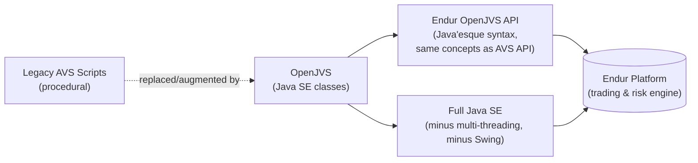
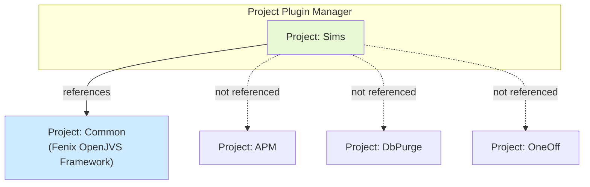
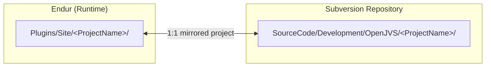
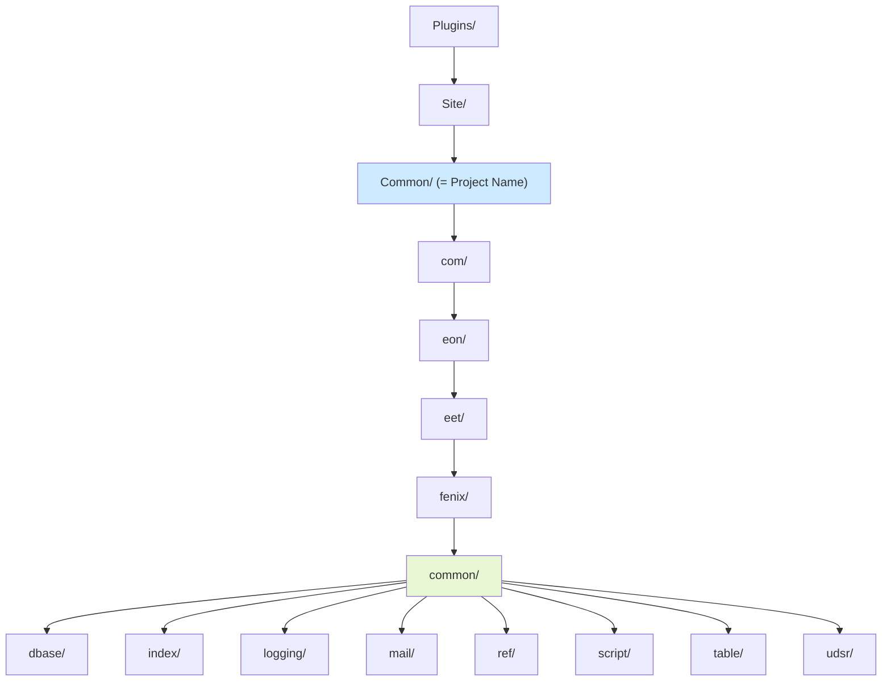
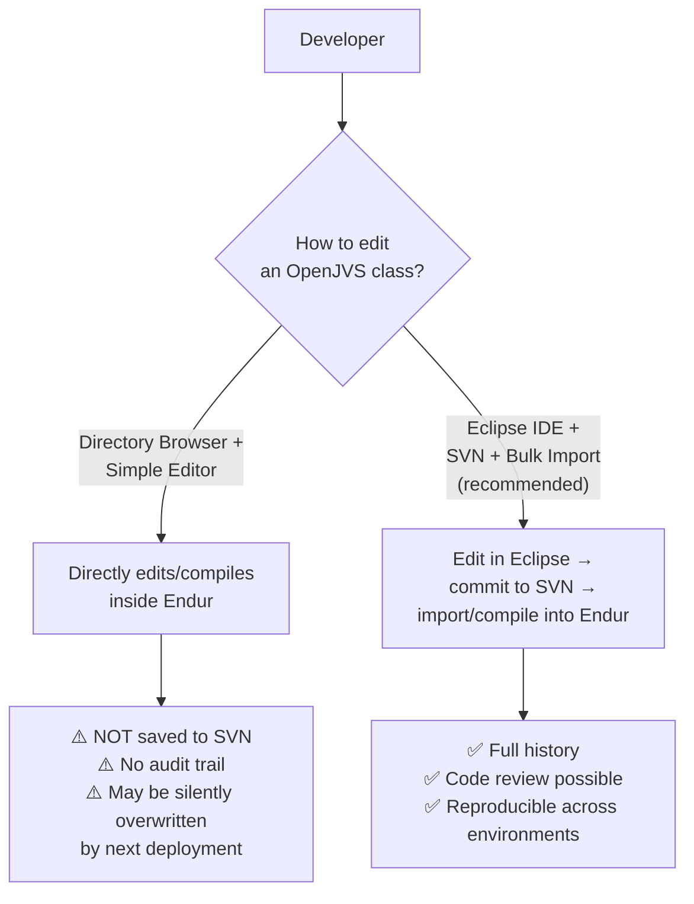
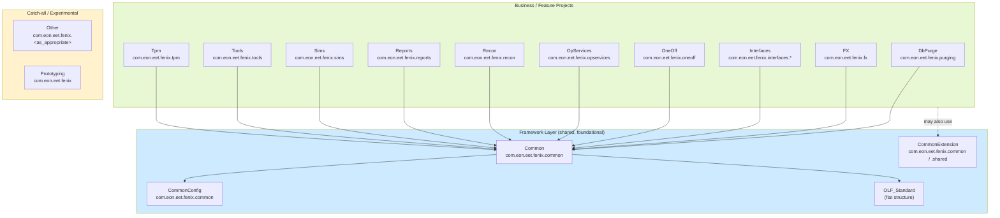
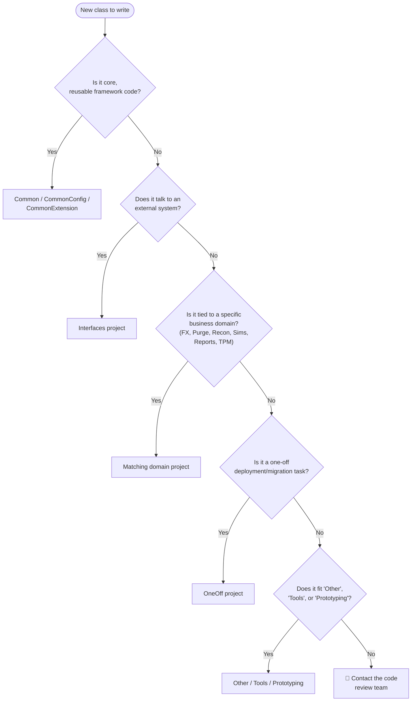
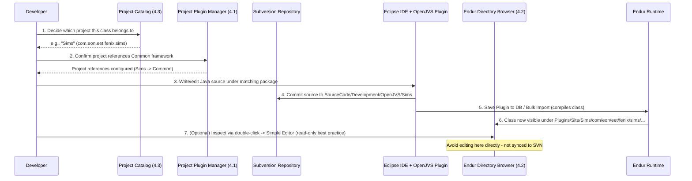

# OpenJVS, Java and Endur — Full Reference Guide

> Source: Section 4 *"OpenJVS, Java and Endur"* (including 4.1 OpenJVS Projects, 4.2 Directory Browser, 4.3 Current EET OpenJVS Projects) of the **Programming Guide for OpenJVS Development — EET Fenix Endur**. This instruction file expands that section into a complete, diagrammed reference for anyone writing or reviewing OpenJVS/Java code against Endur.

---

## Table of Contents

1. [Overview: OpenJVS, Java and Endur](#1-overview-openjvs-java-and-endur)
2. [4.1 OpenJVS Projects](#2-41-openjvs-projects)
3. [4.2 Directory Browser](#3-42-directory-browser)
4. [4.3 Current EET OpenJVS Projects](#4-43-current-eet-openjvs-projects)
5. [End-to-End Flow Summary](#5-end-to-end-flow-summary)
6. [Practical Checklist for Developers](#6-practical-checklist-for-developers)

---

## 1. Overview: OpenJVS, Java and Endur

**OpenJVS** is OpenLink's Java-based scripting layer for the Endur trading and risk platform. It lets developers write **custom scripts as ordinary Java classes** instead of the older, more limited AVS (Advanced Visual Script) language.

### Key facts

| Fact | Detail |
|---|---|
| **Language** | Java SE (standard Java syntax, classes, generics, collections, etc.) |
| **API** | The Endur **OpenJVS API** — conceptually similar to the older AVS API, but exposed with Java-style classes/methods instead of AVS's procedural syntax |
| **Where it runs** | Anywhere an AVS script could previously run (main tasks, parameter scripts, workflow steps, UDSRs, etc.) |
| **What's *not* available** | **Multi-threading** and the **Swing UI** are explicitly excluded — OpenJVS classes run inside Endur's managed script engine, which does not support spawning your own threads or building desktop UI dialogs beyond what Endur's own `Ask` API provides |
| **What *is* available** | All other standard Java SE functionality: collections, string processing, I/O, exceptions, date/time handling, etc. |



### Why this matters for developers

Because OpenJVS classes are compiled Java, they get the full benefit of object-oriented design — inheritance, interfaces, encapsulation, exception hierarchies, generics — while still plugging directly into Endur's task/workflow/simulation engine. This is why the Programming Guide immediately follows its OOP and UML introduction sections with this section: **OpenJVS is where object-oriented theory meets Endur's runtime reality.**

---

## 2. 4.1 OpenJVS Projects

### What is an OpenJVS Project?

OpenJVS classes are never loose, standalone files — they are always **organised and grouped into "Projects"** inside Endur. A **Project** is a named container (similar in spirit to an IDE module or a Java package root) that:

- Groups related Java classes together.
- Has its own storage location inside the Endur directory structure (the **Plugin Path**).
- Can be configured to **reference other projects**, so its classes can call classes that live in a different project.

### The Project Plugin Manager

Projects are **set up and configured using the `Project Plugin Manager`** — an Endur administration screen. Two of its jobs are:

1. **Define new projects** (name + plugin path).
2. **Configure project references** — i.e., declare which *other* projects this project is allowed to use classes from.

**Example from the guide — the `Sims` project referencing `Common`:**

| Selected | Plugin Project Name | Plugin Path |
|---|---|---|
| ✔ | Common | `Plugins/Site/Common/` |
|  | APM | `Plugins/Site/APM/` |
|  | DbPurge | `Plugins/Site/DbPurge/` |
|  | OneOff | `Plugins/Site/OneOff/` |
|  | Other | `Plugins/Site/Other/` |
|  | connex | `Plugins/Site/connex/` |

In this example, the `Sims` project has ticked **Common** as a reference — meaning any class inside `Sims` can import and use classes from the `Common` project (e.g., `BasicScript`, `Log`, `DestroyableObjectStore`). Without this reference being configured, the compiler/runtime would not resolve those classes.



### The `Common` Project — the Fenix OpenJVS Framework

In the Fenix implementation, the **`Common`** project holds the classes that make up the **Fenix OpenJVS Framework** (`BasicScript`, `BasicParamScript`, `AbstractUdsr`, `DestroyableObjectStore`, `Log`, `SendMail`, etc. — detailed in Section 6 of the full guide). Because almost every other project needs this shared framework, **most other projects are configured to reference `Common`** — exactly as shown in the `Sims` example above.

### Project → Source Control Relationship

Every Endur OpenJVS project has a **1:1 mirror in the Subversion (SVN) source-control repository**. This means:

- The `Plugin Path` seen in Endur (e.g., `Plugins/Site/Common/`) corresponds to a repository folder (e.g., `SourceCode/Development/OpenJVS/Common`).
- Changes made through the proper channels (Eclipse IDE + SVN + Endur import) stay traceable and recoverable.
- (See [Section 12 — Source Control](#3-42-directory-browser) concept reused later in the guide for full detail.)



### Key Rule: What the "Plugin Path" Represents

> The **Plugin Path** shows where, in the Endur directory structure, the Java classes (**both source code and compiled code**) are stored.

This is an important detail: Endur stores **both** the `.java` source and the compiled `.class` bytecode side by side in the same project folder — which is why editing/compiling can happen directly inside Endur (via the Simple Editor or Bulk Import), in addition to the "proper" Eclipse + SVN workflow.

---

## 3. 4.2 Directory Browser

### Purpose

The **Directory Browser** is the Endur tool used to explore, browse, and manage the folders and files that make up OpenJVS projects (and other Endur artifacts) directly from within the running Endur client.

### Folder Structure Rules

| Rule | Detail |
|---|---|
| **Root location** | Every OpenJVS project lives under the `Plugins/Site` folder |
| **Folder naming** | The project's folder name is **identical to the project name** (e.g., project `Common` → folder `Plugins/Site/Common`) |
| **Sub-folder structure** | Java classes within a project are organised into sub-folders that **mirror the Java package name** — exactly like a normal Java source tree |

**Worked example from the guide:**

For a class in package `com.eon.eet.fenix.common` inside the `Common` project, the physical folder path inside Endur is:

```
Plugins/Site/Common/com/eon/eet/fenix/common/
```



This exactly matches the screenshot in the guide, where the **Current Directory** shown is:

```
/Plugins/Site/Common/com/eon/eet/fenix/common
```

...and the visible contents include classes like `DestroyableObjectStore`, `FenixAttributeNotFoundException`, `FenixConfigParameterNotFoundException`, `FeniaDBAccessException`, `FenixException`, `FenixRuntimeException`, `UserTableEnum`, plus package sub-folders `dbase`, `index`, `logging`, `mail`, `ref`, `script`, `table`, `udsr`.

### Directory Browser Views

The Directory Browser exposes at least these views/tabs (as seen in the guide's screenshots):

| View | Purpose |
|---|---|
| **View by File** | Flat list of files regardless of folder |
| **View by Category** | Groups content by a category attribute |
| **View by Directory** | Standard hierarchical folder tree (the default working view) |

Each row for a class/file shows metadata columns: **Name, Type** (e.g., `Plugin`, `Directory`), **Owner**, **Security Groups**, **Category**, **Other Category**.

### Editing via the Directory Browser (and why to be careful)

> Double-click on a Java class within the directory browser to open the source code in the **OpenJVS Simple Editor**.

⚠️ **Critical warning from the guide:**

> It is **highly discouraged** to edit Java classes using the Simple Editor as the changes here are **not reflected in Subversion source control**.

This is one of the most important operational rules in the whole document. The Directory Browser + Simple Editor path is a **direct edit against the live Endur environment**, completely bypassing SVN. If a developer edits and saves there:

- The change **works immediately** in Endur (and even compiles on save — see Section 10.1 of the full guide).
- The change is **NOT captured in source control**, meaning:
  - No history/audit trail of *why* or *who* changed it.
  - The next proper SVN check-in/deployment could **silently overwrite or revert** the change.
  - Other environments (BAU, UAT, other Fenix instances) will **not** have the fix unless someone manually re-applies it there too.



**Practical guidance:** Use the Directory Browser + Simple Editor only for quick, throwaway inspection or genuinely one-off/emergency fixes that will immediately be back-ported into SVN. For all standard development, use the **Eclipse IDE OpenJVS plugin** workflow (Section 10.3 of the full guide) so changes are version-controlled.

---

## 4. 4.3 Current EET OpenJVS Projects

### Purpose of the Catalog

Section 4.3 defines the **fixed, agreed set of OpenJVS projects** that exist for the EET Fenix implementation. The rule is explicit:

> **All code should fit into one of these projects** OR, if not, it may be necessary to create a new project. **If you are unsure then contact the code review team** to discuss the best location for your code.

This is a **governance control** — it prevents developers from randomly creating new top-level projects, which would fragment the codebase and complicate the "only reference Common framework / OLF standard projects" rule described later (Section 7 of the full guide).

### Full Project Catalog

| Project Name | Package | Description |
|---|---|---|
| **CommonConfig** | `com.eon.eet.fenix.common` | Application-specific configuration classes |
| **Common** | `com.eon.eet.fenix.common` | EGC core OpenJVS common framework |
| **CommonExtension** | `com.eon.eet.fenix.common`, `com.eon.eet.fenix.shared` | Application-specific extensions to common framework; shared project code |
| **DbPurge** | `com.eon.eet.fenix.purging` | Code related to database purging |
| **FX** | `com.eon.eet.fenix.fx` | FX hedging functionality |
| **Interfaces** | `com.eon.eet.fenix.interfaces.<interface_name>` | OpenJVS code related to external systems |
| **OLF_Standard** | Flat structure | Modified OPL standard JVS classes |
| **OneOff** | `com.eon.eet.fenix.oneoff` | One-off tasks needed as part of a project deployment, e.g., trade migration or one-time deal update |
| **OpServices** | `com.eon.eet.fenix.opservices` | Op Services plugins. If an op service plugin is related to an external interface, it should instead live in the **Interfaces** project with an appropriate package name |
| **Other** | `com.eon.eet.fenix.<as_appropriate>` | Classes that don't fit any other project and don't warrant their own project |
| **Prototyping** | `com.eon.eet.fenix` | For experimenting |
| **Recon** | `com.eon.eet.fenix.recon` | Code associated with the Reconciliation module |
| **Reports** | `com.eon.eet.fenix.reports` | All reporting code, unless associated with an Interface |
| **Sims** | `com.eon.eet.fenix.sims` | User-defined simulations |
| **Tools** | `com.eon.eet.fenix.tools` | Various handy tools |
| **Tpm** | `com.eon.eet.fenix.tpm` | Code related to the TPM module |

### Visual Map of Projects and Their Relationship to the Common Framework



> **Governance rule reminder (formalized fully in Section 7 of the guide):** Business/feature projects (`Sims`, `DbPurge`, `FX`, `Interfaces`, etc.) may reference **framework layer** projects (`Common`, `CommonConfig`, `CommonExtension`, `OLF_Standard`) — but **must never reference each other directly** (e.g., `Sims` must not depend on `DbPurge`). This keeps each project independently deployable/removable.

### Decision Table: "Which Project Does My New Class Belong To?"

| If your class is about... | Put it in... |
|---|---|
| Configuration values / reference-data enums specific to this application | `CommonConfig` |
| Core, shareable framework logic usable by both Fenix and GO | `Common` |
| Fenix-or-GO-specific extension of the framework, or code shared across 2+ projects | `CommonExtension` |
| Purging / archiving of database tables | `DbPurge` |
| FX hedging | `FX` |
| Talking to an external system (any interface) | `Interfaces` (with a package sub-name per interface) |
| A modified copy of an OPL standard script | `OLF_Standard` |
| A one-time migration/deployment task | `OneOff` |
| An Operational Services plug-in **not** tied to an external interface | `OpServices` |
| An Operational Services plug-in **that is** tied to an external interface | `Interfaces` instead |
| Doesn't fit anywhere else, and isn't big enough to warrant its own project | `Other` |
| Quick experiments / spikes | `Prototyping` |
| Reconciliation module logic | `Recon` |
| Reporting logic **not** tied to an external interface | `Reports` |
| User Defined Simulation Results / simulation logic | `Sims` |
| General-purpose utility/helper classes | `Tools` |
| TPM module logic | `Tpm` |
| None of the above fit | **Escalate to the code review team** to decide if a *new* project is warranted |



---

## 5. End-to-End Flow Summary

Putting Sections 4.1–4.3 together, this is the full lifecycle of an OpenJVS class from concept to running code:



---

## 6. Practical Checklist for Developers

Use this checklist whenever starting new OpenJVS work:

- [ ] **Identify the correct project** using the [decision table](#decision-table-which-project-does-my-new-class-belong-to) in Section 4.3; escalate to the code review team if unsure.
- [ ] **Confirm package name** matches the project's documented package (e.g., `com.eon.eet.fenix.sims` for the `Sims` project).
- [ ] **Verify project references** in the Project Plugin Manager include `Common` (and `CommonExtension`/`CommonConfig` if needed) before assuming those classes will resolve.
- [ ] **Never edit directly** in the Directory Browser's Simple Editor for real development — use Eclipse + SVN + Bulk Import/Save-Plugin-to-DB instead.
- [ ] **Check the SVN mirror path** (`SourceCode/Development/OpenJVS/<ProjectName>`) exists and is checked out before making changes.
- [ ] **Remember the Java SE limitations**: no multi-threading, no Swing UI — design accordingly.
- [ ] **Do not create a new top-level project** without confirming with the code review team first.

---

## Related Sections (Full Programming Guide)

- Section 5 — OpenJVS Architecture (`IntPtr`, `IScript`, `IContainerContext`, JNI)
- Section 6 — The Common Framework (`BasicScript`, `BasicParamScript`, `DestroyableObjectStore`, etc.)
- Section 7 — The CommonExtension Project Shared Package (project-reference governance rules)
- Section 8 — Developing OpenJVS Plugins (naming conventions per plug-in type)
- Section 10 — Importing Code to Endur (Simple Editor, Bulk Import, Eclipse IDE plugin)
- Section 12 — Source Control (Subversion repository structure)
