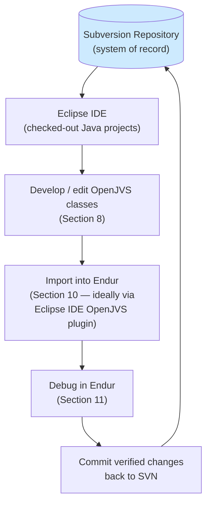
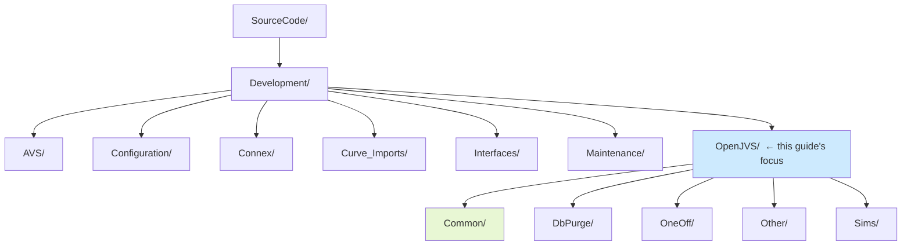
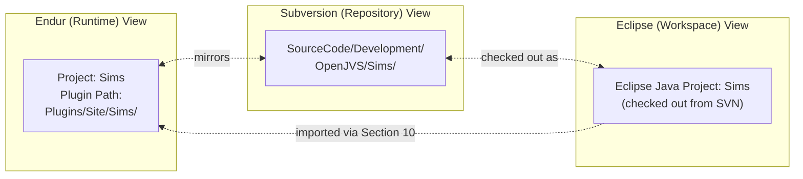
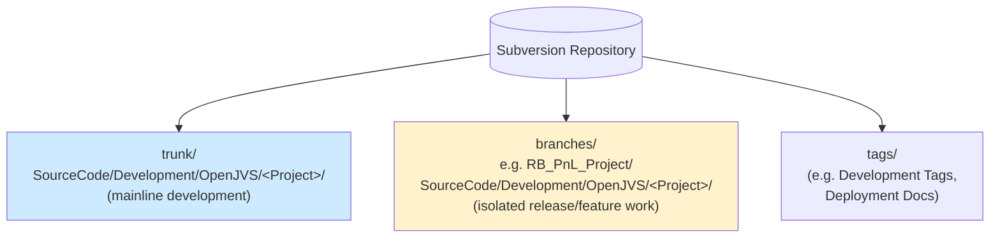
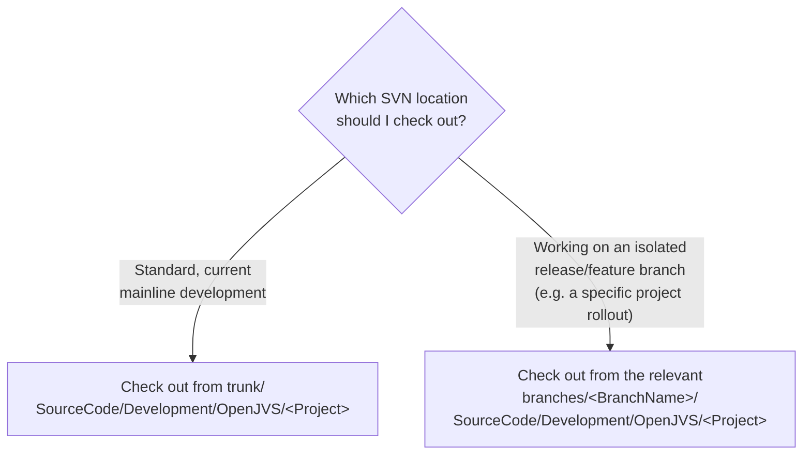
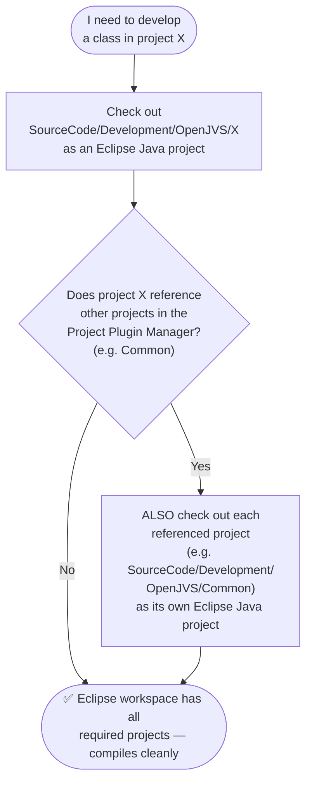
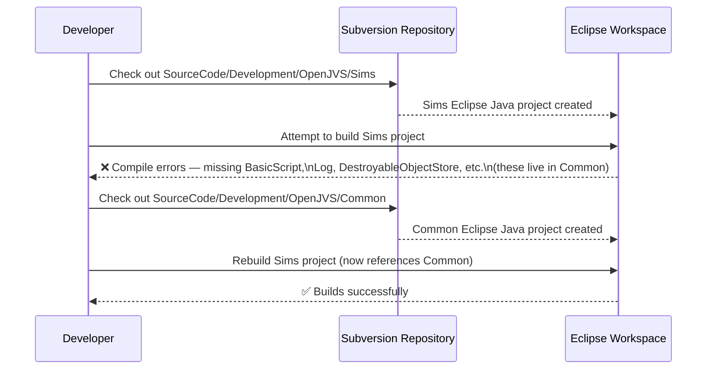
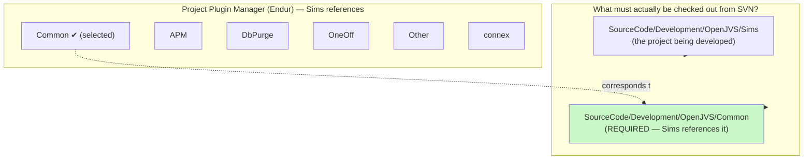
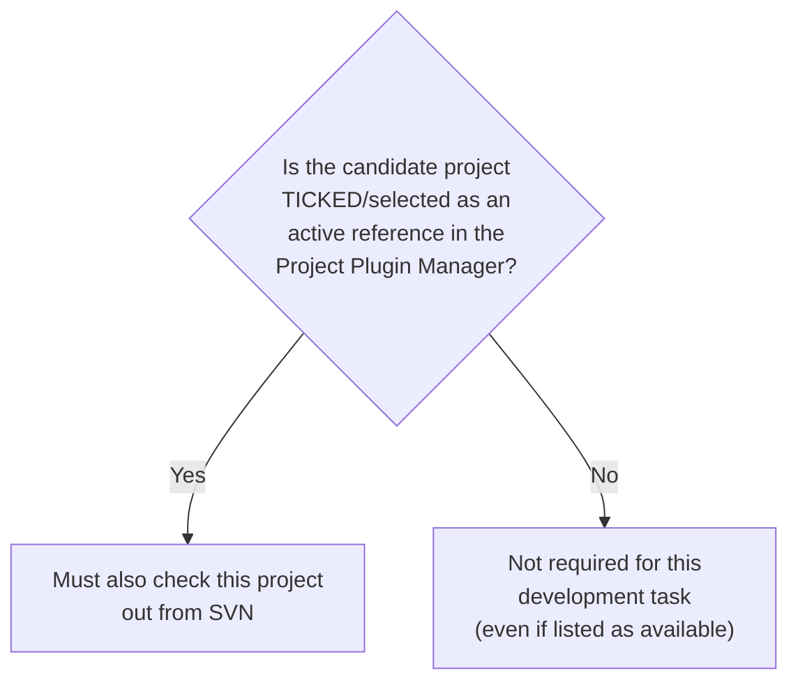
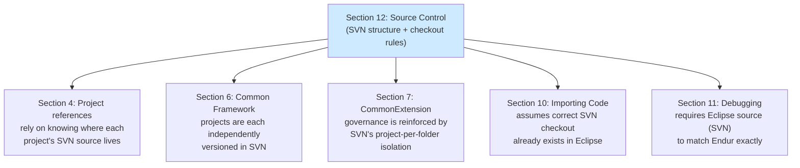

# Source Control — Full Reference Guide

> Source: Section 12 *"Source Control"* of the **Programming Guide for OpenJVS Development — EET Fenix Endur**. This instruction file expands that section into a complete, diagrammed reference explaining how OpenJVS source code is organized in Subversion, and how to correctly check out a project (plus its supporting dependencies) before starting development.

---

## Table of Contents

1. [Overview: Subversion as the System of Record](#1-overview-subversion-as-the-system-of-record)
2. [The Repository Folder Structure](#2-the-repository-folder-structure)
3. [Project-to-Repository Mapping](#3-project-to-repository-mapping)
4. [Trunk vs. Branches](#4-trunk-vs-branches)
5. [Preparing for Development: Checking Out the Right Projects](#5-preparing-for-development-checking-out-the-right-projects)
6. [Worked Example: Developing in the Sims Project](#6-worked-example-developing-in-the-sims-project)
7. [How Source Control Ties Together the Whole Guide](#7-how-source-control-ties-together-the-whole-guide)
8. [Practical Checklist for Developers](#8-practical-checklist-for-developers)

---

## 1. Overview: Subversion as the System of Record

> **Subversion** is the source control software used by the Endur Fenix team. This section **assumes familiarity with Subversion** and how it is used in the Eclipse IDE. See the **separate Eclipse IDE guide** for more details.

Section 12 is deliberately the **final** section of the Programming Guide — it exists to make one point unmistakably clear: **everything described in Sections 4–11 (projects, the Common Framework, plug-in development, importing code, debugging) is built on top of Subversion being the authoritative source of truth.**



This is why Section 10.1 (Endur Simple Editor) carried such a strong warning: editing directly in Endur **bypasses this entire cycle**, breaking the guarantee that Subversion always reflects what's actually running.

---

## 2. The Repository Folder Structure

> **OpenJVS source code is stored in the Subversion repository as Eclipse projects.** The Eclipse projects **match the OpenJVS projects that can be found in Endur**. The projects are located below the folder **`SourceCode/Development/OpenJVS`** within the **trunk and branches**.

### The Repository Tree (as shown in the guide)

```
SourceCode/
└── Development/
    ├── AVS/
    ├── Configuration/
    ├── Connex/
    ├── Curve_Imports/
    ├── Interfaces/
    ├── Maintenance/
    └── OpenJVS/
        ├── Common/
        ├── DbPurge/
        ├── OneOff/
        ├── Other/
        └── Sims/
```



**Key observation:** `Development/` contains **sibling folders for every kind of Endur-related source** (AVS scripts, Configuration, Connex, Curve Imports, Interfaces, Maintenance) — and **`OpenJVS`** is just one of those siblings. Everything this Programming Guide describes lives specifically under the `OpenJVS` subtree.

---

## 3. Project-to-Repository Mapping

The single most important architectural fact in this section:

> **Each of the Endur OpenJVS projects are reflected in the Subversion Source Control repository** (as already noted in Section 4.1). The Eclipse projects **match** the OpenJVS projects found in Endur **exactly**.

This creates a clean **1:1 mapping** between three different "views" of the same project:



| View | Where it lives | Purpose |
|---|---|---|
| **Endur (runtime)** | `Plugins/Site/<ProjectName>/` | Where compiled classes actually execute |
| **Subversion (repository)** | `SourceCode/Development/OpenJVS/<ProjectName>/` | The authoritative, versioned source of truth |
| **Eclipse (workspace)** | A checked-out Eclipse Java project | Where a developer actively edits code |

This table directly reinforces Section 4.2's Directory Browser note that the "Plugin Path" and Subversion location are two representations of the **same logical project**.

---

## 4. Trunk vs. Branches

> The projects are located below the folder `SourceCode/Development/OpenJVS` **within the trunk and branches**.



This matches what's visible in the Section 10.2 Eclipse Project Explorer screenshots from the guide, where multiple parallel checkouts of the same project exist:

- `Common [not associated] [branches/R8_PnL_Project/SourceCode/Development/...]`
- `EET SVN Development Tags [tags/Dev...]`
- `EET SVN PnL Branch [branches/R8_PnL_Project/...]`
- `EET SVN PnL Branch Deployment Doc`
- `GO`



**Practical implication:** always confirm with the team/release plan whether current work should target **trunk** or a specific **branch** before checking anything out — checking out the wrong one leads to changes landing in the wrong release stream.

---

## 5. Preparing for Development: Checking Out the Right Projects

### The Core Rule

> To prepare for development, the **whole OpenJVS project must be checked out from SVN as an Eclipse Java project plus any supporting projects**.

This is the critical, easy-to-miss rule of Section 12: **checking out just the project you intend to edit is not enough** — you must **also** check out every project it depends on (per the Project Plugin Manager's configured references — see Section 4.1), otherwise the Eclipse project won't compile (missing classes from `Common`, `CommonConfig`, etc.).



### Worked Example (from the guide, verbatim logic)

> Therefore if development is required for classes within the **`Sims`** project, then the repository location **`SourceCode/Development/OpenJVS/Sims`** needs to be checked out from SVN as an Eclipse Java project. Since the **`Sims`** project **uses the Common framework**, the repository location **`SourceCode/Development/OpenJVS/Common`** also needs to be checked out from SVN as an Eclipse Java project.



> The **separate Eclipse IDE guide** provides details how to check out a java project from Subversion.

---

## 6. Worked Example: Developing in the Sims Project

Combining Section 12 with what's already known about the `Sims` project from Section 4.1 (the `Project Plugin Manager` screenshot showing `Sims` referencing `Common`, `APM`, `DbPurge`, `OneOff`, `Other`, `connex`):



**Important nuance:** the Project Plugin Manager screenshot shows **only `Common` ticked** as an active reference for `Sims` (the others — `APM`, `DbPurge`, `OneOff`, `Other`, `connex` — are listed as *available* references but not currently selected). This means, in this specific example, **only `Sims` and `Common` strictly need to be checked out** — not every project listed in the Plugin Manager's reference list, only the ones actually **ticked/selected**.



---

## 7. How Source Control Ties Together the Whole Guide

Section 12 is the natural capstone to the entire Programming Guide — every prior section assumed this SVN structure existed:

| Earlier Section | How It Depends on Source Control |
|---|---|
| **4.1 OpenJVS Projects** | Stated project references are configured in the Plugin Manager — Section 12 explains *where* the actual source for each referenced project lives |
| **4.2 Directory Browser** | Warned that Simple Editor changes are "not reflected in Subversion source control" — Section 12 explains exactly what that repository looks like |
| **6.1 Projects of the Common Framework** | `CommonConfig`, `Common`, `CommonExtension` are each their own SVN-mirrored project |
| **7. CommonExtension Shared Package** | The governance rule (no cross-referencing business projects) is enforced partly by projects living in **separate, independent SVN locations** — makes it structurally awkward to "reach into" another project's source |
| **10.2/10.3 Importing Code** | Both import paths assume the developer's Eclipse workspace already has the correct SVN-checked-out projects open |
| **11.3 Setting Breakpoints** | Requires the Eclipse source (from SVN) to be **identical** to what's imported into Endur — only possible if the correct SVN checkout was used in the first place |



---

## 8. Practical Checklist for Developers

- [ ] **Confirm you're working in the correct SVN location** — `trunk` for mainline work, or the specific `branches/<BranchName>` for isolated release/feature work.
- [ ] **Always check out from `SourceCode/Development/OpenJVS/<ProjectName>`** as an Eclipse Java project — never assume a project already exists correctly in your workspace.
- [ ] **Before starting development, check the Project Plugin Manager** (Section 4.1) to see which other projects are **ticked/selected** as active references for your target project.
- [ ] **Check out every actively-referenced project** (most commonly `Common`) as its own separate Eclipse Java project — otherwise the build will fail with missing-class compile errors.
- [ ] **Never rely on the Endur Simple Editor** (Section 10.1) as a substitute for this SVN checkout workflow — it explicitly does not sync with source control.
- [ ] **Keep Eclipse source and Endur-imported classes in sync** — this SVN-based checkout is the foundation that makes debugging (Section 11.3) reliable.
- [ ] **Consult the separate Eclipse IDE guide** for the exact mechanical steps of performing an SVN checkout within Eclipse (right-click → Team / SVN checkout wizard), since this Programming Guide intentionally defers those details to that guide.

---

## Related Sections (Full Programming Guide)

- Section 4.1 — OpenJVS Projects (Project Plugin Manager references — determines which other projects must also be checked out)
- Section 4.2 — Directory Browser (why Simple Editor changes are "not reflected in Subversion source control")
- Section 6.1 — Projects of the Common Framework (`CommonConfig`, `Common`, `CommonExtension` as independently SVN-mirrored projects)
- Section 7 — The CommonExtension Project Shared Package (governance rule reinforced by SVN's per-project isolation)
- Section 10 — Importing Code to Endur (all import paths assume a correct SVN checkout already exists in Eclipse)
- Section 11.3 — Setting Breakpoints (requires Eclipse source to be identical to what was imported into Endur)
