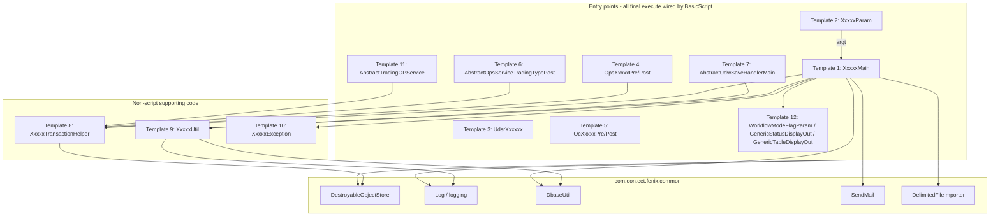

# OpenJVS Common Framework — Master Instructions

## 1. Purpose

This document is the entry point for developers writing new OpenJVS Java plug-ins (Main scripts, Param scripts, UDSRs,
Operational Services, Connex method scripts, UDW save handlers, transaction helpers, supporting utility classes and
custom exceptions) for the **Endur–Fenix migration** codebase.

It was produced by reviewing, end to end, every `.java` file under:

```
endur-fenix-migration/JVS/Common/src/com/eon/eet/fenix/common/**
endur-fenix-migration/JVS/CommonConfig/src/com/eon/eet/fenix/common/**  (FenixException / FenixRuntimeException base)
```

and cross-checking usages of those base classes across the other `JVS/*` projects (`OpServices`, `Interfaces`, `Sims`,
`Tpm`, `RemitFeed`, `FX`, `Recon`, `CloudControl`, `OLFModified`, `OLF_Standard`, `otk`, `OneOff`, `Prototyping`, `Tools`,
`DbPurge`, `JBroker`, `APM`).

Each reusable plug-in/utility "shape" (base class) has its own individual instruction file in this folder — see
**Section 3 (Index of Templates)**. Copy the relevant template file's code skeleton as the starting point for new code;
do not start a new class from a blank file.

## 2. Package Inventory (what was reviewed)

| Package | Key Classes Reviewed | Responsibility |
|---|---|---|
| `com.eon.eet.fenix.common` | `DestroyableObjectStore`, `FenixUtil`, `IncStandard`, `RunRecon`, `IFenixAlertBrokerException`, exception classes (`FenixAttributeNotFoundException`, `FenixConfigParamNotFoundException`, `FenixDBAccessException`, `FenixDbNoResultsException`, `FenixDbQueryException`, `FenixNoFailureException`) | Core plumbing: object lifecycle management, alert-broker exception contract, misc utilities |
| `com.eon.eet.fenix.common.script` | `BasicScript`, `BasicParamScript`, `AbstractOpsServiceTradingTypePost`, `AbstractTradingOPService`, `FenixParamScriptException`, `GenericStatusDisplayOut`, `GenericTableDisplayOut`, `WorkflowModeFlagParam` | Abstract base classes that ALL plug-ins must extend; entry-point plumbing, logging, alerting, error propagation |
| `com.eon.eet.fenix.common.logging` | `Log`, `AbstractLog`, `LogCategory`, `LogConfiguration`, `ILogWriter` + writer implementations | Central logging framework, configuration driven by the Constants Repository |
| `com.eon.eet.fenix.common.table` | `TableIterator`, `TableRowIterator`, `TableColIterator`, `TableUtil`, `UserTableEnum` | Safe/simple table row & column iteration helpers, user-table name enum |
| `com.eon.eet.fenix.common.dbase` | `DbaseUtil`, `EET_DB_PROC_ENUM` | Wrapper around SQL execution, user-table loads, saved queries, config lookups |
| `com.eon.eet.fenix.common.file` | `DelimitedFileImporter`, `DelimitedFileDefinition`, `ColumnAttributes` | XML-definition-driven CSV import into a memory table |
| `com.eon.eet.fenix.common.mail` | `SendMail`, `SendMailImpl`, `SendMailConfiguration`, `EetMailFromAlertBrokerMain`, `SendMailTest` | Central email sending (SMTP first, Connex/J2EE fallback) |
| `com.eon.eet.fenix.common.udsr` | `AbstractUdsr`, `ContextHelper` | Base class + helper for User Defined Simulation Results |
| `com.eon.eet.fenix.common.udw` | `AbstractUdwSaveHandlerMain` | Base class for User Data Worksheet save-handler Main scripts |
| `com.eon.eet.fenix.common.tran` | `AbstractTransactionHelper` | Base class for reusable, per-transaction helper objects |
| `com.eon.eet.fenix.common.ref` / `.enumeration` | `RefUtils`, `UserUtils`, various `EET_*_ENUM` classes, `DateSequenceDates` | EET-specific reference-data enumerations and helpers |
| `com.eon.eet.fenix.common.connex`, `.amq`, `.constrepository`, `.customservice`, `.date`, `.emir`, `.grid`, `.index`, `.notification`, `.obsolete`, `.report`, `.rest`, `.security`, `.task`, `.tp`, `.util`, `.xml` | Various | Additional shared services (Connex messaging, constants repository access, date helpers, EMIR reporting, grid computation, index/curve helpers, notifications, report generation, REST clients, security, task/workflow helpers, generic utilities, XML handling) — treat these the same way: reusable, must not be duplicated in project-specific code |
| (in `CommonConfig` project) | `FenixException`, `FenixRuntimeException`, `FenixAlertBrokerException`, `FenixAlertBrokerRuntimeException`, `UserTableEnum` | Exception base classes and user-table enum shared by `Common` |

> `FenixException` / `FenixRuntimeException` live in the **`CommonConfig`** OpenJVS project (referenced by `Common`), not
> directly under `common/`. Always import from `com.eon.eet.fenix.common`.

## 3. Index of Templates (individual instruction files in this folder)

| # | File | Base Class | Plug-in Type |
|---|---|---|---|
| 1 | `01_MainScript_Template_Instructions.md` | `com.eon.eet.fenix.common.script.BasicScript` | Main script (`XxxxxMain`) |
| 2 | `02_ParamScript_Template_Instructions.md` | `com.eon.eet.fenix.common.script.BasicParamScript` | Parameter script (`XxxxxParam`) |
| 3 | `03_UDSR_Template_Instructions.md` | `com.eon.eet.fenix.common.udsr.AbstractUdsr` | User Defined Simulation Result (`UdsrXxxxxx`) |
| 4 | `04_OperationalService_Template_Instructions.md` | `com.eon.eet.fenix.common.script.BasicScript` | Operational Service pre/post-processing (`OpsXxxxxPre` / `OpsXxxxxPost`) |
| 5 | `05_ConnexMethodScript_Template_Instructions.md` | `com.eon.eet.fenix.common.script.BasicScript` | Connex method script (`OcXxxxxPre` / `OcXxxxxPost`) |
| 6 | `06_TradingTypeOpsPostProcessing_Template_Instructions.md` | `com.eon.eet.fenix.common.script.AbstractOpsServiceTradingTypePost` | Trading-type Operational Service post-processing with saved-query deal filtering |
| 7 | `07_UdwSaveHandler_Template_Instructions.md` | `com.eon.eet.fenix.common.udw.AbstractUdwSaveHandlerMain` | User Data Worksheet save-handler Main script |
| 8 | `08_TransactionHelper_Template_Instructions.md` | `com.eon.eet.fenix.common.tran.AbstractTransactionHelper` | Reusable per-transaction helper object |
| 9 | `09_SupportingUtilityClass_Template_Instructions.md` | none (private `Log` member) | Supporting/utility class (`XxxxxUtil`) |
| 10 | `10_CustomException_Template_Instructions.md` | `FenixException` / `FenixRuntimeException` / `FenixAlertBrokerException` / `FenixAlertBrokerRuntimeException` | Project-specific custom exception (`XxxxxException`) |
| 11 | `11_TradingOpServiceStateMachine_Template_Instructions.md` | `com.eon.eet.fenix.common.script.AbstractTradingOPService` | Trading transaction-status transition handler (`OpsXxxxxPost`) |
| 12 | `12_ReadyMadeReusableScripts_Instructions.md` | `WorkflowModeFlagParam` / `GenericStatusDisplayOut` / `GenericTableDisplayOut` | Ready-made scripts to reuse directly (not skeletons) |

Each file contains: the mandatory base class, a **Full Explanation** of how the base class works and when to use it,
a **Diagram** (Mermaid sequence/flowchart) showing the execution flow, a copy-paste-ready `.java` code skeleton with
`TODO`/`<placeholder>` markers, and the specific rules that apply to that template only. Rules that apply to **all**
templates are in Section 4 below (do not repeat them per file — they are referenced from each template file).

### 3.1 Overall Framework Architecture



## 4. Mandatory Base Classes (never implement `IScript` directly)

| Plug-in type | Must extend | Class name suffix/prefix |
|---|---|---|
| Main script | `com.eon.eet.fenix.common.script.BasicScript` | ends `Main` |
| Parameter script | `com.eon.eet.fenix.common.script.BasicParamScript` | ends `Param` |
| UDSR | `com.eon.eet.fenix.common.udsr.AbstractUdsr` | starts `Udsr` |
| Operational Service | `com.eon.eet.fenix.common.script.BasicScript` | starts `Ops`, ends `Pre`/`Post` |
| Connex method script | `com.eon.eet.fenix.common.script.BasicScript` | starts `Oc`, ends `Pre`/`Post` |
| Trading-type OPS post-processing | `com.eon.eet.fenix.common.script.AbstractOpsServiceTradingTypePost` | project-specific, ends `Post` |
| UDW save handler | `com.eon.eet.fenix.common.udw.AbstractUdwSaveHandlerMain` | ends `Main` |
| Transaction helper | `com.eon.eet.fenix.common.tran.AbstractTransactionHelper` | ends `Helper` |
| Supporting utility class | none required, but must have `private Log log = new Log();` (or a `static final Log`) for logging | ends `Util` |
| Custom exception | `FenixException` / `FenixRuntimeException` / `FenixAlertBrokerException` / `FenixAlertBrokerRuntimeException` | ends `Exception` |
| Trading OpService state-machine handler | `com.eon.eet.fenix.common.script.AbstractTradingOPService` | starts `Ops`, ends `Post` |

`BasicScript.execute(IContainerContext)` is `final` — it wires up logging, alert broker notifications, script-path
tracking, and guarantees `DestroyableObjectStore.destroyAll()` runs in a `finally` block. Subclasses only implement
`execute(Table argt, Table returnt)`.

`BasicParamScript.execute(Table, Table)` is `final` — it determines workflow vs. ad-hoc execution and delegates to
`getWorkflowValues(argt)` / `getUserSelection(argt)` respectively. Implement **both** abstract methods; if a param
script is not designed for one of the two modes, throw a `FenixRuntimeException` with a clear message from that method.

## 5. Object Lifecycle Rules (`DestroyableObjectStore`) — applies to ALL templates

1. **Always** create `Table`, `Transaction`, `Instrument`, `ODateTime`, `XString` objects via `DestroyableObjectStore`
   (`tableNew()`, `tableClone()`, `tableCopy()`, `retrieveTransaction()`, `retrieveInstrument()`, `dtNew()`,
   `xstringNew()`, ...) — never call `Table.tableNew()` etc. directly inside script/plug-in code.
2. If an object is obtained from an API that is not wrapped (e.g. `Ref.getInfo()`), register it manually with
   `DestroyableObjectStore.store(obj)`.
3. Register query ids with `DestroyableObjectStore.store(queryId)` so `Query.clear()` happens automatically.
4. Call `DestroyableObjectStore.remove(obj)` only when you need to destroy something **before** script end (otherwise
   it is destroyed automatically in `BasicScript`'s `finally` block via `destroyAll()`).
5. Use **labels** (`newLabel()`, `destroyCurrentLabel()`, `destroyToLabel()`) only for advanced scenarios needing
   scoped cleanup within a long-running script (e.g. per-iteration cleanup in a loop).
6. Never implement your own destroy-tracking logic — reuse this class.

## 6. Logging Rules — applies to ALL templates

1. In scripts (`BasicScript` descendants) call the inherited wrapper methods directly: `debug()`, `info()`,
   `warning()`, `error()`, `severe()`, `recoverableError()`, `unRecoverableError()`.
2. In non-script supporting classes (utility classes, transaction helpers), instantiate a private `Log` field:
   `private Log log = new Log();` and call `log.debug(...)`, etc. — do **not** use `System.out.print`.
3. Logging levels: `DEBUG` (verbose/dev detail) < `WARNING` (unexpected but recoverable) < `INFO` (progress) <
   `ERROR` (unrecoverable-for-this-unit) < `SEVERE` (critical). Default level is `info`; configure per-script in the
   Constants Repository (`Logging` context, `LogLevel` sub-context, variable name = script name).
4. **Rule of thumb:** if your code *handles* an exception, log it. If your code *throws* an exception (propagates
   it), do **not** log it — let the caller/`BasicScript` handle and log it once, to avoid duplicate log noise.
5. Use `setDealNumForLogging` / `setTranNumForLogging` / `setDealNumTranNumForLogging` to prefix subsequent log lines
   with deal/transaction context while processing a specific deal in a loop; call `clearLoggingDealAndTranNum()`
   afterwards.
6. Log writers (`FileLogWriter`, `OConsoleLogWriter`, `NtEventLogWriter`, `SuppressLogWriter`, etc.) are assigned via
   the Constants Repository — do not hard-code writer selection in application code.

## 7. Exception Handling Rules — applies to ALL templates

1. Prefer **unchecked** exceptions (`FenixRuntimeException`) over checked (`FenixException`) unless the caller can
   meaningfully react to a checked exception.
2. Wrap any caught `OException` (or other checked exception you cannot usefully handle) in a `FenixRuntimeException`,
   including the original exception as the cause, and add context to the message (what operation/object failed).
3. Use `FenixAlertBrokerException` / `FenixAlertBrokerRuntimeException` only when the failure should trigger an Alert
   Broker notification; always pass the alert broker message id to the super constructor.
4. Do not let `NullPointerException` or other "accidental" exceptions mask the real cause — catch specific exceptions
   where possible and rethrow with context.
5. `BasicScript.execute` already logs and (conditionally) alerts on any `Throwable` that escapes
   `execute(Table, Table)` — do not duplicate that top-level handling inside your own script; only catch what you can
   specifically act upon.
6. `FenixParamScriptException` thrown from `getUserSelection` suppresses the alert-broker email (the user already
   sees the error dialog) — this is handled automatically by `BasicParamScript`/`BasicScript`; do not catch it
   yourself.
7. `FenixNoFailureException` can be thrown to terminate execution early without it being treated as a failure (no
   alert, only a warning log entry) — use sparingly and only where the "failure" is actually an expected/benign
   early exit.

## 8. Database Access Rules — applies to ALL templates

1. Use `DbaseUtil.execISql(sql)` / `execISql(sql, tableName)` for direct SQL — results are automatically registered
   with `DestroyableObjectStore`.
2. Use `DbaseUtil.loadUserTable(UserTableEnum)` to load user tables — reference the table via the `UserTableEnum`
   enum, not a hard-coded string.
3. Use `DbaseUtil.runSavedQuery(...)` / `runSavedQueryDirect(...)` for saved queries; the returned query id is
   auto-registered for cleanup.
4. Use `DbaseUtil.getUserEonConfig(paramName)` to read `user_eon_configuration` values (throws
   `FenixConfigParamNotFoundException` if missing, `FenixRuntimeException` if duplicated).
5. Follow the **EQ-first** ordering rule for `Table.select()` conditions: put `EQ` conditions before other operators
   in the where-string.
6. Do not use the `DBMAINT` API. Avoid excessive query-result-table usage; prefer `DbaseUtil` helpers which already
   apply correct error handling via `DBUserTable.dbRetrieveErrorInfo`.

## 9. File Import Rule

- Use `DelimitedFileImporter.importFile(filename, definitionFilename)` for any CSV/delimited file import. Create the
  matching XML definition file (columns, types, validation behaviour) and import it into
  `/User/Import File Definitions` in the Endur Directory Browser before use. Do not write bespoke CSV parsing code.

## 10. Email Rule

- Use `SendMail.sendMail(...)` overloads (category/KID based) for all outbound email. Define recipient addresses in
  the `user_email_configuration` user table by category (with a `dbname` column so non-production environments do not
  email production addresses) — never hard-code email addresses in Java code.

## 11. Naming, Style and Documentation Rules (recap)

- Package must start with `com.eon.eet.fenix.` (or the project's namespace); Common framework classes live under
  `com.eon.eet.fenix.common.*`.
- 4-space indentation, no tabs, 140-character line length limit (Java).
- One class/interface per file (public one first); Javadoc on every class and every public/protected method
  (`@param`, `@return`, `@throws` as applicable, no implementation detail in Javadoc, only effect).
- Include a version-history implementation comment block (Rev/RSS/Date/Who/Description) directly after the class
  Javadoc.
- Constants ALL_UPPERCASE; no Hungarian notation; verbs for methods, nouns for classes; enums:
  `EGC_XXXX_ENUM` (Common project) / `XxxxxEnum` (other projects).
- Never make instance/class fields `public` — use getters/setters, except `final static` constants.
- Use `StringBuilder` instead of `StringBuffer`/string concatenation in loops.
- Always provide a final `else`/`default` that throws for unhandled cases in `if/else-if` chains or `switch`
  statements (see `AbstractUdsr.execute`'s `switch` with a `default: throw new FenixRuntimeException(...)` as the
  reference example).

## 12. Code Review Rule

- All new/changed code depending on this framework must go through the Uniper Endur code review process (SVN comment
  templates: `Ready for Review` → `Code Review Failed` / `L3/L2/L1 Code Review Passed`). Mark unfinished parts
  `INTERIM` in Javadoc so reviewers know to skip them.

## 13. Quick Checklist Before Committing New OpenJVS Code

- [ ] Extends the correct Common framework base class from Section 4/the matching template file (never `IScript` directly).
- [ ] Package name and class name follow the naming convention for the plug-in type.
- [ ] All `Table`/`Transaction`/`Instrument`/`ODateTime`/`XString` objects created via `DestroyableObjectStore`.
- [ ] Logging uses inherited `BasicScript` methods or a private `Log` field — no `System.out`.
- [ ] Exceptions: unchecked preferred, wrapped with context, alert-broker variants used only when an alert is required.
- [ ] Database access goes through `DbaseUtil`, `EQ` conditions first in `select()` calls.
- [ ] CSV import goes through `DelimitedFileImporter`; email goes through `SendMail`.
- [ ] Javadoc + version history block present; no hard-coded literals besides -1/0/1.
- [ ] Code passes the Uniper Endur code review workflow (correct SVN comment template used).

## 14. How to Use This Folder

1. Identify which plug-in/utility shape you need to write (Main, Param, UDSR, Ops, Oc, Trading-type Ops post, UDW
   save handler, transaction helper, utility, or exception).
2. Open the matching file from the index in Section 3.
3. Copy the `.java` skeleton, replace every `TODO` / `<placeholder>`, and follow the "Rules applied" list in that
   file together with Sections 4–12 above.
4. Run the Section 13 checklist before requesting code review.
