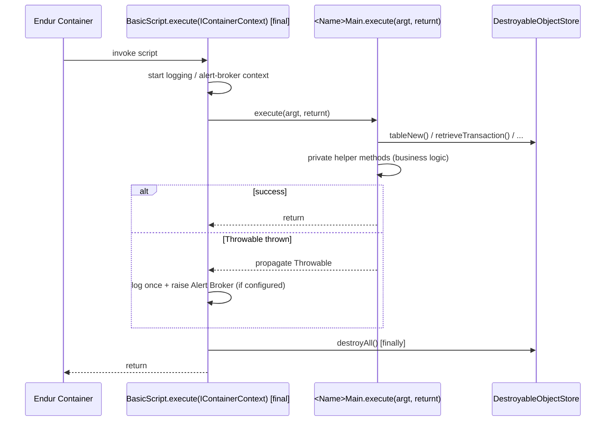

# Template 1: Main Script (`XxxxxMain`)

> See `OpenJVS_Common_Framework_Instructions.md` for the rules shared by all templates (object lifecycle, logging,
> exceptions, database access, naming/style). Only template-specific notes are repeated here.

## Base class

`com.eon.eet.fenix.common.script.BasicScript` — class name **must** end with `Main`.

`BasicScript.execute(IContainerContext)` is `final`: it wires up logging, alert-broker notification, script-path
tracking, and guarantees `DestroyableObjectStore.destroyAll()` runs in a `finally` block. Your subclass only
implements `execute(Table argt, Table returnt)`.

## Full Explanation

A Main script is the primary entry point Endur invokes for a task, toolbar button, workflow step, or menu action. The
Endur container calls the framework-level `execute(IContainerContext)` (final, in `BasicScript`), which:

1. Captures the script name/path for logging and alert-broker context.
2. Wraps your `execute(Table argt, Table returnt)` in a `try/finally` so `DestroyableObjectStore.destroyAll()` always
   runs, even if your code throws.
3. Catches any `Throwable` escaping your `execute`, logs it once (`severe`/`error`), and raises an Alert Broker
   notification if configured — so your own code should only catch exceptions it can specifically act on.

Your subclass never touches object destruction, alerting, or top-level logging wiring directly — it only receives
`argt` (input parameters, populated by the paired Param script if any) and `returnt` (output/result table) and does
the actual business logic, ideally delegated to small private helper methods.

## Diagram



## Code skeleton

```java
package com.eon.eet.fenix.<project>.<subpackage>;

import com.eon.eet.fenix.common.DestroyableObjectStore;
import com.eon.eet.fenix.common.FenixException;
import com.eon.eet.fenix.common.script.BasicScript;
import com.olf.openjvs.OException;
import com.olf.openjvs.Table;

/**
 * TODO: Description and purpose of the script.
 *
 * @author <author name>
 *         Created: <dd MMM yyyy>
 *
 */
/*
 * ------------------------------------------------------------------------------------------------------------------
 * | Rev | RSS No.   | Date        | Who          | Description                                                     |
 * ------------------------------------------------------------------------------------------------------------------
 * | 001 |           | <dd-MMM-yyyy> | <initials> | Initial version                                                  |
 * ------------------------------------------------------------------------------------------------------------------
 */
public class <Name>Main extends BasicScript {

    @Override
    public void execute(Table argt, Table returnt) throws FenixException, OException {

        info("TODO: describe what this script is about to do");

        // Use DestroyableObjectStore instead of Table.tableNew() so objects are cleaned up automatically
        Table workTable = DestroyableObjectStore.tableNew();

        // TODO: implement script logic here, keep MAIN short - split into small private methods

        debug("TODO: completed processing");
    }

    // TODO: add small, focused private helper methods below (one task per method)
}
```

## Rules applied

- Never implement `IScript` directly – always extend `BasicScript`.
- Use `DestroyableObjectStore` for every `Table` / `Transaction` / `ODateTime` / `Instrument` created.
- Use `info` / `debug` / `warning` / `error` wrapper methods inherited from `BasicScript` – never `System.out.print`.
- Do not use `finalize()` – use `try..finally`.
- Keep `execute(Table, Table)` short; delegate to small private helper methods (one task per method), consistent with
  the "Class/interface declaration order" rule (variables → constructors → methods).
- If the script needs deal/transaction context in log lines while looping, call `setDealNumForLogging(dealNum)` /
  `setTranNumForLogging(tranNum)` and clear it with `clearLoggingDealAndTranNum()` when done with that deal.
