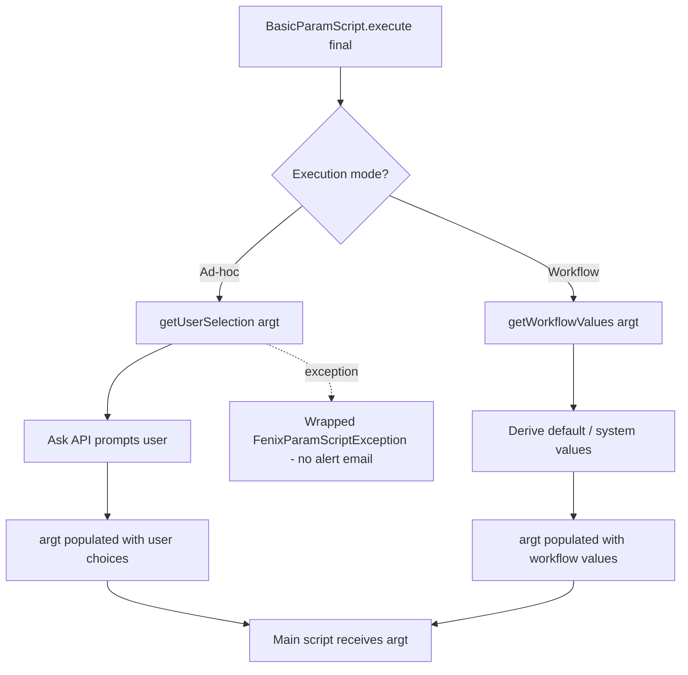

# Template 2: Parameter Script (`XxxxxParam`)

> See `OpenJVS_Common_Framework_Instructions.md` for the rules shared by all templates.

## Base class

`com.eon.eet.fenix.common.script.BasicParamScript` — class name **must** end with `Param`.

`BasicParamScript.execute(Table, Table)` is `final`: it determines workflow vs. ad-hoc execution and delegates to
`getWorkflowValues(argt)` / `getUserSelection(argt)` respectively. Implement **both** abstract methods; if a param
script is not designed for one of the two modes, throw a `FenixRuntimeException` with a clear message from that
method.

## Full Explanation

A Param script's sole responsibility is to populate the `argt` table that the paired Main script will receive — it
must never contain business logic. `BasicParamScript.execute` (final) inspects the execution context and branches:

- **Ad-hoc** (user runs the task manually): calls `getUserSelection(argt)`, where you use the `Ask` API to prompt the
  user and write their choices into `argt`. Any exception you throw here is wrapped as `FenixParamScriptException` so
  the alert-broker email is suppressed (the user already sees an error dialog).
- **Workflow** (task runs automatically as part of a workflow): calls `getWorkflowValues(argt)`, where you derive
  default/system values without prompting, since no user is present to answer a dialog.

If a given param script is only ever meant to run in one of the two modes, the other method must throw a
`FenixRuntimeException` explaining that this mode is unsupported, rather than silently doing nothing.

## Diagram



## Code skeleton

```java
package com.eon.eet.fenix.<project>.<subpackage>;

import com.eon.eet.fenix.common.FenixException;
import com.eon.eet.fenix.common.script.BasicParamScript;
import com.eon.eet.fenix.common.script.FenixParamScriptException;
import com.olf.openjvs.OException;
import com.olf.openjvs.Table;

/**
 * TODO: Description and purpose of the parameter script.
 *
 * @author <author name>
 *         Created: <dd MMM yyyy>
 *
 */
/*
 * ------------------------------------------------------------------------------------------------------------------
 * | Rev | RSS No.   | Date        | Who          | Description                                                     |
 * ------------------------------------------------------------------------------------------------------------------
 * | 001 |           | <dd-MMM-yyyy> | <initials> | Initial version                                                  |
 * ------------------------------------------------------------------------------------------------------------------
 */
public class <Name>Param extends BasicParamScript {

    /**
     * {@inheritDoc}
     * Called when running ad-hoc (outside workflow); use Ask API to prompt the user.
     * Throw {@link RuntimeException} (wrapped automatically into {@link FenixParamScriptException}) if the user cancels.
     */
    @Override
    protected void getUserSelection(Table argt) throws OException, FenixException {
        // TODO: prompt user via Ask API and populate argt
        // If this param script is NOT designed to run ad-hoc, replace body with:
        // throw new FenixRuntimeException("This parameter script cannot be run ad-hoc.");
    }

    /**
     * {@inheritDoc}
     * Called when running inside workflow; set default values without user intervention.
     */
    @Override
    protected void getWorkflowValues(Table argt) throws OException, FenixException {
        // TODO: populate argt with default/derived values
        // If this param script is NOT designed to run in workflow, replace body with:
        // throw new FenixRuntimeException("This parameter script cannot be run in workflow.");
    }
}
```

## Rules applied

- Only populate `argt` or interact with the user – no other business logic belongs in a Param script.
- Never call an `EXIT_Terminate` equivalent / do not throw uncontrolled checked exceptions; `BasicParamScript`
  already wraps `getUserSelection` exceptions into `FenixParamScriptException`, which suppresses the alert-broker
  email since the user already sees an error dialog — do not catch it yourself.
- Implement both `getUserSelection` and `getWorkflowValues`; use the explicit "not supported" `FenixRuntimeException`
  pattern rather than leaving a method empty when a mode is intentionally unsupported.
