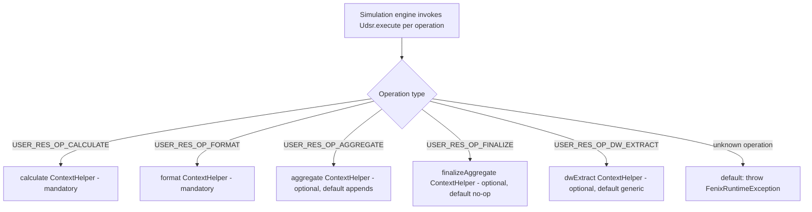

# Template 3: User Defined Simulation Result (`UdsrXxxxxx`)

> See `OpenJVS_Common_Framework_Instructions.md` for the rules shared by all templates.

## Base class

`com.eon.eet.fenix.common.udsr.AbstractUdsr` — package `com.eon.eet.fenix.sims.udsr`. Class name **must** start with
`Udsr`.

`AbstractUdsr` extends `BasicScript` and dispatches on the simulation result operation (`calculate`, `format`,
`aggregate`, `finalizeAggregate`, `dwExtract`) via a `switch` with a `default: throw new FenixRuntimeException(...)` —
use that pattern as the reference example for any similar dispatch code you write.

## Full Explanation

Endur's simulation engine calls a UDSR multiple times during a single simulation run, each time for a different
"operation" (represented as `USER_RES_OP_*` values in the `argt`). `AbstractUdsr.execute` reads the requested
operation and dispatches to one of five overridable lifecycle methods:

1. **`calculate`** — mandatory. Runs once per scenario/revaluation to compute the raw simulation result.
2. **`format`** — mandatory. Converts the calculated raw result into the display/output table shape.
3. **`aggregate`** — optional (default: append current result to the master results table). Combines results across
   scenarios/iterations.
4. **`finalizeAggregate`** — optional (default: no-op). Runs once after all aggregation is complete.
5. **`dwExtract`** — optional (default: generic extraction). Extracts results for the data warehouse.

Because `calculate` and `format` are always required and the other three usually rely on sensible defaults, most
UDSRs only need to override the first two.

## Diagram



## Code skeleton

```java
package com.eon.eet.fenix.sims.udsr;

```java
package com.eon.eet.fenix.sims.udsr;

import com.eon.eet.fenix.common.udsr.AbstractUdsr;
import com.eon.eet.fenix.common.udsr.ContextHelper;
import com.olf.openjvs.OException;

/**
 * TODO: Description and purpose of the user defined simulation result.
 *
 * @author <author name>
 *         Created: <dd MMM yyyy>
 *
 */
/*
 * ------------------------------------------------------------------------------------------------------------------
 * | Rev | RSS No.   | Date        | Who          | Description                                                     |
 * ------------------------------------------------------------------------------------------------------------------
 * | 001 |           | <dd-MMM-yyyy> | <initials> | Initial version                                                  |
 * ------------------------------------------------------------------------------------------------------------------
 */
public class Udsr<Name> extends AbstractUdsr {

    @Override
    protected void calculate(ContextHelper context) throws OException {
        // TODO: perform the simulation calculation
    }

    @Override
    protected void format(ContextHelper context) throws OException {
        // TODO: format the result set for display - always provide an implementation
    }

    // Optional overrides (default implementations provided by AbstractUdsr):
    // protected void aggregate(ContextHelper context) throws OException { }
    // protected void finalizeAggregate(ContextHelper context) throws OException { }
    // protected void dwExtract(ContextHelper context) throws OException { }
}
```

## Rules applied

- Extend `AbstractUdsr`; always implement `calculate` and `format`.
- Only override `aggregate`, `finalizeAggregate`, or `dwExtract` if the default behaviour (append current to master
  results / no-op / generic extraction) is insufficient.
- Use `ContextHelper` to access the simulation context rather than reaching into raw OpenJVS simulation APIs
  directly.
