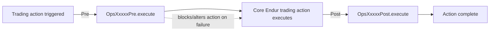

# Template 4: Operational Service Plug-in (`OpsXxxxxPre` / `OpsXxxxxPost`)

> See `OpenJVS_Common_Framework_Instructions.md` for the rules shared by all templates.

## Base class

`com.eon.eet.fenix.common.script.BasicScript` — package `com.eon.eet.fenix.opservices` (+ sub-packages). Class name
**must** start with `Ops`. Pre-processing classes end with `Pre`, post-processing with `Post`.

> If the operational service is for the **Trading** service type and needs a saved-query-based deal filter, use
> Template 6 (`AbstractOpsServiceTradingTypePost`) instead of this generic template.

## Full Explanation

Operational Services ("Ops Services") run before (`Pre`) or after (`Post`) a core Endur trading action (e.g. deal
validation, generation of accounting entries, deal booking) for a configured operation-service definition. Because
they extend plain `BasicScript`, they get the same entry-point guarantees (logging, alert-broker, object-lifecycle
cleanup) as a Main script, but the `argt`/`returnt` shape is driven by the specific ops-service framework contract
(deal info table, service run id, operation service definition id, etc.) rather than by a Param script.

Use `Pre` when the logic must run, and potentially block/alter, the action before it happens (e.g. validation);
use `Post` for logic that reacts after the action has already completed (e.g. notifications, derived data updates).

## Diagram



## Code skeleton

```java
package com.eon.eet.fenix.opservices.<subpackage>;

import com.eon.eet.fenix.common.FenixException;
import com.eon.eet.fenix.common.script.BasicScript;
import com.olf.openjvs.OException;
import com.olf.openjvs.Table;

/**
 * TODO: Description and purpose of the operational service.
 *
 * @author <author name>
 *         Created: <dd MMM yyyy>
 *
 */
/*
 * ------------------------------------------------------------------------------------------------------------------
 * | Rev | RSS No.   | Date        | Who          | Description                                                     |
 * ------------------------------------------------------------------------------------------------------------------
 * | 001 |           | <dd-MMM-yyyy> | <initials> | Initial version                                                  |
 * ------------------------------------------------------------------------------------------------------------------
 */
public class Ops<Name>Post extends BasicScript {

    @Override
    public void execute(Table argt, Table returnt) throws FenixException, OException {
        // TODO: use cached reference data (TABLE_LoadRef equivalent) instead of repeated DB calls
        // TODO: implement pre/post processing logic
    }
}
```

## Rules applied

- Use `Pre` suffix for pre-processing, `Post` suffix for post-processing operational services.
- Prefer cached/looked-up reference data over repeated ad-hoc DB calls inside per-deal loops.
- Same object-lifecycle, logging, and exception rules as the Main script template apply (this is still a
  `BasicScript` descendant).
