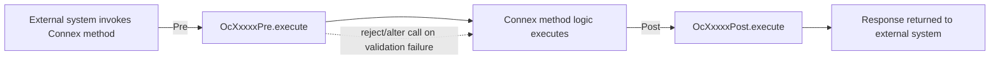

# Template 5: Connex Method Script (`OcXxxxxPre` / `OcXxxxxPost`)

> See `OpenJVS_Common_Framework_Instructions.md` for the rules shared by all templates.

## Base class

`com.eon.eet.fenix.common.script.BasicScript` — package `com.eon.eet.fenix.connex` (+ sub-packages, mirroring the
operational-service layout). Class name **must** start with `Oc`. Pre-processing classes end with `Pre`,
post-processing with `Post`.

Connex method scripts are invoked around a Connex method call in the same way operational services wrap trading
actions; they share the same `BasicScript` entry point contract (logging, alert broker, `DestroyableObjectStore`
cleanup all wired up by the `final execute(IContainerContext)`).

## Full Explanation

Connex is Endur's external-facing messaging/integration layer (used for straight-through processing, external system
integration and remote method invocation). A Connex method script intercepts a specific Connex method call so custom
logic can run immediately before (`Pre`) or after (`Post`) the method executes — for example, validating an inbound
message payload before it is processed, or triggering a follow-up notification once the method has completed.
Because `Oc*` scripts are plain `BasicScript` descendants, they follow exactly the same object-lifecycle, logging,
and exception rules as a Main script; the only difference is the trigger point (a Connex method call rather than a
user/task action) and the `Oc` naming convention.

## Diagram



## Code skeleton

```java
package com.eon.eet.fenix.connex.<subpackage>;

import com.eon.eet.fenix.common.FenixException;
import com.eon.eet.fenix.common.script.BasicScript;
import com.olf.openjvs.OException;
import com.olf.openjvs.Table;

/**
 * TODO: Description and purpose of the Connex method pre/post-processing script.
 *
 * @author <author name>
 *         Created: <dd MMM yyyy>
 *
 */
/*
 * ------------------------------------------------------------------------------------------------------------------
 * | Rev | RSS No.   | Date        | Who          | Description                                                     |
 * ------------------------------------------------------------------------------------------------------------------
 * | 001 |           | <dd-MMM-yyyy> | <initials> | Initial version                                                  |
 * ------------------------------------------------------------------------------------------------------------------
 */
public class Oc<Name>Post extends BasicScript {

    @Override
    public void execute(Table argt, Table returnt) throws FenixException, OException {
        // TODO: read the Connex method call context/result from argt
        // TODO: implement pre/post processing logic for the Connex method
    }
}
```

## Rules applied

- Use `Pre` suffix for logic that must run before the Connex method executes, `Post` for logic that must run after.
- Same object-lifecycle, logging, and exception rules as the Main script template apply (this is still a
  `BasicScript` descendant) — do not duplicate `BasicScript`'s top-level `Throwable` handling inside `execute`.
- Do not perform heavy/blocking work (large DB writes, outbound email) synchronously in a `Pre` script if it can
  delay the Connex call — prefer `Post` for non-blocking follow-up actions unless the pre-check must reject the call.
