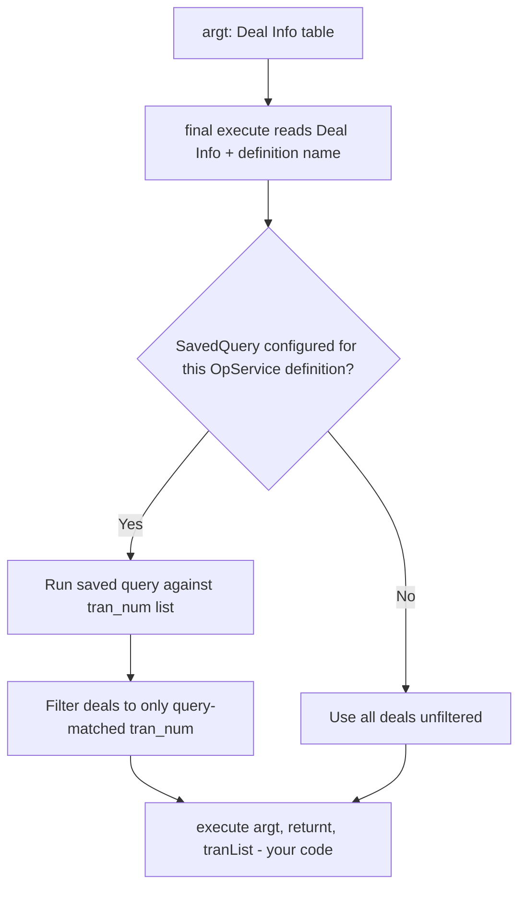

# Template 6: Trading-Type Operational Service Post-Processing

> See `OpenJVS_Common_Framework_Instructions.md` for the rules shared by all templates.
> Source reviewed: `JVS/Common/src/com/eon/eet/fenix/common/script/AbstractOpsServiceTradingTypePost.java`

## Base class

`com.eon.eet.fenix.common.script.AbstractOpsServiceTradingTypePost` (itself extends `BasicScript`) — use this
instead of the generic Operational Service template (Template 4) whenever the service type is **Trading** and the
deals must be filtered against a saved query before your logic runs.

`AbstractOpsServiceTradingTypePost.execute(Table argt, Table returnt)` is `final`. It:

1. Retrieves the `"Deal Info"` table from `argt` (throws `FenixException` if missing/invalid).
2. Reads the operation-service definition name from `argt`.
3. Looks up an `IConfig` entry (`ConfigurationEnum.OPS_SERVICE`, sub-context = definition name, variable
   `SavedQuery`).
4. If a saved query is configured, runs it and filters the deal list down to the transactions the query returns; if
   not configured, uses all deals unfiltered.
5. Calls your `execute(Table argt, Table returnt, Table tranList)` with the filtered `tranList` (single column
   `tran_num`).

The saved query is configured via the Constants Repository:

```
Context      = OpService
Sub Context  = <Operation service definition name>
Variable Name = SavedQuery
Type         = String
String Value = <Saved query name>
```

## Full Explanation

Some Trading-type operational services should only act on a subset of the deals Endur passes in (e.g. only deals
matching a particular book/portfolio/counterparty criterion). Rather than have every post-processing script
reimplement "look up my saved query, run it, filter the deal list", `AbstractOpsServiceTradingTypePost` centralises
that logic: it reads the `SavedQuery` configuration entry for the running operation-service definition, executes the
query if configured, and hands your code only the transactions that survived the filter (`tranList`). If no saved
query is configured, your code simply receives all deals — so it must behave correctly both with and without
filtering configured.

## Diagram



## Code skeleton

```java
package com.eon.eet.fenix.opservices.<subpackage>;

import com.eon.eet.fenix.common.FenixException;
import com.eon.eet.fenix.common.script.AbstractOpsServiceTradingTypePost;
import com.olf.openjvs.OException;
import com.olf.openjvs.Table;

/**
 * TODO: Description and purpose of the trading-type operational service post-processing.
 *
 * @author <author name>
 *         Created: <dd MMM yyyy>
 *
 */
/*
 * ------------------------------------------------------------------------------------------------------------------
 * | Rev | RSS No.   | Date        | Who          | Description                                                     |
 * ------------------------------------------------------------------------------------------------------------------
 * | 001 |           | <dd-MMM-yyyy> | <initials> | Initial version                                                  |
 * ------------------------------------------------------------------------------------------------------------------
 */
public class Ops<Name>Post extends AbstractOpsServiceTradingTypePost {

    @Override
    public void execute(Table argt, Table returnt, Table tranList) throws FenixException, OException {
        // TODO: tranList contains the filtered transaction numbers (column tran_num) - only process these
        // TODO: implement post-processing logic for the filtered transactions
    }
}
```

## Rules applied

- Do not override the `final execute(Table argt, Table returnt)` — implement the 3-argument
  `execute(Table argt, Table returnt, Table tranList)` overload instead.
- Only process the transactions present in `tranList`, not the raw `"Deal Info"` table from `argt`, so behaviour
  stays consistent with the configured saved-query filter.
- If no `SavedQuery` is configured for the operation service definition, `tranList` will contain all deals from
  `argt` unfiltered — your code must behave correctly in both cases.
- Same object-lifecycle, logging, and exception rules as the Main script template apply.
