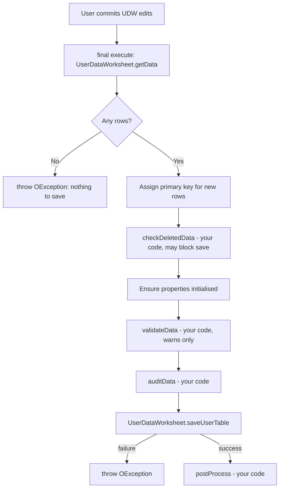

# Template 7: User Data Worksheet (UDW) Save Handler (`XxxxxUdwSaveHandlerMain`)

> See `OpenJVS_Common_Framework_Instructions.md` for the rules shared by all templates.
> Source reviewed: `JVS/Common/src/com/eon/eet/fenix/common/udw/AbstractUdwSaveHandlerMain.java`

## Base class

`com.eon.eet.fenix.common.udw.AbstractUdwSaveHandlerMain` (itself extends `BasicScript`) — use for any Main script
that handles the save event of a User Data Worksheet (UDW) panel.

`AbstractUdwSaveHandlerMain.execute(Table argt, Table returnt)` is `final`. It:

1. Reads the UDW data via `UserDataWorksheet.getData()`; throws `OException` if there is nothing to save.
2. Sets the primary key value for new rows (rows with key = 0).
3. Calls your `checkDeletedData(deletedData)` so you can prevent violating an external constraint on deleted rows.
4. Ensures `UserDataWorksheet.getProperties()` is initialised.
5. Calls your `validateData(data, properties)` (default `true`) to warn (not block) on invalid data.
6. Calls your `auditData(data, isValid)` to record the user action.
7. Saves the table via `UserDataWorksheet.saveUserTable(data, properties)`, throwing `OException` on failure.
8. Calls your `postProcess(data, properties)` for any follow-up action after a successful save.

## Full Explanation

User Data Worksheets (UDWs) let end users edit grid-like data directly in the Endur UI; the save handler Main script
is invoked when the user commits their edits. `AbstractUdwSaveHandlerMain` centralises the common save workflow
(primary key assignment, deleted-row constraint checks, non-blocking validation, audit, the actual save call, and
post-save follow-up) so individual UDW implementations only need to plug in the parts that are specific to their
data: which column is the primary key, what constraint deleted rows must satisfy, how to validate/audit, and what to
do after a successful save.

## Diagram



## Code skeleton

```java
package com.eon.eet.fenix.<project>.<subpackage>;

import com.eon.eet.fenix.common.udw.AbstractUdwSaveHandlerMain;
import com.olf.openjvs.OException;
import com.olf.openjvs.Table;

/**
 * TODO: Description and purpose of the UDW save handler.
 *
 * @author <author name>
 *         Created: <dd MMM yyyy>
 *
 */
/*
 * ------------------------------------------------------------------------------------------------------------------
 * | Rev | RSS No.   | Date        | Who          | Description                                                     |
 * ------------------------------------------------------------------------------------------------------------------
 * | 001 |           | <dd-MMM-yyyy> | <initials> | Initial version                                                  |
 * ------------------------------------------------------------------------------------------------------------------
 */
public class <Name>UdwSaveHandlerMain extends AbstractUdwSaveHandlerMain {

    /**
     * TODO: name of the column used as primary key for this UDW.
     *
     * @return the primary key column name
     */
    @Override
    protected String getPrimaryKey() {
        return "TODO_primary_key_column";
    }

    /**
     * TODO: verify deleted rows do not violate an external constraint; throw if they do.
     *
     * @param deletedData the rows being deleted
     */
    @Override
    protected void checkDeletedData(Table deletedData) throws OException {
        // TODO: validate deletedData, throw OException to prevent the save if a constraint would be violated
    }

    /**
     * TODO: warn (do not block save) on invalid data.
     *
     * @param data the data table
     * @param properties the properties table
     * @return true if data is valid
     */
    @Override
    protected boolean validateData(Table data, Table properties) throws OException {
        // TODO: override only if the default "always valid" behaviour is insufficient
        return super.validateData(data, properties);
    }

    /**
     * TODO: audit the user action.
     *
     * @param data the data table
     * @param isValid whether invalid data was saved anyway
     */
    @Override
    protected void auditData(Table data, boolean isValid) throws OException {
        // TODO: record who/what/when for this save
    }

    /**
     * TODO: post-save follow-up actions.
     *
     * @param data the saved data table
     * @param properties the properties table
     */
    @Override
    protected void postProcess(Table data, Table properties) {
        // TODO: implement any action required after a successful save
    }
}
```

## Rules applied

- Implement `getPrimaryKey()`, `checkDeletedData()`, and `auditData()` (mandatory, abstract); only override
  `validateData()` if the default "always valid" behaviour is insufficient.
- `validateData` must only **warn**, never block the save — use `checkDeletedData` to actually block a save (by
  throwing) when a hard constraint would be violated.
- Same object-lifecycle, logging, and exception rules as the Main script template apply (this is still a
  `BasicScript` descendant).
