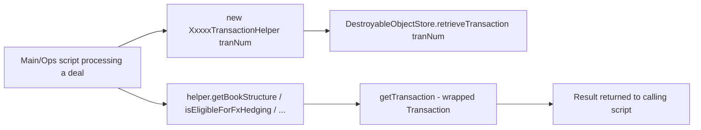

# Template 8: Transaction Helper (`XxxxxTransactionHelper` / `XxxxxHelper`)

> See `OpenJVS_Common_Framework_Instructions.md` for the rules shared by all templates.
> Source reviewed: `JVS/Common/src/com/eon/eet/fenix/common/tran/AbstractTransactionHelper.java`

## Base class

`com.eon.eet.fenix.common.tran.AbstractTransactionHelper` — a **non-script** supporting class used to generalise how
a single `Transaction` is fetched, inspected, and mutated. It is not a `BasicScript` descendant; it is instantiated
by Main/Ops/Param scripts and wraps a single `Transaction` object for the lifetime of the helper instance.

Key characteristics from the reviewed base class:

- Constructors accept either a `Transaction` object or a `tranNum` (`int`); the `tranNum` constructor retrieves the
  transaction via `DestroyableObjectStore.retrieveTransaction(tranNum)` so it is cleaned up automatically.
- Exposes `getTransaction()` to access the wrapped `Transaction`.
- Concrete subclasses add project-specific helper methods (e.g. field get/set helpers, book-structure lookups,
  balance-circle lookups) that operate on the wrapped transaction — avoid duplicating this kind of logic ad hoc in
  scripts; put it on a helper subclass instead.

## Full Explanation

Main/Ops/Param scripts frequently need to inspect or manipulate the same transaction from several different
methods (e.g. compute a book structure, check FX-hedging eligibility, retrieve total volume). Instead of passing a
raw `Transaction` around and repeating retrieval/lookup code across scripts, a Transaction Helper wraps one
`Transaction` instance for the lifetime of a processing unit (e.g. one loop iteration over deals) and exposes
focused, well-named methods for the operations that transaction needs. Because the helper is instantiated by the
calling script (not itself a `BasicScript`), it relies on the calling script's `DestroyableObjectStore`/logging
context rather than having its own.

## Diagram



## Code skeleton

```java
package com.eon.eet.fenix.<project>.<subpackage>;

import com.eon.eet.fenix.common.tran.AbstractTransactionHelper;
import com.eon.eet.fenix.common.logging.Log;
import com.olf.openjvs.OException;
import com.olf.openjvs.Transaction;

/**
 * TODO: Description and purpose of this transaction helper (what it generalizes/simplifies).
 *
 * @author <author name>
 *         Created: <dd MMM yyyy>
 *
 */
/*
 * ------------------------------------------------------------------------------------------------------------------
 * | Rev | RSS No.   | Date        | Who          | Description                                                     |
 * ------------------------------------------------------------------------------------------------------------------
 * | 001 |           | <dd-MMM-yyyy> | <initials> | Initial version                                                  |
 * ------------------------------------------------------------------------------------------------------------------
 */
public class <Name>TransactionHelper extends AbstractTransactionHelper {

    /** Log instance for this helper */
    private final Log log = new Log();

    /**
     * Constructor to instantiate helper with a transaction object.
     *
     * @param tran transaction needing help
     */
    public <Name>TransactionHelper(Transaction tran) {
        super(tran);
    }

    /**
     * Constructor to instantiate helper with a transaction number.
     *
     * @param tranNum transaction number needing help
     */
    public <Name>TransactionHelper(int tranNum) {
        super(tranNum);
    }

    /**
     * TODO: describe method effect (not implementation).
     *
     * @return TODO
     */
    public String doSomethingWithTransaction() throws OException {
        log.debug("Processing transaction " + getTransaction().getFieldInt("tran_num"));
        // TODO: implementation, using getTransaction() to access the wrapped Transaction
        return null;
    }
}
```

## Rules applied

- Always call the matching `super(tran)` / `super(tranNum)` constructor so the wrapped `Transaction` is either
  provided directly or retrieved through `DestroyableObjectStore` (never fetch it manually with a raw OpenJVS API
  call).
- Use `getTransaction()` to access the wrapped transaction rather than storing a second reference to it.
- Provide a private `Log` field for logging (helpers are not `BasicScript` descendants and have no inherited
  `debug()`/`info()` wrappers).
- Keep helper methods focused (one concern per method) and named as verbs describing the effect, matching the
  reviewed base class's own method-naming style (e.g. `getBookStructure`, `isEligibleForFxHedging`,
  `retrieveTotalVolume`).
