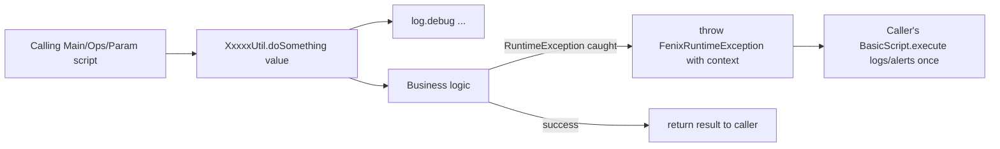

# Template 9: Supporting / Utility Class (`XxxxxUtil`)

> See `OpenJVS_Common_Framework_Instructions.md` for the rules shared by all templates.

## Base class

None required — a regular supporting class (not a script entry point, not a `BasicScript`/`BasicParamScript`
descendant). It must still follow the general framework rules and provide logging via a private `Log` member.

## Full Explanation

Utility classes hold stateless, reusable logic that does not belong to any single script (e.g. string/date
formatting, validation helpers, thin facades over `DbaseUtil` for a specific project's needs — see the real example
at `JVS/Common/src/com/eon/eet/fenix/common/Test_Reusable_Utility/DatabaseUtility.java`). Because they are not
`BasicScript` descendants, they have no inherited `debug()`/`info()` wrappers or automatic top-level exception
handling — they must instantiate their own `Log` and must wrap unexpected failures in a `FenixRuntimeException`
themselves before the exception reaches the calling script (which will do the top-level logging/alerting once).

## Diagram



## Code skeleton

```java
package com.eon.eet.fenix.<project>.<subpackage>;

import com.eon.eet.fenix.common.FenixRuntimeException;
import com.eon.eet.fenix.common.logging.Log;
import com.olf.openjvs.OException;

/**
 * TODO: Description and purpose of the class.
 *
 * @author <author name>
 *         Created: <dd MMM yyyy>
 *
 */
/*
 * ------------------------------------------------------------------------------------------------------------------
 * | Rev | RSS No.   | Date        | Who          | Description                                                     |
 * ------------------------------------------------------------------------------------------------------------------
 * | 001 |           | <dd-MMM-yyyy> | <initials> | Initial version                                                  |
 * ------------------------------------------------------------------------------------------------------------------
 */
public final class <Name>Util {

    /** Log instance */
    private static final Log log = new Log();

    /** Private constructor - static utility class */
    private <Name>Util() {}

    /**
     * TODO: describe method effect (not implementation)
     *
     * @param value the value to process
     * @return the processed result
     */
    public static String doSomething(String value) {
        try {
            log.debug("Processing value: " + value);
            // TODO: implementation
            return value;
        }
        catch (RuntimeException e) {
            throw new FenixRuntimeException("Failed to process value " + value, e);
        }
    }
}
```

## Rules applied

- Name ends with `Util`; make the class `final` with a `private` constructor when it is a pure static-method holder
  (no instance state).
- Provide a `private static final Log log = new Log();` (or non-static `private final Log log = new Log();` if the
  utility carries instance state) — never `System.out.print`.
- Wrap any caught unchecked/unexpected failure in a `FenixRuntimeException` with context before rethrowing.
- Do not duplicate logic already available in `DbaseUtil`, `TableRowIterator`/`TableColIterator`,
  `DelimitedFileImporter`, or `SendMail` — reuse the existing Common framework helpers instead of writing a new
  utility that reimplements them.
