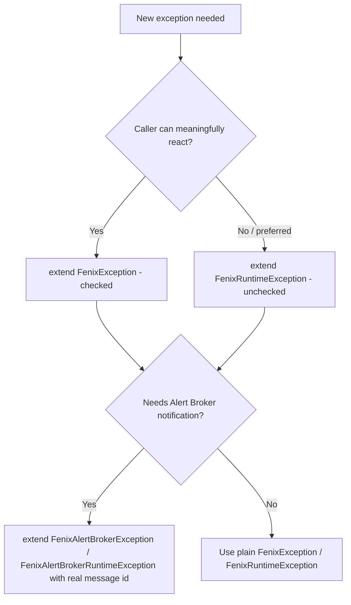

# Template 10: Custom Exception (`XxxxxException` / `XxxxxAlertException`)

> See `OpenJVS_Common_Framework_Instructions.md` for the rules shared by all templates.

## Base class

Extend `FenixException` (checked) or `FenixRuntimeException` (unchecked, **preferred**) — or their Alert Broker
variants (`FenixAlertBrokerException` / `FenixAlertBrokerRuntimeException`) if the failure should trigger an Alert
Broker notification.

## Full Explanation

Project-specific exceptions give calling code (and log output) a precise, self-describing failure type instead of a
generic `RuntimeException`/`OException`. Choose the base class based on two questions: (1) can/should the immediate
caller meaningfully react to this failure (checked `FenixException`) or should it simply propagate up to
`BasicScript`'s top-level handler (unchecked `FenixRuntimeException`, preferred)? and (2) does this failure need to
trigger an Alert Broker notification (use the `AlertException`/`AlertRuntimeException` variants and always supply a
real alert-broker message id)?

## Diagram



## Code skeleton — plain exception

```java
package com.eon.eet.fenix.<project>.<subpackage>;

import com.eon.eet.fenix.common.FenixRuntimeException;

/**
 * TODO: Description of when this exception is thrown.
 *
 * @author <author name>
 *         Created: <dd MMM yyyy>
 *
 */
public class <Name>Exception extends FenixRuntimeException {

    private static final long serialVersionUID = 1L;

    public <Name>Exception(String message) {
        super(message);
    }

    public <Name>Exception(String message, Throwable cause) {
        super(message, cause);
    }
}
```

## Code skeleton — Alert-Broker-raising exception

```java
package com.eon.eet.fenix.<project>.<subpackage>;

import com.eon.eet.fenix.common.FenixAlertBrokerRuntimeException;

/**
 * TODO: Description of when this exception is thrown and why it must raise an Alert Broker notification.
 *
 * @author <author name>
 *         Created: <dd MMM yyyy>
 *
 */
public class <Name>AlertException extends FenixAlertBrokerRuntimeException {

    private static final long serialVersionUID = 1L;

    public <Name>AlertException(String message) {
        super("MY_ALERT_MESSAGE_ID", message);
    }
}
```

## Rules applied

- Prefer the unchecked `FenixRuntimeException` base unless the caller can meaningfully react to a checked exception
  (in which case extend `FenixException`).
- Always define `serialVersionUID = 1L`.
- Provide at least a `(String message)` constructor; add `(String message, Throwable cause)` when the exception will
  commonly wrap another `Throwable`.
- Only extend the Alert Broker variants when the failure must raise an Alert Broker notification, and always pass a
  real alert broker message id to the super constructor (never a placeholder left as `TODO` in committed code).
- Name ends with `Exception` (or `AlertException` for the Alert Broker variant).
