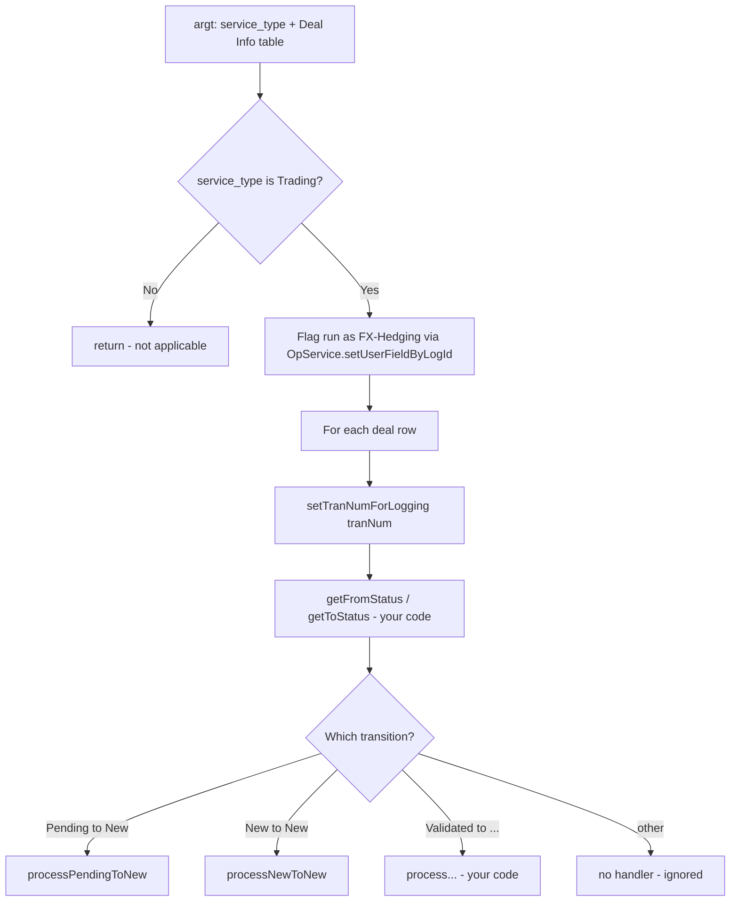

# Template 11: Trading Operation Service State-Machine (`AbstractTradingOPService`)

> See `OpenJVS_Common_Framework_Instructions.md` for the rules shared by all templates.
> Source reviewed: `JVS/Common/src/com/eon/eet/fenix/common/script/AbstractTradingOPService.java`

## Base class

`com.eon.eet.fenix.common.script.AbstractTradingOPService` (extends `BasicScript`) — use when an operational service
must react to the Endur transaction-status finite-state-machine (`TRAN_STATUS_ENUM`) transitions for the **Trading**
service type only.

Unlike Template 6 (`AbstractOpsServiceTradingTypePost`), this base class does **not** filter deals via a saved query;
instead its (non-final) `execute(Table argt, Table returnt)` already:

1. Returns immediately if `argt.getInt("service_type", 1) != 0` (only processes Trading service type).
2. Flags the ops-service run as an FX-Hedging service via `OpService.setUserFieldByLogId(...)`.
3. Iterates every deal row in the `"Deal Info"`-equivalent table (`argt.getTable(1, 1)`), calls
   `setTranNumForLogging(tranNum)`, resolves `fromStatus`/`toStatus` via your `getFromStatus`/`getToStatus`
   overrides, and dispatches to the matching `processXxxToYyy(tranNum)` transition handler
   (e.g. Pending→New, New→New, Validated→...).

## Full Explanation

Endur models a transaction's lifecycle as a finite state machine over `TRAN_STATUS_ENUM` values (Pending, New,
Validated, ...). Rather than have each ops service reimplement "figure out which status transition just happened and
run the matching logic", `AbstractTradingOPService` provides the iteration/dispatch skeleton: for every deal in the
run, it resolves the from/to status pair and calls the one transition-handler method that matches. Concrete
subclasses only need to say how to read the from/to status for a row and implement the handler(s) for the specific
transitions they care about — irrelevant transitions simply have no handler and are ignored by the base class.

## Diagram



## Code skeleton

```java
package com.eon.eet.fenix.opservices.<subpackage>;

import com.eon.eet.fenix.common.script.AbstractTradingOPService;
import com.olf.openjvs.OException;
import com.olf.openjvs.Table;
import com.olf.openjvs.enums.TRAN_STATUS_ENUM;

/**
 * TODO: Description and purpose of this trading transaction-status transition handler.
 *
 * @author <author name>
 *         Created: <dd MMM yyyy>
 *
 */
/*
 * ------------------------------------------------------------------------------------------------------------------
 * | Rev | RSS No.   | Date        | Who          | Description                                                     |
 * ------------------------------------------------------------------------------------------------------------------
 * | 001 |           | <dd-MMM-yyyy> | <initials> | Initial version                                                  |
 * ------------------------------------------------------------------------------------------------------------------
 */
public class Ops<Name>Post extends AbstractTradingOPService {

    @Override
    protected TRAN_STATUS_ENUM getFromStatus(Table deals, int row) throws OException {
        // TODO: return the "from" transaction status for the given row
        return null;
    }

    @Override
    protected TRAN_STATUS_ENUM getToStatus(Table deals, int row) throws OException {
        // TODO: return the "to" transaction status for the given row
        return null;
    }

    // TODO: implement only the transition handlers relevant to this ops service, e.g.:
    // protected void processPendingToNew(int tranNum) throws OException { }
    // protected void processNewToNew(int tranNum) throws OException { }
}
```

> Check the actual base class in the workspace for the exact abstract/overridable method signatures
> (`getFromStatus`, `getToStatus`, and the `processXxxToYyy` transition methods) before implementing, since the
> supported transition set may be extended over time.

## Rules applied

- Only use this base class for Trading-service-type operational services driven by a transaction-status transition;
  use Template 4 (generic Ops) or Template 6 (saved-query-filtered Ops) otherwise.
- Call `setTranNumForLogging(tranNum)` (already done by the base class per deal row) so log lines carry deal context;
  do not clear it yourself mid-loop.
- Implement only the transition-handler methods that are relevant to the concrete service; do not add a default
  catch-all that silently ignores unhandled transitions — follow the "final `else`/`default` throws" rule from the
  shared instructions for any additional dispatch logic you add on top of the base class.
