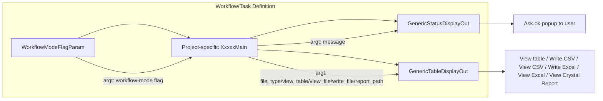

# Template 12: Ready-Made Reusable Scripts — Reuse, Do Not Reimplement

> See `OpenJVS_Common_Framework_Instructions.md` for the rules shared by all templates.
> Source reviewed: `JVS/Common/src/com/eon/eet/fenix/common/script/WorkflowModeFlagParam.java`,
> `GenericStatusDisplayOut.java`, `GenericTableDisplayOut.java`

Unlike Templates 1–11, the three classes below are **not skeletons to copy** — they are already-complete, generic,
reusable scripts shipped in the Common framework. Wire them directly into a workflow/task/menu item; do **not** write
a new class that duplicates their behaviour.

## 12.1 `WorkflowModeFlagParam` — pass-through workflow-mode flag Param script

`com.eon.eet.fenix.common.script.WorkflowModeFlagParam` extends `BasicParamScript` with empty
`getUserSelection`/`getWorkflowValues` bodies. Its only purpose is to let `BasicParamScript` populate the standard
workflow-mode flag into `argt` for a following Main script, with no extra prompt/logic.

**When to use:** attach directly as the Param script for a workflow task when the Main script only needs to know
whether it is running in workflow mode or ad-hoc, and no other parameter needs to be collected.

**Do not**: copy this class and rename it — reference `WorkflowModeFlagParam` itself from the task/workflow
definition.

## 12.2 `GenericStatusDisplayOut` — generic success/failure pop-up

`com.eon.eet.fenix.common.script.GenericStatusDisplayOut` extends `BasicScript`. Reads a `message` string from row 1
of `argt` and shows it via `Ask.ok(message)`; logs a `warning()` and no-ops if `message` is missing.

**When to use:** as the display-out script for any Main script that needs to show a simple one-line success/failure
message to the user — populate a `message` column (single row) in `returnt`/`argt` from your Main script instead of
calling `Ask.ok(...)` yourself.

## Full Explanation

These three classes exist because the same small pieces of UI plumbing (pass through a workflow flag, pop up a
status message, offer report/table output options) were being re-written slightly differently in many projects. By
shipping them once in the Common framework and wiring them into task/workflow definitions (Directory Browser),
every project gets identical, already-reviewed behaviour with zero new Java code, and any future improvement
(e.g. a new output format in `GenericTableDisplayOut`) benefits every consumer at once instead of requiring N patches.

## Diagram

## 12.3 `GenericTableDisplayOut` — generic report/table output

`com.eon.eet.fenix.common.script.GenericTableDisplayOut` extends `BasicScript`. Reads flags from `argt`
(`file_type`, `view_table`, `view_file`, `write_file`, `report_path`, …) and handles, in any combination: viewing the
report table on screen, writing it to CSV, viewing the CSV, writing to Excel (single or multi-tab), viewing the
Excel file, and viewing a Crystal Report.

**When to use:** as the display-out script for report/table-producing Main scripts that need local output options
when running on a remote server — populate the expected `argt` flag columns from the Main/Param script rather than
writing bespoke file-writing/viewing code (see the File Import Rule and Coding Standards in the master instructions
for the equivalent "do not write bespoke parsing/IO code" principle).

## Rules applied

- Prefer wiring these existing classes into the workflow/task definition over writing new Main/Param scripts that
  reimplement the same status pop-up or table/report output behaviour.
- If a required flag or behaviour genuinely does not exist in `GenericTableDisplayOut`, extend the Common framework
  class itself (subject to code review) rather than forking a private copy in a project package.
